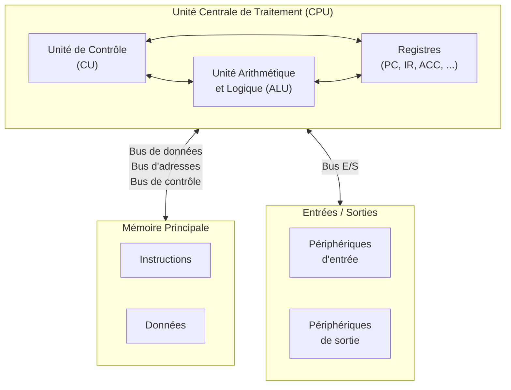

# Chapitre I.11 : Architecture du Jeu d\'Instructions (ISA)

L\'Architecture du Jeu d\'Instructions, ou ISA (de l\'anglais *Instruction Set Architecture*), constitue la pierre angulaire de la conception des systèmes informatiques. Elle représente le contrat formel, l\'interface abstraite et immuable qui régit le dialogue entre le matériel et le logiciel. Pour le programmeur, le compilateur ou le système d\'exploitation, l\'ISA définit la vue conceptuelle du processeur : l\'ensemble des instructions qu\'il peut exécuter, les registres qu\'il met à disposition, les modes d\'adressage pour accéder à la mémoire et le modèle de gestion des données. C\'est le vocabulaire fondamental que le matériel comprend et que le logiciel doit utiliser pour accomplir toute tâche.

Cette abstraction est d\'une importance capitale. Elle permet de découpler l\'évolution rapide des implémentations matérielles, que l\'on nomme microarchitectures, de la stabilité requise par l\'écosystème logiciel. Un programme compilé pour l\'architecture x86-64 il y a une décennie peut s\'exécuter sans modification sur un processeur contemporain, même si la microarchitecture sous-jacente a été radicalement transformée, passant d\'une exécution séquentielle à des pipelines superscalaires à exécution dans le désordre. L\'ISA est la garantie de cette compatibilité binaire ascendante, un facteur qui a été déterminant dans la domination de certaines architectures sur le marché.

Ce chapitre se propose d\'explorer en profondeur les multiples facettes de l\'ISA. Nous débuterons notre analyse par les modèles architecturaux de haut niveau qui organisent la relation fondamentale entre le processeur et la mémoire, à savoir les modèles de Von Neumann et de Harvard. Ces paradigmes, conçus aux balbutiements de l\'informatique, continuent d\'influencer la conception des caches de processeurs les plus sophistiqués. Ensuite, nous disséquerons l\'anatomie d\'un jeu d\'instructions moderne, en examinant en détail les types d\'opérations, les formats d\'encodage, la myriade de façons de spécifier l\'emplacement des données via les modes d\'adressage, et les mécanismes structurés qui gouvernent les appels de fonctions. Enfin, nous aborderons les grandes philosophies de conception qui ont engendré un débat fondamental dans le domaine de l\'architecture des ordinateurs : la confrontation entre les approches CISC (*Complex Instruction Set Computer*) et RISC (*Reduced Instruction Set Computer*). Nous analyserons leurs motivations, leurs caractéristiques et, surtout, le phénomène de convergence qui caractérise les processeurs modernes, où les frontières entre ces deux écoles de pensée sont devenues de plus en plus floues.

## 11.1 Modèles d\'Architecture Fondamentaux

Au cœur de tout système informatique se trouve la relation entre l\'unité centrale de traitement (CPU) et la mémoire. La manière dont cette relation est structurée définit le modèle architectural fondamental de la machine. Deux paradigmes dominants, nés des premières expérimentations de l\'ère de l\'informatique, continuent de dicter les principes de base de l\'organisation de la mémoire : l\'architecture de Von Neumann et l\'architecture de Harvard. Bien que le débat conceptuel remonte aux années 1940, ses implications sont profondément ancrées dans la conception des systèmes contemporains, depuis les microcontrôleurs embarqués jusqu\'aux cœurs des processeurs de serveurs les plus performants. Comprendre ces deux modèles est essentiel pour saisir les compromis fondamentaux en matière de performance, de flexibilité et de coût qui sous-tendent toute conception de processeur.

### 11.1.1 L\'Architecture de Von Neumann : Le Modèle à Mémoire Unifiée

L\'architecture de Von Neumann, proposée par le mathématicien John von Neumann et ses collaborateurs au milieu des années 1940, représente une rupture conceptuelle qui a fondé l\'informatique moderne. Son principe révolutionnaire est le concept de **programme stocké** (*stored-program concept*). Avant cette innovation, les premiers ordinateurs comme l\'ENIAC étaient programmés en reconfigurant physiquement des câbles et des interrupteurs ; le programme était intrinsèquement lié à la structure matérielle de la machine. L\'idée de Von Neumann était de traiter les instructions de la même manière que les données, en les stockant dans une mémoire unique et accessible en lecture/écriture.

Cette unification de la mémoire pour les instructions et les données est la caractéristique distinctive du modèle de Von Neumann. Elle confère à l\'ordinateur une flexibilité sans précédent. Un programme devient lui-même une donnée qui peut être lue, analysée et modifiée par un autre programme. C\'est ce principe qui rend possibles les compilateurs (qui traduisent un programme source en instructions machine), les chargeurs de programmes (qui chargent les instructions depuis un disque vers la mémoire) et même des techniques avancées comme la compilation juste-à-temps (JIT) ou le code auto-modifiable, où un programme peut altérer ses propres instructions pendant son exécution.

#### Structure et Cycle d\'Instruction

La structure d\'un ordinateur Von Neumann est conceptuellement simple. Elle s\'articule autour de quelques composants principaux interconnectés par un ensemble de canaux de communication appelé le bus système.

**Figure 11.1 -- Architecture de Von Neumann : structure fondamentale**

1.  **L\'Unité Centrale de Traitement (CPU)** : Le cerveau de l\'ordinateur, responsable de l\'exécution des instructions. Elle contient l\'Unité Arithmétique et Logique (ALU) pour les calculs, l\'Unité de Contrôle (CU) pour orchestrer les opérations, et un ensemble de registres pour le stockage temporaire à haute vitesse.

2.  **La Mémoire Principale** : Un espace de stockage unifié qui contient à la fois les instructions du programme en cours d\'exécution et les données que ce programme manipule.

3.  **Le Bus Système** : Il est subdivisé en un bus de données, un bus d\'adresses et un bus de contrôle, et constitue le canal unique par lequel le CPU communique avec la mémoire.

Le fonctionnement d\'un processeur Von Neumann est rythmé par une séquence d\'opérations fondamentales et répétitives connue sous le nom de **cycle d\'instruction**, ou cycle *fetch-decode-execute*. Ce cycle est la pulsation de la machine, se répétant des milliards de fois par seconde. Il se décompose en trois étapes principales :

1.  **La Phase de Recherche (Fetch)** : L\'Unité de Contrôle initie le cycle en allant chercher la prochaine instruction à exécuter en mémoire. Pour ce faire, elle utilise un registre spécial, le **Compteur Ordinal** ou *Program Counter* (PC), qui contient l\'adresse de cette instruction. Cette adresse est placée dans le **Registre d\'Adresse Mémoire** (*Memory Address Register* - MAR). Le MAR est connecté au bus d\'adresses pour sélectionner l\'emplacement mémoire désiré. L\'Unité de Contrôle envoie alors un signal de lecture via le bus de contrôle. La mémoire répond en plaçant le contenu de l\'emplacement spécifié (l\'instruction) sur le bus de données. Cette instruction est transférée au **Registre de Données Mémoire** (*Memory Data Register* - MDR) et finalement copiée dans le **Registre d\'Instruction Courante** (*Current Instruction Register* - CIR). Simultanément, le PC est incrémenté pour pointer vers l\'adresse de l\'instruction suivante, préparant ainsi la prochaine itération du cycle.

2.  **La Phase de Décodage (Decode)** : Une fois l\'instruction dans le CIR, l\'Unité de Contrôle l\'analyse. Le code binaire de l\'instruction est décodé pour déterminer quelle opération doit être effectuée (par exemple, une addition, un chargement de mémoire, un branchement) et quels sont ses opérandes. Si l\'instruction nécessite des données provenant de la mémoire, l\'Unité de Contrôle prépare une nouvelle requête de lecture mémoire.

3.  **La Phase d\'Exécution (Execute)** : L\'opération est finalement exécutée. Si c\'est une opération arithmétique ou logique, l\'Unité de Contrôle dirige les opérandes (provenant de registres ou de la mémoire) vers l\'ALU et lui commande d\'effectuer le calcul. Le résultat est ensuite stocké dans un registre ou en mémoire. Si c\'est une instruction de transfert de données, une lecture ou une écriture en mémoire est effectuée. Si c\'est une instruction de branchement, la valeur du PC peut être modifiée pour altérer le flux séquentiel du programme.

Une fois l\'exécution terminée, le cycle recommence avec la recherche de l\'instruction suivante, dont l\'adresse est désormais contenue dans le PC. Cette simplicité conceptuelle et la flexibilité inhérente au modèle de programme stocké ont assuré la prédominance de l\'architecture de Von Neumann dans la quasi-totalité des ordinateurs à usage général.

### 11.1.2 Le Goulot d\'Étranglement de Von Neumann : Une Limitation Fondamentale

Malgré son élégance et sa flexibilité, le modèle de Von Neumann souffre d\'une limitation de performance inhérente, connue sous le nom de **goulot d\'étranglement de Von Neumann** (*Von Neumann bottleneck*). Ce problème ne découle pas d\'une faille de conception, mais est une conséquence directe de son principe fondateur : la séparation physique entre l\'unité de traitement (le CPU, rapide) et l\'unité de stockage (la mémoire, plus lente), reliées par un canal de communication de bande passante limitée.

Le symptôme le plus évident de ce goulot d\'étranglement est la **contention d\'accès** au bus système. Puisqu\'un seul bus est utilisé pour transférer à la fois les instructions et les données, ces deux types de transferts ne peuvent pas avoir lieu simultanément. Durant la phase de recherche d\'un cycle d\'instruction, le bus est occupé à transférer le code de l\'instruction depuis la mémoire vers le CPU. Si la phase d\'exécution de l\'instruction précédente nécessite une lecture ou une écriture de donnée en mémoire, le CPU doit attendre que cette opération soit terminée avant de pouvoir commencer à chercher l\'instruction suivante. Cette sérialisation forcée des accès mémoire impose une limite fondamentale à la performance : la vitesse d\'exécution n\'est pas dictée par la rapidité avec laquelle le CPU peut calculer, mais par la vitesse à laquelle il peut échanger des informations avec la mémoire.

Cette limitation a été dramatiquement exacerbée au fil des décennies par un phénomène connu sous le nom de **\"mur de la mémoire\"** (*memory wall*). Depuis les années 1980, la performance des microprocesseurs (mesurée en termes de fréquence d\'horloge et de nombre d\'opérations par cycle) a connu une croissance exponentielle, suivant approximativement la loi de Moore. En revanche, la latence d\'accès à la mémoire vive dynamique (DRAM), la technologie dominante pour la mémoire principale, s\'est améliorée à un rythme beaucoup plus lent. Cet écart de performance croissant entre le CPU et la mémoire signifie que le processeur passe une proportion de plus en plus grande de son temps à attendre des données, les bras croisés. Le goulot d\'étranglement de Von Neumann est donc devenu la contrainte de performance la plus critique dans les systèmes informatiques modernes.

Loin d\'être un simple détail historique, ce goulot d\'étranglement a été et reste le principal moteur de l\'innovation en architecture des ordinateurs. La quasi-totalité des techniques d\'optimisation de performance développées au cours des cinquante dernières années peut être interprétée comme une tentative de contourner ou d\'atténuer cette limitation fondamentale.

1.  La première et la plus importante de ces solutions a été l\'introduction de la **hiérarchie mémoire**. Des mémoires caches (SRAM), petites, coûteuses mais extrêmement rapides, sont insérées entre le CPU et la mémoire principale (DRAM) pour stocker les données et instructions récemment utilisées. L\'objectif est de servir la majorité des requêtes du CPU depuis le cache rapide, masquant ainsi la latence de la DRAM.

2.  Des techniques microarchitecturales avancées comme la **prédiction de branchement** et l\'**exécution spéculative** visent à anticiper les futures instructions nécessaires pour les pré-charger en cache avant même que le CPU ne les demande explicitement, afin de maintenir le pipeline d\'exécution constamment alimenté.

3.  Plus récemment, face aux exigences des charges de travail de l\'intelligence artificielle qui manipulent des volumes de données colossaux, le coût énergétique et temporel du déplacement des données à travers le goulot d\'étranglement est devenu prohibitif. Cela a ravivé l\'intérêt pour des paradigmes architecturaux post-Von Neumann, tels que le\
    **traitement en mémoire** (*Processing-in-Memory* - PIM), où des capacités de calcul sont intégrées directement dans les puces mémoire pour effectuer des opérations sur les données *in situ*, minimisant ainsi le trafic sur le bus.

Le goulot d\'étranglement de Von Neumann n\'est donc pas un problème résolu, mais une contrainte fondamentale qui continue de façonner l\'évolution de l\'architecture des ordinateurs, poussant l\'industrie à explorer des solutions de plus en plus sophistiquées pour rapprocher le calcul des données.

### 11.1.3 L\'Architecture Harvard : Le Modèle à Mémoires Séparées

En contraste direct avec le modèle à mémoire unifiée de Von Neumann, l\'architecture de Harvard propose une approche fondamentalement différente. Son origine remonte à l\'ordinateur électromécanique Harvard Mark I, achevé en 1944, qui stockait ses instructions sur une bande perforée et ses données dans des registres à relais. La caractéristique distinctive de ce modèle est la

**séparation physique** entre l\'espace de stockage des instructions (la mémoire programme) et l\'espace de stockage des données (la mémoire de données). De manière cruciale, chaque espace mémoire dispose de ses propres bus dédiés pour communiquer avec le CPU.

#### Avantages en Termes de Performance et d\'Optimisation

L\'avantage principal et immédiat de cette séparation est l\'élimination de la contention de bus qui caractérise le goulot d\'étranglement de Von Neumann. Avec deux chemins de communication indépendants, le CPU peut effectuer une lecture d\'instruction et un accès à la mémoire de données (lecture ou écriture) *simultanément*, au cours du même cycle d\'horloge. Ce parallélisme d\'accès double potentiellement la bande passante mémoire maximale par rapport à un système Von Neumann fonctionnant à la même fréquence, ce qui se traduit par une augmentation significative de la performance.

Au-delà de la performance brute, l\'architecture Harvard offre une flexibilité d\'optimisation au niveau matériel. Les deux mémoires étant indépendantes, elles peuvent être conçues avec des caractéristiques différentes pour mieux répondre à leurs rôles respectifs  :

- **Technologie de mémoire** : La mémoire programme, qui contient le code souvent figé d\'un système, peut être implémentée avec une technologie non volatile comme la mémoire ROM (*Read-Only Memory*) ou Flash. La mémoire de données, qui doit être modifiée fréquemment, sera implémentée en RAM (*Random-Access Memory*).

- **Taille de mot** : Les instructions et les données n\'ont pas nécessairement besoin d\'avoir la même largeur. Par exemple, un système peut utiliser des instructions de 14 bits pour une meilleure densité de code, tout en manipulant des données de 8 bits. Cette hétérogénéité est impossible dans un modèle Von Neumann où instructions et données cohabitent dans un espace mémoire uniforme.

- **Espace d\'adressage** : Les deux mémoires peuvent avoir des tailles très différentes, optimisées pour les besoins spécifiques de l\'application, sans qu\'un espace inutilisé dans l\'une ne puisse être alloué à l\'autre.

#### Inconvénients et Domaines d\'Application

Cependant, ces avantages ont un coût. L\'architecture Harvard est intrinsèquement plus complexe et plus coûteuse à mettre en œuvre. La duplication des bus et des contrôleurs mémoire augmente la surface de silicium nécessaire et la complexité du design. De plus, la stricte séparation des mémoires réduit la flexibilité. L\'espace alloué au programme ne peut pas être utilisé pour stocker des données si le programme est petit, et inversement, ce qui peut conduire à une utilisation inefficace de la mémoire globale. Le modèle de programmation est également plus rigide, rendant difficile l\'implémentation de programmes qui se modifient eux-mêmes.

En raison de ce compromis, les architectures Harvard pures ou quasi-pures sont aujourd\'hui principalement confinées à des domaines d\'application spécialisés où la performance déterministe et l\'efficacité priment sur la flexibilité générale :

- **Processeurs de Traitement Numérique du Signal (DSP)** : Ces processeurs sont conçus pour exécuter des algorithmes mathématiques intensifs (comme les transformées de Fourier rapides ou les filtres numériques) sur des flux de données continus (audio, vidéo). Le parallélisme d\'accès de l\'architecture Harvard est idéal pour ces tâches, permettant de charger une nouvelle instruction tout en accédant simultanément à un coefficient de filtre depuis la mémoire programme et à un échantillon de données depuis la mémoire de données.

- **Microcontrôleurs** : Ces puces informatiques autonomes, que l\'on trouve dans d\'innombrables systèmes embarqués (de l\'automobile à l\'électroménager), bénéficient également de l\'architecture Harvard. Ils exécutent généralement un programme unique et dédié stocké en mémoire Flash (mémoire programme) tout en manipulant des données de capteurs et d\'actuateurs en SRAM (mémoire de données). La capacité à accéder aux deux simultanément permet d\'atteindre une haute réactivité avec des ressources matérielles limitées. Des familles populaires comme les PIC de Microchip et les AVR d\'Atmel sont des exemples classiques d\'implémentation de l\'architecture Harvard.

### 11.1.4 La Synthèse Moderne : L\'Architecture Harvard Modifiée

Les ordinateurs à usage général modernes, des téléphones intelligents aux supercalculateurs, sont confrontés à un dilemme. D\'une part, ils ont besoin de la flexibilité du modèle de Von Neumann pour gérer des logiciels complexes, des systèmes d\'exploitation multitâches et des environnements d\'exécution dynamiques. D\'autre part, ils doivent surmonter le goulot d\'étranglement de Von Neumann pour atteindre les niveaux de performance exigés par les applications contemporaines. La solution adoptée par l\'industrie n\'est ni l\'un ni l\'autre de ces modèles purs, mais une synthèse pragmatique et élégante : l\'**architecture Harvard modifiée**.

Le principe fondamental de cette approche hybride est d\'appliquer différentes architectures à différents niveaux de la hiérarchie mémoire.

- **Au niveau le plus proche du CPU**, là où la vitesse est la plus critique, on implémente une architecture de type Harvard. Concrètement, le cache de premier niveau (L1) est divisé en deux caches distincts et indépendants : un **cache d\'instructions (I-Cache)** et un **cache de données (D-Cache)**. Chacun de ces caches dispose de son propre chemin d\'accès au cœur du processeur. Lorsqu\'une instruction est exécutée, le processeur peut simultanément chercher la prochaine instruction dans le I-Cache et lire ou écrire une donnée requise par l\'instruction actuelle dans le D-Cache. Pour la grande majorité des opérations qui trouvent leurs cibles dans le cache L1 (ce qu\'on appelle un \"cache hit\"), le processeur fonctionne comme une pure machine de Harvard, bénéficiant d\'une bande passante mémoire maximale et évitant toute contention.

- **Aux niveaux supérieurs de la hiérarchie mémoire** (caches L2, L3 et mémoire principale DRAM), le modèle de Von Neumann prévaut. Les caches I-Cache et D-Cache sont alimentés par un cache de niveau inférieur unifié (ou directement par la mémoire principale), qui stocke indifféremment instructions et données dans un seul et même espace d\'adressage.

Cette organisation stratifiée offre le meilleur des deux mondes. Du point de vue du logiciel (programmeur, compilateur, système d\'exploitation), le processeur présente un modèle de mémoire simple et unifié, typique de Von Neumann. Il n\'y a qu\'un seul espace d\'adressage linéaire, ce qui préserve toute la flexibilité nécessaire pour que le code puisse être traité comme une donnée. Cependant, du point de vue de la microarchitecture, l\'implémentation matérielle utilise la séparation des caches de type Harvard pour optimiser la performance et contourner le goulot d\'étranglement pour les accès les plus fréquents.

Ce découplage entre le modèle architectural visible par le logiciel et l\'implémentation microarchitecturale est un exemple paradigmatique du rôle de l\'ISA. L\'ISA définit une abstraction (le modèle de mémoire Von Neumann) qui reste stable et simple à programmer, tout en laissant aux concepteurs de matériel la liberté d\'implémenter des optimisations complexes (l\'architecture Harvard modifiée) \"sous le capot\" pour améliorer la performance. Le programmeur n\'a généralement pas besoin de savoir que le processeur utilise des caches séparés, mais il bénéficie directement de la vitesse accrue que cette organisation permet. La seule situation où cette abstraction peut devenir \"perméable\" est dans le cas du code auto-modifiable : si un programme écrit de nouvelles instructions en mémoire (les traitant comme des données), il doit explicitement exécuter une instruction de synchronisation pour s\'assurer que le I-Cache est invalidé et mis à jour avec le nouveau code avant de tenter de l\'exécuter.

En conclusion, le débat historique entre Von Neumann et Harvard a trouvé sa résolution non pas dans la victoire d\'un camp sur l\'autre, mais dans une synthèse ingénieuse qui exploite les forces de chaque modèle à l\'échelle la plus appropriée de la hiérarchie mémoire.

## 11.2 Les Composants Fondamentaux d\'un Jeu d\'Instructions

Après avoir examiné les modèles d\'organisation de la mémoire à grande échelle, nous allons maintenant plonger au cœur même de l\'ISA : l\'instruction machine. Une instruction est l\'unité de travail atomique pour un processeur, un ensemble de bits qui commande une opération spécifique. La conception d\'un jeu d\'instructions implique une série de décisions fondamentales qui auront un impact profond sur la performance, la complexité et l\'efficacité du processeur. Cette section dissèque l\'anatomie d\'un jeu d\'instructions, en explorant les différents types d\'opérations que les processeurs peuvent effectuer, la manière dont ces opérations et leurs opérandes sont encodés dans des formats binaires, les multiples techniques utilisées pour localiser ces opérandes en mémoire ou dans les registres (les modes d\'adressage), et enfin, les mécanismes sophistiqués qui permettent de gérer de manière structurée et efficace les appels de fonctions, une pierre angulaire de la programmation moderne.

### 11.2.1 Types d\'instructions et formats

Chaque instruction qu\'un processeur peut exécuter est définie par son **opcode** (code d\'opération), un champ de bits qui spécifie l\'action à réaliser. L\'ensemble de ces instructions peut être classé en quelques grandes catégories fonctionnelles. La manière dont l\'opcode et les opérandes (les données sur lesquelles l\'opération agit) sont agencés dans le mot binaire de l\'instruction est définie par le **format d\'instruction**. Les choix de conception concernant ces formats et le nombre d\'opérandes explicites par instruction ont des conséquences profondes sur l\'architecture globale.

#### Classification des Instructions

Bien que les jeux d\'instructions modernes puissent contenir des centaines d\'instructions, celles-ci se regroupent généralement en trois grandes familles fonctionnelles :

1.  **Instructions de Transfert de Données** : Ces instructions sont responsables du déplacement des données entre les différents niveaux de la hiérarchie mémoire. Elles ne modifient pas les données, mais les copient d\'un emplacement à un autre. Les opérations les plus courantes sont :

    - LOAD : Copie une donnée depuis la mémoire principale vers un registre du CPU.

    - STORE : Copie une donnée depuis un registre du CPU vers la mémoire principale.

    - MOVE : Copie une donnée d\'un registre à un autre.

    - PUSH / POP : Transfèrent des données entre un registre et le sommet de la pile mémoire.\
      Ces instructions sont fondamentales, car les données doivent être amenées dans les registres du CPU avant de pouvoir être traitées par la plupart des autres instructions, en particulier dans les architectures RISC.33

2.  **Instructions Arithmétiques et Logiques** : C\'est le cœur du traitement de l\'information. Ces instructions prennent des opérandes (généralement depuis des registres), les traitent via l\'Unité Arithmétique et Logique (ALU), et placent le résultat dans un registre de destination. On y trouve :

    - **Arithmétiques** : ADD (addition), SUB (soustraction), MUL (multiplication), DIV (division), INC (incrémentation), DEC (décrémentation).

    - **Logiques (bitwise)** : AND (ET logique), OR (OU logique), XOR (OU exclusif), NOT (négation).

    - **Décalages et Rotations** : SHIFT LEFT, SHIFT RIGHT, ROTATE. Ces opérations sont essentielles pour la manipulation de bits à bas niveau.

3.  **Instructions de Contrôle de Flux** : Par défaut, le processeur exécute les instructions de manière séquentielle, en suivant l\'ordre dans lequel elles sont stockées en mémoire. Les instructions de contrôle de flux permettent de rompre cette séquence pour implémenter des boucles, des conditions et des appels de fonction. Elles agissent en modifiant directement la valeur du Compteur Ordinal (PC).

    - **Branchements (Branches)** : Modifient le PC pour \"sauter\" à une autre partie du programme. Ils peuvent être **inconditionnels** (JUMP, BRANCH) ou **conditionnels** (BRANCH IF EQUAL, BRANCH IF NOT ZERO), où le saut n\'est effectué que si une certaine condition (généralement basée sur les drapeaux d\'état de l\'ALU) est remplie.

    - **Appels de Procédure (Fonctions)** : CALL (ou BL en ARM, JAL en RISC-V). Ces instructions sont des sauts qui sauvegardent également l\'adresse de l\'instruction suivante (l\'adresse de retour) pour permettre de revenir au point d\'appel une fois la procédure terminée.

    - **Retours de Procédure** : RETURN. Charge l\'adresse de retour sauvegardée dans le PC pour reprendre l\'exécution après un appel de fonction.

#### Formats d\'Instruction : Longueur Fixe contre Longueur Variable

L\'un des choix de conception les plus fondamentaux pour un ISA est la longueur de ses instructions. Ce choix représente un compromis majeur entre la simplicité du décodage matériel et la densité du code.

- **Instructions à Longueur Fixe** : C\'est la marque de commerce des architectures **RISC** comme ARM et RISC-V. Dans ces ISA, toutes les instructions ont la même taille, typiquement 32 bits.

  - **Avantages** : Le principal avantage est une simplification radicale du matériel de décodage. Le processeur sait à l\'avance où une instruction se termine et où la suivante commence. Cela permet de paralléliser les phases de recherche (*fetch*) et de décodage (*decode*) des instructions de manière très efficace, ce qui est la clé d\'un *pipelining* performant. Le décodage est rapide et consomme moins d\'énergie.

  - **Inconvénients** : Le principal inconvénient est une potentielle perte de densité de code. Une instruction très simple, qui n\'a besoin que de quelques bits pour être spécifiée, occupera tout de même 32 bits, les bits restants étant \"gaspillés\". Inversement, une opération nécessitant une grande constante ou plusieurs adresses de registres peut ne pas tenir dans 32 bits, obligeant le compilateur à générer plusieurs instructions pour accomplir la tâche. Pour pallier ce problème, de nombreuses architectures RISC ont introduit des\
    **extensions d\'instructions compressées** (comme Thumb pour ARM ou l\'extension \'C\' pour RISC-V), qui définissent un sous-ensemble d\'instructions communes encodées sur 16 bits. Ces instructions de 16 et 32 bits peuvent être mélangées, améliorant significativement la densité de code, particulièrement dans les systèmes embarqués où la taille de la mémoire est limitée.

- **Instructions à Longueur Variable** : C\'est la caractéristique des architectures **CISC**, dont l\'exemple le plus célèbre est x86. Les instructions peuvent avoir des tailles très différentes, allant de 1 octet pour les plus simples à 15 octets pour les plus complexes.

  - **Avantages** : L\'avantage majeur est une excellente densité de code. Les instructions les plus fréquemment utilisées peuvent être encodées de manière très compacte, tandis que les instructions complexes peuvent embarquer une grande quantité d\'informations (plusieurs opérandes, des constantes, des modes d\'adressage complexes) dans une seule instruction. Historiquement, cela était crucial lorsque la mémoire était une ressource rare et coûteuse.

  - **Inconvénients** : Le prix à payer est une complexité matérielle énorme au niveau du *front-end* du processeur. Avant de pouvoir décoder une instruction, le processeur doit d\'abord déterminer sa longueur, ce qui peut nécessiter de lire plusieurs octets séquentiellement. Ce processus de décodage est lent, complexe, et énergivore. Il rend le *pipelining* beaucoup plus difficile à implémenter, car la position de l\'instruction suivante n\'est pas connue à l\'avance. C\'est l\'une des raisons pour lesquelles les processeurs x86 modernes consacrent une part considérable de leur surface de silicium et de leur budget de puissance à des décodeurs sophistiqués.

#### Architectures d\'Opérandes

Un autre aspect fondamental du format d\'instruction est le nombre d\'opérandes qu\'une instruction peut spécifier explicitement. Ce choix influence directement la structure des programmes en assembleur et la manière dont les compilateurs génèrent le code. Pour illustrer cela, nous analyserons comment l\'expression simple C = A + B (où A, B et C sont des variables en mémoire) serait compilée pour chaque architecture.

- **Architecture à 3 adresses** : Chaque instruction arithmétique spécifie deux opérandes sources et un opérande de destination, qui peut être différent des sources (OP dst, src1, src2). C\'est le modèle dominant dans les architectures RISC modernes comme ARM et RISC-V.

  - **Avantages** : Ce format est très régulier et expressif, ce qui le rend facile à cibler pour les compilateurs. Un avantage clé est qu\'il est **non destructif** : les valeurs des opérandes sources ne sont pas écrasées par le résultat, ce qui simplifie la réutilisation des valeurs et l\'optimisation du code.

  - **Compilation de C = A + B** :\
    Extrait de code\
    LOAD R1, A ; R1 = Memory\[A\]\
    LOAD R2, B ; R2 = Memory\
    ADD R3, R1, R2 ; R3 = R1 + R2\
    STORE C, R3 ; Memory\[C\] = R3

- **Architecture à 2 adresses** : L\'instruction spécifie deux opérandes, dont l\'un sert à la fois de source et de destination (OP dst_src1, src2). C\'est le modèle utilisé par de nombreuses architectures CISC, y compris x86.

  - **Avantages** : Les instructions sont potentiellement plus courtes car elles n\'ont qu\'à encoder deux opérandes au lieu de trois.

  - **Inconvénients** : Ce format est **destructif**. La valeur originale de l\'un des opérandes est perdue, écrasée par le résultat. Si cette valeur est nécessaire plus tard, le compilateur doit la sauvegarder dans un autre registre au préalable, ce qui peut augmenter le nombre total d\'instructions.

  - **Compilation de C = A + B** :\
    Extrait de code\
    MOV R1, A ; R1 = Memory\[A\]\
    ADD R1, B ; R1 = R1 + Memory (la valeur originale de A dans R1 est perdue)\
    MOV C, R1 ; Memory\[C\] = R1

- **Architecture à 1 adresse (ou à accumulateur)** : Une seule opérande est spécifiée explicitement. L\'autre opérande et la destination sont implicitement un registre spécial appelé l\'**accumulateur** (AC). L\'opération est de la forme OP mem, ce qui signifie AC = AC OP Memory\[mem\]. C\'était courant dans les premiers ordinateurs.

  - **Avantages** : Instructions très courtes et format simple.

  - **Inconvénients** : Très rigide. L\'accumulateur est un goulot d\'étranglement, car toutes les opérations doivent passer par lui. Cela génère un trafic mémoire important avec de nombreuses instructions LOAD et STORE pour manipuler les valeurs intermédiaires.

  - **Compilation de C = A + B** :\
    Extrait de code\
    LOAD A ; AC = Memory\[A\]\
    ADD B ; AC = AC + Memory\
    STORE C ; Memory\[C\] = AC

- **Architecture à 0 adresse (ou à pile)** : Les instructions n\'ont pas d\'opérandes explicites. Les opérations sont effectuées implicitement sur les valeurs se trouvant au sommet d\'une pile LIFO (*Last-In, First-Out*). Par exemple, une instruction ADD va dépiler les deux valeurs supérieures, les additionner, et empiler le résultat.

  - **Avantages** : Peut mener à un code très dense, car les opcodes n\'ont pas besoin de champs d\'adressage. L\'évaluation d\'expressions arithmétiques complexes est naturelle.

  - **Inconvénients** : L\'accès aux opérandes est strictement séquentiel. Il n\'est pas possible d\'accéder à une donnée au milieu de la pile sans d\'abord dépiler tout ce qui se trouve au-dessus. La gestion efficace de la pile peut être complexe pour un compilateur.

  - **Compilation de C = A + B** :\
    Extrait de code\
    PUSH A ; Empile la valeur de A\
    PUSH B ; Empile la valeur de B\
    ADD ; Dépile B et A, calcule A+B, empile le résultat\
    POP C ; Dépile le résultat et le stocke dans C

Le tableau suivant synthétise ces exemples pour une comparaison directe.

**Tableau 11.1 : Compilation de C = A + B pour Différentes Architectures d\'Opérandes**

  ------------------------------ --------------------------------------------------------------
  Architecture                   Séquence d\'instructions pour C = A + B (A, B, C en mémoire)

  **3-Adresses (type RISC)**     LOAD R1, A LOAD R2, B ADD R3, R1, R2 STORE C, R3

  **2-Adresses (type CISC)**     MOV R1, A ADD R1, B MOV C, R1

  **1-Adresse (Accumulateur)**   LOAD A ADD B STORE C

  **0-Adresse (Pile)**           PUSH A PUSH B ADD POP C
  ------------------------------ --------------------------------------------------------------

Ce tableau illustre de manière tangible les compromis de conception. Le code 3-adresses, bien que nécessitant plus d\'instructions pour cette tâche simple (en raison de son modèle load/store), est le plus flexible et le plus clair pour un compilateur. Le code 2-adresses est plus compact mais destructif. Les modèles à 1 et 0 adresse, bien que concis, imposent une discipline stricte sur le flux des données, centrée sur l\'accumulateur ou la pile. Les architectures modernes ont très largement convergé vers les modèles à 3 et 2 adresses pour les processeurs à usage général.

### 11.2.2 Modes d\'adressage

Un **mode d\'adressage** est la méthode par laquelle une instruction spécifie l\'emplacement de ses opérandes. Un jeu d\'instructions peut supporter une multitude de modes d\'adressage pour offrir au programmeur et au compilateur la flexibilité nécessaire pour accéder efficacement aux données, qu\'elles soient des constantes, des variables stockées dans des registres ou des structures de données complexes en mémoire. La richesse et la complexité des modes d\'adressage sont l\'une des principales distinctions entre les philosophies CISC et RISC.

La complexité des modes d\'adressage d\'une ISA est un reflet direct de la philosophie de conception concernant la répartition des tâches entre le matériel et le logiciel. Une ISA CISC comme x86, par exemple, intègre des modes d\'adressage très sophistiqués. L\'objectif est de fournir au matériel la capacité d\'exécuter, en une seule instruction, des calculs d\'adresse qui correspondent directement à des constructions de langages de haut niveau, comme l\'accès à un élément d\'un tableau de structures (array\[i\].field). Cela simplifie la tâche du compilateur, qui peut traduire de telles expressions en une seule instruction machine. À l\'opposé, une ISA RISC comme RISC-V propose un ensemble minimaliste de modes d\'adressage. Pour effectuer le même calcul d\'adresse complexe, le compilateur doit générer une séquence d\'instructions arithmétiques simples (par exemple, un décalage pour multiplier par la taille de l\'élément, une addition pour l\'index, une autre addition pour l\'adresse de base) avant de pouvoir effectuer l\'instruction de chargement (

load) ou de stockage (store). La complexité n\'a pas disparu ; elle a été déplacée du décodeur matériel vers le générateur de code du compilateur. Ce compromis est au cœur de la divergence entre CISC et RISC.

Nous allons maintenant examiner en détail les modes d\'adressage les plus courants, en fournissant pour chacun une définition, son cas d\'utilisation principal, et des exemples concrets tirés des architectures x86, ARM et RISC-V.

#### Adressage Immédiat

- **Définition** : L\'opérande n\'est pas une adresse, mais la valeur elle-même. Cette valeur constante (ou \"immédiate\") est directement encodée dans le champ opérande de l\'instruction.

- **Adresse Effective** : Il n\'y a pas de calcul d\'adresse. La valeur est extraite directement de l\'instruction.

- **Utilisation** : Idéal pour manipuler des constantes connues à la compilation : initialiser des variables ou des compteurs, ajouter ou comparer avec une valeur fixe.

- **Exemples** :

  - **x86**: mov eax, 1234h ; Charge la valeur hexadécimale 1234 dans le registre EAX. 

  - **ARM**: ADD r0, r1, #10 ; Ajoute la constante 10 à la valeur du registre r1 et stocke le résultat dans r0. 

  - **RISC-V**: addi a0, x0, 34 ; Ajoute la constante 34 au registre x0 (qui contient toujours zéro) et stocke le résultat dans a0. C\'est la manière standard de charger une petite constante dans un registre. 

#### Adressage par Registre

- **Définition** : L\'opérande se trouve dans un des registres du CPU. Le champ opérande de l\'instruction spécifie simplement le numéro du registre à utiliser.

- **Adresse Effective** : Pas d\'accès mémoire. L\'opérande est directement accessible dans le banc de registres.

- **Utilisation** : C\'est le mode d\'adressage le plus rapide, car il n\'implique aucun accès à la mémoire, qui est beaucoup plus lente. C\'est le mode de prédilection pour toutes les opérations arithmétiques et logiques dans les architectures load/store (RISC).

- **Exemples** :

  - **x86**: add ebx, eax ; Ajoute le contenu de EAX à EBX, le résultat est dans EBX. 

  - **ARM**: SUB r3, r4, r5 ; Soustrait le contenu de r5 de r4 et place le résultat dans r3. 

  - **RISC-V**: and s0, s1, s2 ; Effectue un ET logique bit à bit entre s1 et s2, et stocke le résultat dans s0. 

#### Adressage Direct (ou Absolu)

- **Définition** : Le champ opérande de l\'instruction contient l\'adresse mémoire complète de la donnée.

- **Adresse Effective** : L\'adresse spécifiée dans l\'instruction est l\'adresse effective.

- **Utilisation** : Principalement pour accéder à des variables globales statiques, dont l\'adresse est connue à l\'édition des liens. Ce mode est devenu moins courant dans les systèmes d\'exploitation modernes qui utilisent la mémoire virtuelle et le code relogeable, car les adresses absolues ne sont généralement pas connues avant l\'exécution.

- **Exemples** :

  - **x86**: MOV al, \[0x403010\] ; Copie l\'octet situé à l\'adresse mémoire absolue 0x403010 dans le registre AL. 

  - **ARM**: L\'adressage direct pur est rare. Il est souvent émulé par une pseudo-instruction LDR r0, =address qui est traduite par l\'assembleur en un chargement relatif au PC. 

  - **RISC-V**: Il n\'y a pas d\'adressage direct en une seule instruction. Il est synthétisé en deux instructions : lui a0, %hi(symbol) (Load Upper Immediate) pour charger les 20 bits de poids fort de l\'adresse, suivi de lw a0, %lo(symbol)(a0) pour charger la donnée en utilisant les 12 bits de poids faible comme déplacement. 

#### Adressage Indirect par Registre

- **Définition** : L\'instruction spécifie un registre qui, au lieu de contenir la donnée, contient l\'**adresse** de la donnée en mémoire. Le processeur doit d\'abord lire le registre pour trouver l\'adresse, puis lire la mémoire à cette adresse pour obtenir l\'opérande.

- **Adresse Effective** : Le contenu du registre spécifié.

- **Utilisation** : C\'est le mécanisme de base pour le déréférencement de pointeurs.

- **Exemples** :

  - **x86**: mov eax, \[ebx\] ; EBX contient une adresse. Le processeur charge le mot de 32 bits situé à cette adresse dans EAX. 

  - **ARM**: LDR r0, \[r1\] ; r1 contient une adresse. Le processeur charge le mot situé à cette adresse dans r0. 

  - **RISC-V**: lw a0, 0(a1) ; a1 contient une adresse. Le processeur charge le mot situé à cette adresse (avec un déplacement de 0) dans a0. 

#### Adressage à Déplacement (Base + Offset)

- **Définition** : C\'est une forme d\'adressage indirect améliorée. L\'adresse effective de l\'opérande est calculée en additionnant le contenu d\'un registre (le **registre de base**) et une constante signée (le **déplacement** ou *offset*) encodée dans l\'instruction.

- **Adresse Effective** : Contenu(Registre de base) + Déplacement.

- **Utilisation** : C\'est l\'un des modes d\'adressage les plus puissants et les plus utilisés.

  - **Accès aux variables locales sur la pile** : Le registre de base est le pointeur de pile (SP) ou le pointeur de cadre (FP), et le déplacement est la distance de la variable par rapport à ce pointeur.

  - **Accès aux champs d\'une structure** : Le registre de base contient l\'adresse de début de la structure, et le déplacement est la distance du champ par rapport au début de la structure.

  - **Accès aux éléments d\'un tableau statique** : Le registre de base contient l\'adresse de début du tableau, et le déplacement est l\'index de l\'élément multiplié par sa taille.

- **Exemples** :

  - **x86**: mov eax, \[ebp+8\] ; Accède à un argument de fonction sur la pile, situé à 8 octets au-dessus du pointeur de cadre EBP. 

  - **ARM**: LDR r0, \[r2, #4\] ; Calcule l\'adresse \[r2 + 4\] et charge le mot qui s\'y trouve dans r0. 

  - **RISC-V**: sw a0, 16(sp) ; Stocke le contenu de a0 sur la pile, à l\'adresse \[sp + 16\]. C\'est le mode d\'adressage standard pour tous les load et store RISC-V. 

#### Adressage Indexé

- **Définition** : L\'adresse effective est calculée en additionnant le contenu de deux registres. L\'un est généralement considéré comme le **registre de base** (contenant l\'adresse de départ d\'une structure de données) et l\'autre comme le **registre d\'index** (contenant un déplacement dynamique).

- **Adresse Effective** : Contenu(Registre de base) + Contenu(Registre d\'index).

- **Utilisation** : Idéal pour accéder aux éléments d\'un tableau lorsque l\'index est une variable calculée pendant l\'exécution.

- **Exemples** :

  - **x86**: mov eax, \[ebx+esi\] ; Calcule l\'adresse \[ebx + esi\] et charge la valeur s\'y trouvant. 

  - **ARM**: LDR r0, \[r1, r2\] ; Calcule l\'adresse \[r1 + r2\] et charge la valeur dans r0. 

  - **RISC-V**: Émulé avec deux instructions : add t0, t1, t2 suivi de lw a0, 0(t0).

#### Adressage Indexé avec Échelle (Scaled Indexed)

- **Définition** : Une variante puissante de l\'adressage indexé, spécifique à certaines architectures CISC. L\'adresse effective est calculée en multipliant le registre d\'index par un facteur d\'échelle (1, 2, 4 ou 8) avant de l\'ajouter au registre de base et à un déplacement optionnel.

- **Adresse Effective** : Contenu(Base) + Contenu(Index) \* Échelle + Déplacement.

- **Utilisation** : Conçu spécifiquement pour l\'accès efficace à des tableaux d\'éléments dont la taille est une puissance de 2 (octets, mots de 16, 32 ou 64 bits). L\'index du tableau peut être utilisé directement dans le registre d\'index, et le matériel se charge de le multiplier par la taille de l\'élément.

- **Exemples** :

  - **x86**: mov eax, \[ebx + esi\*4 + 20h\] ; Calcule l\'adresse \[ebx + esi\*4 + 32\] et charge la valeur. C\'est l\'expression la plus générale du mode d\'adressage x86. 

  - **ARM**: Supporte une forme limitée d\'échelle via une opération de décalage sur le registre d\'index : LDR r0, ; Calcule l\'adresse \[r1 + (r2 \<\< 2)\], ce qui équivaut à \[r1 + r2\*4\]. 

  - **RISC-V**: Émulé avec plusieurs instructions : slli t0, t1, 2 (pour multiplier l\'index par 4), add t0, t0, t2 (pour ajouter la base), puis lw a0, 0(t0).

#### Adressage Relatif au PC

- **Définition** : Similaire à l\'adressage à déplacement, mais le registre de base implicite est le Compteur Ordinal (PC). L\'adresse effective est calculée en ajoutant un déplacement signé à la valeur actuelle du PC.

- **Adresse Effective** : Contenu(PC) + Déplacement.

- **Utilisation** :

  - **Branchements** : La quasi-totalité des instructions de branchement conditionnel utilisent ce mode. Au lieu de spécifier une adresse de destination absolue, elles spécifient un déplacement \"en avant\" ou \"en arrière\" par rapport à l\'instruction actuelle.

  - **Code Indépendant de la Position (PIC)** : Permet d\'écrire du code qui peut être chargé et exécuté à n\'importe quelle adresse en mémoire sans modification. C\'est essentiel pour les bibliothèques partagées (DLLs,.so). Les accès aux données et les appels de fonction se font via des adresses relatives au PC.

- **Exemples** :

  - **x86**: jne.loop ; L\'assembleur calcule le déplacement entre l\'instruction suivante et l\'étiquette .loop et l\'encode dans l\'instruction.

  - **ARM**: B.loop ; Branchement inconditionnel. L\'offset est calculé par l\'assembleur. 

  - **RISC-V**: beq a0, a1,.label ; Si a0 == a1, saute à l\'adresse PC + offset calculé par l\'assembleur. 

#### Modes avec Auto-Incrémentation/Décrémentation

- **Définition** : Une variante de l\'adressage indirect par registre où, après (post-incrément) ou avant (pré-décrément) l\'accès mémoire, la valeur du registre d\'adresse est automatiquement modifiée (incrémentée ou décrémentée) de la taille de la donnée accédée.

- **Utilisation** : Très efficace pour parcourir séquentiellement un tableau ou pour les opérations push (pré-décrément) et pop (post-incrément) sur une pile.

- **Exemples** :

  - **x86**: Ne dispose pas de mode d\'adressage général de ce type, mais les instructions de chaîne comme LODSB (Load String Byte) utilisent implicitement ce mécanisme en incrémentant le registre ESI.

  - **ARM**: Supporte explicitement ces modes.

    - Post-indexé : LDR r0, \[r1\], #4 ; Charge la valeur à l\'adresse \[r1\] dans r0, *puis* met à jour r1 avec r1 + 4. 

    - Pré-indexé : LDR r0, \[r1, #4\]! ; Met à jour r1 avec r1 + 4, *puis* charge la valeur de cette nouvelle adresse dans r0. 

  - **RISC-V**: Ne supporte pas ces modes directement pour maintenir la simplicité des instructions. Ils sont émulés par deux instructions séparées : un lw suivi d\'un addi.

### 11.2.3 La Gestion des Procédures et de la Pile d\'Appels

La programmation structurée moderne repose sur l\'utilisation intensive de procédures (ou fonctions, sous-programmes, méthodes). Pour qu\'un programme puisse appeler une fonction, lui passer des paramètres, et que cette fonction puisse s\'exécuter, allouer ses propres variables, puis retourner un résultat à l\'appelant sans perturber son état, un mécanisme robuste et standardisé est nécessaire. Ce mécanisme s\'articule autour d\'une structure de données fondamentale : la **pile d\'appels** (*call stack*). L\'ISA doit fournir les instructions nécessaires pour manipuler cette pile et définir des règles claires, les **conventions d\'appel**, pour garantir que l\'appelant et l\'appelé communiquent de manière cohérente.

#### Mécanisme d\'Appel et de Retour

L\'acte d\'appeler une fonction se décompose en deux actions fondamentales que le matériel doit supporter :

1.  **Sauvegarder le point de retour** : Le processeur doit mémoriser l\'adresse de l\'instruction qui suit l\'appel, afin de savoir où reprendre son exécution une fois la fonction terminée.

2.  **Transférer le contrôle** : Le Compteur Ordinal (PC) doit être chargé avec l\'adresse de début de la fonction appelée, provoquant un \"saut\" dans le flux d\'exécution.

Les architectures implémentent cela de différentes manières :

- **x86** utilise l\'instruction CALL. Lorsqu\'elle est exécutée, CALL \<adresse_fonction\> pousse automatiquement l\'adresse de retour (la valeur actuelle du PC incrémentée) sur la pile, puis saute à \<adresse_fonction\>. L\'instruction RET correspondante dépile cette adresse de retour et la charge dans le PC.

- **ARM et RISC-V** utilisent une approche basée sur un registre. L\'instruction BL (*Branch with Link*) en ARM ou JAL (*Jump and Link*) en RISC-V place l\'adresse de retour dans un registre dédié, appelé le **registre de lien** (LR ou x14 en ARM, ra ou x1 en RISC-V), avant de sauter à l\'adresse de la fonction. Le retour est effectué en copiant la valeur de ce registre dans le PC (par exemple, avec\
  BX LR en ARM ou jalr x0, ra, 0 en RISC-V).

L\'approche par registre est plus rapide car elle évite un accès mémoire. Cependant, elle pose un problème pour les appels de fonctions imbriqués : si la fonctionA appelle la fonctionB, l\'instruction JAL de l\'appel à fonctionB écrasera l\'adresse de retour de fonctionA dans le registre ra. Pour cette raison, toute fonction non-feuille (une fonction qui appelle elle-même d\'autres fonctions) doit commencer par sauvegarder la valeur du registre de lien sur la pile avant de pouvoir effectuer d\'autres appels. En fin de compte, la pile reste le lieu de stockage ultime pour les adresses de retour multiples.

#### La Pile (Stack) et ses Registres

La pile d\'appels est une région de la mémoire gérée selon le principe LIFO (*Last-In, First-Out*). Elle \"grandit\" généralement des adresses hautes vers les adresses basses. Chaque fois qu\'une fonction est appelée, un nouvel espace est alloué au sommet de la pile pour ses besoins. Cet espace est libéré lorsque la fonction se termine. Deux registres spéciaux sont essentiels à sa gestion :

- **Le Pointeur de Pile (Stack Pointer - SP)** : Ce registre (esp/rsp en x86, sp en ARM/RISC-V) contient toujours l\'adresse du **sommet** actuel de la pile. Allouer de l\'espace sur la pile se fait en décrémentant le SP, et en libérer se fait en l\'incrémentant. Le SP est donc un registre très dynamique, qui change de valeur à chaque PUSH, POP ou allocation de variables locales.

- **Le Pointeur de Cadre (Frame Pointer - FP)** : Également appelé *Base Pointer* (ebp/rbp en x86), le FP est un registre qui, par convention, pointe vers un emplacement **fixe** au sein du bloc de mémoire de la fonction active. Alors que le SP fluctue, le FP reste stable pendant toute la durée d\'exécution de la fonction. Il sert de point d\'ancrage, de référence stable à partir de laquelle les arguments de la fonction et les variables locales peuvent être accédés avec un déplacement constant. Par exemple, \[FP+8\] pourrait toujours pointer vers le premier argument, et \[FP-4\] vers la première variable locale, indépendamment des opérations PUSH/POP qui modifient le SP. L\'utilisation du FP simplifie la génération de code et est particulièrement utile pour le débogage (car il permet de \"remonter\" la chaîne des cadres de pile). Cependant, elle monopolise un registre et ajoute quelques instructions au début et à la fin de chaque fonction. Pour des raisons de performance, de nombreux compilateurs modernes proposent une optimisation appelée \"omission du pointeur de cadre\" (*frame pointer omission*), où les accès se font directement par rapport au SP, libérant ainsi le FP pour un usage général.

#### Structure d\'un Cadre de Pile (Enregistrement d\'Activation)

L\'espace alloué sur la pile pour un seul appel de fonction est appelé un **cadre de pile** (*stack frame*) ou **enregistrement d\'activation** (*activation record*). Il contient toutes les informations nécessaires à l\'exécution de cette instance de la fonction. Bien que les détails varient selon l\'architecture et la convention d\'appel, un cadre de pile typique contient les éléments suivants, généralement empilés dans cet ordre  :

1.  **Arguments de la fonction** : Les paramètres passés à la fonction qui ne tiennent pas dans les registres.

2.  **Adresse de retour** : L\'adresse où l\'exécution doit reprendre dans l\'appelant.

3.  **Ancien Pointeur de Cadre** : Une sauvegarde de la valeur du FP de la fonction appelante, pour pouvoir la restaurer au retour.

4.  **Registres Sauvegardés** : Espace pour sauvegarder les valeurs des registres non-volatils que la fonction a l\'intention de modifier.

5.  **Variables Locales** : Espace pour toutes les variables locales à la fonction qui ne peuvent pas être allouées dans des registres.

Au début d\'une fonction (dans son **prologue**), le code met en place ce cadre : il pousse l\'ancien FP sur la pile, copie la valeur actuelle du SP dans le FP pour établir le nouvel ancrage, puis décrémente le SP pour allouer de l\'espace pour les variables locales. À la fin de la fonction (dans son **épilogue**), le processus est inversé : le SP est ramené au niveau du FP pour libérer les variables locales, l\'ancien FP est restauré depuis la pile, et l\'instruction RET est exécutée.

#### Conventions d\'Appel (Application Binary Interface - ABI)

Pour que du code généré par différents compilateurs, voire écrit dans différents langages, puisse interagir (par exemple, un programme C appelant une bibliothèque Fortran), il est impératif que tout le monde s\'accorde sur les \"règles du jeu\" pour les appels de fonction. Cet ensemble de règles est la **convention d\'appel**, une partie essentielle de l\'ABI (*Application Binary Interface*) de la plateforme. L\'ABI définit précisément :

- **Le Passage de Paramètres** : Quelles sont les règles pour passer les arguments? Les conventions modernes privilégient la rapidité en passant les premiers arguments (typiquement 4 à 8) dans des registres spécifiés. Par exemple, pour l\'ABI System V x86-64 (utilisée par Linux et macOS), les premiers six arguments entiers sont passés dans les registres RDI, RSI, RDX, RCX, R8, R9. L\'ABI ARM64 passe les huit premiers arguments dans\
  X0-X7. L\'ABI RISC-V fait de même avec\
  a0-a7. Les arguments supplémentaires sont passés sur la pile.

- **La Valeur de Retour** : Comment la fonction retourne-t-elle son résultat? Généralement, les petites valeurs de retour (entiers, pointeurs) sont placées dans un ou deux registres désignés (par exemple, RAX en x86-64, X0 en ARM64, a0 en RISC-V). Les structures plus grandes sont retournées via un pointeur passé en paramètre implicite.

- **La Sauvegarde des Registres** : C\'est un compromis d\'optimisation crucial. Les registres sont divisés en deux catégories pour minimiser les sauvegardes/restaurations inutiles en mémoire :

  - **Registres de Sauvegarde par l\'Appelant (*Caller-saved*)** : Ces registres (aussi appelés **volatils** ou **temporaires**) peuvent être modifiés par la fonction appelée sans préavis. Si l\'appelant a une valeur importante dans un de ces registres et en a besoin après l\'appel, c\'est à l\'appelant de la sauvegarder (généralement sur sa propre pile) avant d\'effectuer l\'appel. Les registres de passage de paramètres (a0-a7 en RISC-V) sont par nature *caller-saved*. Exemples : EAX, ECX, EDX en x86  ;\
    r0-r3, r12 en ARM  ;\
    t0-t6, a0-a7 en RISC-V.

  - **Registres de Sauvegarde par l\'Appelé (*Callee-saved*)** : Ces registres (aussi appelés **non-volatils** ou **sauvegardés**) doivent être préservés par la fonction appelée. Si la fonction a besoin d\'utiliser un de ces registres, elle doit d\'abord en sauvegarder la valeur originale sur son cadre de pile, et la restaurer juste avant de retourner. Du point de vue de l\'appelant, la valeur de ces registres est garantie d\'être intacte après un appel de fonction. Exemples : EBX, ESI, EDI, EBP en x86  ;\
    r4-r11 en ARM  ;\
    s0-s11 en RISC-V.

Cette division est intelligente : une fonction simple qui n\'a pas besoin de beaucoup de registres (une fonction \"feuille\") peut se contenter d\'utiliser les registres *caller-saved* sans avoir à effectuer la moindre sauvegarde sur la pile, ce qui la rend très rapide. Inversement, l\'appelant n\'a pas besoin de sauvegarder les registres *caller-saved* s\'il n\'a plus besoin de leur contenu après l\'appel, évitant des accès mémoire superflus.

## 11.3 Philosophies de Conception d\'ISA : Le Grand Débat

La conception d\'un jeu d\'instructions n\'est pas seulement un exercice technique ; elle est le reflet d\'une philosophie sur la manière d\'optimiser un système informatique. Au cours de l\'histoire de l\'informatique, deux approches radicalement différentes se sont affrontées, donnant naissance à un débat fondamental qui a façonné l\'industrie pendant des décennies : la philosophie CISC (*Complex Instruction Set Computer*) et la philosophie RISC (*Reduced Instruction Set Computer*). Ce débat ne se résume pas à une simple question de \"plus ou moins d\'instructions\". Il s\'agit d\'une divergence profonde sur la question de savoir où la complexité doit résider : doit-on la confier au matériel, en créant des instructions puissantes qui simplifient la tâche du logiciel, ou doit-on la déléguer au logiciel (le compilateur), en concevant un matériel simple, régulier et donc intrinsèquement plus rapide?

### 11.3.1 CISC (Complex Instruction Set Computer) : La Quête de la Puissance Sémantique

La philosophie CISC a dominé la conception des processeurs des années 1960 jusqu\'au début des années 1980. Elle est née d\'un ensemble de contraintes technologiques et de motivations logicielles propres à cette époque.

#### Philosophie et Motivations Historiques

Les concepteurs des premières architectures CISC poursuivaient deux objectifs principaux, intimement liés aux limitations de leur temps :

1.  **Réduire le \"Fossé Sémantique\"** : Il existait un écart important, un \"fossé sémantique\", entre les constructions des langages de programmation de haut niveau (comme les boucles for, les appels de fonctions, les structures de données complexes) et les opérations très simples que le matériel pouvait exécuter. L\'idée de la philosophie CISC était de combler ce fossé en créant des instructions machine de haut niveau, capables d\'effectuer en une seule opération des tâches qui nécessiteraient de nombreuses instructions simples. Par exemple, une seule instruction pouvait être responsable de la mise en place d\'un cadre de pile, de la copie d\'un bloc de mémoire, ou de l\'itération d\'une boucle. Cela visait à simplifier l\'écriture des compilateurs et des programmes en assembleur.

2.  **Optimiser la Densité de Code** : À une époque où la mémoire vive était une ressource extrêmement coûteuse et de faible capacité (de l\'ordre du kilooctet), et où les mémoires de masse comme les disques étaient très lentes, la taille d\'un programme en mémoire était une préoccupation primordiale. Des instructions puissantes et sémantiquement riches, encodées de manière très compacte grâce à des formats de longueur variable, permettaient de réduire le nombre total d\'instructions nécessaires pour un programme donné, et donc de minimiser son empreinte mémoire. Moins d\'octets à stocker signifiait des coûts matériels plus faibles et moins de temps passé à charger les instructions depuis une mémoire lente.

#### Caractéristiques Architecturales

Cette philosophie se traduit par un ensemble de caractéristiques architecturales distinctives :

- **Un grand nombre d\'instructions** : Les jeux d\'instructions CISC sont vastes, incluant non seulement des opérations de base mais aussi une multitude d\'instructions très spécialisées pour des tâches spécifiques (par exemple, des instructions pour les opérations sur les chaînes de caractères, la manipulation de champs de bits, ou l\'arithmétique décimale).

- **Des instructions de longueur variable** : Pour optimiser la densité de code, les instructions les plus communes sont encodées sur un ou deux octets, tandis que les instructions plus complexes et moins fréquentes peuvent s\'étendre sur de nombreux octets pour inclure des opérandes mémoire et des constantes.

- **Des opérations mémoire-registre** : Contrairement aux architectures load/store, les instructions CISC permettent souvent qu\'un de leurs opérandes soit directement en mémoire. Certaines instructions peuvent même opérer sur deux opérandes mémoire simultanément, combinant le chargement des données, l\'opération et le stockage du résultat en une seule étape.

- **Des modes d\'adressage nombreux et complexes** : Pour supporter ces opérations sur la mémoire, les architectures CISC offrent une riche palette de modes d\'adressage, y compris des modes sophistiqués comme l\'adressage indexé avec échelle, qui simplifient l\'accès à des structures de données complexes.

#### Étude de Cas : l\'Architecture x86

L\'architecture x86, initiée par l\'Intel 8086 et qui domine aujourd\'hui les marchés des ordinateurs personnels et des serveurs, est l\'archétype de la philosophie CISC. Son jeu d\'instructions est un musée vivant de cette approche, accumulant des couches d\'instructions de plus en plus complexes au fil des générations. Voici quelques exemples emblématiques :

- **Instructions de chaîne (REP MOVSB/W/D)** : Une seule instruction, MOVSB, copie un octet de l\'adresse pointée par le registre ESI à l\'adresse pointée par EDI, puis incrémente les deux pointeurs. Lorsqu\'elle est préfixée par REP (répéter), cette instruction s\'exécute autant de fois que la valeur contenue dans le registre ECX. En une seule ligne d\'assembleur, on peut ainsi copier un bloc de mémoire entier de taille variable.

- **Gestion du cadre de pile (ENTER/LEAVE)** : L\'instruction ENTER effectue tout le prologue d\'une fonction en une seule fois : elle pousse l\'ancien pointeur de cadre (EBP) sur la pile, met à jour EBP avec la valeur actuelle du pointeur de pile (ESP), et alloue de l\'espace pour les variables locales. L\'instruction LEAVE effectue l\'épilogue correspondant, restaurant ESP et EBP.

- **Instruction de boucle (LOOP)** : Cette instruction décrémente le compteur ECX, puis effectue un saut conditionnel à une étiquette si ECX n\'est pas nul. Elle combine une opération arithmétique, une mise à jour des drapeaux et un branchement en une seule instruction, mimant directement une boucle for ou while.

- **Opérations arithmétiques avec opérande mémoire** : Une instruction comme ADD \[ebx + esi\*4\], eax illustre parfaitement la puissance de CISC. Elle calcule une adresse complexe (base + index \* échelle), lit la valeur à cette adresse en mémoire, l\'additionne à la valeur du registre eax, et réécrit le résultat à la même adresse mémoire, le tout en une seule instruction.

Ces instructions, bien que puissantes du point de vue du programmeur assembleur, cachent une grande complexité d\'exécution pour le matériel, un point qui sera au cœur de la critique formulée par la philosophie RISC.

### 11.3.2 RISC (Reduced Instruction Set Computer) : La Primauté de la Simplicité

À la fin des années 1970 et au début des années 1980, un changement de paradigme a commencé à émerger, mené par des chercheurs d\'IBM, de Stanford et de Berkeley. Cette nouvelle approche, baptisée RISC, remettait en question les fondements mêmes de la philosophie CISC, en proposant que la performance ne vienne pas de la complexité des instructions, mais de leur simplicité et de la vitesse à laquelle elles peuvent être exécutées.

#### Philosophie et Motivations

La philosophie RISC est née non pas de principes théoriques abstraits, mais d\'observations empiriques sur la manière dont les ordinateurs étaient réellement utilisés :

1.  **L\'utilisation réelle des instructions** : Des études approfondies sur des programmes existants ont révélé une réalité surprenante : la grande majorité du temps d\'exécution était passée dans un très petit sous-ensemble d\'instructions simples (chargements, stockages, additions, branchements). Les instructions CISC complexes et hautement spécialisées, si chères aux concepteurs d\'ISA, étaient rarement utilisées par les compilateurs. Lorsqu\'elles l\'étaient, elles étaient souvent plus lentes qu\'une séquence équivalente d\'instructions simples optimisées, car leur implémentation microprogrammée était générique et non optimisée pour des cas spécifiques.

2.  **L\'optimisation pour le *pipelining*** : La principale technique pour augmenter la performance d\'un processeur est le *pipelining*, qui consiste à décomposer l\'exécution d\'une instruction en plusieurs étapes (recherche, décodage, exécution, etc.) et à les superposer, comme sur une chaîne de montage. Pour qu\'un *pipeline* soit efficace, il faut que chaque étape ait une durée à peu près égale et prévisible. Les instructions CISC, avec leurs formats variables et leurs temps d\'exécution très différents (une instruction ADD registre-registre pouvait prendre 2 cycles, tandis qu\'une instruction de chaîne pouvait en prendre des centaines), rendaient le *pipelining* extrêmement difficile et inefficace. La philosophie RISC a donc pris le contre-pied : définir un jeu d\'instructions si simple, régulier et uniforme que chaque instruction puisse, idéalement, progresser d\'une étape du *pipeline* à chaque cycle d\'horloge. L\'objectif est d\'atteindre un débit proche d\'une instruction par cycle (IPC).

#### Caractéristiques Architecturales

Pour atteindre cet objectif de simplicité et de vitesse, les architectures RISC partagent un ensemble de caractéristiques communes qui contrastent fortement avec celles de CISC :

- **Un petit nombre d\'instructions simples et orthogonales** : Le jeu d\'instructions est réduit à l\'essentiel. Chaque instruction réalise une seule opération atomique. L\'orthogonalité signifie que n\'importe quelle instruction peut utiliser n\'importe quel mode d\'adressage ou n\'importe quel registre, ce qui simplifie la tâche du compilateur.

- **Des instructions de longueur fixe** : Toutes les instructions ont la même taille (généralement 32 bits). Cela simplifie énormément le matériel de recherche et de décodage des instructions et est la clé d\'un *pipelining* efficace.

- **Une architecture *Load/Store*** : C\'est un principe central de RISC. Seules deux instructions, LOAD et STORE, sont autorisées à accéder à la mémoire. Toutes les autres opérations (arithmétiques, logiques) doivent s\'effectuer exclusivement entre les registres du processeur. Un calcul comme C = A + B doit donc être décomposé en un chargement de A dans un registre, un chargement de B dans un autre registre, une addition entre ces deux registres, et enfin un stockage du résultat en mémoire. Cela sépare clairement les accès mémoire (lents) des opérations de l\'ALU (rapides) et simplifie la conception du *pipeline*.

- **Un grand banc de registres à usage général** : Pour compenser le fait que toutes les opérations doivent passer par des registres, les architectures RISC fournissent un grand nombre de registres (typiquement 32 ou plus). Cela permet au compilateur de garder un maximum de variables et de résultats intermédiaires dans les registres rapides, réduisant ainsi le nombre d\'accès lents à la mémoire.

#### Études de Cas : ARM et RISC-V

Les architectures ARM et RISC-V sont des exemples modernes et très populaires de la philosophie RISC.

- **ARM** : Initialement conçue pour les ordinateurs de bureau Acorn, l\'architecture ARM a trouvé sa niche dans les systèmes embarqués et mobiles grâce à sa faible consommation d\'énergie, une conséquence directe de sa simplicité. Son jeu d\'instructions A32/A64 est un exemple classique de conception RISC : instructions de 32 bits de longueur fixe, architecture load/store, grand nombre de registres. L\'introduction du jeu d\'instructions compressé Thumb (16 bits) a permis de répondre à la critique de la faible densité de code, le rendant très compétitif dans les environnements à mémoire contrainte.

- **RISC-V** : C\'est une incarnation plus récente et encore plus pure de la philosophie RISC. Conçue à l\'Université de Californie à Berkeley, RISC-V se distingue par sa nature **ouverte et modulaire**. L\'ISA de base (RV32I) est intentionnellement minimale, ne contenant qu\'une quarantaine d\'instructions suffisantes pour faire tourner un système complet. Des fonctionnalités supplémentaires (multiplication, opérations atomiques, virgule flottante) sont ajoutées via des extensions standardisées et optionnelles. Cette modularité pousse la simplicité à son paroxysme, permettant de concevoir des processeurs sur mesure, contenant uniquement les fonctionnalités nécessaires à une application donnée, ce qui minimise la surface de silicium et la consommation d\'énergie. La régularité de son format d\'instruction et son adhésion stricte au modèle\
  load/store en font un exemple canonique de l\'école de pensée RISC.

### 11.3.3 Analyse Comparative et Convergence Moderne

Le débat entre CISC et RISC a été l\'un des plus vifs de l\'histoire de l\'architecture informatique. Cependant, avec le temps, les contraintes technologiques ont changé et les deux philosophies ont évolué, empruntant des idées l\'une à l\'autre dans un fascinant processus de convergence.

#### Tableau Comparatif

Pour synthétiser les différences fondamentales, le tableau suivant met en opposition les caractéristiques clés des deux approches.

**Tableau 11.2 : Grille d\'Analyse Comparative des Philosophies CISC et RISC**

  ------------------------------- ------------------------------------------------------------------- --------------------------------------------------------------------------------------
  Caractéristique                 CISC (ex: x86)                                                      RISC (ex: ARM, RISC-V)

  **Philosophie**                 Matériel puissant pour simplifier le logiciel (compilateur)         Matériel simple pour la vitesse, compilateur intelligent pour la complexité

  **Complexité d\'instruction**   Élevée, multi-cycles, sémantique riche                              Faible, idéalement mono-cycle, opérations atomiques

  **Nombre d\'instructions**      Grand, avec de nombreuses instructions spécialisées                 Petit, instructions générales et orthogonales

  **Format d\'instruction**       Longueur variable (1 à 15 octets)                                   Longueur fixe (32 bits), avec extensions compressées (16 bits)

  **Accès Mémoire**               Opérations registre-mémoire, voire mémoire-mémoire                  Architecture *Load/Store* stricte

  **Registres**                   Moins nombreux (16 en x86-64), souvent avec des rôles spécialisés   Nombreux (32+), à usage général

  **Modes d\'adressage**          Nombreux et complexes (ex: base + index \* échelle + offset)        Peu nombreux et simples (ex: base + offset)

  **Rôle du Compilateur**         Moins critique, peut mapper directement des opérations complexes    Crucial, doit optimiser les séquences d\'instructions simples

  **Pipelining**                  Complexe à implémenter efficacement à cause des irrégularités       Naturellement adapté au pipelining grâce à la régularité

  **Densité de Code**             Historiquement très élevée                                          Historiquement plus faible, mais grandement améliorée par les extensions compressées
  ------------------------------- ------------------------------------------------------------------- --------------------------------------------------------------------------------------

#### Le Phénomène de Convergence

Plutôt que de voir la victoire définitive d\'un camp, les décennies de compétition ont conduit à une convergence où chaque philosophie a adopté les meilleures techniques de l\'autre, bien que de manière très différente.

- **CISC devient RISC \"sous le capot\"** : La plus grande innovation dans les processeurs x86 modernes n\'est pas une nouvelle instruction CISC, mais le fait qu\'ils ne sont plus des machines CISC pures au niveau de leur exécution. Le *front-end* d\'un processeur Intel ou AMD contemporain est un décodeur extrêmement complexe dont le rôle est de traduire \"à la volée\" les instructions x86 complexes et de longueur variable en une séquence d\'opérations internes, simples, de longueur fixe et de type RISC, appelées **micro-opérations (μops)**. Le\
  *back-end* du processeur --- le cœur d\'exécution --- est en réalité une machine RISC superscalaire à exécution dans le désordre, hautement optimisée, qui n\'exécute que ces μops. Par exemple, une instruction x86 complexe comme\
  ADD \[mem\], reg peut être décomposée en trois μops : un μop de chargement (load), un μop d\'addition (add) et un μop de stockage (store). Cette traduction permet de bénéficier de la compatibilité ascendante de l\'ISA x86 tout en utilisant les techniques d\'optimisation de performance (pipelining, parallélisme) développées pour les architectures RISC.

- **RISC devient plus \"complexe\"** : Inversement, pour répondre aux exigences de performance des applications modernes, les architectures RISC ont progressivement enrichi leur jeu d\'instructions. La philosophie \"réduite\" initiale a été complétée par des extensions pour des tâches spécialisées. Par exemple, les processeurs ARM modernes incluent l\'extension **NEON**, un jeu d\'instructions SIMD (*Single Instruction, Multiple Data*) sophistiqué pour accélérer le traitement multimédia et les calculs vectoriels. Des instructions pour la cryptographie matérielle ou des opérations atomiques avancées ont également été ajoutées. Bien que l\'architecture de base reste fidèle aux principes RISC (load/store, format fixe), l\'ensemble du jeu d\'instructions n\'est plus aussi \"réduit\" qu\'à ses débuts.

#### Une Convergence par Stratification

Il est crucial de comprendre que cette \"convergence\" n\'est pas une simple fusion où les deux approches se rejoignent au milieu. Il s\'agit plutôt d\'une **stratification**. L\'ISA CISC, en particulier x86, n\'a pas été abandonnée. En raison de l\'immense écosystème logiciel qui en dépend, elle a été conservée comme une **couche de compatibilité** visible par le logiciel. Sous cette couche, cependant, la microarchitecture a été entièrement repensée autour d\'un moteur d\'exécution fondamentalement RISC.

Cette solution d\'ingénierie, bien que brillante, a un coût. La nécessité de maintenir cette couche de traduction impose une \"taxe de compatibilité\". Le décodeur x86 est l\'une des parties les plus complexes et les plus énergivores d\'un processeur moderne. Il représente une surface de silicium considérable qui pourrait être utilisée pour d\'autres fonctionnalités, comme plus de cœurs d\'exécution ou des caches plus grands.

C\'est précisément cette \"taxe de traduction\" que les architectures RISC natives, comme les processeurs de la série M d\'Apple basés sur ARM, n\'ont pas à payer. Leur ISA est déjà simple et régulière, ce qui permet une correspondance beaucoup plus directe entre les instructions et la microarchitecture. Cette absence de couche de traduction complexe est l\'une des raisons fondamentales de leur avantage spectaculaire en termes d\'efficacité énergétique (performance par watt).

Le débat historique CISC contre RISC a donc évolué. La question n\'est plus de savoir quelle philosophie d\'ISA est théoriquement supérieure, mais plutôt de déterminer si le coût en complexité, en surface de silicium et en consommation d\'énergie de la compatibilité ascendante avec une ISA CISC historique est encore justifié face à la performance et à l\'efficacité des nouvelles microarchitectures basées sur des ISA RISC natives et modernes.

## Conclusion

L\'Architecture du Jeu d\'Instructions est bien plus qu\'un simple catalogue d\'opérations ; elle est le langage fondamental de l\'informatique, le point de rencontre entre l\'intention logicielle et la réalité matérielle. Ce chapitre a exploré les multiples couches de décisions et de compromis qui façonnent cette interface cruciale.

Nous avons vu comment les modèles architecturaux fondateurs de Von Neumann et de Harvard, bien que nés il y a plus de soixante-dix ans, continuent de définir un compromis fondamental entre la flexibilité d\'une mémoire unifiée et la performance d\'un accès parallèle. Leur synthèse dans l\'architecture Harvard modifiée, avec ses caches L1 séparés au-dessus d\'une mémoire principale unifiée, est un exemple paradigmatique de la manière dont les microarchitectures modernes implémentent des optimisations complexes tout en présentant une abstraction simple et stable au logiciel.

En disséquant les composants d\'une ISA, nous avons analysé l\'anatomie d\'une instruction machine : sa classification fonctionnelle, les compromis entre les formats à longueur fixe et variable, et l\'impact du nombre d\'opérandes sur la structure du code. L\'étude des modes d\'adressage a révélé la diversité des techniques permettant de localiser les données, soulignant comment la complexité de ces modes reflète un transfert de responsabilité entre le matériel et le compilateur. Enfin, l\'examen de la gestion de la pile d\'appels a mis en lumière les mécanismes sophistiqués et les conventions rigoureuses (ABI) qui rendent possible la programmation structurée et modulaire.

L\'exploration des philosophies de conception CISC et RISC a révélé que ce débat historique portait moins sur le nombre d\'instructions que sur une question fondamentale de répartition de la complexité. La quête de la puissance sémantique et de la densité de code de CISC s\'est heurtée à la primauté de la simplicité et de l\'optimisation pour le *pipelining* de RISC. La convergence moderne, où les processeurs CISC traduisent leurs instructions en micro-opérations de type RISC, montre que les principes de simplicité et de régularité ont largement triomphé au niveau de l\'exécution matérielle. Cependant, l\'ISA CISC persiste en tant que couche de compatibilité, dont le coût en complexité et en énergie est au cœur des enjeux concurrentiels actuels.

L\'ISA n\'est pas un domaine figé. L\'émergence de RISC-V comme un standard ouvert, modulaire et extensible, ainsi que la prolifération d\'accélérateurs matériels et d\'instructions spécialisées pour des domaines comme l\'intelligence artificielle, démontrent que la conception de l\'ISA reste un champ d\'innovation dynamique. Chaque choix, du plus fondamental (Von Neumann vs Harvard) au plus détaillé (le format d\'un mode d\'adressage), est le fruit d\'un arbitrage constant entre la performance, la complexité, le coût, la consommation d\'énergie et la compatibilité. Comprendre ces compromis est, et restera, essentiel pour tout architecte de système, ingénieur matériel ou développeur de logiciel système cherchant à repousser les limites des systèmes complexes.

