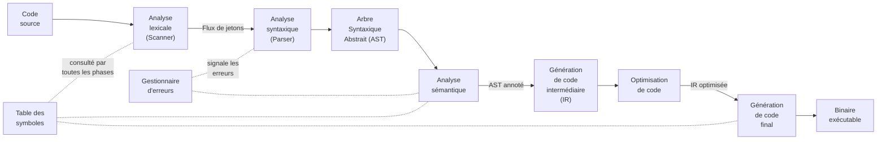

# Chapitre I.20 : Compilation et Interprétation

## 20.1 Structure d\'un Compilateur

### 20.1.1 Introduction : La Traduction des Langages comme Pont entre l\'Humain et la Machine

Au cœur de l\'informatique moderne se trouve un processus de traduction fondamental, un acte de transformation qui permet aux idées humaines, exprimées dans des langages abstraits et structurés, de prendre vie sous forme d\'opérations électroniques au sein d\'un processeur. Ce processus est l\'œuvre du **compilateur**, un programme dont la fonction est de lire un programme écrit dans un langage de programmation, dit *langage source*, et de le traduire en un programme équivalent dans un autre langage, le *langage cible*. Le plus souvent, le langage source est un langage de haut niveau comme C++, Java ou Python, conçu pour être lisible et manipulable par les développeurs grâce à une syntaxe et des mots-clés proches du langage naturel. Le langage cible, quant à lui, est typiquement un langage de bas niveau, tel que le langage d\'assemblage ou directement le code machine, une séquence d\'instructions binaires complexes mais directement exécutables par le matériel informatique.

Le compilateur n\'est donc pas un simple traducteur littéral. Il est un pont sophistiqué jeté par-dessus le fossé sémantique qui sépare la pensée humaine de la logique de la machine. La complexité inhérente à la conception d\'un compilateur est le reflet direct de l\'ampleur de ce fossé. Un programmeur de haut niveau raisonne en termes de variables, de boucles, d\'objets et de fonctions, des abstractions puissantes qui masquent les détails de l\'architecture sous-jacente. La machine, à l\'inverse, ne comprend qu\'un ensemble limité d\'opérations fondamentales : charger des données depuis la mémoire vers un registre, effectuer une addition, comparer deux valeurs, ou sauter vers une autre instruction. La tâche du compilateur est de décomposer les abstractions de haut niveau en une séquence précise et optimisée de ces opérations élémentaires.

Ce chapitre se propose d\'explorer en profondeur l\'anatomie de ce traducteur. Nous allons déconstruire le processus de compilation en une série d\'étapes logiques, chacune responsable d\'une transformation spécifique. Ce voyage nous mènera de la simple chaîne de caractères du fichier source à la structure arborescente de l\'analyse syntaxique, puis à une représentation sémantiquement validée, pour enfin aboutir à un code machine efficace. En chemin, nous verrons comment les concepts théoriques des langages formels et des automates, étudiés dans le Volume I, ne sont pas de simples curiosités académiques, mais bien les fondations rigoureuses sur lesquelles reposent ces outils d\'ingénierie logicielle essentiels.

### 20.1.2 Compilation vs. Interprétation : Analyse Comparative des Modèles d\'Exécution

Avant de plonger dans les rouages internes d\'un compilateur, il est crucial de le situer par rapport à son principal homologue dans l\'exécution de programmes : l\'**interpréteur**. Bien que les deux visent à exécuter un programme source, leurs approches diffèrent fondamentalement quant au moment et à la manière dont la traduction est effectuée. Cette différence philosophique a des implications profondes sur la performance, la portabilité et le cycle de développement des langages de programmation.

La **compilation** est un processus de traduction *a priori*. Le compilateur analyse et traduit l\'intégralité du code source en une seule fois, avant toute exécution. Le résultat de cette phase est un fichier exécutable autonome, contenant du code machine spécifique à une plateforme (une combinaison d\'architecture de processeur et de système d\'exploitation). Une fois ce fichier généré, il peut être exécuté de manière répétée sans qu\'il soit nécessaire de consulter à nouveau le code source. La traduction est une étape distincte et préalable à l\'exécution.

L\'**interprétation**, à l\'inverse, est un processus de traduction *à la volée*. L\'interpréteur lit le code source ligne par ligne (ou instruction par instruction) et exécute immédiatement les actions correspondantes. Il n\'y a pas de phase de traduction préalable ni de génération d\'un fichier exécutable distinct. L\'interpréteur agit comme une machine virtuelle qui simule l\'exécution du code source directement. La traduction et l\'exécution sont intrinsèquement liées et se déroulent simultanément.

Le choix entre ces deux modèles n\'est pas anodin ; il représente un compromis fondamental entre plusieurs facteurs critiques, résumés dans le tableau ci-dessous.

**Tableau 20.1 : Compilation vs. Interprétation - Tableau Comparatif**

  ----------------------------- -------------------------------------------------------------------------------------------------------------------------------------------------------------------------------------------------------- ---------------------------------------------------------------------------------------------------------------------------------------------------------------------------------------- ------------------------------------------------------------------------------------------------------------------------------------------------------------------
  Critère                       Compilation                                                                                                                                                                                              Interprétation                                                                                                                                                                           Modèles Hybrides (JIT)

  **Vitesse d\'Exécution**      **Élevée**. Le code est traduit en code machine natif et optimisé avant l\'exécution. L\'analyse globale du programme permet des optimisations profondes.                                             **Faible**. La traduction est effectuée à la volée à chaque exécution, ce qui introduit une surcharge de performance significative (overhead).                                        **Élevée (après \"chauffage\")**. Commence par interpréter, puis compile les portions de code fréquemment exécutées (\"hot spots\") en code natif à la volée.

  **Portabilité**               **Faible**. Le code exécutable est spécifique à une plateforme (CPU + OS). Le programme doit être recompilé pour chaque nouvelle cible.                                                               **Élevée**. Le même code source peut être exécuté sur n\'importe quelle plateforme disposant d\'un interpréteur compatible, sans recompilation.                                       **Élevée**. Le bytecode (une forme d\'IR) est portable. Seule la machine virtuelle (qui inclut le compilateur JIT) doit être portée sur la nouvelle plateforme.

  **Cycle de Développement**    **Plus long**. Chaque modification du code source nécessite une étape de compilation avant de pouvoir tester le programme, ce qui peut être lent pour de grands projets.                              **Rapide**. Les modifications peuvent être testées instantanément sans étape de compilation, ce qui favorise le prototypage rapide et le développement itératif.                      **Rapide**. Le cycle de développement est similaire à celui de l\'interprétation, avec les bénéfices de performance de la compilation pour le code déployé.

  **Facilité de Débogage**      **Plus difficile**. Les erreurs sont souvent détectées à la compilation avec des messages statiques. Les erreurs d\'exécution peuvent être plus difficiles à tracer jusqu\'au code source original.   **Plus facile**. Les erreurs sont détectées à l\'exécution, ligne par ligne, avec un accès complet au contexte (variables, pile d\'appels), ce qui facilite le débogage interactif.   **Facile**. Combine les avantages du débogage interprété avec la possibilité d\'analyser le code compilé.

  **Sécurité du Code Source**   **Élevée**. Seul le code machine binaire est distribué, ce qui rend la rétro-ingénierie du code source original difficile (confidentialité du code).                                                  **Faible**. Le code source est directement distribué et exécuté par l\'interpréteur, le rendant facilement accessible et modifiable.                                                  **Moyenne**. Le bytecode est distribué, ce qui est plus abstrait que le code source mais plus facile à décompiler que le code machine natif.

  **Cas d\'Usage Typiques**     Systèmes d\'exploitation, compilateurs, moteurs de jeux, calcul scientifique, applications embarquées (performance critique).                                                                         Scripts web (PHP, JavaScript côté client), analyse de données (Python, R), langages de script système, prototypage rapide.                                                            Applications d\'entreprise (Java, C#), navigateurs web modernes (moteurs JavaScript), certaines implémentations de Python (PyPy).
  ----------------------------- -------------------------------------------------------------------------------------------------------------------------------------------------------------------------------------------------------- ---------------------------------------------------------------------------------------------------------------------------------------------------------------------------------------- ------------------------------------------------------------------------------------------------------------------------------------------------------------------

La distinction entre compilation et interprétation n\'est pas simplement une question d\'implémentation technique ; elle façonne la philosophie, l\'écosystème et les domaines d\'application d\'un langage. Le modèle de compilation, en effectuant tout le travail d\'analyse en amont, est intrinsèquement adapté aux environnements où la performance et la robustesse sont primordiales. L\'écosystème qui en découle est centré sur des chaînes d\'outils complexes (build systems, linkers) et une culture de l\'analyse statique. À l\'opposé, le modèle d\'interprétation, avec son approche \"juste-à-temps\", favorise la flexibilité, le dynamisme (typage dynamique, modification du code à la volée) et l\'interactivité (consoles REPL), ce qui le rend idéal pour des tâches où la vitesse de développement prime sur la vitesse d\'exécution.

Cette dichotomie historique a cependant été nuancée par l\'émergence de **modèles hybrides**, notamment la **compilation juste-à-temps (Just-In-Time, JIT)**. Des systèmes comme la Machine Virtuelle Java (JVM) ou le moteur JavaScript V8 dans les navigateurs modernes cherchent à obtenir le meilleur des deux mondes. Un programme est d\'abord compilé en une représentation intermédiaire portable (le

*bytecode*). À l\'exécution, cette représentation est initialement interprétée. Simultanément, la machine virtuelle profile le code en cours d\'exécution pour identifier les \"points chauds\" (*hot spots*), c\'est-à-dire les portions de code (typiquement des boucles) qui sont exécutées le plus fréquemment. Ces portions sont alors compilées en code machine natif optimisé, à la volée. Les exécutions ultérieures de ces portions de code utiliseront la version compilée, beaucoup plus rapide. Ce modèle illustre que la compilation et l\'interprétation ne sont pas des catégories mutuellement exclusives, mais plutôt les deux extrêmes d\'un spectre de stratégies d\'exécution.

### 20.1.3 Le Pipeline de Compilation : Un Voyage Séquentiel à travers les Phases de Traduction

La transformation d\'un programme source en code cible n\'est pas une opération monolithique. Elle est décomposée en une série de phases séquentielles, formant ce que l\'on appelle le **pipeline de compilation**.

**Figure 20.1 -- Pipeline de compilation : du code source au binaire exécutable**

Chaque phase prend en entrée la représentation du programme produite par la phase précédente, y applique une transformation spécifique, et transmet sa sortie à la phase suivante. Cette structure modulaire permet de gérer la complexité du processus en isolant les différentes préoccupations. Le pipeline classique, souvent appelé le modèle du \"livre du dragon\" (en référence à l\'ouvrage de référence d\'Aho, Sethi et Ullman), se compose des phases suivantes  :

> **Analyse Lexicale (Scanning)** : Le compilateur commence par lire le fichier source comme une simple séquence de caractères. L\'analyseur lexical, ou *scanner*, regroupe ces caractères en unités lexicales significatives appelées *lexèmes*, et produit pour chacun un *jeton* (token). Par exemple, la chaîne position = initial + vitesse \* 60; est transformée en un flux de jetons tels que (IDENTIFIANT, \"position\"), (OPÉRATEUR_ASSIGNATION, \"=\"), (IDENTIFIANT, \"initial\"), etc.. Cette phase élimine également les éléments non pertinents pour la structure logique, comme les espaces et les commentaires.
>
> **Analyse Syntaxique (Parsing)** : L\'analyseur syntaxique reçoit le flux de jetons et vérifie s\'il respecte la grammaire du langage. Il organise les jetons en une structure hiérarchique, généralement un **Arbre Syntaxique Abstrait (AST)**, qui représente la structure grammaticale du programme. Cet arbre capture des relations telles que \"cette expression est une addition dont les opérandes sont telle variable et telle autre expression\". Si la séquence de jetons ne peut pas être structurée selon les règles de la grammaire, une erreur de syntaxe est signalée.
>
> **Analyse Sémantique** : Une fois la structure syntaxique validée, l\'analyseur sémantique vérifie la cohérence \"logique\" du programme. Il utilise l\'AST pour effectuer des contrôles de type (par exemple, s\'assurer qu\'on n\'additionne pas une chaîne de caractères et un tableau), vérifier que les variables sont déclarées avant d\'être utilisées, que les fonctions sont appelées avec le bon nombre et le bon type d\'arguments, etc.. Cette phase enrichit l\'AST avec des informations de type et de portée.
>
> **Génération de Code Intermédiaire** : Après les analyses, de nombreux compilateurs traduisent l\'AST en une **Représentation Intermédiaire (IR)** de plus bas niveau. Cette IR est conçue pour être à la fois indépendante du langage source et de la machine cible. Une forme courante est le code à trois adresses, qui décompose les opérations complexes en une séquence d\'instructions simples, chacune avec au plus trois opérandes (par exemple, t1 = vitesse \* 60).
>
> **Optimisation de Code** : Cette phase (ou ensemble de phases) opère sur la représentation intermédiaire pour la transformer en une version sémantiquement équivalente mais plus performante. Les optimisations peuvent viser à réduire le temps d\'exécution (vitesse) ou la taille du code. Les techniques incluent l\'élimination de code mort, le déplacement de calculs hors des boucles, la propagation de constantes, etc..
>
> **Génération de Code Final** : Enfin, le générateur de code prend l\'IR optimisée et la traduit dans le langage cible final, généralement le langage d\'assemblage de l\'architecture visée. Cette phase est hautement dépendante de la machine et implique des décisions cruciales comme la sélection des instructions machine appropriées et l\'**allocation de registres**, c\'est-à-dire l\'assignation des variables et des valeurs temporaires aux registres rapides du processeur.

Chacune de ces phases constitue une étape essentielle du voyage de traduction, et les sections suivantes de ce chapitre seront consacrées à les explorer en détail.

### 20.1.4 Composants Transversaux : Le Rôle Central de la Table des Symboles et du Gestionnaire d\'Erreurs

Bien que le pipeline de compilation soit souvent présenté comme une séquence linéaire, deux composants agissent de manière transversale, interagissant avec presque toutes les phases : la **table des symboles** et le **gestionnaire d\'erreurs**. Ils ne constituent pas des phases à proprement parler, mais plutôt des services globaux essentiels au bon fonctionnement du compilateur.

La **Table des Symboles** est une structure de données centrale qui stocke des informations sur tous les identificateurs (noms de variables, de fonctions, de types, etc.) rencontrés dans le programme source. Pour chaque identificateur, elle enregistre des attributs cruciaux tels que son type, sa portée (la région du code où il est visible), son emplacement en mémoire, et d\'autres informations sémantiques.

> L\'**analyseur lexical** peut être le premier à insérer de nouveaux identificateurs dans la table.
>
> L\'**analyseur syntaxique** et surtout l\'**analyseur sémantique** la peuplent massivement lors de l\'analyse des déclarations et la consultent constamment pour vérifier la validité des utilisations des identificateurs (par exemple, pour la vérification des types).
>
> Les phases d\'optimisation et de génération de code l\'utilisent pour connaître la taille et l\'emplacement des variables afin de générer le code approprié.\
> La table des symboles est en quelque sorte la mémoire et le contexte du compilateur tout au long du processus de traduction.

Le **Gestionnaire d\'Erreurs** est le second composant transversal. Son rôle est de détecter, de signaler et, si possible, de gérer les erreurs qui peuvent survenir à n\'importe quelle étape du pipeline.

> Une **erreur lexicale** peut être un caractère invalide.
>
> Une **erreur syntaxique** peut être un point-virgule manquant.
>
> Une erreur sémantique peut être l\'utilisation d\'une variable non déclarée.\
> Un bon gestionnaire d\'erreurs ne se contente pas d\'arrêter la compilation à la première erreur. Il doit fournir des messages clairs et précis, indiquant la nature de l\'erreur et sa localisation dans le code source, afin d\'aider le développeur à la corriger.11 De plus, des mécanismes de\
> *récupération d\'erreur* peuvent être mis en place pour permettre au compilateur de continuer l\'analyse après une erreur, afin de détecter et de signaler plusieurs erreurs en une seule passe de compilation.

Ces deux composants agissent comme le système nerveux central et le système immunitaire du compilateur, respectivement, assurant la cohérence, la robustesse et l\'utilité de l\'ensemble du processus de traduction.

### 20.1.5 L\'Architecture Front-End / Back-End : Le Pilier de la Portabilité et de la Modularité

L\'organisation d\'un compilateur en phases séquentielles peut être regroupée en une architecture de plus haut niveau, qui est devenue la norme dans la conception de compilateurs modernes. Cette architecture divise le compilateur en trois grandes parties : la partie avant (*front-end*), la partie intermédiaire (*middle-end*), et la partie arrière (*back-end*). Cette division n\'est pas arbitraire ; elle est motivée par un objectif d\'ingénierie fondamental : la portabilité et la réutilisation.

> **La Partie Avant (Front-End)** : Cette partie est dépendante du **langage source**. Elle englobe les premières phases du pipeline : l\'analyse lexicale, l\'analyse syntaxique et l\'analyse sémantique. Son unique responsabilité est de prendre un programme source dans un langage spécifique (par exemple, C++), de le valider, et de le traduire en une Représentation Intermédiaire (IR) commune.
>
> **La Partie Intermédiaire (Middle-End)** : Cette partie est largement indépendante à la fois du langage source et de la machine cible. Elle prend en entrée l\'IR générée par le front-end et y applique la majorité des optimisations de code (par exemple, l\'élimination de code mort, la propagation de constantes, les optimisations de boucles). Comme elle opère sur une IR standardisée, ces optimisations sont génériques et peuvent bénéficier à n\'importe quel langage source.
>
> **La Partie Arrière (Back-End)** : Cette partie est dépendante de la **machine cible**. Elle prend l\'IR optimisée par le middle-end et la traduit en code machine pour une architecture de processeur spécifique (par exemple, x86-64, ARM64, RISC-V). Cela inclut les phases de sélection d\'instructions, d\'allocation de registres et d\'optimisations spécifiques à la machine.

L\'importance de cette architecture réside dans sa solution élégante au **problème \"M x N\"**. Imaginez que l\'on veuille compiler

*M* langages de programmation différents pour *N* architectures de machines différentes. Une approche monolithique nécessiterait d\'écrire *M × N* compilateurs distincts, un effort colossal et redondant. L\'architecture en trois parties, centrée sur une IR bien définie, transforme ce problème en un problème \"M + N\". Pour supporter un nouveau langage, il suffit d\'écrire un nouveau *front-end* qui génère l\'IR existante ; ce langage sera alors immédiatement compilable pour toutes les architectures pour lesquelles un *back-end* existe déjà. Inversement, pour cibler une nouvelle architecture matérielle, il suffit d\'écrire un nouveau *back-end* qui consomme l\'IR ; tous les langages existants pourront alors être compilés pour cette nouvelle machine.

Cette modularité est le principe fondateur de géants de la compilation comme **GCC (GNU Compiler Collection)** et **LLVM (Low Level Virtual Machine)**. LLVM, en particulier, a poussé cette philosophie à son paroxysme. En fournissant une IR robuste et bien spécifiée (LLVM IR), ainsi qu\'un middle-end extrêmement performant et une vaste collection de back-ends, LLVM a considérablement abaissé la barrière à l\'entrée pour la création de nouveaux langages compilés. Des langages modernes comme Swift, Rust et Clang (un front-end C/C++/Objective-C) sont tous construits sur l\'infrastructure LLVM. Ils bénéficient \"gratuitement\" de décennies de travail sur l\'optimisation de code et la génération de code pour de multiples plateformes. Ainsi, cette architecture ne favorise pas seulement la réutilisation de code ; elle est un catalyseur d\'innovation dans l\'ensemble de l\'industrie informatique, permettant aux concepteurs de langages de se concentrer sur la sémantique et les fonctionnalités de leur langage, tout en s\'appuyant sur une infrastructure de compilation de classe mondiale pour la performance et la portabilité.

## 20.2 Analyse Lexicale (Scanning)

### 20.2.1 Rôle et Objectifs : De la Chaîne de Caractères au Flux Structuré de Lexèmes

L\'analyse lexicale, également connue sous le nom de *scanning* ou *tokenization*, constitue la toute première phase du processus de compilation. Son rôle fondamental est de lire le programme source, qui se présente initialement comme un simple flux de caractères, et de le segmenter en une séquence d\'unités lexicales, ou

*jetons* (tokens), qui sont les \"mots\" du langage de programmation. Cette phase agit comme une interface entre le monde brut du texte et le monde structuré de la syntaxe.

Plus précisément, l\'analyseur lexical accomplit plusieurs tâches essentielles :

> **Regroupement de caractères en lexèmes** : Il parcourt le texte source de gauche à droite, caractère par caractère, et identifie les séquences de caractères qui forment des unités logiques. Ces séquences sont appelées *lexèmes*. Par exemple, dans l\'instruction if (x \> 10), les lexèmes sont if, (, x, \>, 10, et ).
>
> **Production de jetons** : Pour chaque lexème reconnu, l\'analyseur lexical produit un *jeton*. Un jeton est une structure de données qui représente le lexème de manière abstraite. Il est généralement composé de deux parties : un type de jeton (ou code) et une valeur attributaire optionnelle. Le type de jeton catégorise le lexème (par exemple,\
> MOT_CLÉ, IDENTIFIANT, LITTÉRAL_ENTIER, OPÉRATEUR_RELATIONNEL). La valeur attributaire contient des informations spécifiques au lexème, comme le nom de l\'identifiant (\"x\") ou la valeur numérique du littéral (10).
>
> **Élimination des éléments superflus** : L\'analyseur lexical est également responsable de la suppression des éléments du code source qui sont sans importance pour les phases ultérieures de la compilation, tels que les espaces, les tabulations, les sauts de ligne (collectivement appelés *espaces blancs*) et les commentaires.
>
> **Interaction avec la table des symboles** : Lorsqu\'un lexème correspondant à un identifiant est rencontré, l\'analyseur lexical peut interagir avec la table des symboles pour y stocker le nom de l\'identifiant et récupérer un pointeur vers son entrée, qui sera utilisé comme valeur attributaire du jeton.

L\'objectif principal de cette séparation est la **simplification de la conception du compilateur**. En déléguant la tâche de reconnaissance des \"mots\" à l\'analyseur lexical, l\'analyseur syntaxique (la phase suivante) peut opérer à un niveau d\'abstraction plus élevé. Il n\'a plus à se soucier des détails de bas niveau comme les espaces, les commentaires ou la manière dont les caractères

1, 0, 0 forment le nombre 100. Il peut travailler directement avec un flux propre et structuré de jetons (MOT_CLÉ_IF, PARENTHÈSE_OUVRANTE, IDENTIFIANT, etc.), ce qui rend la définition de la grammaire du langage et l\'implémentation de l\'analyseur syntaxique beaucoup plus simples et efficaces. L\'analyse lexicale est donc une étape de prétraitement et de nettoyage qui prépare le terrain pour l\'analyse structurelle plus complexe qui va suivre.

### 20.2.2 Fondements Théoriques : Les Expressions Régulières comme Langage de Spécification des Lexèmes

La question fondamentale de l\'analyse lexicale est la suivante : comment spécifier de manière formelle et non ambiguë les patrons (patterns) qui définissent les différents types de lexèmes? La réponse à cette question se trouve dans la théorie des langages formels, et plus précisément dans l\'utilisation des **expressions régulières** (parfois appelées expressions rationnelles). Les expressions régulières constituent un langage puissant et concis pour décrire des ensembles de chaînes de caractères, qui sont connus sous le nom de **langages réguliers**.

Une expression régulière est construite à partir de symboles d\'un alphabet (par exemple, les caractères ASCII) et de trois opérateurs fondamentaux  :

> **Concaténation** : Si r et s sont des expressions régulières, alors leur concaténation rs est une expression régulière qui dénote le langage formé par les chaînes obtenues en concaténant une chaîne du langage de r avec une chaîne du langage de s. Par exemple, l\'expression ab dénote le langage {\"ab\"}.
>
> **Union (ou alternative)** : Si r et s sont des expressions régulières, alors leur union r \| s (parfois notée r + s) est une expression régulière qui dénote le langage qui est l\'union des langages de r et de s. Par exemple, a\|b dénote le langage {\"a\", \"b\"}.
>
> **Fermeture de Kleene (ou étoile)** : Si r est une expression régulière, alors r\* est une expression régulière qui dénote le langage formé par la concaténation de zéro ou plusieurs chaînes du langage de r. Par exemple, a\* dénote le langage {ε, \"a\", \"aa\", \"aaa\",\...}, où ε est la chaîne vide.

À partir de ces opérateurs de base, on peut définir des abréviations utiles :

> r+ : Une ou plusieurs occurrences de r (équivalent à rr\*).
>
> r? : Zéro ou une occurrence de r (équivalent à r\|ε).
>
> \[a-z\] : Une plage de caractères, équivalente à a\|b\|\...\|z.
>
> . : N\'importe quel caractère (sauf le saut de ligne, généralement).

Grâce à ce formalisme, nous pouvons définir précisément les patrons de tous les jetons d\'un langage de programmation. Voici quelques exemples typiques :

> **Identificateurs** : Un identifiant commence généralement par une lettre ou un tiret bas, suivi de n\'importe quel nombre de lettres, de chiffres ou de tirets bas. L\'expression régulière correspondante serait : (lettre \| \_) (lettre \| \_ \| chiffre)\*, où lettre est une abréviation pour \[a-zA-Z\] et chiffre pour \[0-9\].
>
> **Nombres entiers non signés** : Une séquence d\'un ou plusieurs chiffres : chiffre+.
>
> **Nombres réels** : Un patron plus complexe pourrait être chiffre+ (\'.\' chiffre+)? (\'E\' (\'+\'\|\'-\')? chiffre+)?, qui reconnaît des formes comme 123, 123.45, 123.45E-2, etc..
>
> **Opérateurs relationnels** : Les opérateurs comme \<, \<=, ==, !=, \>, \>= peuvent être décrits par des alternatives : \< \| \<= \| == \|!= \| \> \| \>=.
>
> **Mots-clés** : Chaque mot-clé est simplement sa propre chaîne de caractères, comme if, else, while.

L\'utilisation des expressions régulières pour spécifier les jetons est un exemple parfait de l\'application de la théorie à la pratique. Elle fournit une notation déclarative, claire et formelle qui sert de cahier des charges pour l\'analyseur lexical. Le compilateur n\'a plus besoin de code impératif complexe pour décrire ce qu\'est un identifiant ; il lui suffit de la définition formelle fournie par l\'expression régulière. La tâche suivante consiste alors à transformer cette spécification en un programme capable de reconnaître efficacement ces patrons.

### 20.2.3 La Reconnaissance par Automates Finis : Du Théorique au Pratique

Une fois les patrons des lexèmes spécifiés par des expressions régulières, le problème se déplace vers la reconnaissance : comment écrire un programme qui, étant donné un flux de caractères, peut efficacement identifier les sous-chaînes qui correspondent à ces patrons? La solution, une fois de plus, est profondément ancrée dans la théorie des automates, un pilier des langages formels. Le **théorème de Kleene** établit une équivalence fondamentale : tout langage qui peut être décrit par une expression régulière peut être reconnu par un automate fini, et vice-versa. Ce théorème n\'est pas seulement une affirmation d\'existence ; il est soutenu par des algorithmes constructifs qui permettent de passer d\'une représentation à l\'autre.

L\'ensemble du processus de construction d\'un analyseur lexical à partir d\'expressions régulières est une démonstration éclatante de cette théorie en action. Il se déroule en plusieurs étapes algorithmiques qui transforment une spécification déclarative de haut niveau en un programme de reconnaissance de bas niveau extrêmement efficace.

#### De l\'Expression Régulière à l\'AFN-ε : L\'Algorithme de Thompson

La première étape consiste à convertir chaque expression régulière définissant un type de jeton en un **Automate Fini Non déterministe avec des ε-transitions (AFN-ε)**. L\'algorithme de Thompson est une méthode classique et élégante pour réaliser cette construction de manière inductive. Il définit des règles simples pour construire des automates pour les expressions de base, puis des règles pour composer ces automates afin de gérer les opérateurs d\'expressions régulières.

> **Cas de base** :

Pour une expression ε (la chaîne vide), l\'automate est un état initial qui est aussi un état final, avec une ε-transition vers lui-même. Plus simplement, un état initial qui est aussi final.

Pour une expression a, où a est un symbole de l\'alphabet, l\'automate a un état initial et un état final, avec une seule transition de l\'initial au final, étiquetée par a.

> **Cas inductifs** : Soient N(s) et N(t) les AFN-ε pour les expressions régulières s et t.

**Union (s\|t)** : On crée un nouvel état initial avec des ε-transitions vers les états initiaux de N(s) et N(t). On crée également un nouvel état final, et les anciens états finaux de N(s) et N(t) y sont reliés par des ε-transitions.

**Concaténation (st)** : L\'état initial de N(s) devient l\'état initial du nouvel automate. L\'état final de N(s) est fusionné avec l\'état initial de N(t) (ou relié par une ε-transition). L\'état final de N(t) devient le nouvel état final.

**Fermeture de Kleene (s\*)** : On crée un nouvel état initial et un nouvel état final. On ajoute une ε-transition du nouvel état initial au nouvel état final (pour reconnaître la chaîne vide). On ajoute une ε-transition du nouvel état initial à l\'ancien état initial de N(s). On ajoute une ε-transition de l\'ancien état final de N(s) à l\'ancien état initial (pour la boucle) et une autre vers le nouvel état final.

En appliquant ces règles récursivement sur la structure de l\'expression régulière, on peut construire un AFN-ε pour n\'importe quelle expression régulière. Le résultat est un automate qui peut avoir plusieurs transitions pour un même symbole à partir d\'un état donné, ou des transitions qui ne consomment aucun caractère (ε-transitions), d\'où son caractère \"non déterministe\".

#### Déterminisation de l\'AFN en AFD : La Construction par Sous-Ensembles

Les AFN sont un outil théorique puissant, mais leur simulation directe est inefficace car elle nécessite d\'explorer plusieurs chemins potentiels simultanément. Pour une implémentation performante, nous avons besoin d\'un **Automate Fini Déterministe (AFD)**, dans lequel, pour chaque état et chaque symbole d\'entrée, il n\'existe qu\'une seule et unique transition possible.

L\'**algorithme de construction par sous-ensembles** permet de convertir n\'importe quel AFN (y compris un AFN-ε) en un AFD équivalent qui reconnaît exactement le même langage. L\'idée centrale est de créer des états de l\'AFD qui correspondent à des

*ensembles* d\'états de l\'AFN.

> **ε-fermeture** : On définit d\'abord une opération ε-fermeture(S), où S est un ensemble d\'états de l\'AFN. Cette opération calcule l\'ensemble de tous les états de l\'AFN atteignables à partir d\'un état de S en ne suivant que des ε-transitions.
>
> **État initial de l\'AFD** : L\'état initial de l\'AFD est ε-fermeture({q₀}), où q₀ est l\'état initial de l\'AFN.
>
> **Construction des transitions** : Pour un état Q de l\'AFD (qui est un ensemble d\'états de l\'AFN) et un symbole d\'entrée a, la transition δ_AFD(Q, a) mène à un nouvel état Q\' de l\'AFD. Cet état Q\' est calculé en deux temps : d\'abord, on trouve tous les états de l\'AFN atteignables à partir d\'un état de Q par une transition sur a ; ensuite, on calcule l\'ε-fermeture de cet ensemble de destination.
>
> **États finaux de l\'AFD** : Un état Q de l\'AFD est un état final si et seulement si il contient au moins un état final de l\'AFN d\'origine.

Ce processus est répété jusqu\'à ce qu\'aucun nouvel état de l\'AFD ne puisse être créé. Bien que le nombre d\'états de l\'AFD puisse être exponentiellement plus grand que celui de l\'AFN dans le pire des cas, en pratique, pour les expressions régulières utilisées dans les langages de programmation, la taille de l\'AFD résultant reste gérable.

#### Minimisation de l\'AFD : L\'Algorithme de Hopcroft

Une fois l\'AFD construit, il est possible qu\'il contienne des états redondants (des états qui sont indiscernables, c\'est-à-dire qui acceptent exactement le même ensemble de chaînes restantes). L\'**algorithme de Hopcroft** (ou des algorithmes de partitionnement d\'états similaires) peut être utilisé pour fusionner ces états équivalents et produire un AFD minimal, c\'est-à-dire un AFD avec le plus petit nombre possible d\'états qui reconnaît le même langage. Cet automate minimal est unique (à un isomorphisme près) et représente le reconnaisseur le plus efficace possible pour le langage régulier donné.

Ce pipeline algorithmique, allant de l\'expression régulière à l\'AFN, puis à l\'AFD et enfin à l\'AFD minimal, est une illustration remarquable de la manière dont la théorie des automates fournit un chemin direct et prouvablement correct d\'une spécification de haut niveau à une implémentation optimisée. C\'est ce processus qui est encapsulé et automatisé par les générateurs d\'analyseurs lexicaux.

### 20.2.4 Implémentation et Outils : Les Générateurs d\'Analyseurs Lexicaux (Lex/Flex)

Bien qu\'il soit possible d\'implémenter manuellement un analyseur lexical en codant directement l\'AFD (par exemple, avec une grande instruction switch dans une boucle), cette approche est fastidieuse, sujette aux erreurs et difficile à maintenir. Heureusement, le processus algorithmique décrit ci-dessus est si bien défini qu\'il peut être entièrement automatisé. Des outils appelés **générateurs d\'analyseurs lexicaux** ont été développés à cette fin. Les plus connus sont **Lex** et sa version GNU plus rapide et plus flexible, **Flex**.

Le fonctionnement de Flex est une application directe de la théorie des automates. Le développeur ne manipule pas directement les automates, mais fournit un fichier de spécification (généralement avec une extension .l) qui décrit l\'analyseur lexical à un niveau d\'abstraction élevé. Ce fichier est structuré en trois sections, séparées par le délimiteur

%%  :

%{\
// Section des définitions C\
// Inclusions de fichiers d\'en-tête, déclarations globales\
%}\
\
/\* Section des définitions régulières (macros) \*/\
chiffre \[0-9\]\
lettre \[a-zA-Z\]\
\
%%\
/\* Section des règles (patrons et actions) \*/\
{lettre}({lettre}\|{chiffre})\* { /\* Action C pour un identifiant \*/ return IDENTIFIANT; }\
{chiffre}+ { /\* Action C pour un entier \*/ yylval = atoi(yytext); return ENTIER; }\
\"if\" { return IF; }\
\[ \\t\\n\]+ { /\* Ignorer les espaces blancs \*/ }\
. { /\* Action pour tout autre caractère \*/ }\
%%\
\
/\* Section du code utilisateur C \*/\
// Fonctions auxiliaires, fonction main()

> **Section des définitions** : La première partie (avant le premier %%) contient du code C qui sera copié verbatim dans le fichier de sortie, ainsi que des définitions de macros pour des expressions régulières réutilisables.
>
> **Section des règles** : C\'est le cœur du fichier de spécification. Chaque ligne est une règle composée d\'un **patron** (une expression régulière) et d\'une **action** (un bloc de code C à exécuter lorsque le patron est reconnu).
>
> **Section du code utilisateur** : La dernière partie (après le second %%) contient du code C supplémentaire, comme la fonction main() qui appelle l\'analyseur, ou des fonctions auxiliaires.

Lorsque l\'on exécute Flex sur ce fichier de spécification (flex analyseur.l), il effectue en interne les étapes théoriques que nous avons décrites :

> Il prend toutes les expressions régulières de la section des règles.
>
> Il les convertit en un seul grand AFN-ε (en utilisant une technique similaire à l\'algorithme de Thompson).
>
> Il convertit cet AFN en un AFD équivalent (via la construction par sous-ensembles).
>
> Il minimise cet AFD.
>
> Finalement, il génère un fichier source en C, traditionnellement nommé lex.yy.c, qui contient une fonction int yylex(void). Cette fonction implémente l\'AFD sous forme de tables de transition et d\'un \"moteur\" de simulation.

Lorsqu\'elle est appelée, la fonction yylex() lit les caractères du flux d\'entrée et simule l\'AFD. Elle suit les transitions jusqu\'à atteindre un état où aucune autre transition n\'est possible. À ce stade, elle applique deux règles de désambiguïsation fondamentales :

> **La règle de la plus longue correspondance (Longest Match)** : Si plusieurs patrons correspondent à des préfixes du texte d\'entrée, yylex() choisit celui qui correspond à la plus longue chaîne de caractères. Par exemple, face à l\'entrée\
> ifelse, il reconnaîtra le lexème ifelse (si c\'est un mot-clé) plutôt que if.
>
> **La règle de la première correspondance (First Match)** : Si plusieurs règles correspondent à la même chaîne la plus longue, la règle qui apparaît en premier dans le fichier de spécification est choisie. C\'est pourquoi les mots-clés (\
> if, while) doivent être déclarés avant la règle générale des identificateurs.

Une fois le lexème identifié, la chaîne de caractères correspondante est stockée dans une variable globale char\* yytext, et sa longueur dans int yyleng. Le code C associé à la règle choisie est alors exécuté. Ce code est généralement responsable de retourner le type de jeton à l\'analyseur syntaxique qui a appelé

yylex().

En somme, des outils comme Flex incarnent l\'abstraction en ingénierie logicielle. Ils masquent la complexité de la théorie des automates et des algorithmes de conversion, permettant au développeur de se concentrer sur la spécification déclarative des jetons de son langage, ce qui augmente considérablement la productivité et la robustesse du processus de développement de compilateurs.

## 20.3 Analyse Syntaxique (Parsing)

### 20.3.1 Rôle et Objectifs : Vérification de la Grammaire et Construction de l\'Arbre Syntaxique

Après que l\'analyseur lexical a décomposé le flux de caractères en une séquence de jetons, l\'**analyseur syntaxique**, ou *parser*, entre en scène. C\'est la deuxième phase majeure du compilateur, et son rôle est d\'imposer une structure hiérarchique à ce qui n\'est encore qu\'une liste linéaire de \"mots\". Si l\'analyseur lexical vérifie la validité des mots, l\'analyseur syntaxique vérifie la validité des \"phrases\" et des \"paragraphes\" du programme.

Les objectifs principaux de l\'analyse syntaxique sont doubles :

> **Vérification de la conformité grammaticale** : L\'analyseur syntaxique s\'assure que la séquence de jetons fournie par l\'analyseur lexical est conforme aux règles de la grammaire du langage de programmation. Ces règles définissent comment les jetons peuvent être combinés pour former des constructions valides, telles que des expressions, des instructions, des déclarations de fonction, etc. Par exemple, la grammaire pourrait stipuler qu\'une instruction\
> if doit être suivie d\'une parenthèse ouvrante, d\'une expression, d\'une parenthèse fermante et d\'une instruction. Si le programme source viole l\'une de ces règles (par exemple, une parenthèse manquante), l\'analyseur syntaxique détecte une **erreur de syntaxe** et la signale via le gestionnaire d\'erreurs.
>
> **Construction d\'une représentation structurelle** : Si le programme est syntaxiquement correct, la tâche la plus importante de l\'analyseur est de produire une représentation de sa structure. Cette représentation prend généralement la forme d\'un **arbre syntaxique**. Cet arbre rend explicite la structure hiérarchique et imbriquée du code. Par exemple, pour l\'expression\
> a + b \* c, l\'arbre syntaxique montrera que la multiplication b \* c est un sous-arbre qui est lui-même un opérande de l\'addition. Cette structure est absolument essentielle pour les phases ultérieures de la compilation.

Le résultat de l\'analyse syntaxique n\'est pas simplement un verdict \"valide\" ou \"invalide\". C\'est une transformation fondamentale de la représentation du programme. On passe d\'une vue unidimensionnelle (le flux de jetons) à une vue bidimensionnelle et hiérarchique (l\'arbre syntaxique). C\'est sur cette structure arborescente que l\'analyse sémantique, l\'optimisation et la génération de code vont opérer. Sans cette étape, le compilateur n\'aurait aucune compréhension de la structure logique du programme et ne pourrait pas procéder à sa traduction.

### 20.3.2 Fondements Théoriques : Grammaires Non Contextuelles et Arbres de Dérivation

Tout comme les expressions régulières sont le formalisme de choix pour spécifier la structure des jetons, les **grammaires non contextuelles** (Context-Free Grammars, CFG) sont le formalisme standard pour décrire la syntaxe de la plupart des langages de programmation. Une CFG est un outil mathématique puissant pour définir des langages où les constructions peuvent être imbriquées récursivement, une caractéristique omniprésente dans la programmation (par exemple, des expressions dans des expressions, des instructions dans des blocs, etc.), que les expressions régulières ne peuvent pas capturer.

Une grammaire non contextuelle est formellement définie par un quadruplet G=(T,N,P,S), où :

> T est un ensemble fini de **symboles terminaux**. Dans le contexte de la compilation, ce sont les types de jetons produits par l\'analyseur lexical (par exemple, IDENTIFIANT, ENTIER, PLUS, POINT_VIRGULE).
>
> N est un ensemble fini de **symboles non terminaux** (ou variables syntaxiques). Ce sont des abstractions qui représentent des ensembles de chaînes de terminaux. Par exemple, \<expression\>, \<instruction\>, \<declaration\>.
>
> P est un ensemble fini de **règles de production** (ou règles de réécriture). Chaque règle est de la forme A→α, où A∈N est un non-terminal et α est une chaîne (possiblement vide) de symboles de (T∪N)∗. Cette règle signifie que le non-terminal A peut être remplacé par la séquence α.
>
> S∈N est un non-terminal spécial appelé l\'**axiome** (ou symbole de départ), qui représente l\'ensemble du programme.

Le processus de génération d\'une phrase valide du langage consiste à partir de l\'axiome S et à appliquer successivement des règles de production pour remplacer les non-terminaux jusqu\'à ce qu\'il ne reste qu\'une séquence de terminaux. Ce processus est appelé une **dérivation**.

La représentation visuelle d\'une dérivation est un **arbre de dérivation** (Parse Tree ou Concrete Syntax Tree). Dans cet arbre :

> Le nœud racine est étiqueté par l\'axiome S.
>
> Chaque nœud feuille est étiqueté par un symbole terminal ou la chaîne vide ϵ.
>
> Chaque nœud interne est étiqueté par un symbole non terminal.
>
> Si un nœud A a pour enfants les nœuds X1​,X2​,...,Xn​ (de gauche à droite), alors il doit exister une règle de production A→X1​X2​...Xn​ dans la grammaire.

L\'analyse syntaxique peut être vue comme le processus inverse : étant donné une séquence de terminaux (jetons), trouver un arbre de dérivation dont la racine est l\'axiome et dont les feuilles, lues de gauche à droite, correspondent à cette séquence. Si un tel arbre peut être construit, le programme est syntaxiquement correct.

Il existe deux principales stratégies de dérivation, qui donnent naissance aux deux grandes familles d\'analyseurs syntaxiques :

> **Dérivation gauche (Leftmost Derivation)** : À chaque étape, c\'est toujours le non-terminal le plus à gauche dans la chaîne qui est remplacé. Les analyseurs descendants (LL) construisent une dérivation gauche.
>
> **Dérivation droite (Rightmost Derivation)** : À chaque étape, c\'est toujours le non-terminal le plus à droite qui est remplacé. Les analyseurs ascendants (LR) construisent une dérivation droite en sens inverse.

Le choix de la grammaire et de la stratégie d\'analyse est fondamental et détermine la complexité et la puissance de l\'analyseur syntaxique.

### 20.3.3 L\'Arbre Syntaxique Abstrait (AST) : Une Représentation Essentielle pour les Phases Ultérieures

L\'arbre de dérivation, bien qu\'il soit une représentation fidèle du processus d\'analyse, est souvent trop détaillé et encombré pour être utilisé directement par les phases ultérieures du compilateur. Il contient de nombreux nœuds qui sont des artefacts de la grammaire plutôt que des éléments essentiels de la sémantique du programme. Par exemple, il inclut des nœuds pour les parenthèses, les points-virgules, et des chaînes de non-terminaux (comme

\<expression\> \\rightarrow \<terme\> \\rightarrow \<facteur\>) qui ne font que transmettre l\'information sans ajouter de signification.

Pour cette raison, l\'analyseur syntaxique construit une version plus concise et sémantiquement plus riche de l\'arbre, appelée **Arbre Syntaxique Abstrait (AST)**. L\'AST est une représentation arborescente condensée de la structure syntaxique du code source, où les détails non pertinents ont été \"abstraits\".

Les principales différences entre un arbre de dérivation et un AST sont :

> **Abstraction des détails syntaxiques** : Les nœuds correspondant à des symboles de ponctuation (parenthèses, accolades, points-virgules) sont généralement omis, car leur rôle est implicite dans la structure de l\'arbre.
>
> **Contraction des chaînes de production** : Les chaînes de productions unitaires (par exemple, \<expression\> \\rightarrow \<terme\>) sont contractées. Un nœud dans l\'AST représente souvent un concept sémantique (comme \"addition\" ou \"appel de fonction\") plutôt qu\'un non-terminal grammatical.
>
> **Structure orientée sémantique** : Les opérateurs deviennent des nœuds internes et leurs opérandes deviennent leurs enfants. Par exemple, pour a + b \* c, l\'AST aura un nœud + comme racine, avec a comme enfant gauche et un sous-arbre représentant b \* c comme enfant droit, reflétant ainsi directement la priorité des opérateurs.

L\'AST est la structure de données centrale pour le reste du compilateur.

> L\'**analyseur sémantique** parcourt l\'AST pour collecter des informations sur les identificateurs, vérifier les types et \"décorer\" l\'arbre avec des informations sémantiques (par exemple, en annotant chaque nœud d\'expression avec son type).
>
> L\'**optimiseur de code** analyse et transforme l\'AST (ou une IR dérivée de celui-ci) pour produire une version plus efficace du programme.
>
> Le **générateur de code** effectue un parcours final de l\'AST (ou de l\'IR) pour produire le code machine cible.

La construction de l\'AST est donc l\'objectif final et le produit le plus précieux de l\'analyse syntaxique. C\'est la première fois que le compilateur possède une représentation complète et sémantiquement exploitable du programme source. Des outils comme AST Explorer permettent de visualiser l\'AST généré pour différents langages et analyseurs, ce qui est un excellent moyen de comprendre comment le code linéaire est transformé en cette structure hiérarchique fondamentale.

### 20.3.4 L\'Analyse Descendante (Top-Down) : De la Racine aux Feuilles

L\'analyse descendante, comme son nom l\'indique, tente de construire l\'arbre de dérivation en partant de la racine (l\'axiome de la grammaire) et en descendant vers les feuilles (les jetons du flux d\'entrée). Cette approche est intuitive et correspond à la manière dont une dérivation gauche est effectuée. La forme la plus courante d\'analyse descendante est l\'

**analyse par descente récursive**.

#### Analyse par Descente Récursive et Analyse Prédictive

Un **analyseur par descente récursive** est une implémentation directe de la grammaire sous forme de code. Il consiste en un ensemble de procédures (ou fonctions) mutuellement récursives, où chaque procédure est associée à un non-terminal de la grammaire. La tâche de la procédure pour un non-terminal

A est de reconnaître une séquence de jetons qui peut être dérivée de A.

Considérons une règle de grammaire simple pour une liste d\'arguments entre parenthèses :

\<liste_args\> -\> ( \<args\> )

\<args\> -\> \<expr\> , \<args\> \| \<expr\>

La procédure parse_liste_args correspondante ressemblerait à ceci en pseudo-code :

fonction parse_liste_args():\
attendre_jeton(\'(\')\
parse_args()\
attendre_jeton(\')\')\
\
fonction parse_args():\
parse_expr()\
si prochain_jeton_est(\',\'):\
attendre_jeton(\',\')\
parse_args()\
// sinon, c\'est la fin de la liste d\'arguments

La structure du code reflète directement la structure de la grammaire. Cette approche est élégante et relativement facile à implémenter manuellement, ce qui en fait un choix populaire pour les compilateurs écrits à la main.

Cependant, cette approche simple peut rencontrer des difficultés. Si, pour un non-terminal A, il existe plusieurs règles de production (A→α1​∣α2​∣...), la procédure parse_A doit décider quelle règle appliquer. Une approche naïve consisterait à essayer chaque règle séquentiellement, en revenant en arrière (*backtracking*) si une tentative échoue. Le *backtracking* peut être très inefficace.

Un **analyseur prédictif** est un type d\'analyseur par descente récursive qui évite le backtracking. Pour ce faire, il doit être capable de choisir la bonne règle de production en examinant un nombre fixe de jetons à venir dans le flux d\'entrée, sans consommer ces jetons. Ce ou ces jetons sont appelés le

*lookahead*.

#### Limitations : Récursion Gauche et Factorisation Gauche

Les analyseurs descendants, en particulier les analyseurs prédictifs, imposent des contraintes strictes sur la forme de la grammaire. Deux problèmes majeurs doivent être résolus :

> **Récursion Gauche** : Une grammaire est récursive à gauche si elle contient une règle de la forme A→Aα (récursion gauche directe) ou si un non-terminal peut se dériver en une forme qui commence par lui-même (A⇒+Aβ, récursion gauche indirecte). Par exemple, la règle classique pour les expressions arithmétiques, E→E+T, est récursive à gauche. Une procédure parse_E pour cette règle commencerait par un appel à parse_E(), conduisant à une récursion infinie. La récursion gauche doit être éliminée de la grammaire en la transformant en une récursion droite équivalente. Par exemple,\
> E→E+T∣T peut être réécrit comme :\
> E→TE′\
> E′→+TE′∣ϵ\
> Cette nouvelle grammaire n\'est plus récursive à gauche et peut être implémentée avec une descente récursive (souvent sous la forme d\'une boucle while dans la pratique).
>
> Absence de Factorisation Gauche : Un analyseur prédictif doit pouvoir choisir une production en se basant sur le prochain jeton. Si plusieurs productions pour un même non-terminal commencent par le même symbole, l\'analyseur ne peut pas décider. Par exemple, les règles pour une instruction conditionnelle :\
> \<instr\> -\> if \<expr\> then \<instr\>\
> \<instr\> -\> if \<expr\> then \<instr\> else \<instr\>\
> Les deux productions commencent par if. La grammaire doit être factorisée à gauche en extrayant le préfixe commun 54 :\
> \
> \<instr\> -\> if \<expr\> then \<instr\> \<suite_if\>\
> \<suite_if\> -\> else \<instr\> \| \\epsilon\$ Maintenant, après avoir reconnu if then , l\'analyseur peut utiliser le jeton suivant pour décider s\'il doit appliquer la règle pour \<suite_if\> \\rightarrow else (s\'il voit unelse\`) ou la règle vide (sinon).

#### Les Grammaires LL(1) : Conditions de Validité via les Ensembles FIRST et FOLLOW

La classe de grammaires qui peut être analysée par un analyseur prédictif avec un seul jeton de *lookahead* est appelée la classe des grammaires **LL(1)**. Le premier \'L\' signifie que le flux d\'entrée est lu de gauche à droite (*Left-to-right*), le second \'L\' signifie qu\'il construit une dérivation gauche (*Leftmost derivation*), et le \'(1)\' indique qu\'il utilise un seul jeton de *lookahead*.

Pour qu\'une grammaire soit LL(1), elle doit satisfaire une condition précise qui garantit qu\'il n\'y a aucune ambiguïté dans le choix de la production. Cette condition est formalisée à l\'aide de deux ensembles calculés à partir de la grammaire : les ensembles **FIRST** et **FOLLOW**.

> **FIRST(α)** : Pour une chaîne de symboles grammaticaux α, FIRST(α) est l\'ensemble des terminaux qui peuvent commencer une chaîne dérivée de α. Si α peut dériver la chaîne vide ϵ, alors ϵ est également dans FIRST(α).
>
> **FOLLOW(A)** : Pour un non-terminal A, FOLLOW(A) est l\'ensemble des terminaux qui peuvent apparaître immédiatement après A dans une dérivation valide. Si A peut être le dernier symbole d\'une phrase, alors le marqueur de fin de fichier (\$) est dans FOLLOW(A).

La **condition LL(1)** peut alors être énoncée comme suit : pour chaque non-terminal A avec deux productions distinctes A→α et A→β :

> Les ensembles de premiers terminaux doivent être disjoints : FIRST(α) ∩ FIRST(β) = ∅.
>
> Si l\'une des productions peut dériver la chaîne vide (disons, ϵ∈ FIRST(α)), alors les terminaux qui peuvent suivre A ne doivent pas pouvoir commencer l\'autre production : FOLLOW(A) ∩ FIRST(β) = ∅.

Si cette condition est respectée pour toutes les productions de la grammaire, alors il est possible de construire une **table d\'analyse prédictive**. Cette table, indexée par les non-terminaux (lignes) et les terminaux (colonnes), indique pour chaque paire (A, t) quelle production A→α utiliser si le non-terminal en cours est A et le jeton de *lookahead* est t. Si la grammaire est LL(1), chaque cellule de la table contiendra au plus une seule règle de production, garantissant ainsi une analyse déterministe. Bien que puissants pour de nombreuses constructions, les analyseurs LL(1) sont moins expressifs que la famille des analyseurs ascendants.

### 20.3.5 L\'Analyse Ascendante (Bottom-Up) : Des Feuilles à la Racine

Contrairement à l\'approche descendante, l\'analyse ascendante construit l\'arbre de dérivation en partant des feuilles (le flux de jetons) et en remontant progressivement vers la racine (l\'axiome). Cette méthode est conceptuellement équivalente à trouver une dérivation droite en sens inverse. Les analyseurs ascendants sont plus puissants que les analyseurs descendants ; ils peuvent gérer une classe de grammaires beaucoup plus large, y compris les grammaires récursives à gauche, sans nécessiter de transformation.

#### Le Principe Fondamental du Décalage-Réduction (Shift-Reduce)

La stratégie la plus courante pour l\'analyse ascendante est appelée **décalage-réduction** (*shift-reduce*). L\'analyseur utilise une pile pour stocker les symboles grammaticaux et prend des décisions en fonction de l\'état actuel (implicitement représenté par le sommet de la pile) et du prochain jeton d\'entrée. Il effectue deux actions fondamentales :

> **Décalage (Shift)** : L\'analyseur prend le prochain jeton du flux d\'entrée et le pousse sur la pile.
>
> **Réduction (Reduce)** : L\'analyseur recherche une sous-séquence de symboles au sommet de la pile qui correspond à la partie droite d\'une règle de production de la grammaire. Cette sous-séquence est appelée un **manche** (*handle*). Une fois un manche identifié, il est retiré (dépilé) de la pile et remplacé par le non-terminal correspondant à la partie gauche de la règle. Cette action correspond à la construction d\'un nœud parent dans l\'arbre de dérivation.

Le processus se poursuit, alternant entre les décalages et les réductions, jusqu\'à ce que deux conditions soient remplies : le flux d\'entrée est vide et la pile ne contient que l\'axiome de la grammaire. À ce stade, l\'analyse a réussi. Si, à un moment donné, aucune action de décalage ou de réduction n\'est possible, une erreur de syntaxe est détectée.

Le défi principal de l\'analyse par décalage-réduction est de savoir quand décaler et quand réduire. Si le sommet de la pile pourrait être un manche, mais qu\'il pourrait aussi faire partie d\'un manche plus long, l\'analyseur est face à un **conflit décalage-réduction** (*shift-reduce conflict*). S\'il y a plusieurs règles de production dont la partie droite correspond au sommet de la pile, l\'analyseur est face à un **conflit réduction-réduction** (*reduce-reduce conflict*).

#### La Famille des Analyseurs LR : Une Hiérarchie de Puissance

Les **analyseurs LR** sont la classe la plus puissante d\'analyseurs par décalage-réduction. Le \'L\' signifie que l\'entrée est lue de gauche à droite, et le \'R\' qu\'ils construisent une dérivation droite (*Rightmost derivation*) en sens inverse. Le (k) qui suit souvent (par exemple, LR(1)) indique le nombre de jetons de *lookahead* utilisés pour prendre des décisions. Les analyseurs LR utilisent un automate fini déterministe et une table d\'analyse pour guider leurs décisions de manière non ambiguë. Il existe plusieurs variantes d\'analyseurs LR, formant une hiérarchie en termes de puissance et de complexité.

#### Analyseur SLR(1) (Simple LR)

L\'analyseur SLR(1) est le plus simple de la famille LR. Il est basé sur la construction d\'un automate d\'**items LR(0)**. Un item LR(0) est une règle de production avec un point (•) quelque part dans sa partie droite, indiquant la progression de l\'analyse. Par exemple, l\'item E → E + • T signifie que nous avons déjà reconnu un E et un +, et que nous nous attendons à reconnaître un T ensuite.

L\'automate LR(0) est construit à partir de ces items. Chaque état de l\'automate correspond à un ensemble d\'items. Cependant, cet automate seul ne peut pas résoudre les conflits. L\'analyseur SLR(1) résout les conflits en utilisant les ensembles **FOLLOW** (les mêmes que pour l\'analyse LL). Lorsqu\'un état contient un item complet (par exemple, E → T •), l\'analyseur décide de réduire par cette règle *uniquement si* le prochain jeton d\'entrée appartient à FOLLOW(E). Sinon, il effectue un décalage (s\'il y a une transition possible sur ce jeton).

Bien que simple, cette approche est parfois trop restrictive. L\'ensemble FOLLOW(E) est une information globale sur ce qui peut suivre E n\'importe où dans le programme. Dans un contexte particulier, seuls certains de ces jetons peuvent être valides. Si un jeton est dans FOLLOW(E) mais qu\'il peut aussi être décalé dans ce contexte, on a un conflit décalage-réduction que SLR ne peut pas résoudre.

#### Analyseur LR(1) Canonique : La Précision Maximale grâce au Jeton d\'Anticipation

L\'analyseur **LR(1) canonique** est le plus puissant de la famille. Il résout les limitations de SLR en intégrant le jeton de *lookahead* directement dans les items. Un **item LR(1)** est une paire \[A → α • β, t\], où t est un terminal (le *lookahead*). Cet item signifie que nous cherchons à réduire par la règle

A→αβ *uniquement si* le jeton qui suit immédiatement cette construction est t.

Cette information de *lookahead* est propagée lors de la construction de l\'automate. Par conséquent, lorsqu\'un état contient un item complet \[A → α •, t\], l\'analyseur sait qu\'il ne doit réduire que si le prochain jeton d\'entrée est exactement t. Cela fournit un contexte beaucoup plus précis que l\'ensemble FOLLOW global, permettant de résoudre de nombreux conflits que SLR ne peut pas gérer.

Le prix de cette puissance est la taille. L\'automate LR(1) peut avoir un nombre d\'états considérablement plus grand (parfois d\'un ordre de grandeur) que l\'automate LR(0), car des états qui seraient identiques en LR(0) sont dupliqués s\'ils ont des ensembles de *lookahead* différents. Cela rend les tables d\'analyse LR(1) canoniques très volumineuses et souvent impraticables pour des grammaires de langages réels.

#### Analyseur LALR(1) (Look-Ahead LR)

L\'analyseur **LALR(1)** a été conçu comme un compromis pragmatique entre la puissance de LR(1) et la taille compacte de SLR(1). Il est au cœur de la plupart des générateurs d\'analyseurs syntaxiques comme

**Yacc** et **Bison**.

L\'idée est simple : on commence par construire l\'ensemble des items LR(1). Ensuite, on identifie et on fusionne tous les ensembles d\'items qui ont le même **cœur LR(0)**, c\'est-à-dire qui ne diffèrent que par leurs jetons de *lookahead*. L\'ensemble des *lookaheads* du nouvel état fusionné est l\'union des ensembles de *lookaheads* des états d\'origine.

Ce processus produit un automate qui a exactement le même nombre d\'états que l\'automate SLR(1), mais dont les décisions de réduction sont basées sur des ensembles de *lookahead* beaucoup plus précis que les ensembles FOLLOW globaux. LALR(1) est donc capable de reconnaître une classe de grammaires beaucoup plus large que SLR(1), tout en générant des tables d\'analyse de taille raisonnable.

Le seul inconvénient est que le processus de fusion peut, dans de rares cas, introduire de nouveaux conflits. Si deux états LR(1), l\'un contenant \[A → α •, a\] et l\'autre \`\`, sont fusionnés, le nouvel état contiendra les deux. Si plus tard, un autre état contenant \[A → α •, b\] est fusionné, le *lookahead* pour la première réduction deviendra {a, b}. Si le *lookahead* pour la seconde réduction est aussi {a, b}, on a créé un **conflit réduction-réduction** qui n\'existait pas dans la grammaire LR(1) originale. Cependant, pour la grande majorité des grammaires de langages de programmation, LALR(1) représente le juste équilibre parfait entre puissance et efficacité.

**Tableau 20.2 : Comparaison des Analyseurs Syntaxiques Ascendants (SLR, LALR, LR(1))**

  -------------------------------------- -------------------------------------------------------------------------- ---------------------------------------------------------------------------------------------------------------- -----------------------------------------------------------------------------------------------------------
  Caractéristique                        SLR(1)                                                                     LALR(1)                                                                                                          LR(1) Canonique

  **Puissance de Reconnaissance**        Bonne. Reconnaît une large classe de grammaires non ambiguës.              Très bonne. Sur-ensemble strict de SLR(1). Gère la plupart des grammaires de langages de programmation.          Maximale. Reconnaît toutes les grammaires déterministes non contextuelles.

  **Taille de la Table d\'Analyse**      Compacte. Le nombre d\'états est basé sur l\'automate LR(0).               Compacte. Identique au nombre d\'états de SLR(1).                                                                Très grande. Peut être d\'un ordre de grandeur supérieur à LALR(1) en raison de la duplication des états.

  **Type d\'Items Utilisés**             Items LR(0) (A → α • β).                                                   Items LR(1) (\[A → α • β, t\]), mais les états avec des cœurs identiques sont fusionnés.                         Items LR(1) (\[A → α • β, t\]).

  **Méthode de Résolution de Conflit**   FOLLOW sets. Réduit sur A → α • si le lookahead est dans FOLLOW(A).        Lookaheads LALR. Réduit sur \[A → α •, t\] si le lookahead est t. Moins précis que LR(1) mais plus que SLR(1).   Lookaheads LR(1) précis. Réduit sur \[A → α •, t\] si le lookahead est t.

  **Complexité de Construction**         Modérée.                                                                   Élevée. Nécessite la construction (ou la simulation) des items LR(1) avant la fusion.                            Très élevée. La génération de tous les états LR(1) est coûteuse en temps et en mémoire.

  **Outils Courants**                    Moins courant dans les outils modernes, mais conceptuellement important.   **Standard de l\'industrie**. Utilisé par Yacc, Bison et de nombreux autres générateurs d\'analyseurs.           Rarement utilisé en pratique en raison de sa complexité, mais sert de référence théorique.
  -------------------------------------- -------------------------------------------------------------------------- ---------------------------------------------------------------------------------------------------------------- -----------------------------------------------------------------------------------------------------------

## 20.4 Analyse Sémantique et Vérification de Types

### 20.4.1 Au-delà de la Syntaxe : La Vérification de la Cohérence et du Sens

Une fois que l\'analyseur syntaxique a validé la structure grammaticale du programme et l\'a transformée en un Arbre Syntaxique Abstrait (AST), le compilateur a la certitude que le programme est bien formé. Cependant, être bien formé ne signifie pas avoir du sens. C\'est ici qu\'intervient l\'**analyse sémantique**, la dernière phase du *front-end* du compilateur. Son rôle est de vérifier que le programme, bien que syntaxiquement correct, est également sémantiquement cohérent, c\'est-à-dire qu\'il respecte les règles de \"signification\" du langage.

L\'analyse sémantique est analogue à la vérification du sens d\'une phrase en langage naturel. La phrase \"Les idées vertes incolores dorment furieusement\" est grammaticalement parfaite (sujet, adjectif, verbe, adverbe), mais elle est sémantiquement absurde. De même, un programme peut contenir des constructions syntaxiquement valides mais logiquement incohérentes.

Les tâches principales de l\'analyseur sémantique incluent  :

> **Vérification de la portée (Scope Checking)** : S\'assurer que chaque identifiant (variable, fonction) est déclaré avant d\'être utilisé et qu\'il est utilisé dans une partie du code où il est visible (sa \"portée\").
>
> **Vérification des types (Type Checking)** : S\'assurer que les opérations sont appliquées à des opérandes de types compatibles. Par exemple, on ne peut pas additionner un entier et une structure, ni utiliser une variable booléenne comme indice de tableau.
>
> **Vérification de l\'unicité** : S\'assurer que les identifiants ne sont pas déclarés plusieurs fois dans la même portée.
>
> **Vérification des appels de fonction** : S\'assurer que les fonctions sont appelées avec le bon nombre d\'arguments et que les types des arguments passés correspondent aux types des paramètres attendus.
>
> **Vérification du flux de contrôle** : S\'assurer que les instructions de branchement (comme break ou continue) n\'apparaissent que dans des contextes valides (à l\'intérieur de boucles), ou qu\'une fonction qui est censée retourner une valeur le fait sur tous les chemins d\'exécution possibles.

L\'analyse sémantique est fondamentalement une **analyse contextuelle**. Contrairement à l\'analyse syntaxique, qui peut valider une construction comme x = y + z; de manière isolée, l\'analyse sémantique doit connaître le contexte : x, y et z ont-ils été déclarés? Quels sont leurs types? L\'opérateur + est-il défini pour ces types? Pour répondre à ces questions, l\'analyseur sémantique s\'appuie sur deux outils essentiels : l\'AST, qui fournit la structure du programme, et la table des symboles, qui mémorise le contexte.

### 20.4.2 La Table des Symboles : Le Cœur de l\'Analyse Contextuelle

La **table des symboles** est la structure de données qui permet au compilateur de garder une trace de toutes les informations contextuelles nécessaires à l\'analyse sémantique. C\'est une sorte de dictionnaire ou de base de données interne qui associe chaque identifiant du programme à ses attributs.

#### Structure et Rôle

Pour chaque identifiant, la table des symboles stocke des informations telles que :

> **Le nom de l\'identifiant** : La chaîne de caractères elle-même (par exemple, \"maVariable\").
>
> **Le type** : Le type de données de l\'identifiant (par exemple, entier, flottant, pointeur vers caractère).
>
> **La portée (Scope)** : La région du programme où cet identifiant est valide.
>
> **L\'emplacement mémoire** : L\'adresse ou le déplacement (offset) où la variable sera stockée à l\'exécution.
>
> **Autres attributs** : Pour une fonction, cela peut inclure le nombre et les types de ses paramètres, ainsi que son type de retour. Pour un type tableau, la dimension et les bornes.

La table des symboles est peuplée lors de l\'analyse des déclarations et est consultée intensivement lors de l\'analyse des instructions et des expressions. C\'est une structure de données dynamique qui évolue au fur et à mesure que le compilateur parcourt le code.

#### Gestion des Portées (Scopes)

L\'un des rôles les plus cruciaux de la table des symboles est la gestion des **portées**. La plupart des langages de programmation modernes sont structurés en blocs, ce qui signifie qu\'un identifiant déclaré à l\'intérieur d\'un bloc (par exemple, le corps d\'une fonction ou d\'une boucle for) n\'est visible et accessible qu\'à l\'intérieur de ce bloc. Cela permet de réutiliser des noms de variables sans conflit.

Pour gérer cela, la table des symboles est souvent implémentée comme une **pile de tables** (ou une seule table avec des mécanismes de portée).

> **Entrée dans une portée** : Lorsqu\'une nouvelle portée est rencontrée (par exemple, en entrant dans une fonction), une nouvelle table vide est poussée sur la pile. Toutes les nouvelles déclarations seront ajoutées à cette table du sommet.
>
> **Recherche d\'un identifiant** : Lorsqu\'un identifiant est utilisé, le compilateur le recherche en commençant par la table au sommet de la pile. S\'il ne le trouve pas, il continue la recherche dans la table juste en dessous, et ainsi de suite, jusqu\'à la table du bas (la portée globale). C\'est l\'implémentation de la \"règle du plus proche imbriqué\" (*most closely nested rule*). Cela garantit qu\'une variable locale masque une variable globale du même nom.
>
> **Sortie d\'une portée** : Lorsque le compilateur a fini d\'analyser une portée, la table correspondante est simplement retirée (dépilée) de la pile. Toutes les informations sur les variables locales à cette portée sont ainsi automatiquement détruites, ce qui correspond bien à leur durée de vie sémantique.

Par exemple, dans le code C suivant :

> C

int x = 10; // Portée globale\
\
void fonction(int y) { // Début de la portée de la fonction\
float x = 5.0; // Début de la portée du bloc\
if (y \> 0) {\
int z = y; // Début de la portée du if\
printf(\"%f\", x); // Affiche 5.0\
} // Fin de la portée du if, z est détruit\
} // Fin de la portée de la fonction, y et x (le float) sont détruits

Lors de l\'analyse de printf, la pile de tables de symboles contiendrait trois niveaux : la table du bloc if (contenant z), la table de la fonction (contenant y et x de type float), et la table globale (contenant x de type int). La recherche de x commencerait par la table du if, ne trouverait rien, continuerait dans la table de la fonction, trouverait x (le float), et s\'arrêterait là. La variable globale x est masquée.

Cette gestion efficace des portées est fondamentale pour la correction de l\'analyse sémantique et constitue l\'une des responsabilités les plus complexes de la table des symboles.

### 20.4.3 Le Processus de Vérification des Types

La **vérification des types** est sans doute la tâche la plus importante de l\'analyse sémantique dans les langages à typage statique comme C++, Java ou Rust. Elle a pour but de garantir qu\'aucune opération n\'est effectuée sur des données d\'un type inapproprié, prévenant ainsi une grande classe d\'erreurs d\'exécution avant même que le programme ne soit lancé. Le vérificateur de types s\'appuie sur l\'AST et la table des symboles pour accomplir sa mission.

Le processus peut être modélisé comme un parcours récursif de l\'AST, souvent implémenté à l\'aide d\'un patron de conception *visiteur*. Pour chaque type de nœud dans l\'AST, une fonction de visite spécifique est appelée. Cette fonction a deux objectifs principaux :

> **Vérifier la cohérence des types** des sous-arbres (enfants du nœud).
>
> **Synthétiser ou déduire le type** du nœud courant.

Considérons le parcours de l\'AST pour une instruction d\'affectation a = b + c;.

> Le visiteur atteint le nœud racine de cette instruction, qui est un nœud ASSIGN.
>
> Il visite d\'abord le sous-arbre droit, qui est un nœud ADD.
>
> Pour le nœud ADD, il visite récursivement ses enfants, les nœuds VAR(b) et VAR(c).
>
> Pour VAR(b), le visiteur consulte la table des symboles pour trouver la déclaration de b et récupérer son type (disons, entier). Il annote le nœud VAR(b) avec ce type. Il fait de même pour VAR(c) (disons, entier).
>
> Revenu au nœud ADD, le visiteur examine les types de ses enfants (entier et entier). Il consulte les règles de typage du langage pour l\'opérateur +. La règle entier + entier est valide et produit un résultat de type entier. Le visiteur annote donc le nœud ADD avec le type entier.
>
> Revenu au nœud ASSIGN, le visiteur a maintenant le type de l\'expression de droite (entier). Il visite l\'enfant gauche, VAR(a), et récupère son type depuis la table des symboles (disons, entier).
>
> Finalement, il vérifie la règle de typage pour l\'affectation : le type de la partie droite (entier) doit être compatible avec le type de la partie gauche (entier). Dans ce cas, c\'est valide. L\'instruction est sémantiquement correcte du point de vue des types.

Si, à une étape quelconque, une règle de typage est violée (par exemple, si b était une chaîne de caractères), le visiteur signalerait une erreur de type.

Ce processus de \"décoration\" de l\'AST avec des informations de type est crucial. Il transforme un simple arbre syntaxique en un arbre sémantique annoté, prêt pour la génération de code. Par exemple, si l\'addition avait été entre un entier et un flottant, le vérificateur de types pourrait non seulement valider l\'opération, mais aussi insérer un nœud de **coercition** (conversion de type implicite) dans l\'AST pour convertir l\'entier en flottant avant l\'addition. L\'analyseur sémantique ne se contente donc pas de vérifier ; il enrichit et affine la représentation du programme pour préparer les phases suivantes.

## 20.5 Représentations Intermédiaires (IR) et Génération de Code

### 20.5.1 La Nécessité d\'une Représentation Intermédiaire : Abstraction et Optimisation

Après que le *front-end* a validé la structure syntaxique et la cohérence sémantique du programme, et l\'a incarné dans un Arbre Syntaxique Abstrait (AST) annoté, le compilateur pourrait en théorie commencer à générer directement le code machine. Cependant, une telle approche monolithique serait rigide et inefficace. C\'est pourquoi la plupart des compilateurs modernes introduisent une ou plusieurs **Représentations Intermédiaires (IR)**.

Une IR est un langage de programmation abstrait, conçu pour se situer entre le langage source de haut niveau et le langage machine de bas niveau. Sa conception est un compromis délicat :

> Elle doit être suffisamment de **bas niveau** pour exposer des aspects importants de la machine, comme les opérations arithmétiques simples, le flux de contrôle explicite (sauts) et l\'utilisation de registres temporaires. Cela la rend plus facile à traduire en code machine final.
>
> Elle doit être suffisamment de **haut niveau** pour rester indépendante des spécificités d\'une architecture de processeur particulière (par exemple, le nombre de registres, les modes d\'adressage). Elle doit également préserver les informations de structure du programme (comme les boucles ou les blocs) qui sont vitales pour les analyses et les optimisations.

L\'introduction d\'une IR offre des avantages considérables en termes d\'ingénierie logicielle, qui font écho à ceux de l\'architecture *front-end/back-end* :

> **Modularité et Portabilité** : L\'IR sert d\'interface claire entre le *front-end* (dépendant du langage) et le *back-end* (dépendant de la machine). Le *front-end* se concentre uniquement sur la traduction du langage source vers l\'IR, tandis que le *back-end* se concentre sur la traduction de l\'IR vers le code machine. Cela permet de réutiliser les *back-ends* pour différents langages et les *front-ends* pour différentes machines.
>
> **Facilitation de l\'Optimisation** : L\'IR est le terrain de jeu de l\'optimiseur de code. Sa structure régulière et explicite est beaucoup plus facile à analyser et à transformer qu\'un AST complexe ou qu\'un code machine déjà figé. De nombreuses optimisations puissantes (comme l\'analyse de flux de données) sont définies et implémentées sur des IR.
>
> **Simplification de la Tâche de Compilation** : En décomposant le problème de la traduction en deux étapes plus simples (Source → IR, puis IR → Cible), on simplifie la conception globale du compilateur. Le *front-end* n\'a pas à se soucier des détails de l\'allocation de registres, et le *back-end* n\'a pas à se soucier des complexités syntaxiques du langage source.

Il existe de nombreuses formes d\'IR, allant des IR graphiques (comme les graphes de dépendance) aux IR linéaires de type assembleur. Parmi ces dernières, le code à trois adresses est l\'une des formes les plus classiques et les plus étudiées.

### 20.5.2 Le Code à Trois Adresses : Une IR Linéaire et Explicite

Le **code à trois adresses** est une forme d\'IR qui ressemble à un langage d\'assemblage idéalisé. Sa caractéristique principale est que chaque instruction effectue une seule opération et implique au plus trois \"adresses\" : deux pour les opérandes sources et une pour la destination du résultat. Une adresse peut être un nom de variable, une constante ou une variable temporaire générée par le compilateur.

#### Syntaxe et Formes d\'Instructions

Une instruction de code à trois adresses typique a la forme générale : résultat := source1 op source2. Les expressions complexes du langage source sont décomposées en une séquence de ces instructions simples. Par exemple, l\'instruction

x = (a + b) \* (c - 5); serait traduite comme suit, en utilisant des variables temporaires t1, t2 et t3 :

t1 := a + b\
t2 := c - 5\
t3 := t1 \* t2\
x := t3

Cette représentation rend l\'ordre des opérations explicite et expose les calculs intermédiaires, ce qui est idéal pour l\'optimisation.

Les formes d\'instructions courantes dans un code à trois adresses incluent  :

> **Assignations binaires** : x := y op z (par exemple, add, mul, and).
>
> **Assignations unaires** : x := op y (par exemple, uminus pour la négation, not).
>
> **Copie** : x := y.
>
> **Sauts inconditionnels** : goto L, où L est une étiquette.
>
> **Sauts conditionnels** : if x relop y goto L, où relop est un opérateur relationnel (\<, ==, etc.).
>
> **Appels de procédure** : param x pour passer un paramètre, suivi de call p, n pour appeler la procédure p avec n paramètres.
>
> **Accès indexés** : x := y\[i\] et x\[i\] := y pour les tableaux.
>
> **Adresses et pointeurs** : x := &y (adresse de), x := \*y (déréférencement) et \*x := y (affectation par pointeur).

#### Implémentations : Quadruplets, Triplets et Triplets Indirects

Cette séquence d\'instructions doit être stockée dans une structure de données. Il existe trois méthodes principales pour le faire  :

> **Quadruplets (Quadruples)** : Chaque instruction est représentée par une structure à quatre champs : (op, arg1, arg2, résultat).

L\'instruction t1 := a + b deviendrait (add, a, b, t1).

**Avantage** : Le nom du résultat (la variable temporaire) est explicite. Cela facilite grandement les optimisations qui déplacent le code (comme le déplacement de code invariant hors des boucles), car l\'instruction est autonome.

**Inconvénient** : La gestion des noms de temporaires peut être lourde.

> **Triplets (Triples)** : Chaque instruction est représentée par une structure à trois champs : (op, arg1, arg2). Les résultats ne sont pas nommés explicitement ; ils sont référencés par la position (l\'indice) de l\'instruction qui les a calculés.

Notre exemple t1 := a + b; t3 := t1 \* t2; deviendrait :\
(0): (add, a, b)\
\...\
(k): (mul, (0), t2) (où (0) est une référence à l\'instruction à l\'indice 0).

**Avantage** : Plus compact en mémoire car on ne stocke pas les noms des temporaires.

**Inconvénient** : Très difficile à optimiser. Si l\'on déplace l\'instruction (0), toutes les autres instructions qui y font référence doivent être mises à jour, ce qui est coûteux.

> **Triplets Indirects (Indirect Triples)** : C\'est un compromis qui combine les avantages des deux approches. On maintient une liste de triplets comme ci-dessus, mais on manipule une liste séparée de pointeurs vers ces triplets.

L\'optimiseur ne réorganise pas les triplets eux-mêmes, mais la liste de pointeurs. Ainsi, le déplacement de code est facile (il suffit de changer un pointeur), et on conserve l\'avantage de la compacité des triplets.

Le choix de l\'implémentation de l\'IR est une décision de conception importante qui influence la facilité avec laquelle les optimisations peuvent être implémentées. Les quadruplets sont souvent préférés dans les compilateurs modernes axés sur l\'optimisation en raison de leur flexibilité.

### 20.5.3 La Transition vers le Code Cible : Défis et Stratégies

La dernière étape du voyage de compilation est la génération de code final, où le *back-end* traduit la représentation intermédiaire (supposons, du code à trois adresses) en langage d\'assemblage pour la machine cible. Cette phase est confrontée à deux défis majeurs et interdépendants qui sont au cœur de la performance du code généré : la sélection des instructions et l\'allocation de registres.

#### Sélection d\'Instructions

La **sélection d\'instructions** consiste à choisir les instructions machine appropriées pour implémenter chaque instruction de l\'IR. Cette tâche n\'est pas triviale, car les architectures de processeurs modernes (en particulier les architectures CISC comme x86) offrent souvent plusieurs façons d\'accomplir la même tâche.

Par exemple, une instruction IR t1 := a + 1 pourrait être traduite par une instruction ADD générique ou par une instruction INC (incrémentation) plus rapide et plus courte. De même, l\'accès à une variable a\[i\] implique des calculs d\'adresse qui peuvent être exprimés de différentes manières en utilisant les modes d\'adressage complexes du processeur.

Le but est de choisir une séquence d\'instructions qui est à la fois correcte et efficace (en termes de vitesse ou de taille). Des techniques comme la **correspondance de motifs d\'arbres** (où des fragments de l\'AST ou de l\'IR sont mis en correspondance avec des tuiles représentant des séquences d\'instructions machine) peuvent être utilisées pour trouver des traductions optimales.

#### Allocation de Registres

Le défi le plus critique de la génération de code est sans doute l\'**allocation de registres**. L\'IR opère avec un nombre illimité de variables temporaires, mais un processeur physique ne dispose que d\'un petit nombre de registres (par exemple, 16 à 32 registres généraux). Les registres sont la forme de mémoire la plus rapide du système ; les accès à la mémoire principale sont des ordres de grandeur plus lents. Par conséquent, une utilisation efficace des registres est primordiale pour la performance.

L\'allocation de registres est le problème qui consiste à assigner les variables de l\'IR (variables locales et temporaires) aux registres physiques disponibles, dans le but de minimiser le nombre de transferts entre les registres et la mémoire principale (opérations de *load* et *store*). Lorsqu\'il n\'y a pas assez de registres pour contenir toutes les variables nécessaires à un moment donné, certaines variables doivent être temporairement stockées en mémoire. Ce processus est appelé

**déversement** (*spilling*).

Ce problème est connu pour être **NP-complet**. Cependant, une heuristique très efficace et largement utilisée modélise le problème comme un **problème de coloration de graphe**  :

> **Analyse de vivacité (Liveness Analysis)** : D\'abord, le compilateur effectue une analyse de flux de données pour déterminer, pour chaque point du programme, quelles variables sont \"vivantes\" (c\'est-à-dire que leur valeur actuelle pourrait être utilisée dans le futur).
>
> **Construction du graphe d\'interférence** : On construit un graphe où chaque nœud représente une variable (ou une \"plage de vie\" d\'une variable). Une arête est ajoutée entre deux nœuds si les variables correspondantes sont vivantes en même temps à un moment donné du programme. Une telle arête signifie que ces deux variables \"interfèrent\" et ne peuvent donc pas être assignées au même registre.
>
> **Coloration du graphe** : Le problème de l\'allocation de registres est alors réduit à celui de colorer ce graphe d\'interférence avec *k* couleurs, où *k* est le nombre de registres physiques disponibles. Si le graphe peut être coloré avec *k* couleurs (ou moins), alors une allocation de registres réussie est possible : chaque couleur correspond à un registre physique.
>
> **Gestion du déversement (Spilling)** : Si le graphe ne peut pas être coloré avec *k* couleurs (c\'est-à-dire si un nœud a *k* voisins ou plus), l\'allocation échoue. L\'allocateur doit alors choisir une variable à \"déverser\" en mémoire. Cette variable est retirée du graphe, et des instructions de *load* et *store* sont ajoutées au code pour la charger depuis la mémoire avant chaque utilisation et la sauvegarder après chaque définition. Ce processus simplifie le graphe, et l\'algorithme de coloration est relancé.

La qualité de l\'allocateur de registres a un impact direct et massif sur la performance du code final. Un bon allocateur peut faire la différence entre un programme lent et un programme rapide.

## 20.6 Optimisation de Code

### 20.6.1 Objectifs et Compromis : Vitesse, Taille et Temps de Compilation

La phase d\'optimisation de code est l\'une des plus complexes et des plus fascinantes du processus de compilation. Son objectif principal est de transformer la représentation intermédiaire du programme en une version sémantiquement équivalente (c\'est-à-dire qui produit exactement le même résultat pour les mêmes entrées) mais qui est \"meilleure\" selon certains critères. Les critères les plus courants sont :

> **Vitesse d\'exécution** : Produire un code qui s\'exécute le plus rapidement possible. C\'est l\'objectif le plus fréquent.
>
> **Taille du code** : Produire le plus petit exécutable possible, ce qui est crucial pour les systèmes embarqués avec une mémoire limitée ou pour réduire les temps de téléchargement.
>
> **Consommation d\'énergie** : Produire un code qui consomme moins d\'énergie, un facteur de plus en plus important pour les appareils mobiles et les centres de données.

Cependant, l\'optimisation n\'est pas un processus sans coût. Elle est régie par une série de compromis fondamentaux  :

> **Performance vs. Temps de compilation** : Les techniques d\'optimisation les plus puissantes, en particulier celles qui analysent l\'ensemble du programme (optimisations globales et interprocédurales), peuvent être très coûteuses en temps de calcul. Un compilateur peut passer une quantité de temps considérable à analyser et à transformer le code. C\'est pourquoi les compilateurs offrent différents **niveaux d\'optimisation** (par exemple, -O0, -O1, -O2, -O3 dans GCC ou Clang). Un niveau bas (\
> -O0) n\'effectue aucune optimisation, ce qui garantit une compilation très rapide, idéale pour les cycles de débogage. Un niveau élevé (-O3) active des optimisations agressives qui peuvent considérablement augmenter le temps de compilation mais produire un code beaucoup plus rapide.
>
> **Vitesse vs. Taille** : Certaines optimisations qui améliorent la vitesse peuvent en fait augmenter la taille du code. L\'exemple le plus classique est le **déroulage de boucle** (*loop unrolling*), où le corps d\'une boucle est dupliqué pour réduire la surcharge des instructions de branchement et de test. Cela rend la boucle plus rapide mais augmente la taille de l\'exécutable. Inversement, une optimisation visant la taille pourrait rendre le code légèrement plus lent.
>
> **Précision vs. Portabilité** : Certaines optimisations peuvent être spécifiques à une architecture de processeur particulière. Par exemple, l\'utilisation d\'instructions vectorielles (SIMD) peut considérablement accélérer les calculs, mais le code résultant ne sera exécutable que sur les processeurs qui supportent ces instructions, sacrifiant ainsi la portabilité.

Le choix des optimisations à appliquer est donc une décision d\'ingénierie qui dépend des objectifs du projet. Pour un logiciel distribué commercialement, un long temps de compilation pour une performance maximale est acceptable. Pour un script de développement, une compilation rapide est préférable.

### 20.6.2 Le Cadre Théorique : L\'Analyse de Flux de Données

Pour effectuer des optimisations qui vont au-delà d\'une seule instruction ou d\'une petite séquence, le compilateur a besoin d\'une compréhension globale de la manière dont les données circulent dans le programme. L\'**analyse de flux de données** est un cadre théorique qui fournit les techniques nécessaires pour collecter ces informations de manière systématique et prouvablement correcte.

#### Graphe de Contrôle de Flux (CFG) et Blocs de Base

La première étape de l\'analyse de flux de données consiste à représenter le programme sous la forme d\'un **Graphe de Contrôle de Flux (Control-Flow Graph, CFG)**.

> Un **bloc de base** est une séquence d\'instructions contiguës sans sauts entrants (sauf au début) ni sauts sortants (sauf à la fin). C\'est un morceau de code qui est toujours exécuté en une seule fois, du début à la fin.
>
> Le **CFG** est un graphe orienté où les **nœuds** sont les blocs de base du programme. Une **arête** est tracée du bloc B1​ au bloc B2​ s\'il est possible que l\'exécution passe directement de la dernière instruction de B1​ à la première instruction de B2​ (soit par un saut, soit en \"tombant\" à travers).

Le CFG rend le flux de contrôle du programme explicite, ce qui est essentiel pour raisonner sur les propriétés du programme à travers les frontières des blocs.

#### Équations de Flux de Données

L\'analyse de flux de données modélise la collecte d\'informations comme un système d\'équations définies sur le CFG. Pour chaque bloc de base B, on définit deux ensembles :

> IN : L\'information de flux de données disponible à l\'**entrée** du bloc B.
>
> OUT : L\'information de flux de données disponible à la **sortie** du bloc B.

Ces ensembles sont reliés par une fonction de transfert fB​, qui modélise l\'effet des instructions du bloc B sur l\'information :

OUT=fB​(IN)

De plus, l\'information à l\'entrée d\'un bloc B dépend de l\'information à la sortie de tous ses prédécesseurs dans le CFG. Cette relation est modélisée par une fonction de fusion (généralement l\'union ou l\'intersection) :

IN=⋃P∈pred(B)​OUT\[P\] (pour une analyse \"forward\")

Ces deux équations forment un système qui peut être résolu par un **algorithme itératif à point fixe**. On initialise les ensembles IN et OUT (par exemple, à l\'ensemble vide), puis on applique les équations de manière répétée pour tous les blocs jusqu\'à ce que les ensembles ne changent plus. Une fois la convergence atteinte, les ensembles contiennent l\'information de flux de données désirée pour chaque point du programme.

Des exemples classiques de problèmes d\'analyse de flux de données incluent :

> **Analyse des définitions Atteignables (Reaching Definitions)** : Pour chaque point du programme, quelles sont les assignations (définitions) qui peuvent l\'atteindre? Utile pour la propagation de constantes.
>
> **Analyse de vivacité (Liveness Analysis)** : Pour chaque point, quelles sont les variables dont la valeur actuelle pourrait être utilisée plus tard? Essentiel pour l\'allocation de registres et l\'élimination de code mort.
>
> **Analyse des expressions disponibles (Available Expressions)** : Pour chaque point, quelles sont les expressions qui ont déjà été calculées et dont la valeur n\'a pas été invalidée? Utile pour l\'élimination des sous-expressions communes.

### 20.6.3 Optimisations Locales : Améliorations au sein d\'un Bloc de Base

Les optimisations locales sont les plus simples à implémenter car elles opèrent exclusivement à l\'intérieur d\'un seul bloc de base, sans avoir besoin d\'informations sur le reste du programme. Elles sont souvent très efficaces.

> **Pliage de Constantes (Constant Folding)** : Cette technique consiste à évaluer les expressions dont les opérandes sont des constantes connues à la compilation. Par exemple, l\'instruction x := 2 \* 7 + 1 peut être remplacée directement par x := 15, évitant ainsi des calculs à l\'exécution.
>
> **Propagation de Constantes (Constant Propagation)** : Si une variable se voit assigner une valeur constante, le compilateur peut remplacer les utilisations ultérieures de cette variable par la constante elle-même.\
> // Avant\
> pi = 3.14;\
> rayon = 5;\
> aire = pi \* rayon \* rayon;\
> \
> // Après propagation\
> pi = 3.14;\
> rayon = 5;\
> aire = 3.14 \* 5 \* 5;\
> \
> Cette optimisation ouvre souvent la voie au pliage de constantes (le calcul de aire peut maintenant être effectué à la compilation).
>
> **Élimination des Sous-Expressions Communes (Common Sub-expression Elimination)** : Si une même expression est calculée plusieurs fois dans un bloc sans que ses opérandes n\'aient été modifiés entre-temps, le résultat du premier calcul peut être sauvegardé dans une variable temporaire et réutilisé.\
> // Avant\
> x = a \* b + c;\
> y = a \* b + d;\
> \
> // Après\
> t1 = a \* b;\
> x = t1 + c;\
> y = t1 + d;\
> \
> Cette technique évite un calcul redondant de a \* b.

### 20.6.4 Optimisations Globales et de Boucles : Une Vision d\'Ensemble

Les optimisations globales opèrent sur l\'ensemble d\'une fonction, en utilisant les informations collectées par l\'analyse de flux de données pour effectuer des transformations à travers les frontières des blocs de base. Les boucles, étant les zones où les programmes passent la majorité de leur temps, sont une cible privilégiée pour ces optimisations.

> **Analyse de Vivacité et Élimination de Code Mort (Liveness Analysis & Dead Code Elimination)** : L\'analyse de vivacité détermine si la valeur d\'une variable sera utilisée dans le futur. Si une instruction assigne une valeur à une variable qui est \"morte\" (c\'est-à-dire qui ne sera jamais lue avant d\'être réécrite), cette instruction est inutile et peut être supprimée. C\'est ce qu\'on appelle l\'élimination de code mort.
>
> **Déplacement de Code Invariant hors des Boucles (Loop-Invariant Code Motion)** : C\'est l\'une des optimisations de boucle les plus importantes. Une expression à l\'intérieur d\'une boucle est dite \"invariante\" si sa valeur ne change pas d\'une itération à l\'autre. Une telle expression peut être calculée une seule fois avant le début de la boucle, et son résultat stocké dans une variable temporaire.\
> // Avant\
> for (i = 0; i \< n; i++) {\
> a\[i\] = x \* y;\
> }\
> \
> // Après\
> t = x \* y;\
> for (i = 0; i \< n; i++) {\
> a\[i\] = t;\
> }\
> \
> Si la boucle s\'exécute un million de fois, cette optimisation remplace un million de multiplications par une seule.
>
> **Réduction de la Force des Opérateurs (Strength Reduction)** : Cette technique remplace une opération coûteuse (forte) à l\'intérieur d\'une boucle par une opération moins coûteuse (faible). L\'exemple classique concerne l\'accès aux éléments d\'un tableau. Le calcul de l\'adresse de A\[i\], qui est adresse_base(A) + i \* taille_element, implique une multiplication à chaque itération. La réduction de force remplace cette multiplication par une addition. On utilise un pointeur qui est initialisé à l\'adresse de A avant la boucle, et à chaque itération, on l\'incrémente simplement de taille_element pour obtenir l\'adresse de l\'élément suivant.

Le pouvoir de ces optimisations, en particulier celles ciblant les boucles, est immense. Il est fondé sur un principe empirique bien connu en informatique : les programmes suivent souvent la **règle 90/10**, passant 90% de leur temps d\'exécution dans seulement 10% du code. Ce 10% est presque toujours constitué de boucles. Par conséquent, une petite amélioration à l\'intérieur d\'une boucle est amplifiée par le nombre d\'itérations, conduisant à des gains de performance globaux significatifs. C\'est une application directe de la loi d\'Amdahl : il faut accélérer le cas le plus fréquent. La complexité et l\'effort que les compilateurs modernes consacrent à l\'analyse et à la transformation des boucles sont un témoignage de l\'importance capitale de ce principe.

**Tableau 20.3 : Panorama des Techniques d\'Optimisation de Code**

  ----------------------------------------------- ---------------- ----------------------------------------------------------------------- -----------------------------------------------------------------------
  Nom de l\'Optimisation                          Portée           Description                                                             Exemple (Avant → Après)

  **Pliage de Constantes**                        Locale           Évalue les expressions constantes à la compilation.                     x = 2 \* 100; → x = 200;

  **Propagation de Constantes**                   Locale/Globale   Remplace une variable par sa valeur constante connue.                   x=5; y=x+2; → x=5; y=5+2;

  **Élimination des Sous-Expressions Communes**   Locale/Globale   Réutilise le résultat d\'une expression déjà calculée.                  a=x+y; b=x+y; → t=x+y; a=t; b=t;

  **Élimination de Code Mort**                    Globale          Supprime les instructions dont le résultat n\'est jamais utilisé.       x=5; y=10; return y; → y=10; return y; (l\'assignation à x est morte)

  **Déplacement de Code Invariant**               Boucle           Sort d\'une boucle un calcul qui ne dépend pas des itérations.          for(i){a\[i\]=x\*y;} → t=x\*y; for(i){a\[i\]=t;}

  **Réduction de la Force**                       Boucle           Remplace une opération coûteuse par une opération moins coûteuse.       for(i){j=i\*4;} → j=0; for(i){j=j+4;}

  **Déroulage de Boucle**                         Boucle           Duplique le corps de la boucle pour réduire la surcharge de contrôle.   for(i=0;i\<4;i++){f();} → f(); f(); f(); f();
  ----------------------------------------------- ---------------- ----------------------------------------------------------------------- -----------------------------------------------------------------------

