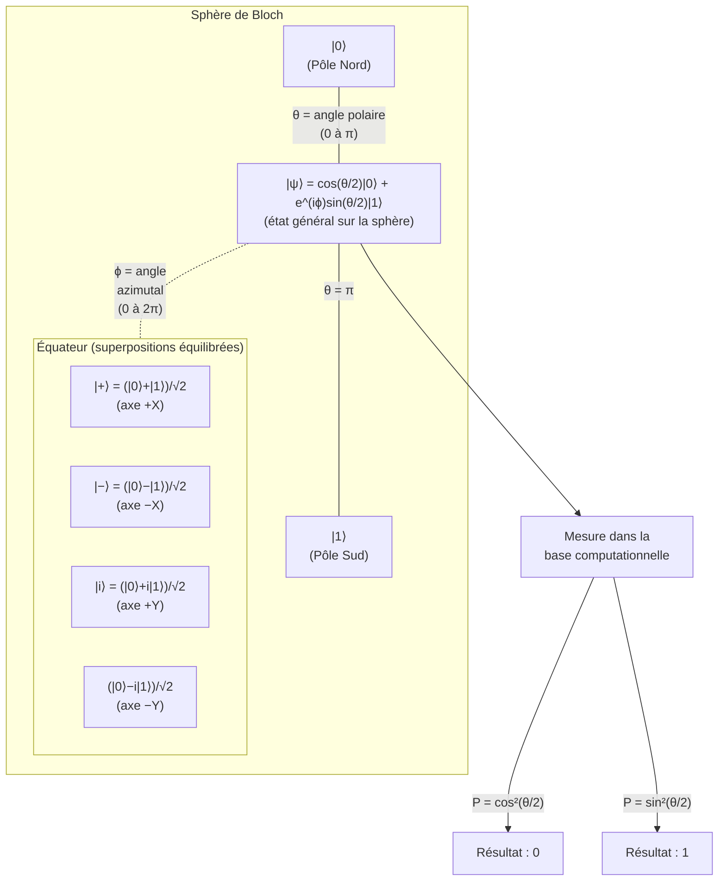

Ce volume se tourne vers l\'avenir, explorant les paradigmes computationnels qui promettent de révolutionner la discipline. Les changements fondamentaux du calcul étant : l\'informatique quantique, le calcul à haute performance (HPC) à l\'ère de l\'exascale, et les architectures post-Moore. Ce volume examine les frontières de l\'Intelligence Artificielle, notamment l\'essor des modèles fondateurs géants, les défis de l\'alignement et les chemins possibles vers une intelligence artificielle générale (AGI), en plus des convergences interdisciplinaires et des infrastructures émergentes. Enfin, une analyse liée aux enjeux éthiques, de gouvernance et de durabilité, et conclusion par une synthèse prospective des prochaines frontières de la computation. En résumé, les 5 couches de la pile AGI -- Intelligence Artificielle Générale sont :

# Chapitre I.51 : Informatique Quantique -- Fondements et Ingénierie

L\'avènement de l\'informatique au XXe siècle a transformé de manière irréversible la civilisation humaine, en se fondant sur un principe d\'une simplicité désarmante : la manipulation de bits, des entités physiques représentant sans ambiguïté les valeurs logiques 0 ou 1. Ce paradigme, formalisé par la thèse de Church-Turing, a défini les limites théoriques de ce qu\'une machine pouvait calculer. Pourtant, au cœur même de la physique qui régit le fonctionnement des transistors, composants ultimes de ces machines classiques, se trouve une description du monde bien plus riche et contre-intuitive : la mécanique quantique.

Dès les années 1980, des physiciens visionnaires, notamment Richard Feynman, ont posé une question fondamentale : si l\'univers est quantique à son niveau le plus fondamental, pourquoi nos outils de calcul ne le seraient-ils pas?. Feynman a reconnu qu\'il existait des problèmes, en particulier la simulation de systèmes quantiques complexes, qui semblaient intrinsèquement intraitables pour les ordinateurs classiques. La complexité de ces systèmes croît de manière exponentielle avec leur taille, une explosion combinatoire que même les supercalculateurs les plus puissants ne sauraient dompter. La solution, suggérait-il, n\'était pas de construire des machines classiques plus rapides, mais de concevoir un nouveau type de calculateur qui exploiterait directement les lois de la mécanique quantique pour traiter l\'information.

Ce chapitre se veut une porte d\'entrée rigoureuse et complète dans ce nouveau paradigme. L\'informatique quantique n\'est pas une simple accélération du calcul classique ; elle représente une refonte fondamentale de la notion même d\'information et de calcul. Pour naviguer dans ce territoire, nous adopterons un langage unificateur qui fait le pont entre la physique et l\'informatique : l\'algèbre linéaire. La notation de Dirac, avec ses kets et ses bras, nous servira de grammaire pour décrire les états quantiques, tandis que les matrices unitaires et les produits tensoriels nous fourniront la syntaxe pour décrire leurs transformations.

Notre parcours sera structuré en quatre étapes. Nous commencerons par établir les fondements de la mécanique quantique pertinents pour l\'informatique, en traduisant les concepts déroutants de qubit, de superposition et d\'intrication en un formalisme mathématique précis. Ensuite, nous explorerons les principaux modèles de calcul quantique, du modèle à base de circuits, analogue à la programmation classique, au modèle adiabatique, orienté vers l\'optimisation. La troisième partie nous plongera dans les défis concrets de l\'ingénierie des systèmes quantiques, en examinant les différentes plateformes matérielles en compétition et en disséquant l\'obstacle majeur à tout progrès : la décohérence. Enfin, nous aborderons la théorie cruciale de la correction d\'erreurs quantiques, une discipline ingénieuse qui offre la seule voie connue vers la construction d\'ordinateurs quantiques à grande échelle et tolérants aux pannes, transformant ainsi une vision théorique en une technologie potentiellement révolutionnaire.

## 51.1 Introduction à la Mécanique Quantique pour l\'Informatique

Pour construire un ordinateur quantique, il est impératif de comprendre comment l\'information peut être encodée et manipulée au niveau le plus fondamental de la nature. Cette section établit le socle conceptuel et mathématique nécessaire. Elle a pour objectif de démystifier les phénomènes quantiques les plus pertinents pour le calcul en les ancrant fermement dans le langage de l\'algèbre linéaire. Ce formalisme rigoureux transforme des concepts qui défient l\'intuition classique en objets mathématiques précis et manipulables, fournissant ainsi à l\'informaticien et à l\'ingénieur les outils nécessaires pour raisonner sur les systèmes quantiques et concevoir des algorithmes. Nous verrons que le passage du bit classique au qubit n\'est pas une simple extension, mais un saut qualitatif qui ouvre un espace de calcul d\'une richesse et d\'une complexité sans précédent.

### 51.1.1 Qubits, Superposition et Intrication

Au cœur de la révolution quantique se trouve une redéfinition de l\'unité fondamentale de l\'information. Nous abandonnons la certitude binaire du bit classique pour embrasser la richesse probabiliste et complexe du qubit. Cette transition nous force à repenser non seulement la manière dont l\'information est stockée, mais aussi la nature même des relations qui peuvent exister entre différentes unités d\'information.

#### Du Bit au Qubit : Un Changement de Fondement

L\'informatique classique, dans toute sa puissance et sa complexité, repose sur un fondement d\'une simplicité remarquable : le bit. Un bit est une abstraction représentant l\'état d\'un système physique qui peut exister dans l\'une de deux configurations distinctes et mutuellement exclusives. Qu\'il s\'agisse d\'une tension électrique haute ou basse dans un transistor, de la magnétisation nord ou sud d\'une région d\'un disque dur, ou de la présence ou de l\'absence d\'une perforation sur une carte, le système physique sous-jacent est toujours interprété comme incarnant l\'une des deux valeurs logiques : 0 ou 1. La totalité de l\'édifice de l\'informatique classique est construite sur la manipulation de chaînes de ces valeurs binaires.

L\'informatique quantique propose un changement radical de ce fondement. L\'unité d\'information n\'est plus le bit, mais le **qubit** (contraction de *quantum bit*). La distinction cruciale est que le qubit n\'est pas limité à deux états exclusifs. Pour le décrire, nous devons abandonner l\'arithmétique binaire pour adopter le langage de l\'algèbre linéaire.

Formellement, un qubit est un système quantique à deux niveaux dont l\'état est décrit par un vecteur dans un **espace de Hilbert** complexe à deux dimensions, que nous noterons H2. Un espace de Hilbert est un espace vectoriel doté d\'un produit scalaire, complet pour la norme induite par ce produit. Pour nos besoins, il suffit de le considérer comme une généralisation aux nombres complexes des espaces vectoriels euclidiens que nous connaissons.

Au sein de cet espace H2, nous choisissons une base orthonormée que nous appelons la **base computationnelle** (ou base de calcul). Les deux vecteurs de cette base sont notés ∣0⟩ et ∣1⟩. Ces notations, introduites par le physicien Paul Dirac, font partie du

**formalisme bra-ket**. Un \"ket\", tel que

∣ψ⟩, représente un vecteur d\'état et est mathématiquement équivalent à un vecteur colonne. Un \"bra\", tel que ⟨ψ∣, représente un vecteur de l\'espace dual et est équivalent au transposé conjugué (ou adjoint hermitien) du ket correspondant, c\'est-à-dire un vecteur ligne : ⟨ψ∣=(∣ψ⟩)†.

Dans la base computationnelle, les vecteurs de base ∣0⟩ et ∣1⟩ correspondent aux états classiques 0 et 1. Leur représentation matricielle est typiquement :

∣0⟩≡(10)et∣1⟩≡(01)

Ces deux états sont orthogonaux, ce que l\'on vérifie avec le produit scalaire (inner product) bra-ket. Le produit scalaire de deux kets ∣ϕ⟩ et ∣ψ⟩ est noté ⟨ϕ∣ψ⟩ et se calcule en multipliant le bra ⟨ϕ∣ par le ket ∣ψ⟩. Ainsi :

\$\$\\langle0\|1\\rangle = \\begin{pmatrix} 1 & 0 \\end{pmatrix} \\begin{pmatrix} 0 \\\\ 1 \\end{pmatrix} = (1 \\times 0) + (0 \\times 1) = 0 \$\$De même, ils sont de norme 1 (normalisés) :\$\$ \\langle0\|0\\rangle = \\begin{pmatrix} 1 & 0 \\end{pmatrix} \\begin{pmatrix} 1 \\\\ 0 \\end{pmatrix} = 1 \\quad \\text{et} \\quad \\langle1\|1\\rangle = \\begin{pmatrix} 0 & 1 \\end{pmatrix} \\begin{pmatrix} 0 \\\\ 1 \\end{pmatrix} = 1\$\$

Jusqu\'ici, le qubit ne semble être qu\'une reformulation complexe du bit classique. La véritable rupture conceptuelle apparaît lorsque l\'on considère les autres vecteurs possibles dans cet espace de Hilbert.

#### La Superposition : Au-delà du Binaire

Le principe de superposition est l\'une des caractéristiques les plus fondamentales et les plus contre-intuitives de la mécanique quantique. Il stipule que si un système peut exister dans un état ∣A⟩ et dans un état ∣B⟩, il peut également exister dans n\'importe quelle **combinaison linéaire** de ces états, de la forme α∣A⟩+β∣B⟩. Cet état combiné est appelé un **état de superposition**.

Appliqué au qubit, cela signifie qu\'un état de qubit ∣ψ⟩ n\'est pas limité à être soit ∣0⟩, soit ∣1⟩. Il peut être n\'importe quel vecteur de l\'espace H2. L\'état général d\'un qubit s\'écrit donc :

∣ψ⟩=α∣0⟩+β∣1⟩

où α et β sont des nombres complexes appelés amplitudes de probabilité.4 Conceptuellement, on peut imaginer un qubit non pas comme un interrupteur qui est soit allumé soit éteint, mais comme un variateur de lumière qui peut se trouver dans une infinité d\'états intermédiaires. Une analogie populaire est celle d\'une pièce de monnaie qui tourne en l\'air : avant de retomber, elle n\'est ni pile ni face, mais dans une sorte de \"flou\" qui contient les deux possibilités.19

L\'état ∣ψ⟩ est un vecteur d\'état qui doit être normalisé, c\'est-à-dire avoir une norme de 1. Cette contrainte physique se traduit par une condition mathématique sur les amplitudes :

∥ψ∥2=⟨ψ∣ψ⟩=(α∗⟨0∣+β∗⟨1∣)(α∣0⟩+β∣1⟩)=∣α∣2⟨0∣0⟩+α∗β⟨0∣1⟩+β∗α⟨1∣0⟩+∣β∣2⟨1∣1⟩

Puisque ⟨0∣0⟩=⟨1∣1⟩=1 et ⟨0∣1⟩=⟨1∣0⟩=0, cette équation se simplifie en la condition de normalisation :

∣α∣2+∣β∣2=1

Cette condition est fondamentale.8 Comme nous le verrons dans la section sur la mesure,

∣α∣2 et ∣β∣2 représentent les probabilités d\'obtenir les résultats 0 et 1, respectivement, lors de la lecture de l\'état du qubit. La condition de normalisation garantit simplement que la somme des probabilités est égale à 100%.

La capacité d\'un qubit à exister dans une superposition d\'états est à la source du **parallélisme quantique**. Un registre de n bits classiques ne peut stocker qu\'une seule valeur parmi 2n possibilités à un instant donné. Un registre de n qubits, grâce à la superposition, peut encoder les 2n valeurs simultanément dans un seul état quantique complexe, permettant à un algorithme quantique d\'effectuer des calculs sur toutes ces valeurs en parallèle. C\'est cette propriété qui confère aux ordinateurs quantiques leur potentiel de puissance de calcul exponentiel pour certaines classes de problèmes.

#### L\'Intrication : La Corrélation Quantique Ultime

Si la superposition est déjà une rupture avec l\'informatique classique, l\'**intrication** est sans doute le phénomène le plus étrange et le plus puissant du monde quantique, celui qu\'Einstein qualifiait d\'« action fantôme à distance ». Elle décrit une forme de corrélation entre plusieurs systèmes quantiques qui n\'a aucun équivalent dans le monde classique.

Pour décrire un système composé de plusieurs qubits, notre intuition classique pourrait nous suggérer d\'additionner les descriptions. En mécanique quantique, la règle est différente : l\'espace d\'états d\'un système composite est le **produit tensoriel** des espaces d\'états de ses composants. Ainsi, pour un système de deux qubits, A et B, l\'espace d\'états global est

HA⊗HB, un espace de Hilbert de dimension 2×2=4. Pour un système de n qubits, la dimension de l\'espace est 2n. Cette croissance exponentielle de la taille de l\'espace d\'états est à la fois la source de la puissance de l\'informatique quantique et la raison pour laquelle la simulation d\'un système quantique est si difficile pour un ordinateur classique.

La base computationnelle de l\'espace à deux qubits est formée par les quatre produits tensoriels des vecteurs de base individuels :

∣00⟩≡∣0⟩A⊗∣0⟩B=(10)⊗(10)=1×11×00×10×0=1000

∣01⟩≡∣0⟩A⊗∣1⟩B=0100,∣10⟩≡∣1⟩A⊗∣0⟩B=0010,∣11⟩≡∣1⟩A⊗∣1⟩B=0001

Un état général de deux qubits est une superposition de ces quatre états de base. Certains de ces états, dits **séparables** (ou états produits), peuvent être décrits comme le simple produit tensoriel des états individuels des qubits. Par exemple, l\'état ∣ψ⟩=∣+⟩⊗∣0⟩=21(∣0⟩+∣1⟩)⊗∣0⟩=21(∣00⟩+∣10⟩) est un état séparable. Dans un tel état, les qubits ont des identités propres, même s\'ils sont en superposition.

Cependant, il existe d\'autres états qui ne peuvent pas être écrits sous cette forme factorisée. Ces états sont dits **intriqués**. Les exemples les plus célèbres et les plus fondamentaux sont les quatre

**états de Bell**  :

∣Φ+⟩=21(∣00⟩+∣11⟩)

∣Φ−⟩=21(∣00⟩−∣11⟩)

∣Ψ+⟩=21(∣01⟩+∣10⟩)

∣Ψ−⟩=21(∣01⟩−∣10⟩)

Considérons l\'état ∣Φ+⟩. Il est impossible de trouver des états ∣ψA⟩=αA∣0⟩+βA∣1⟩ et ∣ψB⟩=αB∣0⟩+βB∣1⟩ tels que ∣ψA⟩⊗∣ψB⟩=∣Φ+⟩. Dans un état intriqué, les qubits individuels n\'ont plus d\'état bien défini indépendamment l\'un de l\'autre. Le système doit être décrit comme un tout indivisible.

La conséquence la plus spectaculaire de l\'intrication réside dans les corrélations de mesure. Supposons que deux expérimentateurs, Alice et Bob, partagent une paire de qubits dans l\'état ∣Φ+⟩ et s\'éloignent l\'un de l\'autre, même à des années-lumière de distance. Si Alice mesure son qubit et obtient le résultat 0, l\'état global du système s\'effondre instantanément en ∣00⟩. Cela signifie que si Bob mesure ensuite son qubit, il obtiendra le résultat 0 avec une certitude de 100%. De même, si Alice mesure 1, Bob mesurera 1. Les résultats des mesures sont parfaitement corrélés, instantanément et quelle que soit la distance. Cette corrélation non-locale, plus forte que toute corrélation classique, est une ressource essentielle pour des protocoles quantiques comme la téléportation et la cryptographie, et joue un rôle central dans l\'avantage computationnel de nombreux algorithmes quantiques.

Le passage de la physique à l\'abstraction mathématique est le pilier sur lequel repose toute l\'informatique quantique. Les phénomènes physiques, qu\'il s\'agisse du spin d\'un électron, de la polarisation d\'un photon ou des niveaux d\'énergie d\'un circuit supraconducteur, sont tous modélisés par le même objet mathématique : un vecteur dans un espace de Hilbert. Cette abstraction est extraordinairement puissante. Elle permet de transformer des concepts physiques déroutants et sans analogie dans notre monde macroscopique en opérations d\'algèbre linéaire bien définies. La superposition devient une simple addition de vecteurs. L\'intrication est capturée par le produit tensoriel. L\'évolution d\'un système est décrite par la multiplication par une matrice unitaire. Ce faisant, l\'algèbre linéaire devient plus qu\'un simple outil de description ; elle devient le pont interdisciplinaire qui a permis la naissance du *génie* informatique quantique à partir de la *science* de la physique quantique. Elle offre un langage commun et rigoureux aux physiciens, informaticiens et ingénieurs, leur permettant de collaborer pour concevoir, analyser et, à terme, construire ces nouvelles machines à calculer.

### 51.1.2 Sphère de Bloch et Mesure

Après avoir défini l\'état d\'un qubit dans le langage abstrait de l\'algèbre linéaire, il est utile de développer une intuition géométrique pour visualiser cet état et de formaliser rigoureusement le processus par lequel nous extrayons de l\'information classique de ce système quantique. La sphère de Bloch nous offre une visualisation élégante pour un seul qubit, tandis que le postulat de la mesure définit les règles du jeu lors de l\'interaction cruciale entre le monde quantique et notre appareillage de mesure classique.

#### Visualisation Géométrique : La Sphère de Bloch

L\'état d\'un qubit, ∣ψ⟩=α∣0⟩+β∣1⟩, est défini par deux amplitudes complexes, α et β. Puisque α et β sont des nombres complexes, cela représente a priori quatre paramètres réels. La condition de normalisation, ∣α∣2+∣β∣2=1, réduit ce nombre à trois. De plus, en mécanique quantique, la phase globale d\'un vecteur d\'état n\'a pas de signification physique observable. C\'est-à-dire que les états ∣ψ⟩ et eiγ∣ψ⟩ sont physiquement indiscernables pour tout γ réel. Nous pouvons utiliser cette liberté pour imposer que l\'amplitude α soit un nombre réel et positif, ce qui élimine un autre paramètre. Il ne reste donc que deux degrés de liberté réels pour décrire de manière unique l\'état d\'un qubit.

Ces deux degrés de liberté peuvent être élégamment représentés par deux angles, θ et ϕ, à travers la paramétrisation suivante  :

∣ψ⟩=cos(2θ)∣0⟩+eiϕsin(2θ)∣1⟩

où 0≤θ≤π et 0≤ϕ\<2π. On peut vérifier que cette forme respecte bien la condition de normalisation, car ∣cos(2θ)∣2+∣eiϕsin(2θ)∣2=cos2(2θ)+sin2(2θ)=1.

Cette paramétrisation suggère une interprétation géométrique naturelle. Les angles θ et ϕ peuvent être vus comme les coordonnées sphériques d\'un point sur la surface d\'une sphère de rayon 1. C\'est la **sphère de Bloch**. Chaque point sur la surface de cette sphère correspond à un état pur unique d\'un seul qubit.

**Figure 51.1 -- Représentation schématique de la sphère de Bloch et des états d\'un qubit**

La correspondance est la suivante :

> Le **pôle Nord** (θ=0) correspond à l\'état ∣0⟩. Pour cette valeur, cos(0/2)=1 et sin(0/2)=0, donc ∣ψ⟩=∣0⟩.
>
> Le **pôle Sud** (θ=π) correspond à l\'état ∣1⟩. Pour cette valeur, cos(π/2)=0 et sin(π/2)=1, donc ∣ψ⟩=eiϕ∣1⟩. En ignorant la phase globale, c\'est l\'état ∣1⟩.
>
> Les points sur l\'**équateur** (θ=π/2) correspondent à des superpositions \"équilibrées\" où les probabilités de mesurer 0 ou 1 sont égales (∣cos(π/4)∣2=∣sin(π/4)∣2=1/2). La longitude ϕ détermine la phase relative entre les composantes ∣0⟩ et ∣1⟩.

Le point sur l\'axe X positif (ϕ=0) correspond à l\'état ∣+⟩=21(∣0⟩+∣1⟩).

Le point sur l\'axe Y positif (ϕ=π/2) correspond à l\'état ∣i⟩=21(∣0⟩+i∣1⟩).

Le point sur l\'axe X négatif (ϕ=π) correspond à l\'état ∣−⟩=21(∣0⟩−∣1⟩).

Une propriété importante de la sphère de Bloch est que les états orthogonaux sont représentés par des points diamétralement opposés. Par exemple, ∣0⟩ et ∣1⟩ sont aux pôles opposés, et ∣+⟩ et ∣−⟩ sont aux extrémités opposées de l\'axe X.

La sphère de Bloch est un outil pédagogique et conceptuel extrêmement utile. Elle permet de visualiser les opérations à un seul qubit (les portes quantiques) comme des rotations du vecteur d\'état sur la sphère. Cependant, il est crucial de comprendre sa limitation fondamentale : la sphère de Bloch ne peut représenter que l\'état d\'un **seul qubit**. Elle est incapable de visualiser les états intriqués de plusieurs qubits, car ces états n\'existent pas dans l\'espace tridimensionnel mais dans des espaces de Hilbert de dimension supérieure (4 pour deux qubits, 8 pour trois, etc.). Tenter de représenter l\'intrication avec des sphères de Bloch individuelles est une erreur conceptuelle courante qui ignore la nature non-locale et holistique de la corrélation quantique.

#### Le Postulat de la Mesure : L\'Interaction avec le Monde Classique

Un état quantique, avec sa superposition et ses amplitudes complexes, est une description riche mais inaccessible directement. Pour extraire de l\'information d\'un système quantique, nous devons effectuer une **mesure**, un processus qui fait le lien entre le domaine quantique et le monde classique des résultats définis. Le postulat de la mesure, l\'un des piliers de la mécanique quantique, décrit ce processus en deux parties.

**1. Nature Probabiliste et Règle de Born**

La première partie du postulat stipule que la mesure est fondamentalement probabiliste. Si l\'on mesure un qubit dans l\'état ∣ψ⟩=α∣0⟩+β∣1⟩ dans la base computationnelle {∣0⟩,∣1⟩}, il n\'y a que deux résultats possibles : 0 ou 1. On ne peut jamais observer directement la superposition. La probabilité d\'obtenir un résultat donné est déterminée par le carré du module de l\'amplitude correspondante. C\'est la **règle de Born**  :

P(0)=∣⟨0∣ψ⟩∣2=∣α∣2

P(1)=∣⟨1∣ψ⟩∣2=∣β∣2

Cette règle est l\'une des lois les plus fondamentales de la physique quantique. Elle relie l\'objet mathématique abstrait (le vecteur d\'état) à une prédiction expérimentale vérifiable (une distribution de probabilité). Il est important de noter que pour un seul qubit et une seule mesure, le résultat est imprévisible. Ce n\'est qu\'en répétant la préparation de l\'état ∣ψ⟩ et sa mesure un grand nombre de fois que l\'on peut vérifier expérimentalement que les fréquences des résultats 0 et 1 convergent vers ∣α∣2 et ∣β∣2.

**2. Effondrement de la Fonction d\'Onde**

La deuxième partie du postulat est tout aussi cruciale et décrit ce qu\'il advient de l\'état du système *après* la mesure. Le processus de mesure n\'est pas passif ; il modifie irréversiblement l\'état du système. L\'état post-mesure n\'est plus la superposition initiale ∣ψ⟩. Il **s\'effondre** (on parle de \"collapse\" ou de réduction du paquet d\'onde) sur le vecteur de base correspondant au résultat obtenu.

> Si le résultat de la mesure est 0, l\'état du qubit immédiatement après la mesure est ∣0⟩.
>
> Si le résultat de la mesure est 1, l\'état du qubit immédiatement après la mesure est ∣1⟩.

Ce processus est destructeur : toute l\'information contenue dans les amplitudes α et β (y compris leur phase relative) est perdue, à l\'exception de l\'information binaire du résultat obtenu. Si l\'on mesure à nouveau le qubit immédiatement après, on obtiendra le même résultat avec une probabilité de 100%.

**Généralisation à d\'autres bases**

Le postulat de la mesure ne se limite pas à la base computationnelle. On peut effectuer une mesure par rapport à n\'importe quelle base orthonormée de l\'espace de Hilbert. Par exemple, pour un qubit, on peut mesurer dans la base de Hadamard, {∣+⟩,∣−⟩}. Les résultats possibles sont alors \"+\" ou \"-\". La règle de Born se généralise de manière élégante : la probabilité d\'obtenir le résultat correspondant à l\'état ∣ϕ⟩ lors de la mesure de l\'état ∣ψ⟩ est donnée par le carré du module de leur produit scalaire :

P(ϕ)=∣⟨ϕ∣ψ⟩∣2

Après la mesure, l\'état s\'effondre sur le vecteur de base de la nouvelle base correspondant au résultat obtenu. Cette flexibilité dans le choix de la base de mesure est une ressource clé dans de nombreux algorithmes et protocoles quantiques.

## 51.2 Modèles de Calcul Quantique

Avoir établi une description mathématique des états quantiques est la première étape. La suivante, qui est au cœur de l\'informatique, est de comprendre comment manipuler ces états de manière contrôlée pour effectuer des calculs. Cette section explore les deux principaux paradigmes du calcul quantique. Le premier, le modèle à base de portes et de circuits, est une approche \"digitale\" qui décompose un calcul complexe en une séquence d\'opérations élémentaires, à l\'instar de l\'informatique classique. Le second, le modèle adiabatique et son proche parent, le recuit quantique, adopte une philosophie \"analogique\", où la solution à un problème émerge de l\'évolution naturelle et continue d\'un système physique vers son état de plus basse énergie. La compréhension de ces deux modèles est essentielle pour saisir l\'éventail des approches poursuivies pour exploiter la puissance du quantique.

### 51.2.1 Portes quantiques et Circuits quantiques

Le modèle de calcul à base de circuits est le plus développé et le plus général des paradigmes de l\'informatique quantique. Il fournit un cadre intuitif, directement inspiré de l\'informatique classique, pour décrire les algorithmes quantiques comme une séquence d\'opérations logiques élémentaires, appelées portes quantiques, agissant sur un registre de qubits.

#### Les Portes Quantiques comme Transformations Unitaires

En mécanique quantique, l\'évolution temporelle d\'un système quantique isolé (c\'est-à-dire qui n\'interagit pas avec son environnement) est décrite par un **opérateur unitaire**. C\'est le deuxième postulat de la mécanique quantique. Si l\'état d\'un système à un instant t1 est ∣ψ1⟩, son état à un instant ultérieur t2 sera ∣ψ2⟩=U∣ψ1⟩, où U est une matrice qui dépend de l\'intervalle de temps et de l\'Hamiltonien du système.

Une matrice U est dite unitaire si son adjointe (sa transposée conjuguée, notée U†) est égale à son inverse :

U†U=UU†=I

où I est la matrice identité.38 Cette propriété a une conséquence physique fondamentale : elle préserve la norme du vecteur d\'état. En effet, si

∣ψ2⟩=U∣ψ1⟩, alors la norme au carré de ∣ψ2⟩ est ⟨ψ2∣ψ2⟩=(U∣ψ1⟩)†(U∣ψ1⟩)=⟨ψ1∣U†U∣ψ1⟩=⟨ψ1∣I∣ψ1⟩=⟨ψ1∣ψ1⟩. Si l\'état initial était normalisé (norme 1), l\'état final l\'est aussi. Cela garantit la conservation de la probabilité totale. Une autre conséquence importante est que les transformations unitaires sont réversibles : si ∣ψ2⟩=U∣ψ1⟩, alors on peut toujours retrouver l\'état initial en appliquant l\'opération inverse, ∣ψ1⟩=U†∣ψ2⟩.

Dans le modèle de circuit, une **porte quantique** est simplement une opération unitaire agissant sur un petit nombre de qubits. Ces portes sont les briques de construction fondamentales des algorithmes quantiques.

#### Portes à un Qubit

Une porte agissant sur un seul qubit est représentée par une matrice unitaire de taille 2×2. Géométriquement, toute porte à un qubit peut être interprétée comme une rotation du vecteur d\'état sur la sphère de Bloch. Il existe une infinité de telles portes, mais quelques-unes sont particulièrement importantes et forment la base de la plupart des circuits.

> **Les Portes de Pauli (X, Y, Z)** : Ces trois portes sont fondamentales et correspondent à des rotations de π radians (180 degrés) autour des axes correspondants de la sphère de Bloch.

La **Porte X**, ou porte NOT quantique, est l\'analogue de l\'inverseur classique. Elle échange les états ∣0⟩ et ∣1⟩. On l\'appelle souvent *bit-flip*.
X=(0110);X∣0⟩=∣1⟩,X∣1⟩=∣0⟩

La **Porte Z** applique un changement de phase de -1 (une rotation de π) à l\'état ∣1⟩ tout en laissant ∣0⟩ inchangé. On l\'appelle souvent *phase-flip*.
Z=(100−1);Z∣0⟩=∣0⟩,Z∣1⟩=−∣1⟩

La **Porte Y** applique à la fois un *bit-flip* et un *phase-flip* (avec des facteurs de i).Y=(0i−i0);Y∣0⟩=i∣1⟩,Y∣1⟩=−i∣0⟩

> **La Porte de Hadamard (H)** : C\'est sans doute la porte à un qubit la plus importante en informatique quantique. Sa fonction principale est de créer des superpositions. Appliquée à un état de base, elle produit une superposition équilibrée des deux états de base.
> H=21(111−1)
> Son action sur les états de base est :\$\$H\|0\\rangle = \\frac{1}{\\sqrt{2}}(\|0\\rangle + \|1\\rangle) \\equiv \|+\\rangle \$\$ \$\$ H\|1\\rangle = \\frac{1}{\\sqrt{2}}(\|0\\rangle - \|1\\rangle) \\equiv \|-\\rangle\$\$
> La porte H est sa propre inverse (H2=I). Appliquer H deux fois de suite ramène le qubit à son état initial. Elle est essentielle pour initialiser les algorithmes qui exploitent le parallélisme quantique.
>
> **Les Portes de Phase (S et T)** : Ces portes modifient la phase relative de la composante ∣1⟩ d\'un qubit sans affecter sa probabilité d\'être mesurée. Elles font partie d\'une famille plus générale de portes de déphasage Rϕ=(100eiϕ).

La **Porte S** (ou porte de phase) correspond à une rotation de π/2 autour de l\'axe Z. Elle est la \"racine carrée\" de la porte Z (S2=Z).
S=(100i)

La **Porte T** (ou porte π/8) correspond à une rotation de π/4 autour de l\'axe Z. Elle est la \"racine carrée\" de la porte S (T2=S).
T=(100eiπ/4)

La porte T est particulièrement importante car, combinée avec la porte Hadamard et la porte CNOT, elle permet de construire un ensemble de portes universel.

#### Portes à plusieurs Qubits : Créer l\'Intrication

Alors que les portes à un qubit permettent de créer des superpositions, elles ne peuvent pas, à elles seules, créer de l\'intrication. Pour cela, il faut des portes qui agissent sur au moins deux qubits simultanément.

> **La Porte CNOT (Controlled-NOT)** : La porte contrôlée-NON est la porte à deux qubits la plus emblématique. Elle possède un qubit de
> contrôle et un qubit cible. Son action est simple : si le qubit de contrôle est dans l\'état ∣0⟩, elle ne fait rien au qubit cible. Si le qubit de contrôle est dans l\'état ∣1⟩, elle applique une porte X (un NOT) au qubit cible.
> Son action sur les quatre états de base du système à deux qubits est :\$\$\\text{CNOT}\|00\\rangle = \|00\\rangle \$\$ \$\$ \\text{CNOT}\|01\\rangle = \|01\\rangle \$\$ \$\$ \\text{CNOT}\|10\\rangle = \|11\\rangle \$\$ \$\$ \\text{CNOT}\|11\\rangle = \|10\\rangle\$\$
> La matrice unitaire 4×4 correspondante, dans la base ordonnée {∣00⟩,∣01⟩,∣10⟩,∣11⟩}, est :
> CNOT=1000010000010010
> Le rôle fondamental de la porte CNOT est de générer de l\'intrication. Si l\'on applique une porte Hadamard au qubit de contrôle (initialement à ∣0⟩) puis qu\'on utilise ce qubit pour contrôler le second (initialement à ∣0⟩), le résultat est un état de Bell intriqué :
> CNOT(H∣0⟩⊗∣0⟩)=CNOT(21(∣0⟩+∣1⟩)⊗∣0⟩)=CNOT(21(∣00⟩+∣10⟩))
> Par linéarité, on applique CNOT à chaque terme :
> =21(CNOT∣00⟩+CNOT∣10⟩)=21(∣00⟩+∣11⟩)=∣Φ+⟩
> Cette capacité à créer et manipuler l\'intrication est au cœur de la puissance des algorithmes quantiques.

#### Circuits Quantiques : Orchestrer les Opérations

Un **circuit quantique** est une séquence d\'opérations (portes) appliquées à un registre de qubits. On le représente par un diagramme où le temps s\'écoule de gauche à droite.

> Chaque ligne horizontale représente un qubit.
>
> Chaque \"boîte\" sur une ou plusieurs lignes représente une porte quantique appliquée à ce(s) qubit(s).
>
> Le circuit se termine généralement par des opérations de mesure, qui extraient l\'information classique du résultat du calcul.

L\'application séquentielle de plusieurs portes U1,U2,...,Um à un état initial ∣ψin⟩ produit un état final ∣ψout⟩=Um...U2U1∣ψin⟩. L\'opérateur unitaire global du circuit est le produit matriciel des opérateurs de chaque porte, notant que l\'ordre de multiplication est l\'inverse de l\'ordre d\'application dans le circuit.

Le concept d\'**universalité** est aussi important en informatique quantique qu\'en informatique classique. Un ensemble de portes est dit universel s\'il permet d\'approximer n\'importe quelle transformation unitaire sur n\'importe quel nombre de qubits avec une précision arbitrairement bonne. Il a été démontré que les portes à un qubit (plus précisément, les rotations d\'angles arbitraires) combinées à la porte CNOT forment un ensemble universel. De manière plus pratique, l\'ensemble {H, S, T, CNOT} est un ensemble de portes universel couramment utilisé. Cela signifie qu\'avec un nombre fini de ces portes de base, on peut construire n\'importe quel algorithme quantique.

### 51.2.2 Modèle adiabatique et Recuit quantique (Quantum Annealing)

À côté du modèle à base de portes, qui est de nature digitale et algorithmique, existe un autre paradigme de calcul quantique, plus analogique et inspiré par la thermodynamique : le calcul quantique adiabatique. Cette approche est particulièrement bien adaptée aux problèmes d\'optimisation, où l\'objectif n\'est pas d\'exécuter une séquence d\'instructions, mais de trouver l\'état de plus basse énergie d\'un système complexe.

#### Le Théorème Adiabatique comme Principe de Calcul

Le fondement de ce modèle est le **théorème adiabatique de la mécanique quantique**. Ce théorème énonce qu\'un système quantique initialement dans son état fondamental (l\'état de plus basse énergie) a une très forte probabilité de rester dans cet état fondamental si les conditions extérieures (décrites par son opérateur Hamiltonien,

H\) sont modifiées de manière suffisamment lente. Le terme \"adiabatique\" signifie ici \"infiniment lent\", sans transition vers des états excités d\'énergie supérieure.

L\'idée d\'utiliser ce principe pour le calcul est la suivante  :

> **Encoder le problème** : On conçoit un Hamiltonien, noté HP (Hamiltonien du Problème), dont l\'état fondamental correspond à la solution d\'un problème d\'optimisation difficile que l\'on souhaite résoudre. Par exemple, pour le problème du voyageur de commerce, les configurations des spins dans l\'état fondamental de HP représenteraient les chemins les plus courts. La construction de ce HP est souvent une tâche complexe en soi.
>
> **Préparer un état simple** : On prépare le système de qubits dans l\'état fondamental d\'un Hamiltonien initial simple, noté HI, dont l\'état fondamental est trivial à préparer. Typiquement, HI est un Hamiltonien qui place tous les qubits dans une superposition uniforme.
>
> **Faire évoluer le système lentement** : On fait évoluer l\'Hamiltonien total du système de manière continue et lente, depuis HI jusqu\'à HP. L\'Hamiltonien dépendant du temps s\'écrit H(t)=(1−s(t))HI+s(t)HP, où le paramètre s(t) varie doucement de 0 à 1 sur une durée totale T.
>
> **Lire la solution** : Si l\'évolution a été suffisamment lente (c\'est-à-dire si la condition d\'adiabaticité est respectée), le théorème adiabatique garantit que l\'état final du système sera (avec une haute probabilité) l\'état fondamental de HP. Une mesure finale des qubits révèle alors la configuration correspondant à la solution du problème.

La durée T requise pour que l\'évolution soit adiabatique est inversement proportionnelle au carré du \"gap\" énergétique, c\'est-à-dire la différence d\'énergie minimale entre l\'état fondamental et le premier état excité tout au long de l\'évolution. Si ce gap devient très petit, le temps de calcul nécessaire peut devenir très long, ce qui constitue la principale limitation de cette approche.

#### Le Recuit Quantique : Une Approche Heuristique

Le **recuit quantique** (*Quantum Annealing*, QA) est une technique d\'optimisation qui s\'inspire du calcul adiabatique mais qui est souvent mise en œuvre de manière plus pragmatique et heuristique. Il est souvent considéré comme une sous-classe ou une implémentation physique du calcul adiabatique qui ne garantit pas toujours le respect strict de la condition d\'adiabaticité.

Le recuit quantique est l\'analogue quantique du recuit simulé (*simulated annealing*), une méthode d\'optimisation classique bien connue. Dans le recuit simulé, on explore un paysage de \"coût\" en autorisant des mouvements vers des états de coût plus élevé avec une probabilité qui dépend d\'un paramètre \"température\". En abaissant lentement la température, le système a tendance à se figer dans un minimum global.

Dans le recuit quantique, le rôle de la température est joué par un champ magnétique transverse. Ce champ induit des **fluctuations quantiques**, notamment l\'**effet tunnel**. Au lieu de devoir \"grimper\" une barrière d\'énergie grâce à l\'agitation thermique pour passer d\'un minimum local à un autre, le système peut \"traverser\" la barrière par effet tunnel. Cet effet est particulièrement avantageux pour les paysages d\'optimisation comportant des barrières d\'énergie hautes mais fines, que le recuit simulé classique aurait beaucoup de mal à franchir. Le processus de recuit quantique consiste à diminuer progressivement l\'intensité de ce champ transverse, réduisant ainsi les fluctuations quantiques et permettant au système de converger vers l\'état de plus basse énergie de l\'Hamiltonien du problème.

#### Comparaison des Modèles

Les modèles à base de portes et adiabatique/recuit représentent deux approches fondamentalement différentes du calcul.

> **Universalité vs. Spécialisation** : Le modèle à base de portes est **universel** (on dit qu\'il est BQP-complet, pour *Bounded-error Quantum Polynomial time*). Cela signifie qu\'il peut, en principe, simuler n\'importe quel autre système quantique et exécuter n\'importe quel algorithme quantique, y compris des algorithmes comme celui de Shor pour la factorisation, qui n\'est pas un problème d\'optimisation. Le recuit quantique, en revanche, est un calculateur
> **spécialisé**. Il est conçu exclusivement pour résoudre des problèmes d\'optimisation et ne peut pas exécuter des algorithmes comme celui de Shor.
>
> **Nature du Calcul (Digital vs. Analogique)** : Le modèle à portes est **digital**. Le calcul est décomposé en une séquence d\'opérations discrètes (les portes) dont la succession est précisément contrôlée. Le modèle adiabatique est **analogique**. Le calcul n\'est pas une séquence d\'étapes, mais une évolution continue et globale du système physique, guidée par les lois de la nature (l\'équation de Schrödinger).
>
> **Robustesse au Bruit** : Les recuits quantiques sont généralement considérés comme plus robustes au bruit que les ordinateurs à portes. Dans le modèle adiabatique, tant que le système reste dans son état fondamental, il est protégé des excitations par le gap énergétique qui le sépare des autres états. Cette robustesse relative a permis à des entreprises comme D-Wave de construire des processeurs avec des milliers de qubits bien avant que les ordinateurs à portes n\'atteignent des échelles comparables, bien que ces qubits soient plus bruités et moins bien contrôlés individuellement.
>
> **Équivalence Théorique** : Malgré leurs différences, il a été prouvé que le calcul quantique adiabatique est polynomialement équivalent au modèle à base de portes. Cela signifie que tout problème pouvant être résolu efficacement par un ordinateur quantique à portes peut aussi, en théorie, être résolu efficacement par un ordinateur quantique adiabatique, et vice-versa. Cependant, cette équivalence est théorique et ne s\'applique pas nécessairement aux implémentations pratiques actuelles du recuit quantique, qui ne sont pas universelles.

Ces deux modèles ne sont pas seulement des implémentations différentes ; ils incarnent deux philosophies distinctes du calcul. Le modèle à portes est **procédural** : comme un programme informatique classique, il spécifie une séquence d\'instructions discrètes à exécuter sur des données. C\'est un modèle où le calcul est activement dirigé par l\'algorithme. Le modèle adiabatique, quant à lui, est

**évolutif** : il ne spécifie pas la séquence d\'opérations, mais plutôt l\'état final désiré (encodé dans l\'Hamiltonien du problème) et laisse le système physique trouver son propre chemin vers cet état en suivant les lois de la mécanique quantique. La programmation d\'un circuit quantique est un exercice de conception d\'algorithme, tandis que la programmation d\'un recuit quantique est un exercice de \"mapping\", c\'est-à-dire de formulation d\'un problème d\'optimisation dans le langage des Hamiltoniens d\'Ising que la machine peut comprendre. Cette dualité suggère que l\'avenir de l\'informatique quantique ne réside peut-être pas dans la suprématie d\'un modèle sur l\'autre, mais dans une approche hybride où chaque modèle sera utilisé pour la classe de problèmes pour laquelle il est le plus naturellement adapté, un peu comme la complémentarité entre les processeurs centraux (CPU) et les processeurs graphiques (GPU) dans l\'informatique haute performance actuelle.

## 51.3 Ingénierie des Systèmes Quantiques

Passer de la théorie abstraite des qubits et des portes à la construction d\'un ordinateur quantique fonctionnel représente un saut monumental, jonché de défis d\'ingénierie parmi les plus complexes jamais entrepris par l\'humanité. Cette section fait le pont entre le monde des équations et celui du laboratoire. Nous explorerons d\'abord les principales plateformes matérielles en compétition pour réaliser physiquement des qubits, chacune avec ses propres principes physiques, ses avantages et ses inconvénients. Ensuite, nous nous attaquerons de front aux deux obstacles universels qui freinent la progression de toutes ces technologies : la décohérence, l\'ennemi implacable qui détruit l\'information quantique, et l\'évolutivité (ou *scaling*), le défi de faire passer ces systèmes de quelques dizaines à des millions de qubits de haute qualité.

### 51.3.1 Implémentations matérielles

La quête pour construire un ordinateur quantique a donné naissance à un \"zoo\" de technologies candidates, chacune tentant de satisfaire un ensemble de critères stricts connus sous le nom de critères de DiVincenzo. Ces critères exigent, entre autres, des qubits bien caractérisés et évolutifs, la capacité de les initialiser, des temps de cohérence longs, un ensemble universel de portes quantiques et la capacité de mesurer les qubits. Aucune plateforme ne domine encore les autres ; chacune représente un ensemble de compromis d\'ingénierie.

#### Qubits Supraconducteurs

L\'une des approches les plus avancées et les mieux financées est celle des circuits supraconducteurs. Des géants de l\'industrie comme Google, IBM et Rigetti, ainsi que de nombreux laboratoires universitaires, ont fait de cette technologie leur principal cheval de bataille.

> **Principe Physique** : Les qubits supraconducteurs sont des circuits électriques microscopiques fabriqués à partir de matériaux qui, refroidis à des températures extrêmement basses (typiquement autour de 15 millikelvins, soit plus froid que l\'espace interstellaire), perdent toute résistance électrique. Ces circuits, souvent des oscillateurs de type LC (inductance-capacité), possèdent des niveaux d\'énergie quantifiés, tout comme un atome. L\'élément clé est la
> **jonction Josephson**, un \"sandwich\" de deux supraconducteurs séparés par une fine couche isolante. Cette jonction se comporte comme une inductance non linéaire, ce qui a pour effet de rendre les niveaux d\'énergie du circuit non équidistants. Cette non-harmonicité est cruciale car elle permet d\'isoler deux niveaux d\'énergie spécifiques (par exemple, l\'état fondamental et le premier état excité) pour qu\'ils servent d\'états
> ∣0⟩ et ∣1⟩ du qubit, sans que le système ne \"fuie\" vers des niveaux d\'énergie supérieurs. Les manipulations du qubit (portes quantiques) sont effectuées en lui appliquant des impulsions de micro-ondes de fréquences précises, typiquement entre 5 et 10 GHz.
>
> **Types de Qubits Supraconducteurs** : Il existe plusieurs \"saveurs\" de qubits supraconducteurs, qui diffèrent par la manière dont l\'information est encodée (charge, flux magnétique ou phase) et par le paramètre dominant du circuit (capacité ou inductance). Les types les plus courants sont les qubits de charge, les qubits de flux, et les **transmons**, une variante du qubit de charge développée pour être beaucoup moins sensible au bruit de charge, qui est aujourd\'tui le design dominant utilisé par IBM et Google.
>
> **Avantages** : Le principal avantage des qubits supraconducteurs est leur **vitesse**. Les portes quantiques peuvent être exécutées très rapidement, en quelques dizaines de nanosecondes. De plus, leur fabrication s\'appuie sur les techniques de lithographie bien maîtrisées de l\'industrie de la microélectronique, ce qui offre une voie prometteuse vers l\'**évolutivité** et l\'intégration de milliers de qubits sur une seule puce.
>
> **Inconvénients** : Le talon d\'Achille de cette technologie est sa sensibilité à l\'environnement. Les temps de cohérence, bien qu\'en constante amélioration, restent relativement courts (de l\'ordre de quelques centaines de microsecondes dans les meilleurs dispositifs). Ils sont très sensibles au bruit, qu\'il s\'agisse de fluctuations de charge, de flux magnétiques parasites ou de défauts dans les matériaux. Leur fonctionnement nécessite des
> **réfrigérateurs à dilution** massifs, complexes et coûteux pour atteindre les températures cryogéniques nécessaires, ce qui pose un défi majeur pour l\'évolutivité du système global.

#### Pièges à Ions

Une approche radicalement différente consiste à utiliser comme qubits ce que la nature nous offre de plus parfait : les atomes. Les ordinateurs quantiques à ions piégés, développés par des entreprises comme IonQ et Quantinuum, sont réputés pour leur fidélité exceptionnelle.

> **Principe Physique** : Dans cette approche, des atomes individuels (par exemple, d\'ytterbium, de calcium ou de magnésium) sont ionisés (on leur arrache un électron pour leur donner une charge électrique nette). Ces ions sont ensuite confinés et maintenus en suspension dans un vide ultra-poussé à l\'aide de champs électromagnétiques finement contrôlés, formant une chaîne linéaire d\'ions. Chaque ion constitue un qubit. Les états
> ∣0⟩ et ∣1⟩ du qubit sont encodés dans deux niveaux d\'énergie électroniques internes de l\'ion, qui sont extrêmement stables et bien isolés de l\'environnement. Il peut s\'agir de niveaux **hyperfins** (liés au spin du noyau) ou de niveaux **optiques** (un état fondamental et un état excité à longue durée de vie). Les opérations quantiques sont effectuées en adressant individuellement les ions avec des faisceaux laser de haute précision, qui induisent des transitions entre les états du qubit. Les portes à deux qubits sont médiées par le mouvement collectif des ions dans le piège (les phonons), qui agissent comme un \"bus\" quantique pour coupler les états internes des ions.
>
> **Avantages** : Le principal atout des ions piégés est la **qualité** exceptionnelle des qubits. Comme tous les atomes d\'un même élément sont parfaitement identiques, les qubits sont uniformes. Ils possèdent des **temps de cohérence** extrêmement longs, pouvant atteindre plusieurs secondes, voire des minutes, soit des ordres de grandeur de plus que les qubits supraconducteurs. La fidélité des portes et de la mesure est également très élevée, souvent supérieure à 99.9%. De plus, au sein d\'un même piège, la **connectivité est totale** : n\'importe quel qubit peut interagir directement avec n\'importe quel autre, un avantage considérable pour l\'exécution d\'algorithmes complexes.
>
> **Inconvénients** : La vitesse des opérations est le principal inconvénient. Les portes quantiques sur les ions piégés sont de l\'ordre de la microseconde, soit environ 100 à 1000 fois plus lentes que pour les supraconducteurs. Le défi majeur reste l\'**évolutivité**. Il est très difficile de maintenir le contrôle précis d\'une longue chaîne de plus de quelques dizaines d\'ions dans un seul piège. Les stratégies pour passer à l\'échelle impliquent des architectures complexes où les ions sont déplacés entre différentes zones d\'un piège ou des modules de pièges interconnectés par des liaisons photoniques, ce qui ajoute une complexité d\'ingénierie considérable.

#### Photonique

Une troisième voie majeure utilise les particules de lumière elles-mêmes, les photons, comme porteurs d\'information quantique. Des entreprises comme Xanadu et la startup française Quandela sont des pionniers dans ce domaine.

> **Principe Physique** : Dans l\'informatique quantique photonique, un qubit est encodé dans une propriété d\'un photon unique. L\'encodage le plus courant est la **polarisation** (par exemple, la polarisation horizontale pour ∣0⟩ et verticale pour ∣1⟩), mais on peut aussi utiliser le chemin qu\'emprunte un photon dans un interféromètre (*path encoding*) ou le moment de son arrivée (*time-bin encoding*). Les portes à un qubit sont relativement simples à réaliser à l\'aide de composants optiques standards comme les lames d\'onde et les polariseurs.
>
> **Avantages** : Les photons sont des qubits \"volants\" remarquablement robustes à la décohérence. Ils interagissent très faiblement avec leur environnement, ce qui leur confère de longs temps de cohérence. Un avantage majeur est qu\'ils peuvent fonctionner à **température ambiante**, éliminant le besoin de cryogénie complexe. Ils sont également le support idéal pour la
> **communication quantique**, car ils peuvent être transmis sur de longues distances via des fibres optiques.
>
> **Inconvénients** : L\'avantage des photons (leur faible interaction) est aussi leur plus grand inconvénient. Parce que les photons n\'interagissent pas facilement entre eux, la construction de portes à deux qubits, essentielles pour le calcul universel, est extrêmement difficile. Les approches actuelles reposent sur des interactions indirectes médiées par des mesures, ce qui rend les portes
> **probabilistes** et non déterministes. Cela nécessite des schémas complexes et une redondance importante pour réussir un calcul, ce qui constitue un obstacle majeur à l\'évolutivité pour le calcul universel. De plus, la génération fiable de photons uniques à la demande et leur détection avec une haute efficacité restent des défis technologiques importants.

---

  Architecture                  Principe Physique                                               Temps de Cohérence (T2)   Vitesse des Portes    Fidélité (2 qubits)        Connectivité                Conditions Opérationnelles

  **Qubits Supraconducteurs**   Circuits LC non linéaires avec jonctions Josephson              10-500 μs                 10-50 ns              \> 99.5%                   Limitée (voisins proches)   Cryogénique (\< 20 mK)

  **Pièges à Ions**             Niveaux d\'énergie d\'atomes ionisés piégés par des champs EM   \> 10 s                   1-100 μs              \> 99.9%                   Totale (dans un piège)      Vide poussé, T ambiante

  **Photonique**                Propriétés de photons uniques (ex: polarisation)                Très longue (\> ms)       ps (portes 1-qubit)   Probabiliste / Difficile   Difficile                   Température ambiante

---

Cette comparaison met en lumière le fait que la course à l\'ordinateur quantique n\'est pas une simple progression linéaire vers plus de qubits. C\'est un problème d\'optimisation multidimensionnel complexe, où chaque plateforme technologique explore une région différente de l\'espace des compromis entre le nombre de qubits, leur qualité (cohérence, fidélité), la connectivité, et la vitesse des opérations. Une avancée sur un de ces axes peut se faire au détriment d\'un autre. Par exemple, les ions piégés privilégient une qualité quasi parfaite au prix de la vitesse, tandis que les supraconducteurs font le pari inverse, misant sur la vitesse et une fabrication plus scalable au prix d\'une plus grande sensibilité au bruit. Cette absence de \"meilleur\" qubit explique la diversité des approches dans le domaine et souligne que l\'évaluation d\'un processeur quantique ne peut se résumer à son seul nombre de qubits. Des métriques plus holistiques, comme le Volume Quantique proposé par IBM, tentent de capturer cette nature multidimensionnelle du progrès.

### 51.3.2 Défis de la décohérence et de l\'évolutivité (Scaling)

Au-delà des spécificités de chaque plateforme matérielle, deux défis transversaux et interconnectés se dressent comme les principaux obstacles sur la voie de l\'informatique quantique à grande échelle : la décohérence, qui sape la nature même du calcul quantique, et l\'évolutivité, qui concerne la difficulté de construire des systèmes de plus en plus grands tout en maintenant une haute qualité.

#### La Décohérence : L\'Ennemi Numéro Un

La décohérence est le processus par lequel un système quantique perd ses propriétés \"quantiques\" -- la superposition et l\'intrication -- en raison de son interaction inévitable avec son environnement. C\'est la raison fondamentale pour laquelle nous n\'observons pas de superpositions macroscopiques (comme le célèbre chat de Schrödinger à la fois vivant et mort) dans notre vie de tous les jours. Pour un ordinateur quantique, la décohérence est l\'ennemi ultime, car elle détruit l\'information encodée dans les qubits et rend le calcul erroné.

> **Nature du Phénomène** : Il est crucial de comprendre que la décohérence n\'est pas simplement du \"bruit\" au sens classique. C\'est un processus physique fondamental. Lorsqu\'un qubit interagit, même très faiblement, avec son environnement (un photon parasite, une vibration du substrat, une fluctuation de champ électromagnétique), il s\'intrique avec les degrés de liberté de cet environnement. L\'information quantique qui était initialement localisée dans le qubit (la relation de phase précise entre α et β) \"fuit\" et se disperse dans les corrélations complexes et incontrôlables entre le qubit et les milliards de particules de l\'environnement. Du point de vue de l\'expérimentateur, qui n\'a accès qu\'au qubit, cette information est perdue. L\'état de superposition pur du qubit se transforme en un simple mélange statistique, indiscernable d\'un bit classique probabiliste. Le parallélisme quantique, qui dépend de l\'interférence constructive et destructive des amplitudes, est alors anéanti.
>
> **Mécanismes et Échelles de Temps** : On caractérise la décohérence par deux échelles de temps principales :

**Le temps de relaxation d\'énergie (T1)** : C\'est le temps caractéristique pour qu\'un qubit dans l\'état excité ∣1⟩ perde son énergie et retourne spontanément à l\'état fondamental ∣0⟩. C\'est un processus irréversible.

**Le temps de déphasage (T2)** : C\'est le temps caractéristique pour que la relation de phase cohérente entre les amplitudes α et β de la superposition ∣ψ⟩=α∣0⟩+β∣1⟩ soit perdue. Ce processus, appelé déphasage, peut se produire même sans perte d\'énergie. Il est causé par des fluctuations aléatoires de l\'énergie du qubit. Le temps T2 est toujours inférieur ou égal à 2T1 (T2≤2T1) et constitue la véritable limite temporelle pour l\'exécution d\'un calcul quantique cohérent. La durée d\'un algorithme quantique doit être significativement plus courte que le temps de cohérence T2 des qubits.

La lutte contre la décohérence est au cœur de l\'ingénierie quantique. Elle passe par une isolation quasi parfaite des qubits de leur environnement (d\'où l\'utilisation du vide poussé et des températures cryogéniques), l\'utilisation de matériaux ultra-purs, et la conception de qubits intrinsèquement moins sensibles à certains types de bruit (comme le transmon).

#### L\'Évolutivité (Scaling) : Le Défi de la Croissance

L\'évolutivité est le défi qui consiste à augmenter le nombre de qubits dans un processeur tout en maintenant, voire en améliorant, leur qualité et leur contrôlabilité. Il ne s\'agit pas simplement d\'un problème de fabrication consistant à graver plus de qubits sur une puce. C\'est un problème systémique complexe avec plusieurs facettes interdépendantes.

> **Qualité vs. Quantité** : L\'un des compromis les plus difficiles est celui entre le nombre de qubits et leur qualité. En augmentant la densité de qubits sur une puce, on augmente inévitablement les interférences non désirées entre eux, un phénomène appelé \"crosstalk\". Un qubit peut être affecté par une impulsion micro-onde destinée à son voisin, introduisant des erreurs. Maintenir des temps de cohérence élevés et de faibles taux d\'erreur sur des puces de plus en plus grandes et denses est un défi majeur.
>
> **Connectivité** : L\'architecture idéale d\'un ordinateur quantique permettrait à n\'importe quel qubit d\'interagir directement avec n\'importe quel autre (connectivité \"tous à tous\"). C\'est le cas pour les ions piégés dans un petit piège. Cependant, pour des architectures solides comme les supraconducteurs, la connectivité est souvent limitée aux plus proches voisins sur la puce 2D. Pour faire interagir deux qubits distants, il faut une série d\'opérations SWAP qui déplacent l\'état d\'un qubit à travers le processeur, ce qui prend du temps et introduit des erreurs supplémentaires. La conception de topologies de connectivité efficaces est un domaine de recherche actif.
>
> **Contrôle et Mesure** : Chaque qubit nécessite une infrastructure de contrôle et de lecture. Pour les qubits supraconducteurs, cela signifie des lignes de signaux micro-ondes individuelles qui doivent être acheminées depuis l\'électronique de contrôle à température ambiante jusqu\'à la puce dans le cryostat. Pour un million de qubits, cela représente un défi de câblage et de gestion thermique colossal. Des solutions comme l\'intégration de l\'électronique de contrôle cryogénique à proximité de la puce sont explorées pour surmonter ce \"goulot d\'étranglement de l\'interconnexion\".
>
> **Intégration et Rendement** : La fabrication de processeurs quantiques est encore un art. Le rendement de fabrication (le pourcentage de dispositifs fonctionnels) est faible. La variabilité d\'un qubit à l\'autre sur une même puce nécessite des procédures de calibration complexes et individualisées. L\'intégration de tous les composants -- le processeur quantique, l\'électronique de contrôle, la cryogénie, le logiciel -- en un système fiable et stable est un immense défi d\'ingénierie des systèmes.

En somme, le chemin vers un ordinateur quantique à grande échelle est semé d\'embûches qui vont bien au-delà de la simple augmentation du nombre de qubits. Il exige des avancées simultanées sur les fronts de la science des matériaux, de la conception de circuits, de la cryogénie, de l\'ingénierie micro-ondes, du logiciel de contrôle et des algorithmes de calibration. La résolution de ce problème d\'optimisation multidimensionnel est la quête centrale de l\'ingénierie quantique aujourd\'hui.

## 51.4 Correction d\'Erreurs Quantiques (QEC)

La décohérence et les imperfections des portes sont des ennemis inévitables. Même avec les meilleurs efforts d\'ingénierie, les qubits physiques resteront toujours bruités et fragiles. L\'idée de construire un ordinateur quantique à grande échelle en se basant sur des composants parfaits est irréaliste. La solution, à la fois en informatique classique et quantique, réside dans la correction d\'erreurs. Cependant, les principes fondamentaux de la mécanique quantique interdisent une transposition directe des méthodes classiques. La correction d\'erreurs quantiques (QEC) est une théorie remarquablement ingénieuse qui montre comment protéger l\'information quantique du bruit, ouvrant ainsi la voie à l\'informatique quantique tolérante aux pannes. C\'est la clé de voûte qui pourrait permettre de passer des machines expérimentales bruitées d\'aujourd\'hui (l\'ère NISQ) à des calculateurs fiables et évolutifs.

### L\'Impossibilité de la Correction d\'Erreurs Classique

Pour comprendre la nécessité d\'une nouvelle approche, il faut d\'abord comprendre pourquoi les méthodes éprouvées de l\'informatique classique ne sont pas applicables dans le monde quantique.

La correction d\'erreurs classique repose sur un principe simple : la **redondance par copie**. Pour protéger un bit d\'information, on en fait plusieurs copies. Par exemple, pour transmettre le bit \'0\', on envoie la séquence \'000\'. Si une erreur se produit sur un des bits durant la transmission (par exemple, \'010\'), le récepteur peut la détecter et la corriger en appliquant un **vote majoritaire** : comme il y a plus de 0 que de 1, il conclut que le message original était \'0\'. Cette stratégie est efficace car elle permet de mesurer chaque bit individuellement pour comparer les copies et identifier l\'erreur.

Cette approche se heurte à deux obstacles fondamentaux en mécanique quantique :

> **Le Théorème de Non-Clonage (*No-Cloning Theorem*)** : Ce théorème est l\'un des résultats les plus fondamentaux de la théorie de l\'information quantique. Il stipule qu\'il est **impossible de créer une copie parfaite d\'un état quantique inconnu et arbitraire**. La preuve est d\'une élégante simplicité et repose sur la linéarité de la mécanique quantique. Supposons qu\'il existe un opérateur unitaire
> Uclone capable de cloner n\'importe quel état ∣ψ⟩. Son action serait de prendre un état ∣ψ⟩ et un état \"vierge\" ∣s⟩ et de produire deux copies de ∣ψ⟩ : Uclone(∣ψ⟩⊗∣s⟩)=∣ψ⟩⊗∣ψ⟩. Si cette opération fonctionne pour un état ∣ψ⟩, elle doit aussi fonctionner pour un autre état ∣ϕ⟩ : Uclone(∣ϕ⟩⊗∣s⟩)=∣ϕ⟩⊗∣ϕ⟩. Considérons maintenant le produit scalaire entre ces deux équations de départ : ⟨ψ∣⟨s∣Uclone†. En appliquant Uclone†Uclone=I, on obtient ⟨ψ∣ϕ⟩⟨s∣s⟩=⟨ψ∣ϕ⟩. Le produit scalaire des états de sortie serait (⟨ψ∣⟨ψ∣)(⟨ϕ∣ϕ⟩)=(⟨ψ∣ϕ⟩)2. Pour que l\'opération soit possible, il faudrait donc que ⟨ψ∣ϕ⟩=(⟨ψ∣ϕ⟩)2 pour n\'importe quels états ∣ψ⟩ et ∣ϕ⟩. Cette équation n\'est vraie que si ⟨ψ∣ϕ⟩ vaut 0 ou 1, c\'est-à-dire si les états sont soit orthogonaux, soit identiques. Elle n\'est pas vraie pour des états en superposition arbitraires. Le théorème de non-clonage interdit donc directement la première étape de la correction d\'erreurs classique : la création de copies redondantes.
>
> **La Nature Destructive de la Mesure** : Même si l\'on pouvait contourner le théorème de non-clonage, la deuxième étape de la méthode classique -- la mesure des copies pour les comparer -- est également impossible. Comme nous l\'avons vu, mesurer un qubit dans un état de superposition ∣ψ⟩=α∣0⟩+β∣1⟩ le force à s\'effondrer en ∣0⟩ ou ∣1⟩. Le simple fait de \"regarder\" l\'état pour voir s\'il a été corrompu détruirait l\'information quantique délicate (les amplitudes α et β) que l\'on cherchait à protéger.

Face à ces impossibilités, il a fallu inventer une approche radicalement nouvelle.

### 51.4.1 Codes de correction (ex: Codes de surface)

La correction d\'erreurs quantiques contourne les obstacles du non-clonage et de la mesure destructive en utilisant une forme plus subtile de redondance : l\'intrication.

#### Principe de la QEC : Redondance sans Clonage

L\'idée centrale de la QEC est d\'encoder l\'information d\'un seul **qubit logique** (l\'unité d\'information abstraite et protégée) dans un état hautement intriqué de plusieurs **qubits physiques** (les composants matériels réels et bruités). Au lieu de copier l\'état

α∣0⟩+β∣1⟩ sur plusieurs qubits, on distribue cette information de manière non-locale à travers les corrélations quantiques du système composite.

La détection des erreurs se fait ensuite par des **mesures de syndrome**. Au lieu de mesurer les qubits physiques individuellement (ce qui détruirait l\'état logique), on mesure des opérateurs collectifs qui agissent sur plusieurs qubits à la fois. Ces opérateurs sont choisis de telle sorte que leur valeur propre (le résultat de la mesure) nous renseigne sur l\'erreur qui a pu se produire, mais nous laisse dans l\'ignorance totale de l\'état logique α∣0⟩L+β∣1⟩L qui est encodé. Le résultat de ces mesures, une chaîne de bits classiques, est appelé le **syndrome d\'erreur**. Chaque valeur possible du syndrome correspond à une erreur spécifique (par exemple, \"un bit-flip s\'est produit sur le troisième qubit physique\"). Une fois le syndrome connu, une opération de correction appropriée peut être appliquée pour ramener le système à son état encodé correct.

#### Exemple Pédagogique : Le Code à 3 Qubits pour Bit-Flip

Le code de correction d\'erreurs le plus simple est le code à 3 qubits, conçu pour protéger contre une seule erreur de type *bit-flip* (une porte X non désirée).

> **Encodage** : Supposons que nous voulions protéger le qubit logique ∣ψ⟩L=α∣0⟩L+β∣1⟩L. Nous utilisons deux qubits physiques supplémentaires, appelés *ancillas*, initialisés à ∣0⟩. Le circuit d\'encodage utilise deux portes CNOT pour intriquer les trois qubits :
> (α∣0⟩+β∣1⟩)⊗∣0⟩⊗∣0⟩CNOT1,2(α∣00⟩+β∣11⟩)⊗∣0⟩CNOT1,3α∣000⟩+β∣111⟩
> L\'état logique ∣ψ⟩L est maintenant encodé dans l\'état intriqué ∣ψ⟩=α∣000⟩+β∣111⟩. L\'information n\'est plus dans un seul qubit, mais dans les corrélations entre les trois.
>
> **Détection de Syndrome** : Supposons qu\'une erreur de bit-flip se produise sur le deuxième qubit. L\'état devient ∣ψerr⟩=α∣010⟩+β∣101⟩. Pour détecter cette erreur, nous mesurons deux opérateurs de parité : Z1Z2 et Z2Z3 (où Zi est l\'opérateur Pauli-Z sur le qubit i). Ces opérateurs vérifient si les qubits adjacents sont dans le même état ou non. Dans l\'état non corrompu ∣000⟩ ou ∣111⟩, les deux parités sont paires (+1). Dans l\'état corrompu, la parité de Z1Z2 est impaire (-1) et celle de Z2Z3 est aussi impaire (-1). En pratique, on mesure ces parités à l\'aide de deux ancillas supplémentaires, comme le montre le circuit de détection. Le syndrome (les résultats de mesure des ancillas) nous indique quel qubit a subi une erreur :

Syndrome 00 : Pas d\'erreur.

Syndrome 11 : Erreur sur le qubit 1.

Syndrome 10 : Erreur sur le qubit 2.

Syndrome 01 : Erreur sur le qubit 3.Crucialement, cette mesure nous donne l\'emplacement de l\'erreur sans révéler quoi que ce soit sur les valeurs de α et β.106

> **Correction** : Une fois le syndrome connu, la correction est simple. Si le syndrome indique une erreur sur le qubit i, on applique une porte X sur ce qubit pour annuler l\'erreur. L\'état logique est ainsi restauré.

Ce code simple ne protège que contre les erreurs de bit-flip. Un code similaire utilisant une base de Hadamard peut protéger contre les erreurs de phase-flip (erreurs Z). Le célèbre **code de Shor à 9 qubits** combine ces deux idées pour protéger un qubit logique contre n\'importe quelle erreur arbitraire sur un seul qubit physique.

#### Les Codes de Surface : Une Voie vers l\'Évolutivité

Bien que des codes comme celui de Shor soient conceptuellement importants, ils sont très coûteux en termes de nombre de qubits. Une des approches les plus prometteuses pour construire des ordinateurs quantiques tolérants aux pannes est basée sur les **codes de surface**.

> **Principe Topologique** : Les codes de surface sont une classe de codes correcteurs d\'erreurs dits **topologiques**. L\'information n\'est pas encodée dans l\'état de qubits individuels, mais dans les propriétés topologiques globales d\'un système de nombreux qubits.
>
> **Structure du Code** : Dans sa version la plus simple, un code de surface est implémenté sur une grille 2D de qubits. Les qubits qui portent l\'information (les *qubits de données*) sont situés sur les arêtes ou les sommets de la grille. Des qubits auxiliaires (*qubits de mesure* ou *ancillas*) sont placés au centre des faces (plaquettes) et sur les sommets (ou étoiles) de la grille. Le code est défini par un ensemble d\'opérateurs de parité locaux, appelés
> **stabilisateurs**. Il y a deux types de stabilisateurs :

Les **stabilisateurs de plaquette**, qui sont des produits d\'opérateurs X sur les quatre qubits de données entourant une face.

Les stabilisateurs de sommet, qui sont des produits d\'opérateurs Z sur les quatre qubits de données qui se rejoignent à un sommet.L\'état encodé (l\'espace de code) est l\'état qui est laissé inchangé (+1) par tous ces stabilisateurs.

> **Détection et Correction** : Le syndrome d\'erreur est obtenu en mesurant périodiquement tous les stabilisateurs à l\'aide des qubits ancillas. Si aucune erreur ne s\'est produite, toutes les mesures de stabilisateurs donnent +1. Si une erreur (par exemple, un X sur un qubit de données) se produit, elle anti-commute avec les deux stabilisateurs Z adjacents, qui donneront alors le résultat -1 lors de la prochaine mesure. Ces \"défauts\" de syndrome signalent les extrémités d\'une \"chaîne\" d\'erreurs. Un algorithme de décodage classique (comme l\'algorithme de \"minimum-weight perfect matching\") est alors utilisé pour inférer la chaîne d\'erreurs la plus probable qui a pu causer le syndrome observé, et une correction est appliquée.
>
> **Robustesse** : La robustesse du code de surface vient du fait que l\'information logique est encodée de manière non-locale. Pour passer d\'un état logique (par exemple, ∣0⟩L) à un autre (∣1⟩L), il faut appliquer une chaîne d\'opérateurs (X ou Z) qui s\'étend d\'un bord à l\'autre de la grille. Une erreur locale sur un seul ou quelques qubits ne peut pas changer l\'état logique ; elle ne crée qu\'une paire de défauts de syndrome localement. Pour qu\'une erreur logique se produise, il faut une chaîne d\'erreurs physiques corrélées qui traverse toute la grille, un événement dont la probabilité diminue de façon exponentielle avec la taille de la grille. La **distance** du code, qui mesure sa capacité à corriger les erreurs, est simplement la taille (longueur) de la grille.

### 51.4.2 Informatique quantique tolérante aux pannes

La correction d\'erreurs quantiques n\'est pas seulement une technique pour protéger des qubits au repos ; c\'est le fondement d\'un concept beaucoup plus large et ambitieux : l\'informatique quantique tolérante aux pannes (*Fault-Tolerant Quantum Computing*, FTQC).

> **Définition** : La FTQC est la capacité de concevoir des circuits quantiques de telle manière que les erreurs qui se produisent pendant le calcul puissent être détectées et corrigées sans corrompre le résultat final. Cela signifie que non seulement les qubits de mémoire doivent être protégés, mais les opérations (les portes quantiques) elles-mêmes doivent être effectuées de manière tolérante aux pannes. Si une porte est appliquée de manière imparfaite, ou si une erreur se produit pendant son application, le schéma doit empêcher cette erreur de se propager et de se multiplier à travers le registre de qubits.
>
> **Le Théorème du Seuil (*Threshold Theorem*)** : C\'est l\'un des résultats les plus importants et les plus optimistes de l\'informatique quantique. Il énonce qu\'il existe un **seuil de tolérance aux pannes** pth, qui est un taux d\'erreur critique. Si le taux d\'erreur physique de chaque composant de base de l\'ordinateur (chaque porte, chaque préparation d\'état, chaque mesure) est
> **inférieur** à ce seuil, alors il est possible de construire des circuits de correction d\'erreurs qui rendent le taux d\'erreur du calcul logique arbitrairement petit. En d\'autres termes, si le matériel est \"suffisamment bon\" (en dessous du seuil), on peut, en principe, réaliser des calculs quantiques de n\'importe quelle longueur et avec n\'importe quelle précision désirée, simplement en utilisant plus de qubits physiques pour l\'encodage (par concaténation de codes). La valeur exacte du seuil dépend du code correcteur et du modèle de bruit, mais pour les codes de surface, elle est estimée être de l\'ordre de 1%, une cible exigeante mais atteignable pour les technologies actuelles.
>
> **Le But Ultime** : La réalisation de la FTQC est le Saint Graal de l\'ingénierie quantique. Elle marque la transition de l\'ère actuelle, l\'ère
> **NISQ** (*Noisy Intermediate-Scale Quantum*), où l\'on travaille avec des processeurs de taille intermédiaire (50-1000 qubits) trop bruités pour exécuter des algorithmes complexes, à une ère où les ordinateurs quantiques deviendront des outils de calcul fiables et évolutifs. C\'est seulement avec la FTQC que des algorithmes comme celui de Shor pourront être exécutés pour des problèmes de taille pertinente (par exemple, casser les clés de cryptage RSA actuelles), ou que des simulations complexes en chimie et en science des matériaux pourront être menées à bien. Des entreprises comme IBM et Google ont des feuilles de route ambitieuses visant à construire un premier processeur quantique tolérant aux pannes d\'ici la fin de la décennie.

La correction d\'erreurs quantiques n\'est pas une simple couche logicielle que l\'on ajoute à un ordinateur existant. C\'est une contrainte de conception si fondamentale qu\'elle dicte l\'architecture même de la machine. Les codes classiques sont des constructions algébriques abstraites, mais les codes quantiques les plus prometteurs, comme les codes de surface, sont intrinsèquement géométriques et topologiques. Ils sont définis par la disposition physique des qubits sur une grille 2D. L\'exécution de ces codes nécessite des cycles constants de mesures de syndrome, impliquant des interactions locales et répétées entre les qubits de données et leurs voisins ancillas. Par conséquent, l\'architecture matérielle doit être optimisée pour rendre ces interactions locales aussi rapides et fidèles que possible. C\'est la raison pour laquelle les puces de qubits supraconducteurs sont souvent conçues avec une topologie de grille, en parfaite adéquation avec les exigences du code de surface. Cette interdépendance profonde mène à une co-conception matériel-logiciel où le \"logiciel\" (le protocole QEC) et le \"matériel\" (la disposition physique des qubits) sont inextricablement liés. L\'informatique quantique tolérante aux pannes n\'est pas quelque chose que l\'on

*exécute* sur un ordinateur quantique ; c\'est la manière dont un ordinateur quantique à grande échelle *est construit*.
