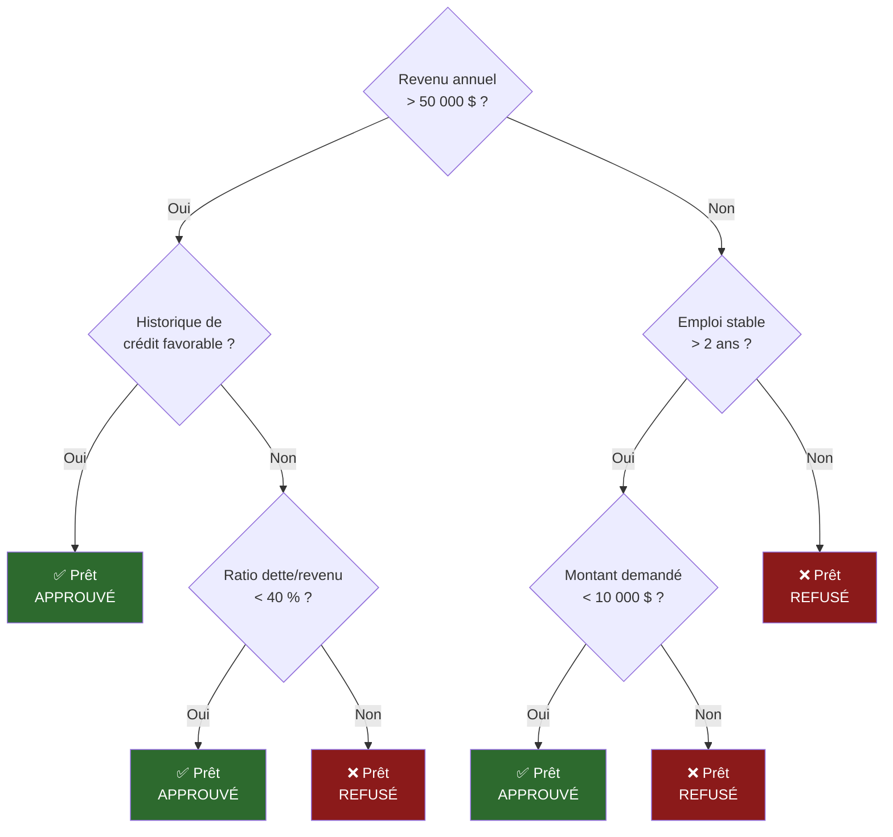

# Chapitre I.43 : Apprentissage Automatique (Machine Learning) - Fondements

## 43.1 Paradigmes d\'Apprentissage et Théorie de l\'Apprentissage Statistique (Biais-Variance)

L\'apprentissage automatique, ou *machine learning*, est une branche de l\'intelligence artificielle et de l\'informatique qui se concentre sur l\'utilisation de données et d\'algorithmes pour imiter la manière dont les humains apprennent, améliorant progressivement sa précision. Ce chapitre a pour vocation d\'établir les fondations théoriques et conceptuelles de ce domaine. Nous commencerons par définir les grands paradigmes qui structurent le champ de l\'apprentissage, avant de plonger dans le cadre formel de la théorie de l\'apprentissage statistique. C\'est au sein de ce cadre que nous introduirons le dilemme fondamental qui anime la quasi-totalité de la modélisation prédictive : le compromis biais-variance. La maîtrise de ces concepts est une condition préalable indispensable à la compréhension profonde des algorithmes qui seront détaillés dans les sections subséquentes.

### 43.1.1 Les Trois Grands Paradigmes de l\'Apprentissage

Le champ de l\'apprentissage automatique est traditionnellement segmenté en trois grandes catégories, différenciées par la nature des données disponibles et l\'objectif de l\'apprentissage : l\'apprentissage supervisé, l\'apprentissage non supervisé et l\'apprentissage par renforcement.

#### Apprentissage Supervisé : Apprendre par l\'Exemple

L\'apprentissage supervisé est le paradigme le plus courant et le plus étudié. Son principe est analogue à celui d\'un élève apprenant sous la direction d\'un professeur. L\'algorithme reçoit un ensemble de données d\'entraînement qui a été préalablement étiqueté par un expert humain ou par un processus automatisé. Chaque point de données est une paire constituée d\'un objet en entrée (un vecteur de caractéristiques) et d\'une sortie désirée (une étiquette ou une valeur cible).

Formellement, étant donné un ensemble de données d\'entraînement de n exemples {(xi​,yi​)}i=1n​, où xi​ est le vecteur de caractéristiques du i-ème exemple et yi​ est son étiquette correspondante, l\'objectif de l\'apprentissage supervisé est d\'apprendre une fonction de mappage f:X→Y. Cette fonction doit être capable de prédire l\'étiquette y pour un nouvel exemple x qui n\'a jamais été vu auparavant. La présence des étiquettes

yi​ constitue la \"supervision\" qui guide le processus d\'apprentissage de l\'algorithme.

Les tâches d\'apprentissage supervisé se divisent principalement en deux catégories :

> **La Classification** : L\'objectif est de prédire une étiquette de classe discrète. La variable de sortie yi​ appartient à un ensemble fini de catégories. Par exemple, un algorithme de classification pourrait être entraîné à distinguer les courriels \"spam\" des \"non-spam\", à identifier si une tumeur est \"bénigne\" ou \"maligne\", ou à reconnaître des chiffres manuscrits (de 0 à 9).
>
> **La Régression** : L\'objectif est de prédire une valeur de sortie continue. La variable de sortie yi​ est un nombre réel. Les applications typiques incluent la prédiction du prix d\'un logement en fonction de ses caractéristiques (superficie, nombre de chambres), l\'estimation de la demande pour un produit, ou la prévision de la température pour le lendemain.

Les applications de l\'apprentissage supervisé sont omniprésentes, allant de la reconnaissance d\'images et de la parole aux systèmes de diagnostic médical, en passant par la détection de transactions frauduleuses et l\'évaluation du risque de crédit.

#### Apprentissage Non Supervisé : Découvrir la Structure Cachée

Contrairement à l\'apprentissage supervisé, l\'apprentissage non supervisé travaille avec des données qui ne sont pas étiquetées. L\'algorithme est confronté à un ensemble de données

{xi​}i=1n​ et sa tâche est de découvrir des motifs, des structures ou des relations inhérentes aux données, sans aucun signal de sortie prédéfini pour le guider. Il s\'agit d\'une forme d\'apprentissage exploratoire, où la machine tente de \"donner un sens\" aux données par elle-même.

Les tâches principales de l\'apprentissage non supervisé incluent :

> **Le Clustering (ou Regroupement)** : Cette technique vise à partitionner un ensemble de données en groupes, ou *clusters*, de telle sorte que les points de données au sein d\'un même cluster soient plus similaires entre eux qu\'avec ceux des autres clusters. La notion de \"similarité\" est généralement définie par une métrique de distance. Les applications courantes sont la segmentation de la clientèle en marketing, le regroupement de documents par sujet, ou l\'identification de communautés dans les réseaux sociaux.
>
> **La Réduction de Dimensionnalité** : Lorsque les données sont décrites par un très grand nombre de caractéristiques (haute dimensionnalité), elles peuvent devenir difficiles à traiter et à visualiser. La réduction de dimensionnalité cherche à réduire le nombre de variables tout en préservant au maximum l\'information pertinente contenue dans les données. Cela peut aider à combattre le \"fléau de la dimensionnalité\", à réduire le bruit et à accélérer les algorithmes d\'apprentissage ultérieurs.
>
> **L\'Apprentissage de Règles d\'Association** : L\'objectif est de découvrir des relations intéressantes entre les variables dans de grands jeux de données. L\'exemple classique est l\'analyse du panier de la ménagère, où l\'on pourrait découvrir une règle telle que \"les clients qui achètent des couches sont également susceptibles d\'acheter de la bière\". Ces règles sont utiles pour les systèmes de recommandation et l\'optimisation des placements de produits.

#### Apprentissage par Renforcement : Apprendre par Essai-Erreur

L\'apprentissage par renforcement est un paradigme fondamentalement différent des deux autres. Il ne s\'appuie pas sur un jeu de données statique, mais sur l\'interaction dynamique entre un

**agent** et un **environnement**. L\'agent apprend à prendre une séquence de **actions** pour maximiser une **récompense** numérique cumulée au fil du temps.

Le processus se déroule comme suit : l\'agent observe l\'**état** actuel de l\'environnement, choisit une action à entreprendre, et l\'environnement répond en passant à un nouvel état et en fournissant une récompense (qui peut être positive, négative ou nulle). L\'objectif de l\'agent est d\'apprendre une

**politique** (une stratégie de prise de décision) qui lui indique quelle action choisir dans chaque état pour maximiser sa récompense totale à long terme.

Le dilemme central de l\'apprentissage par renforcement est le compromis entre l\'**exploration** (tenter de nouvelles actions pour découvrir leurs conséquences) et l\'**exploitation** (utiliser les actions qui sont déjà connues pour donner de bonnes récompenses). Un agent qui n\'explore jamais risque de rester coincé dans une stratégie sous-optimale, tandis qu\'un agent qui explore trop ne capitalise jamais sur ses connaissances acquises.

Ce paradigme est particulièrement bien adapté aux problèmes de contrôle et de prise de décision séquentielle. Ses applications les plus spectaculaires incluent la maîtrise de jeux complexes comme le Go (avec AlphaGo de DeepMind) et les jeux vidéo, ainsi que des domaines plus pratiques comme la robotique, la conduite autonome, la gestion de portefeuille financier et l\'optimisation de chaînes logistiques.

#### Synthèse et Paradigmes Hybrides

Bien que ces trois paradigmes couvrent la majorité des problèmes d\'apprentissage automatique, des approches hybrides existent. L\'**apprentissage semi-supervisé**, par exemple, est utilisé lorsque l\'on dispose d\'une grande quantité de données non étiquetées mais seulement d\'un petit nombre de données étiquetées, ce qui est souvent le cas en pratique car l\'étiquetage est coûteux. L\'algorithme tente alors d\'utiliser la structure des données non étiquetées pour améliorer l\'apprentissage à partir des données étiquetées. L\'

**apprentissage auto-supervisé** est une autre approche puissante où les étiquettes sont générées automatiquement à partir des données elles-mêmes (par exemple, en masquant une partie d\'une image et en demandant au modèle de la reconstruire), permettant d\'exploiter d\'énormes quantités de données non étiquetées pour apprendre des représentations utiles.

### 43.1.2 Le Cadre de la Théorie de l\'Apprentissage Statistique

Pour aborder l\'apprentissage automatique avec rigueur, il est essentiel de le formaliser dans un cadre mathématique. La théorie de l\'apprentissage statistique nous fournit ce cadre, en définissant le problème de l\'apprentissage comme un problème d\'inférence statistique à partir de données.

#### Le Problème de l\'Apprentissage comme Recherche de Fonction

Au cœur de l\'apprentissage supervisé se trouve la quête d\'une fonction prédictive. Nous postulons qu\'il existe une distribution de probabilité jointe inconnue,

P(X,Y), qui régit la relation entre les caractéristiques X et les étiquettes Y. L\'ensemble de données d\'entraînement {(xi​,yi​)}i=1n​ est considéré comme un échantillon de n réalisations indépendantes et identiquement distribuées (i.i.d.) tirées de cette distribution.

L\'objectif de l\'algorithme d\'apprentissage est de sélectionner, à partir d\'un ensemble d\'hypothèses H (un espace de fonctions possibles, par exemple l\'ensemble de toutes les fonctions linéaires), une fonction spécifique f\^​∈H qui approxime au mieux la \"vraie\" relation sous-jacente entre X et Y.

Pour évaluer la qualité d\'une fonction candidate f, nous introduisons une **fonction de perte** (ou fonction de coût), notée L(y,f(x)), qui quantifie l\'erreur commise par le modèle lorsqu\'il prédit f(x) alors que la vraie valeur est y. Pour la régression, une fonction de perte courante est l\'erreur quadratique,

L(y,f(x))=(y−f(x))2. Pour la classification, c\'est souvent la perte 0-1, L(y,f(x))=1y=f(x)​, où 1 est la fonction indicatrice.

Le but ultime n\'est pas de bien performer sur les données que nous avons vues, mais sur de nouvelles données invisibles. Nous cherchons donc à minimiser le **risque attendu** (ou erreur de généralisation), qui est l\'espérance de la fonction de perte sur l\'ensemble de la distribution de données P(X,Y)  :

R(f)=E(X,Y)∼P​=∫L(y,f(x))dP(x,y)

Ce risque attendu représente la véritable performance du modèle en généralisation.

#### La Minimisation du Risque Empirique (MRE)

Le problème fondamental est que la distribution P(X,Y) est inconnue. Par conséquent, le risque attendu R(f) est incalculable en pratique. La théorie de l\'apprentissage statistique propose une solution pragmatique : approximer le risque attendu par le

**risque empirique**, Remp​(f), qui est simplement l\'erreur moyenne calculée sur l\'ensemble d\'entraînement disponible  :

Remp​(f)=n1​i=1∑n​L(yi​,f(xi​))

L\'algorithme d\'apprentissage met alors en œuvre le principe de Minimisation du Risque Empirique (MRE). Il recherche dans l\'espace des hypothèses H la fonction f\^​ qui minimise ce risque empirique :

f\^​=argf∈Hmin​Remp​(f)

Ce principe est au cœur de nombreux algorithmes d\'apprentissage. Cependant, il recèle un piège fondamental. Le fait de minimiser l\'erreur sur l\'échantillon d\'entraînement ne garantit pas une minimisation de l\'erreur sur de nouvelles données. En effet, un modèle suffisamment complexe peut réduire le risque empirique à zéro en \"mémorisant\" simplement les données d\'entraînement, y compris leur bruit et leurs particularités aléatoires. Un tel modèle aura une performance désastreuse en généralisation. Ce phénomène, appelé surapprentissage (overfitting), est la manifestation de l\'échec de l\'hypothèse selon laquelle la minimisation du risque empirique est un bon proxy pour la minimisation du risque attendu. C\'est ici qu\'intervient le dilemme central de la modélisation.

### 43.1.3 Le Dilemme Central : Le Compromis Biais-Variance

Le compromis biais-variance est sans doute le concept le plus important de la théorie de l\'apprentissage statistique. Il fournit un cadre pour comprendre le surapprentissage et le sous-apprentissage et guide la sélection et la régularisation des modèles. Il stipule que l\'erreur de généralisation d\'un modèle peut être décomposée en trois composantes : le biais, la variance et une erreur irréductible.

#### Intuition et Analogie

Pour saisir intuitivement ces concepts, l\'analogie d\'une cible de tir à l\'arc est particulièrement éclairante. Imaginez qu\'un algorithme d\'apprentissage est un archer qui tente d\'atteindre le centre de la cible (la \"vraie\" fonction que nous essayons de modéliser). L\'archer tire plusieurs volées de flèches, chaque volée représentant l\'entraînement du modèle sur un jeu de données d\'entraînement différent (mais tiré de la même distribution).

> **Biais élevé, faible variance** : Les flèches sont toutes groupées, mais loin du centre. L\'archer est constant mais systématiquement à côté de la plaque. Le modèle est stable, mais ses hypothèses de base sont trop simplistes et ne capturent pas la réalité des données. C\'est le **sous-apprentissage** (*underfitting*).
>
> **Biais faible, variance élevée** : Les flèches sont dispersées tout autour du centre. En moyenne, l\'archer vise juste, mais chaque tir est imprévisible. Le modèle est très flexible et capable de capturer la structure des données, mais il est aussi très sensible aux fluctuations spécifiques de chaque jeu de données d\'entraînement, modélisant le bruit comme s\'il s\'agissait d\'un signal. C\'est le **surapprentissage** (*overfitting*).
>
> **Biais faible, faible variance** : Les flèches sont toutes groupées au centre de la cible. C\'est le modèle idéal, à la fois précis et stable.
>
> **Biais élevé, variance élevée** : Les flèches sont dispersées et loin du centre. C\'est le pire des cas, un modèle à la fois imprécis et instable.

#### Définitions Formelles

Formalisons ces concepts. Soit y=f(x)+ϵ la vraie relation, où ϵ est un bruit aléatoire de moyenne nulle et de variance σ2. Soit f\^​(x) le modèle entraîné sur un jeu de données d\'entraînement spécifique.

> Le **Biais** d\'un modèle en un point x est l\'écart entre la prédiction moyenne du modèle (sur tous les jeux de données d\'entraînement possibles) et la vraie valeur. Il mesure l\'erreur systématique du modèle due à ses hypothèses simplificatrices.\
> Biais\[f\^​(x)\]=E\[f\^​(x)\]−f(x)\
> \
> Un biais élevé signifie que le modèle, en moyenne, ne parvient pas à capturer la vraie relation, ce qui conduit au sous-apprentissage.29
>
> La **Variance** d\'un modèle en un point x mesure la variabilité de la prédiction du modèle pour différents jeux de données d\'entraînement. Elle quantifie la sensibilité du modèle aux fluctuations de l\'échantillon d\'apprentissage.\
> Variance\[f\^​(x)\]=E\[(f\^​(x)−E\[f\^​(x)\])2\]\
> \
> Une variance élevée signifie que le modèle est instable et change radicalement ses prédictions en fonction des données d\'entraînement spécifiques qu\'il a vues. C\'est la cause principale du surapprentissage.29

#### Décomposition Mathématique de l\'Erreur Quadratique Moyenne (MSE)

La puissance de ce cadre conceptuel réside dans le fait que, pour la fonction de perte quadratique, l\'erreur de généralisation attendue en un point x peut être décomposée mathématiquement en ces trois termes.

L\'erreur attendue est \$ \\mathbb{E}\[(y - \\hat{f}(x))\^2\] \$. En utilisant le fait que y=f(x)+ϵ et que E\[ϵ\]=0, et après quelques manipulations algébriques, on obtient la décomposition suivante  :

\$\$ \\mathbb{E}\[(y - \\hat{f}(x))\^2\] = \\underbrace{(\\mathbb{E}\[\\hat{f}(x)\] - f(x))\^2}*{\\text{(Biais)}\^2} + \\underbrace{\\mathbb{E}\[(\\hat{f}(x) - \\mathbb{E}\[\\hat{f}(x)\])\^2\]}*{\\text{Variance}} + \\underbrace{\\sigma\^2}\_{\\text{Erreur irréductible}} \$\$

Cette équation est fondamentale. Elle nous dit que l\'erreur totale d\'un modèle est la somme de trois composantes :

> **Le Biais au carré** : L\'erreur due aux hypothèses erronées du modèle.
>
> **La Variance** : L\'erreur due à la sensibilité excessive du modèle à l\'échantillon d\'entraînement.
>
> **L\'Erreur irréductible (σ2)** : Cette erreur est due au bruit inhérent au processus de génération de données lui-même. C\'est une limite inférieure à l\'erreur que n\'importe quel modèle, aussi parfait soit-il, peut atteindre. On ne peut pas la réduire.

#### Le Compromis et la Complexité du Modèle

Le dilemme vient du fait que le biais et la variance sont souvent antagonistes. Lorsque l\'on cherche à réduire l\'un, on a tendance à augmenter l\'autre. Cette relation est directement liée à la **complexité du modèle**.

> Un **modèle simple** (par exemple, une régression linéaire avec peu de caractéristiques) a peu de flexibilité. Il fera des hypothèses fortes sur les données. Il aura donc un **biais élevé** (il ne pourra pas capturer une structure complexe) mais une **faible variance** (il ne changera pas beaucoup d\'un jeu de données à l\'autre). Il est sujet au sous-apprentissage.
>
> Un **modèle complexe** (par exemple, un arbre de décision très profond ou un polynôme de haut degré) a une grande flexibilité. Il peut s\'adapter très finement aux données d\'entraînement. Il aura donc un **biais faible** (il peut capturer des structures très complexes) mais une **variance élevée** (il capturera aussi le bruit, le rendant très instable). Il est sujet au surapprentissage.

L\'objectif de l\'apprentissage automatique n\'est pas de minimiser le biais ou la variance isolément, mais de trouver le \"point idéal\" (*sweet spot*) de complexité du modèle qui minimise l\'erreur totale (Biais² + Variance). Ce compromis est le fil conducteur qui justifie la plupart des techniques que nous allons explorer. La régularisation, par exemple, consiste à introduire volontairement du biais dans un modèle complexe pour réduire drastiquement sa variance. Les méthodes d\'ensemble, comme nous le verrons, sont des stratégies sophistiquées pour gérer ce compromis en combinant plusieurs modèles. La validation croisée est la technique qui nous permettra d\'estimer cette erreur de généralisation et de trouver le bon niveau de complexité. Ainsi, la quête du modèle optimal est une quête d\'équilibre dans ce dilemme fondamental.

## 43.2 Apprentissage Supervisé

Forts de notre compréhension des fondements théoriques, nous plongeons maintenant au cœur des algorithmes qui constituent la boîte à outils de l\'apprentissage supervisé. Cette section est consacrée à l\'étude détaillée des modèles qui apprennent à partir de données étiquetées. Nous allons explorer une gamme d\'approches, des modèles linéaires interprétables, qui forment la base de la modélisation statistique, aux méthodes non linéaires plus complexes et puissantes comme les machines à vecteurs de support et les méthodes d\'ensemble. Pour chaque algorithme, nous adopterons une démarche systématique : nous commencerons par l\'intuition conceptuelle de son fonctionnement, nous poursuivrons avec une formalisation rigoureuse de ses fondements mathématiques, et nous conclurons par une analyse de ses aspects pratiques, incluant ses hyperparamètres clés, ses avantages et ses inconvénients. Cette exploration révélera comment chaque famille d\'algorithmes propose une stratégie distincte pour naviguer le compromis biais-variance et résoudre les tâches de régression et de classification.

### 43.2.1 Régression et Régularisation

Les modèles de régression sont les piliers de la modélisation prédictive. Leur objectif est de modéliser la relation entre une ou plusieurs variables indépendantes (ou caractéristiques) et une variable dépendante continue. Nous commencerons par le modèle le plus fondamental, la régression linéaire, avant d\'aborder son adaptation à la classification, la régression logistique. Enfin, nous introduirons la régularisation, une technique cruciale pour contrôler la complexité de ces modèles et améliorer leur capacité de généralisation.

#### Régression Linéaire

**Intuition et Modèle**

L\'intuition de la régression linéaire est de trouver la \"meilleure\" ligne droite (dans le cas d\'une seule variable prédictive) ou le meilleur hyperplan (dans le cas de plusieurs variables) qui passe à travers un nuage de points de données. Ce modèle suppose que la relation entre la variable dépendante

y et les variables indépendantes x1​,x2​,...,xp​ est linéaire.

Le modèle de régression linéaire simple (une seule variable prédictive x) s\'écrit :

yi​=β0​+β1​xi​+ϵi​

où :

> yi​ est la valeur de la variable dépendante pour la i-ème observation.
>
> xi​ est la valeur de la variable indépendante pour la i-ème observation.
>
> β0​ est l\'ordonnée à l\'origine (intercept), la valeur prédite de y lorsque x=0.
>
> β1​ est la pente (slope), qui représente le changement moyen de y pour une augmentation d\'une unité de x.
>
> ϵi​ est le terme d\'erreur (ou résidu) pour la i-ème observation, qui capture toute la variabilité de y non expliquée par la relation linéaire avec x. On suppose que ces erreurs sont indépendantes, de moyenne nulle et de variance constante σ2.

Ce modèle se généralise à la **régression linéaire multiple** avec p variables prédictives  :

\$\$ y_i = \\beta_0 + \\beta_1 x\_{i1} + \\beta_2 x\_{i2} + \\dots + \\beta_p x\_{ip} + \\epsilon_i = \\beta_0 + \\sum\_{j=1}\^{p} \\beta_j x\_{ij} + \\epsilon_i \$\$

En utilisant la notation matricielle, ce système d\'équations pour n observations peut être écrit de manière compacte 40 :

Y=Xβ+ϵ

où :

> Y est un vecteur de taille n×1 des observations de la variable dépendante.
>
> X est la matrice de conception (design matrix) de taille n×(p+1), où chaque ligne est une observation et chaque colonne une variable prédictive (la première colonne est remplie de 1 pour correspondre au coefficient β0​).
>
> β est un vecteur de taille (p+1)×1 des coefficients du modèle.
>
> ϵ est un vecteur de taille n×1 des termes d\'erreur.

**Fonction de Coût et Solution des Moindres Carrés Ordinaires (MCO)**

Le défi est de trouver les \"meilleurs\" coefficients β qui ajustent le modèle aux données. La méthode la plus courante est celle des **Moindres Carrés Ordinaires** (MCO, ou *Ordinary Least Squares*, OLS). L\'idée est de minimiser la **Somme des Carrés des Résidus** (SCR, ou *Sum of Squared Residuals*, SSR), qui est la somme des carrés des différences entre les valeurs observées yi​ et les valeurs prédites par le modèle y\^​i​=Xβ\^​.

La fonction de coût (ou de perte) est donc :

\$\$ L(\\beta) = \\sum\_{i=1}\^{n} (y_i - \\hat{y}i)\^2 = \\sum{i=1}\^{n} \\left(y_i - \\left(\\beta_0 + \\sum\_{j=1}\^{p} \\beta_j x\_{ij}\\right)\\right)\^2 = \|Y - X\\beta\|\^2_2 \$\$

Pour trouver le vecteur β\^​ qui minimise cette fonction, nous devons calculer le gradient de L(β) par rapport à β et l\'égaler à zéro.

\$\$ \\nabla\_{\\beta} L(\\beta) = \\nabla\_{\\beta} (Y - X\\beta)\^T(Y - X\\beta) = \\nabla\_{\\beta} (Y\^T Y - 2\\beta\^T X\^T Y + \\beta\^T X\^T X \\beta) \$\$\$\$ \\nabla\_{\\beta} L(\\beta) = -2X\^T Y + 2X\^T X \\beta\$\$

En posant le gradient à zéro pour trouver le minimum :

−2XTY+2XTXβ\^​=0

XTXβ\^​=XTY

Ces équations sont connues sous le nom d\'équations normales. Si la matrice XTX est inversible (ce qui est le cas si les variables prédictives ne sont pas parfaitement colinéaires), nous pouvons isoler β\^​ pour obtenir la solution analytique de l\'estimateur des moindres carrés 40 :

β\^​=(XTX)−1XTY

Cet estimateur est le meilleur estimateur linéaire non biaisé (BLUE) sous certaines hypothèses (théorème de Gauss-Markov).

**Avantages et Inconvénients**

> **Avantages** : Très simple, rapide à calculer, et hautement interprétable. Chaque coefficient βj​ quantifie l\'impact de la variable xj​ sur y, en maintenant les autres variables constantes. C\'est un excellent modèle de base.
>
> **Inconvénients** : L\'hypothèse de linéarité est forte et souvent violée en pratique. Il est sensible aux valeurs aberrantes (outliers) en raison de la nature quadratique de la fonction de coût. Sa performance se dégrade en présence de multicolinéarité (variables prédictives fortement corrélées entre elles).

#### Régression Logistique

**Intuition : De la Régression à la Classification**

La régression logistique est un algorithme fondamental de classification, malgré son nom. Elle adapte les principes de la régression linéaire pour prédire une sortie catégorielle binaire (par exemple, 0 ou 1, \"oui\" ou \"non\"). L\'idée centrale est de ne pas modéliser la sortie binaire directement, mais de modéliser la

**probabilité** que la sortie appartienne à une classe particulière.

Pour ce faire, on utilise une combinaison linéaire des caractéristiques, comme en régression linéaire (z=Xβ), mais on passe ensuite cette sortie linéaire à travers une fonction non linéaire qui la \"comprime\" dans l\'intervalle \$\$, la rendant interprétable comme une probabilité.

**Formalisation Mathématique : La Fonction Sigmoïde et la Fonction de Coût**

La fonction utilisée pour cette transformation est la **fonction sigmoïde** (ou fonction logistique)  :

σ(z)=1+e−z1​

Cette fonction a une forme en \"S\" caractéristique. Lorsque z→∞, σ(z)→1. Lorsque z→−∞, σ(z)→0.

La sortie du modèle de régression logistique est donc la probabilité estimée que l\'observation appartienne à la classe positive (classe 1) :

p\^​=P(Y=1∣X)=σ(Xβ)=1+e−Xβ1​

La probabilité d\'appartenir à la classe négative (classe 0) est simplement P(Y=0∣X)=1−p\^​.

La fonction de coût des moindres carrés (SSR) n\'est pas appropriée ici, car elle mènerait à un problème d\'optimisation non convexe avec de multiples minima locaux. À la place, la fonction de coût pour la régression logistique est dérivée du principe du maximum de vraisemblance (Maximum Likelihood Estimation, MLE). La vraisemblance de l\'ensemble des données est la probabilité d\'observer les étiquettes yi​ étant donné les caractéristiques X et les paramètres β. Pour une seule observation, elle s\'écrit P(yi​∣xi​)=p\^​iyi​​(1−p\^​i​)1−yi​. Pour l\'ensemble des données (supposées i.i.d.), la vraisemblance est le produit :

L(β)=i=1∏n​p\^​iyi​​(1−p\^​i​)1−yi​

Maximiser la vraisemblance est équivalent à minimiser le négatif de la log-vraisemblance. Cela nous donne la fonction de coût connue sous le nom d\'entropie croisée binaire (Binary Cross-Entropy) ou log-loss 44 :

J(β)=−n1​i=1∑n​\[yi​log(p\^​i​)+(1−yi​)log(1−p\^​i​)\]

Cette fonction de coût a deux propriétés désirables : elle est convexe, garantissant que nous pouvons trouver un minimum global, et elle pénalise lourdement les prédictions qui sont à la fois fausses et très confiantes (par exemple, prédire une probabilité de 0.99 pour la classe 0 alors que la vraie classe est 1).

**Algorithme d\'Apprentissage : La Descente de Gradient**

Contrairement à la régression linéaire, il n\'existe pas de solution analytique pour minimiser J(β). Nous devons utiliser une méthode d\'optimisation itérative. La plus courante est la **descente de gradient** (*Gradient Descent*). L\'algorithme met à jour les paramètres

β de manière itérative dans la direction opposée du gradient de la fonction de coût :

> Initialiser les paramètres β (par exemple, à zéro).
>
> Répéter jusqu\'à convergence :\
> \
> βj​:=βj​−η∂βj​∂J(β)​\
> \
> où η est le taux d\'apprentissage (learning rate), un hyperparamètre qui contrôle la taille des pas. Le gradient de la fonction de coût pour le paramètre βj​ est :\
> \$\$ \\frac{\\partial J(\\beta)}{\\partial \\beta_j} = \\frac{1}{n} \\sum\_{i=1}\^{n} (\\sigma(x_i\^T \\beta) - y_i) x\_{ij} = \\frac{1}{n} \\sum\_{i=1}\^{n} (\\hat{p}i - y_i) x{ij} \$\$\
> La mise à jour se fait donc en fonction de la moyenne des erreurs de prédiction, pondérée par les valeurs des caractéristiques.

#### Régularisation : Combattre le Surapprentissage

Les modèles linéaires, en particulier lorsqu\'ils ont de nombreuses caractéristiques, peuvent souffrir de surapprentissage. Les coefficients β peuvent atteindre des valeurs très élevées pour s\'adapter au bruit dans les données d\'entraînement, ce qui nuit à la généralisation. La régularisation est une technique qui combat ce phénomène en ajoutant un terme de pénalité à la fonction de coût pour décourager les coefficients d\'être trop grands. C\'est une méthode explicite pour contrôler la complexité du modèle et gérer le compromis biais-variance.

**Régularisation L2 (Ridge Regression)**

La régularisation L2, utilisée dans la **régression de Ridge**, ajoute un terme de pénalité proportionnel à la somme des carrés des coefficients. La fonction de coût devient :

\$\$ L(\\beta){\\text{Ridge}} = \\underbrace{\|Y - X\\beta\|\^2_2}{\\text{Terme d\'erreur (SSR)}} + \\underbrace{\\alpha \\sum\_{j=1}\^{p} \\beta_j\^2}\_{\\text{Pénalité L2}} \$\$

> **Effet** : Cette pénalité, aussi appelée \"weight decay\", pousse tous les coefficients à se rapprocher de zéro, mais sans jamais les atteindre exactement. Elle réduit la magnitude des coefficients, ce qui rend le modèle moins sensible aux données d\'entraînement (réduction de la variance). Elle est particulièrement efficace lorsque les variables prédictives sont fortement corrélées (multicolinéarité), car elle répartit le poids entre elles.
>
> **Hyperparamètre α** : Le paramètre de régularisation α≥0 contrôle la force de la pénalité. Si α=0, on retrouve la régression linéaire MCO. Si α→∞, tous les coefficients tendent vers zéro, résultant en un modèle très simple (biais élevé). Le choix de α est crucial et se fait généralement par validation croisée.

**Régularisation L1 (Lasso Regression)**

La régularisation L1, utilisée dans la **régression Lasso** (Least Absolute Shrinkage and Selection Operator), ajoute un terme de pénalité proportionnel à la somme des valeurs absolues des coefficients. La fonction de coût devient :

\$\$ L(\\beta){\\text{Lasso}} = \\underbrace{\|Y - X\\beta\|\^2_2}{\\text{Terme d\'erreur (SSR)}} + \\underbrace{\\alpha \\sum\_{j=1}\^{p} \|\\beta_j\|}\_{\\text{Pénalité L1}} \$\$

> **Effet** : La pénalité L1 a une propriété remarquable : elle peut réduire certains coefficients exactement à zéro. Cela signifie que la régression Lasso effectue une **sélection de variables** automatique, en éliminant les caractéristiques les moins pertinentes du modèle. Elle produit des modèles\
> **parcimonieux** (*sparse*), ce qui les rend plus simples et plus interprétables.
>
> **Comparaison avec Ridge** : Alors que Ridge est utile pour gérer la multicolinéarité en gardant toutes les variables, Lasso est plus agressif et en sélectionnera une parmi un groupe de variables corrélées, mettant les autres à zéro.

Ces techniques de régularisation peuvent également être appliquées à la régression logistique, où le terme de pénalité est ajouté à la fonction de coût d\'entropie croisée. Le choix entre L1 et L2 dépend de l\'objectif : si l\'on suspecte que de nombreuses caractéristiques sont inutiles et que l\'on souhaite un modèle plus simple, Lasso (L1) est un excellent choix. Si l\'on pense que toutes les caractéristiques sont potentiellement utiles et que l\'on veut surtout stabiliser le modèle, Ridge (L2) est souvent préférable.

### 43.2.2 Classification (Algorithmes Classiques)

Au-delà des modèles linéaires, il existe une riche famille d\'algorithmes de classification, chacun reposant sur des principes et des hypothèses différents. Nous allons maintenant explorer trois des approches les plus fondamentales et les plus influentes : les k-plus proches voisins (un modèle basé sur l\'instance), les classifieurs bayésiens naïfs (un modèle probabiliste) et les arbres de décision (un modèle basé sur des règles).

#### k-Plus Proches Voisins (k-NN)

**Intuition : La Classification par Proximité**

L\'algorithme des k-plus proches voisins (k-NN) est l\'un des algorithmes d\'apprentissage les plus simples et les plus intuitifs. Son principe repose sur l\'adage \"Dis-moi qui sont tes voisins, et je te dirai qui tu es\". Pour classer un nouveau point de données, l\'algorithme regarde simplement les

k points de données les plus proches de lui dans l\'ensemble d\'entraînement et lui assigne la classe qui est la plus fréquente parmi ces k voisins.

k-NN est un exemple d\'**apprentissage basé sur l\'instance** ou d\'**apprentissage paresseux** (*lazy learning*). Il est qualifié de \"paresseux\" car il n\'y a pas de véritable phase d\'entraînement où un modèle est explicitement construit. L\'algorithme se contente de mémoriser l\'intégralité de l\'ensemble d\'entraînement. Tout le travail de calcul se fait au moment de la prédiction.

**Algorithme et Composantes Clés**

Le processus de prédiction pour un nouveau point xnew​ est le suivant :

> **Choisir la valeur de k** : L\'hyperparamètre k, le nombre de voisins à considérer, est défini par l\'utilisateur.
>
> **Calculer les distances** : Calculer la distance entre xnew​ et chaque point xi​ de l\'ensemble d\'entraînement. La métrique de distance la plus courante est la **distance euclidienne**, mais d\'autres métriques comme la **distance de Manhattan** peuvent être utilisées en fonction de la nature des données.
>
> **Identifier les k plus proches voisins** : Trier les points de l\'ensemble d\'entraînement en fonction de leur distance à xnew​ et sélectionner les k points les plus proches.
>
> **Effectuer un vote majoritaire** : Pour une tâche de classification, la classe de xnew​ est déterminée par la classe la plus représentée parmi ses k plus proches voisins. Pour une tâche de régression, la prédiction serait la moyenne des valeurs des\
> k voisins.

**Hyperparamètres et Considérations Pratiques**

> **Le choix de k** : C\'est l\'hyperparamètre le plus critique. Il contrôle directement le compromis biais-variance.

Un **petit k** (par ex., k=1) conduit à un modèle très flexible et complexe. La frontière de décision sera très irrégulière, s\'adaptant aux particularités locales des données. Cela résulte en une **faible biais** mais une **variance élevée**, rendant le modèle sensible au bruit et sujet au surapprentissage.

Un **grand k** lisse la frontière de décision, car la prédiction est basée sur une plus grande région de l\'espace. Cela conduit à un modèle plus simple, avec un **biais élevé** mais une **faible variance**.

Le choix optimal de k se fait généralement par validation croisée. Une règle empirique courante est de choisir k=n​, où n est le nombre d\'échantillons d\'entraînement.

> **Métrique de distance** : Le choix de la métrique de distance dépend du problème. La distance euclidienne est un bon point de départ pour les caractéristiques continues. La normalisation des caractéristiques (par exemple, en les mettant à l\'échelle entre 0 et 1) est presque toujours nécessaire pour que les caractéristiques ayant de grandes échelles ne dominent pas le calcul de la distance.
>
> **Avantages** :

Simple à comprendre et à mettre en œuvre.

Aucune phase d\'entraînement, ce qui le rend rapide à \"adapter\" si de nouvelles données arrivent (il suffit de les ajouter au jeu de données mémorisé).

Naturellement non linéaire, il peut apprendre des frontières de décision complexes.

> **Inconvénients** :

**Coût de calcul élevé à la prédiction** : Il faut calculer les distances avec tous les points de l\'ensemble d\'entraînement pour chaque nouvelle prédiction, ce qui peut être très lent pour de grands jeux de données.

**Besoin de stockage élevé** : L\'algorithme doit stocker l\'intégralité du jeu de données.

**La malédiction de la dimensionnalité** : En haute dimension, la notion de \"proximité\" devient moins significative. La distance entre n\'importe quelle paire de points tend à devenir uniforme, ce qui dégrade considérablement les performances de k-NN.

#### Classifieurs Bayésiens Naïfs (Naive Bayes)

**Intuition : La Classification par Probabilités**

Les classifieurs bayésiens naïfs sont une famille de modèles probabilistes simples mais étonnamment efficaces. L\'intuition est d\'utiliser le **théorème de Bayes** pour calculer la probabilité qu\'une observation appartienne à une certaine classe, étant donné les valeurs de ses caractéristiques. L\'observation est ensuite assignée à la classe qui a la plus haute probabilité.

**Fondements Mathématiques : Le Théorème de Bayes et l\'Hypothèse \"Naïve\"**

Le **théorème de Bayes** est une pierre angulaire de la théorie des probabilités. Il relie la probabilité conditionnelle d\'un événement à sa probabilité conditionnelle inverse. Dans le contexte de la classification, il s\'énonce comme suit  :

P(y∣x1​,...,xp​)=P(x1​,...,xp​)P(x1​,...,xp​∣y)P(y)​

où :

> P(y∣x1​,...,xp​) est la **probabilité a posteriori** : la probabilité que l\'observation appartienne à la classe y étant donné ses caractéristiques X=(x1​,...,xp​). C\'est ce que nous voulons calculer.
>
> P(x1​,...,xp​∣y) est la **vraisemblance** (*likelihood*) : la probabilité d\'observer les caractéristiques X si l\'observation appartient à la classe y.
>
> P(y) est la **probabilité a priori** (*prior*) : la probabilité de la classe y avant de voir les données.
>
> P(x1​,...,xp​) est l\'**évidence** (*evidence*) : la probabilité marginale d\'observer les caractéristiques X.

Pour classer une nouvelle observation, nous calculons la probabilité a posteriori pour chaque classe possible et choisissons la classe qui maximise cette probabilité. Comme l\'évidence P(X) est la même pour toutes les classes, elle agit comme un facteur de normalisation et peut être ignorée lors de la comparaison. La règle de décision devient donc :

y\^​=argymax​P(x1​,...,xp​∣y)P(y)

Le calcul de la vraisemblance P(x1​,...,xp​∣y) reste difficile car il nécessite d\'estimer la distribution jointe de toutes les caractéristiques. C\'est ici qu\'intervient l\'hypothèse \"naïve\" : nous supposons que toutes les caractéristiques sont conditionnellement indépendantes étant donné la classe.57 Mathématiquement, cela signifie :

P(x1​,...,xp​∣y)=i=1∏p​P(xi​∣y)

Cette hypothèse est \"naïve\" car elle est rarement vraie en pratique (par exemple, dans un texte, la présence du mot \"machine\" rend la présence du mot \"learning\" plus probable). Cependant, elle simplifie radicalement le problème : il suffit maintenant d\'estimer la probabilité de chaque caractéristique individuellement pour chaque classe, ce qui est beaucoup plus facile à faire à partir des données d\'entraînement.

La règle de décision finale devient :

y\^​=argymax​P(y)i=1∏p​P(xi​∣y)

Les probabilités a priori P(y) et les vraisemblances conditionnelles P(xi​∣y) sont estimées à partir des fréquences observées dans l\'ensemble d\'entraînement.

**Variantes de Naive Bayes**

La manière dont les vraisemblances P(xi​∣y) sont modélisées dépend du type de données :

> **Gaussian Naive Bayes** : Utilisé lorsque les caractéristiques sont continues. On suppose que pour une classe y donnée, la valeur de la caractéristique xi​ suit une distribution gaussienne (normale). Le modèle apprend la moyenne μiy​ et la variance σiy2​ de chaque caractéristique i pour chaque classe y à partir des données d\'entraînement.
>
> **Multinomial Naive Bayes** : Typiquement utilisé pour la classification de texte, où les caractéristiques représentent des comptes de mots ou des fréquences (par exemple, le nombre de fois qu\'un mot apparaît dans un document). Il modélise la probabilité d\'observer un certain nombre de comptages pour chaque mot du vocabulaire.
>
> **Bernoulli Naive Bayes** : Une autre variante pour les données textuelles, mais qui travaille avec des caractéristiques binaires (présence ou absence d\'un mot), plutôt qu\'avec leurs fréquences.

**Avantages et Inconvénients**

> **Avantages** : Extrêmement rapide à entraîner et à prédire. Il fonctionne bien même avec de petits jeux de données et en haute dimension. Malgré son hypothèse naïve, il est souvent étonnamment performant, en particulier pour la classification de texte (filtrage de spam, analyse de sentiments).
>
> **Inconvénients** : L\'hypothèse d\'indépendance conditionnelle est une forte limitation. Si cette hypothèse est fortement violée, ses performances peuvent être médiocres. De plus, il est connu pour être un mauvais estimateur de probabilités ; bien que la classe prédite soit souvent correcte, les probabilités elles-mêmes ne sont pas fiables.

#### Arbres de Décision

**Intuition : La Classification par Questions Successives**

Les arbres de décision sont des modèles non paramétriques qui prédisent la valeur d\'une variable cible en apprenant des règles de décision simples inférées à partir des caractéristiques des données. Leur structure est analogue à un organigramme, où chaque nœud interne représente un \"test\" sur une caractéristique, chaque branche représente le résultat du test, et chaque nœud feuille représente une étiquette de classe. Pour classer une nouvelle observation, on la fait descendre dans l\'arbre depuis la racine, en suivant le chemin déterminé par les résultats des tests à chaque nœud, jusqu\'à atteindre une feuille qui donne la prédiction.

Leur principal attrait réside dans leur grande **interprétabilité**. La logique de décision est explicite et peut être facilement visualisée et comprise par des non-experts.

**Figure 43.1 -- Exemple d\'arbre de décision pour la classification d\'une demande de prêt bancaire**

**Algorithme de Construction (ID3/C4.5)**

Les arbres de décision sont généralement construits de manière récursive de haut en bas, selon une approche gloutonne (*greedy*). L\'algorithme le plus célèbre est **ID3** (*Iterative Dichotomiser 3*), développé par Ross Quinlan. Son successeur,

**C4.5**, apporte plusieurs améliorations clés.

Le principe de base est le suivant :

> Commencer avec l\'ensemble des données d\'entraînement à la racine de l\'arbre.
>
> À chaque nœud, sélectionner la \"meilleure\" caractéristique pour diviser les données.
>
> Créer une branche pour chaque valeur possible de cette caractéristique.
>
> Répartir les données dans les branches correspondantes.
>
> Répéter le processus récursivement pour chaque branche, en utilisant uniquement les données qui atteignent cette branche.
>
> Arrêter la récursion lorsqu\'un nœud ne contient que des observations d\'une seule classe (nœud pur) ou si aucun autre attribut ne permet d\'améliorer la classification.

**Critère de Division : Entropie et Gain d\'Information**

La question cruciale est : comment choisir la \"meilleure\" caractéristique à chaque étape? La meilleure caractéristique est celle qui divise les données en sous-ensembles les plus \"purs\" ou les plus homogènes possible. Pour mesurer cette pureté, ID3 utilise des concepts de la théorie de l\'information : l\'**entropie** et le **gain d\'information**.

L\'**entropie** d\'un ensemble de données S mesure son degré d\'impureté ou de désordre par rapport aux étiquettes de classe. Si un ensemble est parfaitement pur (tous les exemples appartiennent à la même classe), son entropie est de 0. Si les classes sont parfaitement mélangées (par exemple, 50% de classe A et 50% de classe B), son entropie est maximale (1). La formule est  :

H(S)=−c∈C∑​p(c)log2​p(c)

où C est l\'ensemble des classes et p(c) est la proportion d\'exemples de la classe c dans l\'ensemble S.

Le **gain d\'information** mesure la réduction attendue de l\'entropie après avoir divisé l\'ensemble S en utilisant une caractéristique A. C\'est la différence entre l\'entropie avant la division et l\'entropie moyenne pondérée des sous-ensembles après la division  :

Gain(S,A)=H(S)−v∈Valeurs(A)∑​∣S∣∣Sv​∣​H(Sv​)

où Valeurs(A) est l\'ensemble des valeurs possibles de la caractéristique A, et Sv​ est le sous-ensemble de S pour lequel la caractéristique A a la valeur v.

L\'algorithme ID3 choisit à chaque nœud la caractéristique qui maximise le gain d\'information.

**Améliorations de C4.5 : Ratio de Gain et Données Continues**

L\'algorithme ID3 a un défaut : le gain d\'information a un biais en faveur des caractéristiques qui ont un grand nombre de valeurs distinctes (par exemple, un identifiant unique pour chaque client). Pour corriger ce biais, son successeur **C4.5** utilise le **ratio de gain** (*Gain Ratio*). Le ratio de gain normalise le gain d\'information par l\'entropie de la division elle-même (appelée

*Split Information*), pénalisant ainsi les divisions qui créent de nombreuses petites branches.

De plus, C4.5 peut gérer les caractéristiques numériques continues en les discrétisant dynamiquement. Il trouve le meilleur seuil de division pour transformer une variable continue en une variable binaire.

**Surapprentissage et Élagage (Pruning)**

Les arbres de décision, s\'ils sont laissés à eux-mêmes, ont une forte tendance à croître jusqu\'à ce que chaque feuille soit pure. Cela conduit à des arbres très complexes qui s\'adaptent parfaitement aux données d\'entraînement, y compris au bruit. C\'est un cas classique de haute variance et de surapprentissage.

Pour éviter cela, on utilise une technique appelée **élagage** (*pruning*).

> **Pré-élagage** (*Pre-pruning*) : Arrêter la croissance de l\'arbre plus tôt, en utilisant des critères d\'arrêt comme une profondeur maximale, un nombre minimum d\'échantillons par feuille, ou un seuil minimum de gain d\'information.
>
> **Post-élagage** (*Post-pruning*) : Construire l\'arbre complet, puis supprimer récursivement les branches qui ne fournissent pas de puissance prédictive significative sur un ensemble de validation.

### 43.2.3 Machines à Vecteurs de Support (SVM)

Les Machines à Vecteurs de Support (SVM, de l\'anglais *Support Vector Machines*) sont une classe de classifieurs supervisés puissants et polyvalents, capables de réaliser des classifications linéaires et non linéaires, ainsi que de la régression. L\'intuition fondamentale qui les distingue des autres classifieurs, comme la régression logistique, est qu\'elles ne cherchent pas seulement à trouver une frontière de séparation entre les classes, mais à trouver la *meilleure* frontière possible, celle qui est la plus robuste à de nouvelles données.

#### Intuition Géométrique : La Maximisation de la Marge

Imaginons un problème de classification binaire avec des données qui sont linéairement séparables. Il existe une infinité d\'hyperplans (de droites en 2D) qui peuvent séparer parfaitement les deux classes. Lequel choisir? La régression logistique, par exemple, en choisirait un parmi cette infinité. L\'idée clé des SVM est de choisir l\'hyperplan qui est le plus éloigné possible des points de données les plus proches de chaque classe.

Cet hyperplan est appelé l\'**hyperplan à marge maximale**. La **marge** est définie comme la \"rue\" ou la zone vide entre les deux classes, délimitée par l\'hyperplan de séparation et les points les plus proches de chaque côté. Les SVM cherchent à rendre cette rue aussi large que possible. L\'intuition est qu\'un hyperplan avec une grande marge est plus robuste et généralisera mieux, car il est moins sensible à la position exacte des points d\'entraînement.

Les points de données qui se trouvent sur les bords de cette marge sont appelés les **vecteurs de support**. Ce sont les points les plus difficiles à classer, et ils sont les seuls qui \"supportent\" ou définissent la position et l\'orientation de l\'hyperplan. Si l\'on déplaçait n\'importe quel autre point (non-support), l\'hyperplan de marge maximale ne changerait pas.

#### Formalisation Mathématique

**Le Cas Linéairement Séparable (Marge Dure)**

Considérons un ensemble de données d\'entraînement {(xi​,yi​)}i=1n​, où xi​∈Rp et yi​∈{−1,1}. Un hyperplan de séparation est défini par l\'équation w⋅x+b=0, où w est le vecteur normal à l\'hyperplan et b est le biais.

Nous voulons que tous les points de la classe +1 soient d\'un côté de l\'hyperplan et tous les points de la classe -1 de l\'autre. Plus précisément, nous pouvons imposer les contraintes suivantes :

w⋅xi​+b≥+1pour yi​=+1

w⋅xi​+b≤−1pour yi​=−1

Ces deux contraintes peuvent être combinées en une seule :

yi​(w⋅xi​+b)≥1∀i

La largeur de la marge est égale à ∥w∥2​. Maximiser la marge est donc équivalent à minimiser ∥w∥, ou, pour des raisons de commodité mathématique, à minimiser 21​∥w∥2.

Le problème d\'optimisation pour un SVM à marge dure est donc un problème d\'optimisation quadratique sous contraintes linéaires  :

w,bmin​21​∥w∥2

sujet aˋ yi​(w⋅xi​+b)≥1pour i=1,...,n

**Le Cas Non Linéairement Séparable (Marge Souple)**

Le modèle à marge dure a deux problèmes majeurs : il ne fonctionne que si les données sont parfaitement séparables linéairement, et il est très sensible aux valeurs aberrantes. Pour surmonter cela, nous introduisons le concept de **marge souple** (*soft margin*). L\'idée est d\'autoriser certaines violations de la marge, c\'est-à-dire de permettre à certains points de se trouver à l\'intérieur de la marge ou même du mauvais côté de l\'hyperplan.

Pour ce faire, nous introduisons des **variables ressort** (*slack variables*) ξi​≥0 pour chaque observation. La contrainte devient yi​(w⋅xi​+b)≥1−ξi​.

> Si ξi​=0, le point est correctement classé et en dehors de la marge.
>
> Si 0\<ξi​≤1, le point est correctement classé mais se trouve à l\'intérieur de la marge.
>
> Si ξi​\>1, le point est mal classé.

Nous devons bien sûr pénaliser ces violations. La fonction objectif est modifiée pour inclure une pénalité pour les variables ressort non nulles :

w,b,ξmin​21​∥w∥2+Ci=1∑n​ξi​

\$\$ \\text{sujet à } y_i(w \\cdot x_i + b) \\ge 1 - \\xi_i \\text{ et } \\xi_i \\ge 0 \\quad \\text{pour } i = 1, \\dots, n \$\$

L\'hyperparamètre C\>0 est un paramètre de régularisation qui contrôle le compromis entre deux objectifs contradictoires :

> Avoir une marge aussi large que possible (minimiser ∥w∥2).
>
> Avoir aussi peu de violations de la marge que possible (minimiser ∑ξi​).\
> Un grand C pénalise fortement les erreurs, conduisant à une marge plus étroite et à un modèle qui tente de classer correctement tous les points (faible biais, haute variance). Un petit C autorise plus d\'erreurs, conduisant à une marge plus large et à un modèle plus général (biais plus élevé, faible variance).70

#### L\'Astuce du Noyau (Kernel Trick)

**Le Problème de la Non-Linéarité**

Que faire si la frontière de décision entre les classes n\'est pas linéaire?. Les SVM linéaires échoueront. Une idée puissante est de transformer les données en les projetant dans un espace de caractéristiques de plus grande dimension, où l\'on espère qu\'elles deviendront linéairement séparables. Par exemple, des données qui ne sont pas séparables par une droite en 1D pourraient le devenir par un plan en 2D.

**L\'Astuce Mathématique**

Le calcul explicite de cette transformation ϕ(x) vers un espace de très haute dimension (voire de dimension infinie) peut être coûteux, voire impossible. C\'est là qu\'intervient l\'**astuce du noyau** (*kernel trick*), qui est l\'une des idées les plus élégantes de l\'apprentissage automatique.

En résolvant le problème d\'optimisation des SVM via sa formulation duale (utilisant les multiplicateurs de Lagrange), on découvre que la solution et la fonction de décision ne dépendent que des **produits scalaires** entre les vecteurs d\'entrée, de la forme ⟨xi​,xj​⟩.

L\'astuce consiste à remplacer ce produit scalaire par une **fonction noyau** K(xi​,xj​), qui calcule le produit scalaire des vecteurs dans l\'espace de caractéristiques transformé, *sans jamais avoir à calculer la transformation ϕ elle-même*  :

K(xi​,xj​)=⟨ϕ(xi​),ϕ(xj​)⟩

Cela permet de travailler implicitement dans un espace de très grande dimension de manière très efficace. La fonction de décision devient :

f(x)=signe(i=1∑n​αi​yi​K(xi​,x)+b)

où les αi​ sont les multiplicateurs de Lagrange, qui ne sont non nuls que pour les vecteurs de support.

**Noyaux Courants**

Le choix de la fonction noyau est un hyperparamètre crucial qui détermine la forme de la frontière de décision. Les noyaux les plus utilisés sont :

> **Noyau linéaire** : K(xi​,xj​)=⟨xi​,xj​⟩. Revient au SVM linéaire classique.
>
> **Noyau polynomial** : K(xi​,xj​)=(γ⟨xi​,xj​⟩+r)d. Permet de modéliser des frontières polynomiales.
>
> **Noyau à base radiale (RBF)** ou **noyau gaussien** : K(xi​,xj​)=exp(−γ∥xi​−xj​∥2). C\'est le noyau le plus populaire. Il peut créer des frontières de décision arbitrairement complexes. Il correspond à une projection dans un espace de dimension infinie.
>
> **Noyau sigmoïde** : K(xi​,xj​)=tanh(γ⟨xi​,xj​⟩+r).

Les SVM, en particulier avec le noyau RBF, sont des classifieurs extrêmement puissants, efficaces en haute dimension et robustes au surapprentissage grâce au contrôle de la marge. Leur principal inconvénient est leur coût de calcul, qui peut devenir prohibitif pour de très grands jeux de données.

### 43.2.4 Méthodes d\'Ensemble

Les méthodes d\'ensemble reposent sur une idée simple mais puissante : en combinant les prédictions de plusieurs modèles, on peut obtenir une prédiction globale qui est meilleure que celle de n\'importe quel modèle individuel. C\'est le principe de la \"sagesse de la foule\" appliqué à l\'apprentissage automatique. Ces méthodes sont parmi les plus performantes et les plus utilisées en pratique.

Il existe deux grandes philosophies pour construire un ensemble de modèles. La première, le *bagging*, est une approche démocratique qui consiste à faire la moyenne des prédictions de plusieurs experts indépendants pour réduire l\'incertitude. La seconde, le *boosting*, est une approche hiérarchique où les experts sont formés séquentiellement, chacun apprenant des erreurs de son prédécesseur pour affiner la prédiction.

#### Bagging et Forêts Aléatoires (Random Forests)

**Le Principe du Bagging**

Le **Bagging**, acronyme de **Bootstrap Aggregating**, est une technique d\'ensemble conçue principalement pour **réduire la variance** d\'un modèle. Elle est particulièrement efficace pour les modèles qui sont instables et ont une variance élevée, comme les arbres de décision profonds.

L\'algorithme du Bagging se déroule en trois étapes  :

> **Bootstrap (Échantillonnage avec remise)** : À partir de l\'ensemble d\'entraînement original de taille n, on crée B nouveaux jeux de données d\'entraînement, chacun de taille n, en tirant des échantillons avec remise. En raison de la remise, chaque jeu de données \"bootstrap\" est une version légèrement différente de l\'original, certains points étant dupliqués et d\'autres omis.
>
> **Apprentissage** : On entraîne un modèle de base indépendant (par exemple, un arbre de décision) sur chacun des B jeux de données bootstrap. On obtient ainsi une collection de B modèles, {h1​,h2​,...,hB​}.
>
> **Agrégation** : Pour faire une prédiction sur une nouvelle observation, on recueille les prédictions de chacun des B modèles.

Pour la **classification**, la prédiction finale est la classe qui a reçu le plus de votes (vote majoritaire).

Pour la **régression**, la prédiction finale est la moyenne des prédictions des B modèles.

En faisant la moyenne des prédictions de nombreux modèles qui ont vu des versions légèrement différentes des données, le Bagging lisse les prédictions et réduit la variance globale du modèle final, le rendant plus stable et moins sujet au surapprentissage.

**Les Forêts Aléatoires : Une Amélioration du Bagging**

Les **Forêts Aléatoires** (*Random Forests*) sont une extension et une amélioration de la technique du Bagging spécifiquement appliquée aux arbres de décision. L\'algorithme a été proposé par Leo Breiman et est l\'un des modèles les plus performants et les plus robustes de l\'apprentissage automatique.

Le Bagging réduit la variance en entraînant les arbres sur des sous-ensembles de données différents. Cependant, si une ou quelques caractéristiques sont de très forts prédicteurs, la plupart des arbres bootstrap auront tendance à choisir ces mêmes caractéristiques pour leurs premières divisions. Cela rend les arbres de l\'ensemble **corrélés** entre eux, ce qui limite l\'efficacité de la réduction de la variance par moyennage.

Les forêts aléatoires introduisent une source supplémentaire de hasard pour **décorréler les arbres**. En plus de l\'échantillonnage bootstrap des données, à chaque fois qu\'un nœud d\'un arbre doit être divisé, l\'algorithme ne considère qu\'un

**sous-ensemble aléatoire de caractéristiques** pour trouver la meilleure division.

L\'algorithme de construction d\'une forêt aléatoire est donc :

Pour b=1,...,B :

> Créer un échantillon bootstrap Db​ à partir des données d\'entraînement.
>
> Construire un arbre de décision hb​ sur Db​ en modifiant l\'algorithme de division :

À chaque nœud, sélectionner un sous-ensemble aléatoire de m caractéristiques parmi les p caractéristiques totales (typiquement m≈p​).

Choisir la meilleure division parmi ce sous-ensemble de m caractéristiques uniquement.

Généralement, les arbres sont développés à leur profondeur maximale sans élagage.

Cette double randomisation (sur les données et sur les caractéristiques) produit une collection d\'arbres très diversifiés et peu corrélés. L\'agrégation de leurs prédictions conduit à une réduction significative de la variance, tout en maintenant un biais faible (car les arbres individuels sont profonds et ont un faible biais). Les forêts aléatoires sont réputées pour leur haute précision, leur robustesse au surapprentissage et leur facilité d\'utilisation (peu d\'hyperparamètres à régler).

#### Boosting

**Le Principe du Boosting**

Le **Boosting** est une autre philosophie d\'apprentissage ensembliste. Contrairement au Bagging qui construit des modèles en parallèle et de manière indépendante, le Boosting construit les modèles de manière **séquentielle**, où chaque nouveau modèle tente de corriger les erreurs commises par les modèles précédents.

L\'objectif principal du Boosting est de **réduire le biais**. Il part d\'une collection de

**classifieurs faibles** (*weak learners*) -- des modèles qui sont à peine meilleurs qu\'une supposition aléatoire (par exemple, des arbres de décision très peu profonds, appelés \"souches de décision\" ou *decision stumps*) -- et les combine séquentiellement pour produire un **classifieur fort** (*strong learner*) très performant.

**AdaBoost (Adaptive Boosting)**

**AdaBoost**, ou *Adaptive Boosting*, est l\'un des premiers et des plus célèbres algorithmes de boosting. Son mécanisme est adaptatif : à chaque itération, il se concentre sur les exemples qui ont été mal classés par les modèles précédents.

L\'algorithme fonctionne comme suit  :

> **Initialisation** : Attribuer un poids égal à chaque observation de l\'ensemble d\'entraînement.
>
> Pour m=1,...,M (pour chaque modèle faible) :\
> a. Entraîner un classifieur faible hm​ sur les données d\'entraînement, en utilisant les poids actuels des observations.\
> b. Calculer l\'erreur pondérée ϵm​ de ce classifieur.\
> c. Calculer le poids αm​ de ce classifieur dans le vote final, généralement basé sur son erreur (un classifieur plus précis aura un poids plus élevé).\
> d. Mettre à jour les poids des observations : Augmenter les poids des observations qui ont été mal classées par hm​ et diminuer les poids de celles qui ont été bien classées.
>
> **Prédiction finale** : La prédiction de l\'ensemble est une somme pondérée des prédictions de tous les classifieurs faibles : H(x)=signe(∑m=1M​αm​hm​(x)).

En se concentrant itérativement sur les cas difficiles, AdaBoost construit un ensemble de classifieurs qui, ensemble, forment une frontière de décision complexe et précise.

**Gradient Boosting**

Le **Gradient Boosting** est une généralisation plus puissante et plus flexible du boosting. Il reformule le boosting comme un problème d\'optimisation numérique où l\'objectif est de minimiser la fonction de coût du modèle en ajoutant séquentiellement des classifieurs faibles.

L\'intuition est la suivante : au lieu de ré-pondérer les exemples comme dans AdaBoost, chaque nouveau modèle est entraîné pour prédire les **erreurs** (ou plus précisément, les **résidus**) du modèle précédent.

L\'algorithme de Gradient Boosting pour la régression (avec une perte quadratique) peut être résumé ainsi  :

> **Initialisation** : Commencer avec un modèle simple, généralement la moyenne de la variable cible : F0​(x)=yˉ​.
>
> Pour m=1,...,M :\
> a. Calculer les pseudo-résidus pour chaque observation : rim​=yi​−Fm−1​(xi​). Ces résidus représentent les erreurs du modèle actuel.\
> b. Entraîner un nouveau modèle faible hm​(x) pour qu\'il s\'ajuste à ces résidus.\
> c. Mettre à jour le modèle d\'ensemble : Fm​(x)=Fm−1​(x)+ηhm​(x), où η est un taux d\'apprentissage (learning rate) qui réduit la contribution de chaque arbre pour éviter le surapprentissage.
>
> **Prédiction finale** : Le modèle final est FM​(x).

Le nom \"Gradient Boosting\" vient du fait que les résidus sont proportionnels au **gradient négatif** de la fonction de perte quadratique. Cette interprétation permet de généraliser l\'algorithme à n\'importe quelle fonction de perte différentiable, ce qui le rend applicable à une vaste gamme de problèmes (classification, régression, etc.). Les modèles de Gradient Boosting, tels que XGBoost, LightGBM et CatBoost, sont souvent les algorithmes les plus performants dans les compétitions de science des données sur des données tabulaires.

Le tableau suivant synthétise et compare les algorithmes d\'apprentissage supervisé abordés dans cette section, offrant un guide pour choisir le modèle le plus approprié en fonction des caractéristiques du problème à résoudre. Cette comparaison met en évidence le spectre allant des modèles simples et interprétables aux modèles complexes et puissants, un compromis fondamental dans la pratique de l\'apprentissage automatique.

**Tableau 43.1 - Synthèse Comparative des Algorithmes d\'Apprentissage Supervisé**

  --------------------------- --------------------------- -------------------------------- ------------------ -------------------------------------------------------- ------------------------------------------------------ -----------------------------------------------------------
  Algorithme                  Type de Problème            Frontière de Décision            Interprétabilité   Principale Force                                         Principale Faiblesse                                   Levier sur le Biais-Variance

  **Régression Linéaire**     Régression                  Linéaire                         Élevée             Simplicité, interprétabilité, rapidité                   Hypothèse de linéarité forte                           Complexité du modèle (nombre de caractéristiques)

  **Régression Logistique**   Classification              Linéaire                         Élevée             Sortie probabiliste, interprétabilité                    Ne capture pas les relations non linéaires             Régularisation (α)

  **k-NN**                    Classification/Régression   Non-linéaire                     Moyenne            Simplicité conceptuelle, pas d\'entraînement             Coûteux en prédiction, sensible à la dimensionnalité   Nombre de voisins (k)

  **Naive Bayes**             Classification              Linéaire (implicite)             Moyenne            Très rapide, performant sur les textes                   Hypothèse d\'indépendance \"naïve\"                    Choix du modèle de distribution (Gaussien, etc.)

  **Arbre de Décision**       Classification/Régression   Non-linéaire (axes parallèles)   Élevée             Très interprétable, gère les données mixtes              Tendance au surapprentissage, instable                 Profondeur de l\'arbre, élagage

  **SVM (Noyau Linéaire)**    Classification              Linéaire                         Moyenne            Efficace en haute dimension, marge maximale              Inefficace pour les problèmes non linéaires            Paramètre de coût (C)

  **SVM (Noyau RBF)**         Classification              Non-linéaire                     Faible             Très flexible, peut modéliser des frontières complexes   Coûteux en calcul, sensible aux hyperparamètres        Paramètres C et γ

  **Forêt Aléatoire**         Classification/Régression   Non-linéaire                     Faible             Haute précision, robuste au surapprentissage             Moins interprétable qu\'un seul arbre                  Nombre d\'arbres, nombre de caractéristiques par division

  **Gradient Boosting**       Classification/Régression   Non-linéaire                     Faible             Très haute performance prédictive                        Sensible au surapprentissage si non régularisé         Nombre d\'arbres, taux d\'apprentissage, profondeur
  --------------------------- --------------------------- -------------------------------- ------------------ -------------------------------------------------------- ------------------------------------------------------ -----------------------------------------------------------

## 43.3 Apprentissage Non Supervisé

Nous nous tournons maintenant vers le défi de l\'apprentissage en l\'absence d\'étiquettes. Dans ce paradigme, l\'objectif n\'est plus la prédiction d\'une sortie connue, mais la **découverte** de la structure inhérente et cachée au sein des données. Les algorithmes d\'apprentissage non supervisé sont des outils d\'exploration de données par excellence, nous permettant de segmenter des ensembles de données en groupes cohérents (clustering) ou de simplifier leur représentation en réduisant leur complexité (réduction de dimensionnalité). Ces techniques sont non seulement des fins en elles-mêmes, mais aussi des étapes de prétraitement et d\'ingénierie des caractéristiques d\'une importance capitale, capables d\'améliorer significativement la performance des modèles supervisés en aval.

### 43.3.1 Clustering (Regroupement)

Le clustering est la tâche la plus emblématique de l\'apprentissage non supervisé. Son but est de regrouper un ensemble de points de données de telle sorte que les points d\'un même groupe (ou *cluster*) soient plus similaires les uns aux autres que ceux des autres groupes. Il existe de nombreuses approches pour définir ce qu\'est un \"groupe\", ce qui a donné naissance à différentes familles d\'algorithmes.

#### K-Means (Centroïdes)

**Intuition et Objectif**

K-Means est l\'un des algorithmes de clustering les plus simples et les plus populaires. Son approche est basée sur la notion de centroïdes. L\'algorithme vise à partitionner les données en k clusters distincts, où chaque cluster est représenté par son centre de gravité, ou **centroïde**. L\'objectif est de trouver les positions des centroïdes et d\'assigner chaque point de données à un cluster de manière à minimiser la

**somme des carrés intra-cluster** (ou inertie), c\'est-à-dire la somme des distances au carré entre chaque point et le centroïde de son cluster assigné.

**Algorithme**

L\'algorithme K-Means est un processus itératif qui alterne entre deux étapes jusqu\'à ce que les assignations des clusters ne changent plus :

> **Initialisation** : Choisir k, le nombre de clusters désiré. Initialiser les positions des k centroïdes (par exemple, en les plaçant sur k points de données choisis au hasard).
>
> **Étape d\'Assignation (Expectation)** : Pour chaque point de données, calculer sa distance à chacun des k centroïdes. Assigner le point de données au cluster du centroïde le plus proche.
>
> **Étape de Mise à Jour (Maximization)** : Pour chaque cluster, recalculer la position de son centroïde comme étant la moyenne (le barycentre) de tous les points de données qui lui ont été assignés à l\'étape précédente.
>
> **Répétition** : Répéter les étapes 2 et 3 jusqu\'à ce que les assignations des clusters ne changent plus d\'une itération à l\'autre (convergence).

**Considérations Pratiques**

> **Choix de k** : L\'algorithme nécessite que le nombre de clusters k soit spécifié à l\'avance. Le choix de k est un défi majeur et est souvent déterminé à l\'aide de méthodes heuristiques comme la \"méthode du coude\" (en observant la diminution de l\'inertie en fonction de k) ou le \"score de silhouette\".
>
> **Sensibilité à l\'initialisation** : Le résultat de K-Means peut dépendre des positions initiales des centroïdes. Pour atténuer ce problème, il est courant d\'exécuter l\'algorithme plusieurs fois avec différentes initialisations aléatoires et de conserver la solution qui donne la plus faible inertie.
>
> **Hypothèses sur la forme des clusters** : K-Means fonctionne mieux lorsque les clusters sont de forme sphérique, de taille similaire et de densité uniforme, car son objectif est de minimiser la variance intra-cluster. Il a des difficultés à identifier des clusters de formes allongées ou non convexes.

#### Clustering Hiérarchique

**Intuition et Dendrogramme**

Contrairement à K-Means qui produit une partition \"plate\", le clustering hiérarchique construit une hiérarchie de clusters. Cette hiérarchie est souvent visualisée sous la forme d\'un **dendrogramme**, un diagramme en forme d\'arbre qui montre comment les clusters sont fusionnés (ou divisés) à différents niveaux de similarité. Un avantage majeur de cette approche est qu\'elle ne nécessite pas de présélectionner le nombre de clusters. On peut choisir le nombre de clusters a posteriori en \"coupant\" le dendrogramme à une certaine hauteur.

**Approches**

Il existe deux stratégies principales pour le clustering hiérarchique :

> **Agglomérative (ascendante)** : C\'est l\'approche la plus courante.

**Initialisation** : Chaque point de données commence dans son propre cluster.

**Itérations** : À chaque étape, les deux clusters les plus \"proches\" sont fusionnés en un seul.

**Arrêt** : Le processus se poursuit jusqu\'à ce que tous les points de données soient regroupés dans un seul grand cluster.

> **Divisive (descendante)** :

**Initialisation** : Tous les points de données commencent dans un seul cluster.

**Itérations** : À chaque étape, un cluster est divisé en deux sous-clusters.

**Arrêt** : Le processus se poursuit jusqu\'à ce que chaque point soit dans son propre cluster.

**Critères de Liaison (Linkage)**

Une composante essentielle du clustering hiérarchique agglomératif est le **critère de liaison**, qui définit comment mesurer la distance entre deux clusters (qui peuvent contenir plusieurs points) :

> **Liaison simple (*Single linkage*)** : La distance entre deux clusters est la distance minimale entre un point du premier cluster et un point du second.
>
> **Liaison complète (*Complete linkage*)** : La distance entre deux clusters est la distance maximale entre un point du premier et un point du second.
>
> **Liaison moyenne (*Average linkage*)** : La distance est la moyenne des distances entre toutes les paires de points (un de chaque cluster).
>
> **Liaison de Ward** : Cherche à fusionner les clusters qui minimisent l\'augmentation de la variance intra-cluster totale.

Le choix du critère de liaison peut avoir un impact significatif sur la forme des clusters produits.

#### DBSCAN (Basé sur la Densité)

**Intuition : Clusters comme Régions Denses**

DBSCAN (*Density-Based Spatial Clustering of Applications with Noise*) est un algorithme de clustering qui adopte une approche basée sur la densité. Il définit les clusters comme des régions denses de l\'espace, séparées par des régions de faible densité. Ses deux avantages majeurs sont sa capacité à découvrir des clusters de

**formes arbitraires** (non sphériques) et sa capacité à identifier les points qui n\'appartiennent à aucun cluster, les traitant comme du **bruit** ou des **valeurs aberrantes** (*outliers*).

**Concepts Clés et Algorithme**

DBSCAN repose sur deux hyperparamètres et trois définitions de points :

> **Hyperparamètres** :

eps (ϵ) : Le rayon d\'un voisinage autour d\'un point.

min_samples : Le nombre minimum de points requis à l\'intérieur du voisinage d\'un point (y compris le point lui-même) pour que ce point soit considéré comme un point central.

> **Définitions des points** :

**Point central (*Core point*)** : Un point qui a au moins min_samples points dans son voisinage de rayon eps.

**Point de bordure (*Border point*)** : Un point qui est dans le voisinage d\'un point central mais qui n\'a pas lui-même min_samples points dans son propre voisinage.

**Point de bruit (*Noise point*)** : Un point qui n\'est ni un point central ni un point de bordure.

L\'algorithme parcourt les points de données et forme des clusters en \"connectant\" les points centraux qui sont à portée les uns des autres, puis en y ajoutant les points de bordure. Tout point non assigné à un cluster à la fin du processus est considéré comme du bruit.

### 43.3.2 Réduction de Dimensionnalité

La réduction de dimensionnalité est le processus de réduction du nombre de variables aléatoires prises en considération, via l\'obtention d\'un ensemble de variables principales. Elle est cruciale pour la visualisation de données de haute dimension et pour améliorer l\'efficacité et la performance d\'autres algorithmes d\'apprentissage.

#### Analyse en Composantes Principales (PCA)

**Intuition : Capturer la Variance Maximale**

L\'Analyse en Composantes Principales (PCA) est la technique de réduction de dimensionnalité linéaire la plus connue. L\'intuition est de transformer le système de coordonnées original de nos données en un nouveau système de coordonnées. Les axes de ce nouveau système, appelés **composantes principales**, sont choisis de manière à être orthogonaux les uns aux autres et à capturer séquentiellement la plus grande quantité de variance possible dans les données.

> La **première composante principale** est l\'axe le long duquel la variance des données projetées est maximale.
>
> La **deuxième composante principale** est l\'axe orthogonal au premier qui capture la plus grande partie de la variance restante.
>
> Et ainsi de suite.

En conservant uniquement les premières composantes principales (celles qui capturent le plus de variance), on peut projeter les données sur un sous-espace de dimension inférieure tout en perdant le moins d\'information possible.

**Approche Mathématique**

Mathématiquement, les composantes principales sont les **vecteurs propres** de la matrice de covariance des données. La quantité de variance capturée par chaque composante principale est donnée par la **valeur propre** correspondante. Pour effectuer une PCA, on calcule la matrice de covariance des données (après les avoir centrées), on trouve ses vecteurs propres et ses valeurs propres, on trie les vecteurs propres par ordre décroissant de leurs valeurs propres, et on choisit les k premiers vecteurs propres pour former la nouvelle base sur laquelle on projette les données.

#### Apprentissage de Variétés (Manifold Learning) : t-SNE et UMAP

**Intuition : Déplier la Structure des Données**

Souvent, les données de haute dimension ne remplissent pas tout l\'espace, mais se trouvent sur ou près d\'une **variété** (*manifold*) de dimension inférieure, une sorte de surface courbe intégrée dans l\'espace de grande dimension. L\'apprentissage de variétés regroupe des techniques non linéaires qui tentent de découvrir et de \"déplier\" cette structure de faible dimension.

**t-SNE (t-distributed Stochastic Neighbor Embedding)**

t-SNE est une technique extrêmement populaire pour la **visualisation** de données de haute dimension en 2D ou 3D. Son objectif est de préserver les

**relations de voisinage locales**. Il modélise les similarités entre les points en haute dimension à l\'aide d\'une distribution de probabilité gaussienne et fait de même pour les points dans l\'espace de basse dimension à l\'aide d\'une distribution t de Student (qui a des queues plus lourdes, aidant à mieux séparer les clusters). L\'algorithme minimise ensuite la divergence (la différence) entre ces deux distributions de probabilités à l\'aide de la descente de gradient. Le résultat est souvent une visualisation spectaculaire où les clusters naturels dans les données sont bien séparés et visibles.

**UMAP (Uniform Manifold Approximation and Projection)**

UMAP est une alternative plus récente à t-SNE qui gagne rapidement en popularité. Il est basé sur des fondements mathématiques plus solides issus de la topologie riemannienne et de la théorie des catégories. En pratique, UMAP est souvent

**beaucoup plus rapide** que t-SNE et tend à mieux préserver la **structure globale** des données, en plus de la structure locale. Alors que t-SNE est excellent pour voir si des clusters existent, UMAP peut souvent donner une meilleure idée de la relation entre ces clusters.

Ces techniques non supervisées, en particulier la réduction de dimensionnalité, sont des outils puissants d\'**ingénierie des caractéristiques**. Par exemple, les composantes principales issues d\'une PCA peuvent être utilisées comme de nouvelles caractéristiques décorrélées pour un modèle de régression linéaire, contournant ainsi les problèmes de multicolinéarité. De même, l\'identifiant de cluster obtenu par un algorithme de clustering peut être utilisé comme une nouvelle caractéristique catégorielle pour un classifieur, informant le modèle supervisé de la structure de groupe inhérente aux données. Cette synergie entre l\'apprentissage non supervisé et supervisé est une stratégie clé dans la construction de pipelines d\'apprentissage automatique performants.

## 43.4 Évaluation des Modèles

La construction d\'un modèle prédictif n\'est que la moitié du travail. Un modèle n\'a de valeur que si sa performance peut être quantifiée de manière fiable et objective. Évaluer un modèle ne consiste pas seulement à calculer un score ; il s\'agit de mettre en place un protocole rigoureux qui nous donne confiance dans la capacité du modèle à **généraliser** à de nouvelles données invisibles. Cette section établit les principes fondamentaux et les outils standards pour une évaluation robuste des modèles, en expliquant d\'abord pourquoi une évaluation naïve est vouée à l\'échec, en présentant ensuite la validation croisée comme la norme d\'or pour l\'estimation de la performance, et enfin en détaillant les métriques clés pour les tâches de classification et de régression.

### 43.4.1 Le Piège du Surapprentissage et la Nécessité d\'un Ensemble de Test

**Le Problème Fondamental de l\'Évaluation**

Une erreur cardinale en apprentissage automatique est d\'évaluer la performance d\'un modèle sur les mêmes données qui ont servi à l\'entraîner. Un modèle, en particulier un modèle complexe, peut facilement \"mémoriser\" les réponses de l\'ensemble d\'entraînement, y compris le bruit et les coïncidences. Il peut atteindre une précision de 100% sur ces données, donnant l\'illusion d\'un modèle parfait. Cependant, lorsqu\'il est confronté à de nouvelles données, sa performance s\'effondre car il n\'a pas appris la structure sous-jacente du problème, mais seulement les particularités de l\'échantillon d\'entraînement. C\'est la définition même du

**surapprentissage** (*overfitting*).

**La Solution : La Partition des Données**

Pour obtenir une estimation honnête de la capacité de généralisation d\'un modèle, nous devons l\'évaluer sur des données qu\'il n\'a jamais vues pendant son entraînement. La pratique standard consiste donc à diviser notre ensemble de données initial en au moins deux sous-ensembles  :

> **L\'ensemble d\'entraînement (*Training Set*)** : Utilisé pour entraîner le modèle, c\'est-à-dire pour apprendre les paramètres du modèle (par exemple, les coefficients β d\'une régression ou la structure d\'un arbre de décision).
>
> **L\'ensemble de test (*Test Set*)** : Mis de côté et utilisé **une seule fois**, à la toute fin du processus, pour évaluer la performance du modèle final choisi. La performance sur cet ensemble est notre meilleure estimation de la manière dont le modèle se comportera en production sur de nouvelles données.

Souvent, on introduit un troisième ensemble, l\'**ensemble de validation (*Validation Set*)**, qui est utilisé pendant le développement pour régler les **hyperparamètres** du modèle (par exemple, le k dans k-NN ou le paramètre de régularisation α) et pour la sélection de modèles.

### 43.4.2 Validation Croisée : Une Estimation Robuste de la Performance

**Les Limites d\'une Simple Division Entraînement/Validation**

Utiliser une seule partition fixe en ensemble d\'entraînement et de validation peut être problématique. La performance mesurée sur l\'ensemble de validation peut être très sensible à la manière dont la division a été faite. Par pur hasard, l\'ensemble de validation pourrait contenir des exemples particulièrement \"faciles\" ou \"difficiles\", conduisant à une estimation trop optimiste ou trop pessimiste de la performance de généralisation.

**La Validation Croisée à k-blocs (k-fold Cross-Validation)**

Pour surmonter cette limitation et obtenir une estimation plus stable et robuste de la performance, la technique standard est la **validation croisée à k-blocs** (*k-fold cross-validation*).

L\'algorithme est le suivant :

> **Partition** : Diviser l\'ensemble de données (qui n\'inclut pas l\'ensemble de test final) en k sous-ensembles de taille approximativement égale, appelés \"blocs\" (*folds*). Une valeur courante pour k est 5 ou 10.
>
> Itération : Effectuer k itérations. À chaque itération i (de 1 à k) :\
> a. Considérer le bloc i comme l\'ensemble de validation.\
> b. Considérer les k−1 autres blocs comme l\'ensemble d\'entraînement.\
> c. Entraîner le modèle sur cet ensemble d\'entraînement.\
> d. Évaluer le modèle sur l\'ensemble de validation (le bloc i) et enregistrer le score de performance (par exemple, l\'exactitude ou l\'erreur quadratique moyenne).
>
> **Agrégation** : La performance de validation croisée finale est la **moyenne** des k scores de performance obtenus. On peut également calculer l\'écart-type de ces scores pour avoir une idée de la stabilité de la performance du modèle.

L\'avantage principal de la validation croisée à k-blocs est que chaque point de donnée est utilisé exactement une fois dans un ensemble de validation, ce qui conduit à une utilisation plus efficace des données et à une estimation de la performance moins biaisée et de plus faible variance que celle obtenue avec une seule division.

### 43.4.3 Métriques d\'Évaluation

Le choix de la métrique d\'évaluation est crucial. Il n\'existe pas de métrique universellement \"meilleure\" ; le choix dépend de la nature du problème et, surtout, des objectifs métier. Une métrique mal choisie peut conduire à l\'optimisation d\'un modèle qui, en pratique, est inutile voire nuisible.

#### Pour les Problèmes de Classification

Pour les problèmes de classification, les métriques sont généralement dérivées de la **matrice de confusion**. C\'est un tableau qui compare les classes prédites par le modèle aux classes réelles.

  -------------------- --------------------- ---------------------
                       Prédit : Positif      Prédit : Négatif

  **Réel : Positif**   Vrais Positifs (TP)   Faux Négatifs (FN)

  **Réel : Négatif**   Faux Positifs (FP)    Vrais Négatifs (TN)
  -------------------- --------------------- ---------------------

> **Vrai Positif (TP)** : Le modèle prédit \"positif\" et c\'est correct.
>
> **Vrai Négatif (TN)** : Le modèle prédit \"négatif\" et c\'est correct.
>
> **Faux Positif (FP)** (Erreur de Type I) : Le modèle prédit \"positif\" mais c\'est incorrect.
>
> **Faux Négatif (FN)** (Erreur de Type II) : Le modèle prédit \"négatif\" mais c\'est incorrect.

À partir de cette matrice, on peut définir plusieurs métriques :

> Exactitude (Accuracy) : La proportion de prédictions correctes.\
> \
> Exactitude=TP+TN+FP+FNTP+TN​\
> \
> C\'est une métrique simple, mais elle peut être très trompeuse lorsque les classes sont déséquilibrées. Par exemple, si 99% des courriels ne sont pas des spams, un classifieur qui prédit toujours \"non-spam\" aura une exactitude de 99%, bien qu\'il soit totalement inutile.88
>
> Précision (Precision) : Parmi toutes les prédictions positives, quelle proportion était correcte?\
> \
> Preˊcision=TP+FPTP​\
> \
> La précision est cruciale lorsque le coût d\'un faux positif est élevé. Par exemple, dans un filtre anti-spam, on veut éviter de classer un courriel important (négatif) comme un spam (positif).
>
> Rappel (Recall) ou Sensibilité : Parmi tous les cas réellement positifs, quelle proportion a été détectée par le modèle?\
> \
> Rappel=TP+FNTP​\
> \
> Le rappel est crucial lorsque le coût d\'un faux négatif est élevé. Par exemple, dans le diagnostic médical d\'une maladie grave, il est primordial de ne manquer aucun patient malade (positif).
>
> Score F1 : La moyenne harmonique de la précision et du rappel.\
> \
> F1=2×Preˊcision+RappelPreˊcision×Rappel​\
> \
> Le score F1 fournit un bon équilibre entre la précision et le rappel, et il est particulièrement utile lorsque les classes sont déséquilibrées.88
>
> **Courbe ROC (Receiver Operating Characteristic) et AUC** : La courbe ROC trace le taux de vrais positifs (Rappel) en fonction du taux de faux positifs pour différents seuils de classification. L\'**Aire Sous la Courbe (AUC)** est une métrique agrégée qui représente la capacité du modèle à distinguer les classes. Un AUC de 1.0 représente un classifieur parfait, tandis qu\'un AUC de 0.5 représente un classifieur qui ne fait pas mieux que le hasard.

#### Pour les Problèmes de Régression

Pour les problèmes de régression, où l\'on prédit une valeur continue, les métriques mesurent la distance entre les valeurs prédites et les valeurs réelles.

> Erreur Quadratique Moyenne (Mean Squared Error - MSE) : La moyenne des carrés des erreurs de prédiction.\
> \
> MSE=n1​i=1∑n​(yi​−y\^​i​)2\
> \
> Le MSE pénalise fortement les grandes erreurs en raison de la mise au carré. La racine carrée du MSE (RMSE) est souvent utilisée car elle est dans la même unité que la variable cible, ce qui la rend plus interprétable.88
>
> Coefficient de Détermination (R²) : Mesure la proportion de la variance de la variable dépendante qui est prévisible à partir des variables indépendantes. Il varie généralement entre 0 et 1.\
> \
> R2=1−∑i=1n​(yi​−yˉ​)2∑i=1n​(yi​−y\^​i​)2​\
> \
> Un R2 de 0.85 signifie que le modèle explique 85% de la variabilité des données de la variable cible. C\'est une mesure de la \"qualité de l\'ajustement\" du modèle.36 Il faut cependant être prudent, car le\
> R2 augmente mécaniquement avec l\'ajout de nouvelles variables, qu\'elles soient pertinentes ou non. Le R2 ajusté est une variante qui pénalise l\'ajout de variables inutiles.

En conclusion, une évaluation rigoureuse est une démarche multi-facettes. Elle nécessite une séparation stricte des données, l\'utilisation de techniques robustes comme la validation croisée pour estimer la performance, et le choix judicieux de métriques qui sont en adéquation avec les objectifs finaux de l\'application. C\'est seulement en respectant ces principes que l\'on peut développer des modèles d\'apprentissage automatique qui sont non seulement performants sur le papier, mais aussi fiables et utiles dans le monde réel.

---

### Références croisées

- **Google Cloud Vertex AI pour le ML en production** : voir aussi [Chapitre II.6 -- Google Cloud Vertex AI](../../III - Entreprise Agentique/Volume_II_Infrastructure_Agentique/Chapitre_II.6_Google_Cloud_Vertex_AI.md)
- **Ingenierie du contexte et RAG** : voir aussi [Chapitre II.7 -- Ingenierie du Contexte et RAG](../../III - Entreprise Agentique/Volume_II_Infrastructure_Agentique/Chapitre_II.7_Ingenierie_Contexte_RAG.md)
