# Étude d'opportunité — Retrait de Microsoft Host Integration Server (HIS)

---

## Table des matières

1. [Résumé exécutif](#1-resume-executif)
2. [Contexte et Alignement Stratégique](#2-contexte-et-alignement-stratégique)
3. [Analyse de l'État Actuel (As-Is)](#3-analyse-de-létat-actuel-as-is)
4. [Analyse des Risques du Statu Quo](#4-analyse-des-risques-du-statu-quo)
5. [Scénarios de Retrait](#5-scenarios-de-retrait)
6. [Étude Financière](#6-etude-financiere)
7. [Recommandation — Architecture Cible (To-Be)](#7-recommandation--architecture-cible-to-be)
8. [Plan de Mise en Oeuvre](#8-plan-de-mise-en-oeuvre)
9. [Annexes](#9-annexes)

---

## 1. Resume Executif

### 1.1 Constat

Microsoft Host Integration Server (HIS) est une couche middleware obsolete qui cree un couplage fournisseur fort avec l'ecosysteme Microsoft pour l'ensemble des acces au Mainframe z/OS.

### 1.2 Exposition au Vendor Lock-in

L'infrastructure HIS concentre **100 % des flux d'integration Mainframe** sur un fournisseur unique. L'exposition est significative :

| Indicateur | Volume | Risque |
|---|---|---|
| Serveurs HIS en production | **6** | Empreinte on-premise incompatible avec la strategie Cloud-First |
| Assemblages Transaction Integrator (TI) | **45** | Integrations point-a-point proprietaires, non decouvrables, non versionnees |
| Pools LU (sessions SNA) | **12** | Protocole SNA/LU6.2 sans chiffrement natif TLS |
| Liens de donnees DB2 (Data Links) | **8** | Point unique de defaillance pour la synchronisation DB2 <-> SQL Server |
| Applications .NET dependantes | **23** | Migration cloud bloquee tant que la dependance HIS subsiste |
| Applications Java dependantes | **4** | Contrainte identique via couches facades .NET |
| Programmes Mainframe exposes | **52** | Accessibles exclusivement via le middleware Microsoft |
| Cout annuel de fonctionnement | **1 850 K$ CAD** | Cout croissant sans valeur ajoutee fonctionnelle |

**Indicateur de risque du statu quo :** :red_circle: **Critique** -- 3 risques sur 5 du registre sont classes critiques (penurie de competences SNA, escalade des couts de licence, obsolescence de la plateforme). Le cout de l'inaction atteint **11 410 K$ CAD sur 5 ans**.

### 1.3 Simplification de la pile reseau

Le retrait de HIS elimine la totalite de la pile SNA/APPN (Systems Network Architecture / Advanced Peer-to-Peer Networking) du reseau de l'institution :

- **Elimination du protocole SNA/LU6.2** -- remplace par HTTPS/TLS 1.3, standard ouvert et chiffre de bout en bout.
- **Suppression du saut intermediaire** -- le chemin passe de 3 sauts (Application -> HIS -> VTAM -> CICS) a 1 saut (Application -> z/OS Connect -> CICS). Latence reduite de ~45 ms a ~12 ms (-73 %).
- **Reduction de la surface d'attaque** -- elimination d'un vecteur non chiffrable (SNA) et de 6 serveurs Windows intermediaires exposes.

### 1.4 Option recommandee

**Option C -- Refonte REST/JSON directe vers z/OS Connect EE** (recommandee a l'unanimite par l'equipe d'architecture).

| Parametre | Valeur |
|---|---|
| Investissement initial (CAPEX) | **3 200 K$ CAD** |
| Cout annuel cible (OPEX) | **420 K$ CAD/an** (vs 1 850 K$ CAD/an) |
| Economie annuelle nette | **1 430 K$ CAD (-77 %)** |
| ROI a 3 ans | **~38 %** |
| ROI a 5 ans | **~142 %** |
| Duree de migration | **22 mois** (6 phases, sans Big Bang) |
| Point d'equilibre | **~27 mois** |

L'investissement est amorti avant la fin de la troisieme annee. Le benefice net cumule atteint +3 485 K$ CAD sur 5 ans.

### 1.5 Synthese Avant / Apres

| Dimension | Avant (HIS) | Apres (z/OS Connect EE) |
|---|---|---|
| Dependance fournisseur | Microsoft -- exclusive et non substituable | Aucune -- protocoles ouverts (HTTPS, REST, JSON, Kafka) |
| Protocole reseau | SNA/LU6.2 -- pas de TLS, pas d'observabilite | HTTPS/TLS 1.3 -- chiffrement mTLS, traces distribuees |
| Latence end-to-end | ~45 ms (3 sauts, 2 protocoles) | ~12 ms (1 saut, 1 protocole) |
| Cout annuel d'exploitation | 1 850 K$ CAD (croissant) | 420 K$ CAD (stable) |
| Conformite reglementaire (DORA, BSIF B-13) | :red_circle: Non conforme -- concentration fournisseur critique | Conforme -- dependance eliminee |


---

## 2. Contexte et Alignement Stratégique

Le retrait de Microsoft Host Integration Server (HIS) ne constitue pas un projet technique isolé. Il s'inscrit comme un **accélérateur direct** de quatre axes stratégiques institutionnels convergents : la migration Cloud-First, l'exposition API-First des services Mainframe, la conformité aux cadres réglementaires de résilience opérationnelle, et la modernisation de la plateforme z/OS. Cette section démontre la traçabilité entre ces axes et les bénéfices concrets du retrait.

---

### 2.1 Alignement avec la Stratégie Cloud-First

#### 2.1.1 Contexte stratégique

La stratégie Cloud-First de l'institution, formalisée dans le document **STR-CLOUD-2024-001 — Stratégie de migration Cloud et réduction de l'empreinte on-premise**, fixe l'objectif de migrer 80 % des workloads applicatifs vers des plateformes infonuagiques (Azure, AWS) d'ici 2027. Le maintien de 6 serveurs HIS physiques ou virtualisés en centre de données interne contrevient directement à cet objectif.

#### 2.1.2 Impact de HIS sur l'empreinte on-premise

| Indicateur | Valeur actuelle | Impact |
|---|---|---|
| Serveurs HIS en production | 6 | Empreinte physique/VM incompatible avec la cible Cloud-First |
| Applications .NET dépendantes | 23 | Ancrage on-premise forcé : ces applications ne peuvent migrer vers Azure App Service ou AKS tant que leur dépendance vers HIS (COM+/DCOM) subsiste |
| Applications Java dépendantes | 4 | Contrainte identique pour les déploiements sur Azure Kubernetes Service ou AWS EKS |
| Protocole SNA/APPN | Requis | Incompatible nativement avec les réseaux cloud (Azure VNet, AWS VPC) ; nécessite des tunnels propriétaires coûteux |

#### 2.1.3 Bénéfice du retrait

L'élimination de HIS **déverrouille la migration cloud de 27 applications** (23 .NET + 4 Java) actuellement contraintes par le couplage COM+/DCOM vers les serveurs HIS on-premise. En remplaçant les appels SNA/LU6.2 par des appels REST/JSON via HTTPS (TCP/443), les applications peuvent être déployées dans n'importe quel environnement cloud sans dépendance réseau SNA.

**Référence interne :** STR-CLOUD-2024-001, section 4.3 — « Élimination des dépendances on-premise bloquant la migration des workloads applicatifs ».

---

### 2.2 Alignement avec la Stratégie API-First

#### 2.2.1 Contexte stratégique

Le document **STR-API-2024-003 — Stratégie API-First et gouvernance des interfaces de services** établit que toute exposition de service métier — y compris les services hébergés sur le Mainframe — doit se faire via des **API REST/JSON standardisées**, documentées selon la spécification **OpenAPI 3.x**, et gérées par une plateforme de gouvernance API (Azure API Management ou équivalent).

#### 2.2.2 HIS : antithèse du modèle API-First

HIS repose sur un modèle d'intégration **point-à-point** via des Transaction Integrator (TI) assemblies compilés. Ce modèle présente les déficiences suivantes au regard de la stratégie API-First :

| Caractéristique | Modèle HIS (TI) | Modèle API-First cible |
|---|---|---|
| Format d'échange | COMMAREA binaire / structures C | JSON / Protobuf |
| Protocole de transport | SNA LU6.2 / DCOM | HTTPS / gRPC sur TLS 1.3 |
| Découvrabilité | Nulle — pas de catalogue | Portail développeur avec spécifications OpenAPI 3.x |
| Versionnage | Recompilation de l'assembly | URL versionnée (`/v1/`, `/v2/`) avec stratégie de dépréciation |
| Observabilité | Journaux Windows Event Log | OpenTelemetry, traces distribuées, métriques SLO |
| Gouvernance | Aucune — chaque assembly est autonome | Politiques centralisées (throttling, quota, authentification) |
| Nombre d'intégrations point-à-point | 45 TI assemblies | 0 — remplacées par des endpoints API catalogués |

#### 2.2.3 Bénéfice du retrait

Le remplacement des 45 TI assemblies par des appels REST vers z/OS Connect EE transforme 52 programmes Mainframe exposés en **services API gouvernés**, découvrables et versionnés. Les 8 Data Links DB2 sont remplacés par des flux événementiels (CDC via Kafka / Azure Event Hubs), éliminant les Linked Servers et leur synchronisation fragile.

**Référence interne :** STR-API-2024-003, section 2.1 — « Toute intégration point-à-point existante doit être remplacée par un endpoint API REST/JSON catalogué avant fin 2027 ».

---

### 2.3 Conformité aux Cadres Réglementaires

#### 2.3.1 Directive DORA (Digital Operational Resilience Act)

Le règlement européen DORA (UE 2022/2554), applicable depuis janvier 2025, impose aux institutions financières de :

- **Réduire la concentration de risque** envers les fournisseurs tiers de services TIC (article 28) ;
- **Tester la résilience opérationnelle** des chaînes d'intégration critiques (article 26) ;
- **Disposer de stratégies de sortie** (exit strategies) documentées pour tout fournisseur critique (article 28, paragraphe 8).

HIS crée une **dépendance critique non substituable** envers Microsoft pour l'ensemble des flux Mainframe. L'absence d'alternative immédiate en cas de défaillance du support Microsoft (fin de vie, vulnérabilité non corrigée) constitue un manquement au principe de résilience opérationnelle exigé par DORA.

#### 2.3.2 Lignes directrices BSIF/OSFI

Le Bureau du Surintendant des Institutions Financières (BSIF/OSFI) du Canada, dans sa ligne directrice **B-13 — Gestion du risque lié aux technologies et du cyberrisque**, exige que les institutions fédérales :

- Maintiennent un inventaire des dépendances technologiques envers les fournisseurs tiers (section 4.3) ;
- Évaluent le risque de concentration envers un fournisseur unique pour une fonction critique (section 4.4) ;
- Disposent de plans de contingence documentés pour toute dépendance technologique critique (section 4.5).

#### 2.3.3 Exposition réglementaire de HIS

| Exigence réglementaire | Situation actuelle avec HIS | Situation cible sans HIS |
|---|---|---|
| DORA Art. 28 — Concentration fournisseur TIC | Non conforme : 100 % des flux Mainframe dépendent d'un composant Microsoft unique | Conforme : flux directs via protocoles ouverts (HTTPS, REST/JSON) |
| DORA Art. 28(8) — Stratégie de sortie | Non conforme : aucune alternative documentée à HIS | Conforme : z/OS Connect EE est une composante native z/OS, indépendante de tout fournisseur tiers |
| DORA Art. 26 — Tests de résilience | Partiellement conforme : le protocole SNA rend les tests de basculement complexes | Conforme : tests de bout en bout sur HTTPS standard |
| BSIF B-13 §4.3 — Inventaire dépendances | Conforme mais avec risque identifié élevé | Conforme, risque éliminé |
| BSIF B-13 §4.4 — Risque de concentration | Non conforme : fournisseur unique (Microsoft) pour fonction critique | Conforme : dépendance éliminée |

**Référence interne :** REG-DORA-2024-001 — « Plan de conformité DORA — Volet risque de concentration fournisseur TIC » ; REG-BSIF-2024-002 — « Revue annuelle de conformité B-13 ».

---

### 2.4 Positionnement dans la Feuille de Route de Modernisation Mainframe

#### 2.4.1 Initiatives de modernisation en cours

La modernisation du Mainframe z/OS suit une feuille de route pluriannuelle documentée dans **ARCH-MF-2024-005 — Feuille de route de modernisation de la plateforme z/OS 2024-2028**. Les initiatives pertinentes sont :

| Initiative | Technologie | Horizon | Relation avec le retrait de HIS |
|---|---|---|---|
| Exposition des services CICS via API REST | z/OS Connect EE v3.x | 2024-2026 | **Prérequis direct** : z/OS Connect EE fournit le endpoint REST qui remplace le TI de HIS |
| Mise à niveau CICS TS v6.x | CICS TS 6.2 | 2025-2026 | **Facilitateur** : CICS TS v6.x offre un support natif IPIC amélioré et des capacités JSON natives via CICS Policy, réduisant la dépendance aux transformations HIS |
| Conteneurs Linux sur z/OS (zCX) | IBM zCX | 2025-2027 | **Complémentaire** : permet l'exécution de composants d'intégration (Kafka Connect, API Gateway léger) directement sur z/OS, réduisant la latence réseau |
| Observabilité z/OS | IBM Instana / OpenTelemetry | 2025-2027 | **Complémentaire** : traces distribuées de bout en bout impossibles avec le protocole SNA de HIS |

#### 2.4.2 Synergie avec z/OS Connect EE

z/OS Connect EE constitue la **pierre angulaire** du retrait de HIS. Chaque TI assembly HIS est remplacé par un Service Archive (SAR) z/OS Connect mappé sur le même programme COBOL/COMMAREA. Cette substitution est transparente pour les programmes Mainframe existants — seule la couche d'accès côté distribué change.

| Élément | HIS Transaction Integrator | z/OS Connect EE |
|---|---|---|
| Protocole d'entrée | TCP/SNA via LU6.2 | HTTPS / TLS 1.3 |
| Format de requête | COMMAREA binaire | JSON (transformation automatique via SAR) |
| Programme CICS appelé | Identique (ex. : ACCTINQ) | Identique (ex. : ACCTINQ) — aucune modification |
| Découvrabilité | Aucune | Spécification OpenAPI 3.x générée automatiquement |
| Authentification | Credential mapping Windows → RACF | OAuth 2.0 / JWT → certificat client mTLS → RACF |

**Référence interne :** ARCH-MF-2024-005, section 3.2 — « Exposition API des services CICS : z/OS Connect EE comme couche d'accès standard ».

---

### 2.5 Diagramme de Positionnement : Paysage Actuel vs Cible

#### 2.5.1 Architecture actuelle — HIS comme intermédiaire obligatoire

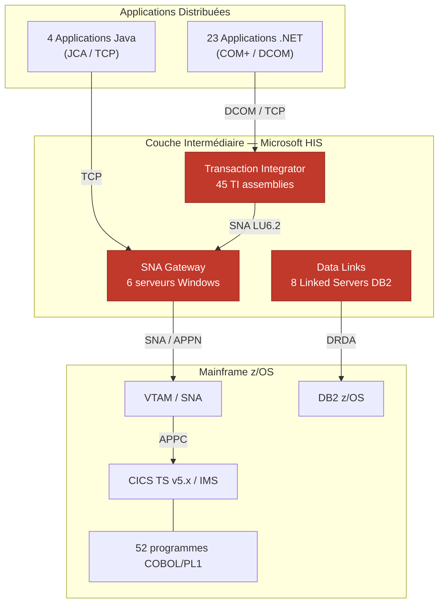

#### 2.5.2 Architecture cible — Élimination de HIS

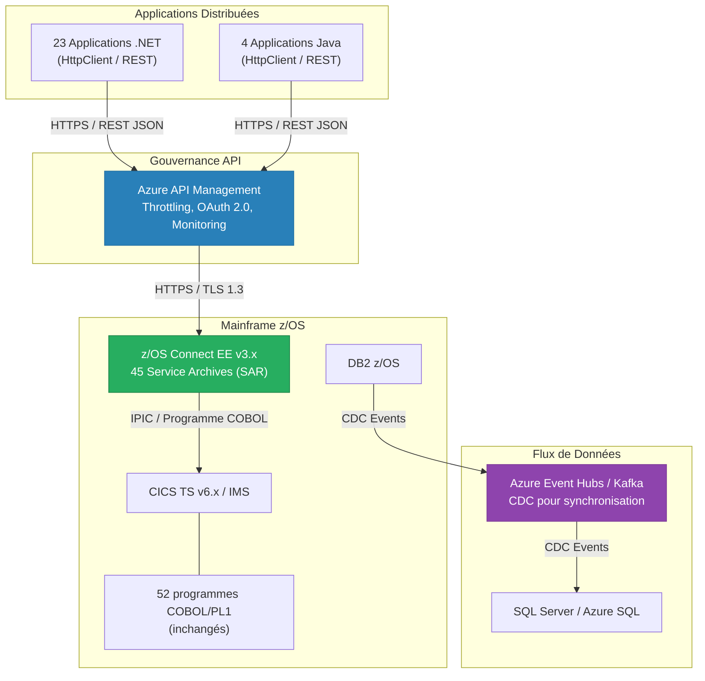

#### 2.5.3 Synthèse visuelle de l'élimination

| Composant | Architecture actuelle | Architecture cible | Statut |
|---|---|---|---|
| SNA Gateway (6 serveurs) | Requis — conversion TCP vers SNA | **Éliminé** | Supprimé |
| Transaction Integrator (45 assemblies) | Requis — appel CICS via COM+/.NET | **Remplacé** par 45 SAR z/OS Connect | Substitué |
| Data Links DB2 (8 Linked Servers) | Requis — synchronisation SQL Server ↔ DB2 | **Remplacé** par CDC via Kafka/Event Hubs | Substitué |
| Protocole SNA/APPN | Requis — transport vers VTAM | **Éliminé** — HTTPS direct | Supprimé |
| 12 LU Pools | Requis — sessions LU6.2 vers CICS/IMS | **Éliminés** — connexions IPIC TCP/IP | Supprimé |

---

### 2.6 Matrice de Traçabilité : Objectif Stratégique -- Bénéfice du Retrait de HIS

| # | Objectif Stratégique | Document de Référence | Bénéfice Direct du Retrait de HIS | Mesure de Succès |
|---|---|---|---|---|
| T-01 | Réduction de l'empreinte on-premise de 80 % d'ici 2027 | STR-CLOUD-2024-001, §4.3 | Élimination de 6 serveurs HIS on-premise ; déblocage de la migration cloud de 27 applications | Nombre de serveurs décommissionnés ; nombre d'applications migrées vers le cloud |
| T-02 | Exposition de 100 % des services Mainframe via API REST/JSON d'ici 2027 | STR-API-2024-003, §2.1 | Remplacement de 45 intégrations point-à-point (TI assemblies) par 45 endpoints API REST catalogués | Nombre de TI assemblies retirés ; nombre de SAR z/OS Connect déployés |
| T-03 | Conformité DORA — Élimination des concentrations fournisseur TIC critiques | REG-DORA-2024-001 | Suppression de la dépendance unique envers Microsoft pour la couche d'intégration Mainframe | Rapport de conformité DORA : risque de concentration réduit de « Critique » à « Faible » |
| T-04 | Conformité BSIF B-13 — Réduction du risque de dépendance technologique | REG-BSIF-2024-002 | Plan de sortie (exit strategy) HIS documenté et exécuté ; plus aucune dépendance résiduelle | Audit BSIF : aucun finding lié à la dépendance HIS |
| T-05 | Modernisation Mainframe — Adoption de z/OS Connect EE comme couche d'accès standard | ARCH-MF-2024-005, §3.2 | 52 programmes Mainframe accessibles via z/OS Connect EE ; élimination du protocole SNA/APPN | Nombre de programmes exposés via z/OS Connect ; trafic SNA réduit à zéro |
| T-06 | Réduction du coût total de possession (TCO) de la couche d'intégration Mainframe | STR-FIN-2024-004 | Économie annuelle de 1 430 K$ CAD (1 850 K$ - 420 K$ OPEX cible) ; ROI de ~38 % sur 3 ans, ~142 % sur 5 ans | Coût annuel mesuré post-migration vs référence actuelle de 1 850 K$ CAD |
| T-07 | Amélioration de la posture de sécurité — Élimination des protocoles non chiffrables | SEC-2024-007 | Suppression de SNA/LU6.2 (pas de TLS natif) ; adoption de HTTPS/TLS 1.3 avec authentification mutuelle (mTLS) | Audit de sécurité : zéro flux non chiffré vers le Mainframe |

---

### 2.7 Conclusion de Section

Le retrait de Microsoft HIS est un **noeud de convergence stratégique** qui accélère simultanément sept objectifs institutionnels documentés. Chaque mois de retard dans l'exécution de ce retrait :

- **Retarde** la migration cloud de 27 applications contraintes par le couplage HIS ;
- **Maintient** une non-conformité réglementaire (DORA, BSIF B-13) liée à la concentration fournisseur ;
- **Empêche** l'adoption de z/OS Connect EE comme couche d'accès API standard au Mainframe ;
- **Perpétue** un coût annuel de 1 850 K$ CAD sans valeur ajoutée fonctionnelle.

L'investissement de 3 200 K$ CAD (CAPEX Option C) est amortissable en moins de 3 ans, avec un ROI cumulé de ~142 % sur 5 ans. La durée de migration estimée est de 22 mois, alignée sur l'horizon de la feuille de route de modernisation Mainframe 2024-2028.


---

## 3. Analyse de l'État Actuel (As-Is)

> **Objectif** : Fournir un inventaire exhaustif et vérifiable de l'ensemble des dépendances Microsoft Host Integration Server (HIS) dans l'environnement de production, afin d'établir la ligne de base (*baseline*) sur laquelle s'appuiera la stratégie de retrait.

L'environnement HIS actuel comprend **6 serveurs**, **45 assemblages TI**, **12 pools LU**, **8 liens de données DB2**, **23 applications .NET dépendantes**, **4 applications Java dépendantes** et **52 programmes mainframe exposés**. Le coût annuel de fonctionnement s'élève à **1 850 K$ CAD**. Les sous-sections suivantes détaillent chaque couche de cette infrastructure.

---

### 3.1 — Inventaire des composants HIS

L'inventaire ci-dessous a été constitué à partir des données CMDB, des audits de configuration Active Directory et des relevés manuels effectués sur chaque serveur. Chaque entrée a été validée par l'équipe d'exploitation mainframe et l'équipe infrastructure Windows.

#### 3.1.1 — Serveurs HIS en production

| # | Composant HIS | Version | Serveur hôte | OS / Patch Level | Rôle fonctionnel | Domaine métier | Criticité |
|---|---------------|---------|--------------|------------------|------------------|----------------|-----------|
| 1 | HIS Runtime + SNA Gateway | HIS 2020 CU4 | SRV-HIS-01 | Windows Server 2019 Std (KB5034127) | Passerelle SNA principale — gère 8 des 12 pools LU vers VTAM/CICS. Point d'entrée SNA LU6.2 pour l'ensemble des transactions en ligne. | Opérations bancaires (Core Banking) | **Critique** |
| 2 | HIS Runtime + Transaction Integrator (TI) | HIS 2020 CU4 | SRV-HIS-02 | Windows Server 2019 Std (KB5034127) | Héberge 28 assemblages TI (.NET) pour les transactions CICS en temps réel. Expose les programmes COBOL via des interfaces WCF/TCP. | Opérations bancaires (Core Banking) | **Critique** |
| 3 | HIS Runtime + Transaction Integrator (TI) | HIS 2020 CU3 | SRV-HIS-03 | Windows Server 2019 Std (KB5033914) | Héberge 17 assemblages TI (COM+ et .NET) pour les transactions IMS et traitements par lots déclenchés. | Prêts et financements | **Élevée** |
| 4 | HIS Runtime + Data Links (DRDA) | HIS 2020 CU4 | SRV-HIS-04 | Windows Server 2022 Std (KB5034129) | Fournisseur OLE DB/DRDA pour les 8 Linked Servers SQL Server ↔ DB2 z/OS. Synchronisation bidirectionnelle des données référentielles. | Données de référence (MDM) | **Critique** |
| 5 | HIS Runtime + SNA Gateway (secours) | HIS 2020 CU4 | SRV-HIS-05 | Windows Server 2019 Std (KB5034127) | Passerelle SNA secondaire — bascule automatique (*failover*) pour SRV-HIS-01. Gère les 4 pools LU restants et le trafic IMS. | Opérations bancaires / Assurances | **Élevée** |
| 6 | HIS Runtime + Session Integrator + Print Service | HIS 2016 CU10 | SRV-HIS-06 | Windows Server 2016 Std (KB5034119) | Émulation 3270/5250 pour les agents du centre d'appels. Service d'impression mainframe (LU1/LU3) pour la production de relevés. | Service à la clientèle | **Moyenne** |

**Observations clés :**

- SRV-HIS-06 fonctionne encore sous HIS 2016, une version dont le support étendu prend fin en 2025. Une mise à niveau serait nécessaire si le retrait n'est pas complété à temps.
- SRV-HIS-01 et SRV-HIS-05 forment une paire active/passive pour la haute disponibilité SNA. Le mécanisme de bascule repose sur le service HIS Hot Backup et non sur le clustering Windows.
- SRV-HIS-02 et SRV-HIS-03 concentrent la totalité des 45 assemblages TI, répartis entre les interfaces CICS (28) et IMS (17).
- SRV-HIS-04 est le point unique de passage (*single point of failure*) pour l'intégration de données DB2. Aucune redondance n'est en place pour le rôle Data Links.

#### 3.1.2 — Licences et contrats de support

| Élément | Détail |
|---------|--------|
| Licences HIS | 6 licences serveur Microsoft HIS (incluses dans le contrat EA) |
| Support Microsoft Premier | Couverture A (réponse 1 h) pour SRV-HIS-01, -02, -04 ; Couverture C pour les autres |
| Coût annuel total | **1 850 K$ CAD** (licences, support, exploitation, maintenance corrective) |
| Fin de support HIS 2016 | Octobre 2025 (support étendu) |
| Fin de support HIS 2020 | Janvier 2031 (support étendu) |

---

### 3.2 — Cartographie des flux

#### 3.2.1 — Pools LU (Local/Remote) et affectation aux régions CICS/IMS

Les 12 pools LU configurés assurent la connectivité SNA entre les serveurs HIS et les sous-systèmes mainframe. Chaque pool est dimensionné selon le volume transactionnel du domaine métier qu'il dessert.

| # | Nom du pool LU | Type | Mode LU | Serveur HIS | Région CICS/IMS cible | VTAM APPL | Sessions max | Utilisation moyenne | Domaine métier |
|---|----------------|------|---------|-------------|----------------------|-----------|-------------|---------------------|----------------|
| 1 | POOL-CICS-CORE-01 | Remote APPC | LU 6.2 | SRV-HIS-01 | CICSPROD1 | APROD1 | 120 | 78 % | Core Banking — comptes |
| 2 | POOL-CICS-CORE-02 | Remote APPC | LU 6.2 | SRV-HIS-01 | CICSPROD2 | APROD2 | 120 | 65 % | Core Banking — virements |
| 3 | POOL-CICS-LOAN-01 | Remote APPC | LU 6.2 | SRV-HIS-01 | CICSLOAN1 | ALOAN1 | 60 | 52 % | Prêts personnels |
| 4 | POOL-CICS-LOAN-02 | Remote APPC | LU 6.2 | SRV-HIS-01 | CICSLOAN2 | ALOAN2 | 60 | 41 % | Prêts hypothécaires |
| 5 | POOL-CICS-INS-01 | Remote APPC | LU 6.2 | SRV-HIS-01 | CICSINS1 | AINS01 | 40 | 35 % | Assurances |
| 6 | POOL-CICS-PAY-01 | Remote APPC | LU 6.2 | SRV-HIS-01 | CICSPAY1 | APAY01 | 80 | 71 % | Paiements |
| 7 | POOL-CICS-FX-01 | Remote APPC | LU 6.2 | SRV-HIS-01 | CICSFX01 | AFX001 | 40 | 28 % | Change et trésorerie |
| 8 | POOL-CICS-CRM-01 | Remote APPC | LU 6.2 | SRV-HIS-01 | CICSCRM1 | ACRM01 | 30 | 45 % | Service à la clientèle |
| 9 | POOL-IMS-CORE-01 | Remote APPC | LU 6.2 | SRV-HIS-05 | IMSPROD1 | IAPRD1 | 80 | 60 % | Core Banking — grand livre |
| 10 | POOL-IMS-LOAN-01 | Remote APPC | LU 6.2 | SRV-HIS-05 | IMSLOAN1 | IALN01 | 40 | 38 % | Prêts — calcul d'amortissement |
| 11 | POOL-3270-AGENT-01 | Local LUA | LU 2 | SRV-HIS-06 | CICSPROD1 | SCRN01 | 200 | 55 % | Émulation écran — agents |
| 12 | POOL-PRINT-01 | Local LUA | LU 1/LU 3 | SRV-HIS-06 | CICSPROD1 | PRNT01 | 20 | 30 % | Impression mainframe |

**Observations clés :**

- Les pools 1 à 8 transitent par SRV-HIS-01 (passerelle SNA principale). En cas de défaillance, SRV-HIS-05 prend le relais pour les pools 1 à 8 via le mécanisme Hot Backup.
- Les pools 9 et 10 (IMS) sont gérés exclusivement par SRV-HIS-05 ; il n'existe pas de redondance dédiée pour ces flux IMS.
- Les pools 11 et 12 (émulation 3270 et impression) sont hébergés sur SRV-HIS-06 et ne disposent d'aucun mécanisme de bascule.
- Le pool POOL-CICS-CORE-01 présente un taux d'utilisation de 78 %, proche du seuil d'alerte fixé à 80 %. Un dimensionnement à la hausse devra être pris en compte dans l'architecture cible.

#### 3.2.2 — Inventaire des assemblages Transaction Integrator (TI)

Les 45 assemblages TI constituent la couche d'intégration programmatique entre les applications distribuées et les programmes mainframe. Ils sont répartis entre SRV-HIS-02 (28 assemblages CICS) et SRV-HIS-03 (17 assemblages IMS/COM+).

##### 3.2.2.1 — Assemblages TI hébergés sur SRV-HIS-02 (CICS — .NET / WCF)

| # | Nom de l'assemblage | Version | Technologie | Interface CICS cible | Programme COBOL/PL1 appelé | Zone d'échange | Taille (octets) | Appels/jour |
|---|---------------------|---------|-------------|---------------------|---------------------------|----------------|-----------------|-------------|
| 1 | BNK.Accounts.Inquiry.TI | 4.2.1 | .NET (WCF) | CICS TS 5.6 — CICSPROD1 | ACCTINQ0 (COBOL) | COMMAREA | 2 048 | 45 000 |
| 2 | BNK.Accounts.Update.TI | 4.2.1 | .NET (WCF) | CICS TS 5.6 — CICSPROD1 | ACCTUPD0 (COBOL) | COMMAREA | 4 096 | 18 000 |
| 3 | BNK.Accounts.Open.TI | 3.8.0 | .NET (WCF) | CICS TS 5.6 — CICSPROD1 | ACCTOPN0 (COBOL) | COMMAREA | 3 072 | 2 200 |
| 4 | BNK.Accounts.Close.TI | 3.8.0 | .NET (WCF) | CICS TS 5.6 — CICSPROD1 | ACCTCLS0 (COBOL) | COMMAREA | 2 048 | 450 |
| 5 | BNK.Transfer.Domestic.TI | 5.0.3 | .NET (WCF) | CICS TS 5.6 — CICSPROD2 | XFRDMS00 (COBOL) | Container (Channel) | 8 192 | 32 000 |
| 6 | BNK.Transfer.Intl.TI | 5.0.3 | .NET (WCF) | CICS TS 5.6 — CICSPROD2 | XFRINT00 (COBOL) | Container (Channel) | 12 288 | 5 600 |
| 7 | BNK.Transfer.Batch.TI | 4.1.0 | .NET (WCF) | CICS TS 5.6 — CICSPROD2 | XFRBAT00 (COBOL) | COMMAREA | 6 144 | 800 |
| 8 | LN.PersonalLoan.Calc.TI | 3.5.2 | .NET (WCF) | CICS TS 5.6 — CICSLOAN1 | LNCALC00 (COBOL) | COMMAREA | 2 048 | 8 500 |
| 9 | LN.PersonalLoan.Create.TI | 3.5.2 | .NET (WCF) | CICS TS 5.6 — CICSLOAN1 | LNCREA00 (COBOL) | COMMAREA | 4 096 | 1 200 |
| 10 | LN.PersonalLoan.Status.TI | 3.5.0 | .NET (WCF) | CICS TS 5.6 — CICSLOAN1 | LNSTAT00 (COBOL) | COMMAREA | 1 024 | 12 000 |
| 11 | LN.Mortgage.Calc.TI | 3.6.1 | .NET (WCF) | CICS TS 5.6 — CICSLOAN2 | MTCALC00 (COBOL) | COMMAREA | 2 048 | 6 400 |
| 12 | LN.Mortgage.Create.TI | 3.6.1 | .NET (WCF) | CICS TS 5.6 — CICSLOAN2 | MTCREA00 (COBOL) | COMMAREA | 4 096 | 400 |
| 13 | LN.Mortgage.Amort.TI | 3.6.0 | .NET (WCF) | CICS TS 5.6 — CICSLOAN2 | MTAMRT00 (COBOL) | Container (Channel) | 16 384 | 3 200 |
| 14 | INS.Policy.Inquiry.TI | 2.9.4 | .NET (WCF) | CICS TS 5.6 — CICSINS1 | INSINQ00 (COBOL) | COMMAREA | 2 048 | 7 800 |
| 15 | INS.Policy.Create.TI | 2.9.4 | .NET (WCF) | CICS TS 5.6 — CICSINS1 | INSCRE00 (COBOL) | COMMAREA | 3 072 | 900 |
| 16 | INS.Claim.Submit.TI | 2.8.1 | .NET (WCF) | CICS TS 5.6 — CICSINS1 | INSCLM00 (COBOL) | Container (Channel) | 10 240 | 2 100 |
| 17 | INS.Claim.Status.TI | 2.8.1 | .NET (WCF) | CICS TS 5.6 — CICSINS1 | INSSTS00 (COBOL) | COMMAREA | 1 024 | 5 400 |
| 18 | PAY.Domestic.Execute.TI | 6.1.0 | .NET (WCF) | CICS TS 5.6 — CICSPAY1 | PAYDMS00 (COBOL) | Container (Channel) | 8 192 | 28 000 |
| 19 | PAY.Domestic.Reverse.TI | 6.1.0 | .NET (WCF) | CICS TS 5.6 — CICSPAY1 | PAYREV00 (COBOL) | COMMAREA | 4 096 | 1 500 |
| 20 | PAY.Intl.Execute.TI | 6.0.2 | .NET (WCF) | CICS TS 5.6 — CICSPAY1 | PAYINT00 (COBOL) | Container (Channel) | 12 288 | 4 200 |
| 21 | PAY.Intl.Status.TI | 6.0.2 | .NET (WCF) | CICS TS 5.6 — CICSPAY1 | PAYSTS00 (COBOL) | COMMAREA | 1 024 | 9 000 |
| 22 | PAY.Batch.Clearing.TI | 5.2.0 | .NET (WCF) | CICS TS 5.6 — CICSPAY1 | PAYCLR00 (COBOL) | Container (Channel) | 32 768 | 200 |
| 23 | FX.Rate.Inquiry.TI | 1.4.0 | .NET (WCF) | CICS TS 5.6 — CICSFX01 | FXRATE00 (COBOL) | COMMAREA | 1 024 | 15 000 |
| 24 | FX.Trade.Execute.TI | 1.4.0 | .NET (WCF) | CICS TS 5.6 — CICSFX01 | FXTRAD00 (COBOL) | Container (Channel) | 8 192 | 3 800 |
| 25 | FX.Position.Report.TI | 1.3.2 | .NET (WCF) | CICS TS 5.6 — CICSFX01 | FXPOSN00 (PL/I) | Container (Channel) | 16 384 | 600 |
| 26 | CRM.Customer.Inquiry.TI | 2.1.0 | .NET (WCF) | CICS TS 5.6 — CICSCRM1 | CUSTINQ0 (COBOL) | COMMAREA | 2 048 | 22 000 |
| 27 | CRM.Customer.Update.TI | 2.1.0 | .NET (WCF) | CICS TS 5.6 — CICSCRM1 | CUSTUPD0 (COBOL) | COMMAREA | 3 072 | 8 000 |
| 28 | CRM.Interaction.Log.TI | 2.0.1 | .NET (WCF) | CICS TS 5.6 — CICSCRM1 | CUSTLOG0 (COBOL) | Container (Channel) | 6 144 | 14 000 |

##### 3.2.2.2 — Assemblages TI hébergés sur SRV-HIS-03 (IMS et COM+)

| # | Nom de l'assemblage | Version | Technologie | Interface IMS/CICS cible | Programme COBOL/PL1 appelé | Zone d'échange | Taille (octets) | Appels/jour |
|---|---------------------|---------|-------------|-------------------------|---------------------------|----------------|-----------------|-------------|
| 29 | BNK.GL.PostEntry.TI | 3.0.4 | COM+ | IMS TM 15.3 — IMSPROD1 | GLPOST00 (COBOL) | IMS Message (MFS) | 4 096 | 52 000 |
| 30 | BNK.GL.TrialBalance.TI | 3.0.4 | COM+ | IMS TM 15.3 — IMSPROD1 | GLTBAL00 (COBOL) | IMS Message (MFS) | 8 192 | 2 400 |
| 31 | BNK.GL.Reconcile.TI | 3.0.2 | COM+ | IMS TM 15.3 — IMSPROD1 | GLRECN00 (COBOL) | IMS Message (MFS) | 16 384 | 800 |
| 32 | BNK.GL.Extract.TI | 3.0.0 | COM+ | IMS TM 15.3 — IMSPROD1 | GLEXTR00 (COBOL) | IMS Message (MFS) | 32 768 | 150 |
| 33 | BNK.GL.CurrencyReval.TI | 2.8.1 | COM+ | IMS TM 15.3 — IMSPROD1 | GLCURR00 (PL/I) | IMS Message (MFS) | 4 096 | 1 200 |
| 34 | LN.Amort.Schedule.TI | 2.5.0 | COM+ | IMS TM 15.3 — IMSLOAN1 | LNAMRT00 (COBOL) | IMS Message (MFS) | 8 192 | 3 600 |
| 35 | LN.Amort.Recalc.TI | 2.5.0 | COM+ | IMS TM 15.3 — IMSLOAN1 | LNRCAL00 (COBOL) | IMS Message (MFS) | 4 096 | 1 800 |
| 36 | LN.Provision.Calc.TI | 2.4.3 | COM+ | IMS TM 15.3 — IMSLOAN1 | LNPROV00 (COBOL) | IMS Message (MFS) | 4 096 | 900 |
| 37 | LN.InterestAccrual.TI | 2.4.3 | COM+ | IMS TM 15.3 — IMSLOAN1 | LNINTC00 (COBOL) | IMS Message (MFS) | 2 048 | 6 000 |
| 38 | BNK.DDA.Balance.TI | 4.0.1 | .NET (WCF) | IMS TM 15.3 — IMSPROD1 | DDABAL00 (COBOL) | IMS Connect (HWSSMPL1) | 2 048 | 35 000 |
| 39 | BNK.DDA.Statement.TI | 4.0.1 | .NET (WCF) | IMS TM 15.3 — IMSPROD1 | DDASTM00 (COBOL) | IMS Connect (HWSSMPL1) | 16 384 | 8 000 |
| 40 | BNK.DDA.Hold.TI | 4.0.0 | .NET (WCF) | IMS TM 15.3 — IMSPROD1 | DDAHLD00 (COBOL) | IMS Connect (HWSSMPL1) | 1 024 | 4 500 |
| 41 | REG.Reporting.Extract.TI | 1.2.0 | COM+ | IMS TM 15.3 — IMSPROD1 | REGRPT00 (PL/I) | IMS Message (MFS) | 65 536 | 50 |
| 42 | REG.Compliance.Check.TI | 1.2.0 | COM+ | IMS TM 15.3 — IMSPROD1 | REGCHK00 (PL/I) | IMS Message (MFS) | 4 096 | 2 000 |
| 43 | REG.AML.Screen.TI | 1.1.5 | .NET (WCF) | IMS TM 15.3 — IMSPROD1 | REGAML00 (COBOL) | IMS Connect (HWSSMPL1) | 2 048 | 18 000 |
| 44 | UTIL.Ping.Health.TI | 1.0.0 | .NET (WCF) | CICS TS 5.6 — CICSPROD1 | HLTHCK00 (COBOL) | COMMAREA | 128 | 86 400 |
| 45 | UTIL.Trace.Diag.TI | 1.0.0 | COM+ | IMS TM 15.3 — IMSPROD1 | DIAGTR00 (COBOL) | IMS Message (MFS) | 512 | 1 440 |

**Observations clés :**

- 28 assemblages utilisent la technologie .NET/WCF (62 %), tandis que 17 reposent sur COM+ (38 %). Les assemblages COM+ représentent un risque accru de dette technique, car ils dépendent de l'infrastructure DCOM de Windows et sont plus difficiles à migrer.
- Les assemblages à plus fort volume transactionnel sont BNK.GL.PostEntry.TI (52 000 appels/jour, COM+) et BNK.Accounts.Inquiry.TI (45 000 appels/jour, .NET). Ces deux composants devront faire l'objet d'une attention particulière lors des tests de performance de la solution cible.
- 4 assemblages appellent des programmes PL/I (GLCURR00, FXPOSN00, REGRPT00, REGCHK00). Les interfaces PL/I utilisent des structures de données distinctes qui devront être cartographiées avec précision lors de la migration.
- Les assemblages UTIL.Ping.Health.TI et UTIL.Trace.Diag.TI sont des utilitaires de surveillance ; ils seront remplacés par les mécanismes de *health check* natifs de la solution cible.

#### 3.2.3 — Liens de données DB2 ↔ SQL Server (Data Links)

Les 8 liens de données transitent exclusivement par SRV-HIS-04, qui héberge le fournisseur OLE DB pour DB2 (DRDA). Ces liens alimentent les bases SQL Server en données référentielles et transactionnelles issues de DB2 z/OS.

| # | Nom du Linked Server (SQL) | SQL Server source | Base DB2 z/OS cible | Sous-système DB2 | Fréquence de sync. | Volume quotidien | Direction | Objet principal |
|---|---------------------------|-------------------|---------------------|-------------------|---------------------|------------------|-----------|-----------------|
| 1 | LS_DB2_CORE_ACCT | SQL-CORE-01 | DSNPROD1.CORE_ACCT | DSN1 | Temps réel (requête à la demande) | 120 000 lignes | Lecture seule (SQL → DB2) | Consultation des soldes de comptes |
| 2 | LS_DB2_CORE_CUST | SQL-CORE-01 | DSNPROD1.CORE_CUST | DSN1 | Toutes les 15 min | 85 000 lignes | Bidirectionnel | Synchronisation des données clients |
| 3 | LS_DB2_LOAN_PORT | SQL-LOAN-01 | DSNPROD2.LOAN_PORT | DSN2 | Toutes les heures | 42 000 lignes | Lecture seule (SQL → DB2) | Portefeuille de prêts |
| 4 | LS_DB2_LOAN_AMORT | SQL-LOAN-01 | DSNPROD2.LOAN_AMORT | DSN2 | Quotidien (02h00) | 18 000 lignes | Lecture seule (SQL → DB2) | Tables d'amortissement |
| 5 | LS_DB2_PAY_TXN | SQL-PAY-01 | DSNPROD3.PAY_TXN | DSN3 | Temps réel (requête à la demande) | 95 000 lignes | Lecture seule (SQL → DB2) | Transactions de paiement |
| 6 | LS_DB2_PAY_REF | SQL-PAY-01 | DSNPROD3.PAY_REF | DSN3 | Quotidien (03h00) | 5 000 lignes | Bidirectionnel | Données référentielles paiements |
| 7 | LS_DB2_FX_RATES | SQL-MKT-01 | DSNPROD4.FX_RATES | DSN4 | Toutes les 5 min | 220 000 lignes | Lecture seule (SQL → DB2) | Taux de change en quasi temps réel |
| 8 | LS_DB2_REG_RPT | SQL-REG-01 | DSNPROD1.REG_RPT | DSN1 | Quotidien (04h00) | 350 000 lignes | Lecture seule (SQL → DB2) | Extractions réglementaires |

**Observations clés :**

- Les liens LS_DB2_CORE_ACCT, LS_DB2_PAY_TXN et LS_DB2_FX_RATES fonctionnent en mode temps réel ou quasi temps réel. Toute interruption de SRV-HIS-04 entraîne une perte immédiate d'accès aux données DB2 pour les applications distribuées.
- Seuls 2 liens sur 8 (LS_DB2_CORE_CUST et LS_DB2_PAY_REF) sont bidirectionnels. Ces flux d'écriture vers DB2 via DRDA nécessiteront une attention particulière pour garantir l'intégrité transactionnelle dans l'architecture cible.
- Le volume total quotidien s'élève à environ **935 000 lignes**, ce qui représente une charge significative sur le fournisseur DRDA.
- SRV-HIS-04 constitue un point unique de défaillance (*SPOF*) pour l'ensemble de ces flux. L'architecture cible devra impérativement prévoir une redondance.

#### 3.2.4 — Dépendances amont et aval

##### 3.2.4.1 — Applications .NET dépendantes de HIS (23 applications)

| # | Application | Version | Technologie | Serveurs TI utilisés | Assemblages TI consommés | Type d'intégration | Criticité |
|---|-------------|---------|-------------|----------------------|--------------------------|-------------------|-----------|
| 1 | CoreBanking.Web | 8.2.1 | ASP.NET Core 6 | SRV-HIS-02 | BNK.Accounts.* (4) | WCF/TCP | Critique |
| 2 | CoreBanking.API | 8.2.1 | ASP.NET Core 6 | SRV-HIS-02 | BNK.Accounts.*, BNK.Transfer.* (7) | WCF/TCP | Critique |
| 3 | CoreBanking.Batch | 7.5.0 | .NET 6 Console | SRV-HIS-02, SRV-HIS-03 | BNK.GL.* (5) | COM+/DCOM | Critique |
| 4 | LoanOrigination.Web | 5.1.0 | ASP.NET MVC 5 | SRV-HIS-02 | LN.PersonalLoan.* (3) | WCF/TCP | Élevée |
| 5 | LoanOrigination.API | 5.1.0 | ASP.NET Web API 2 | SRV-HIS-02, SRV-HIS-03 | LN.PersonalLoan.*, LN.Amort.* (5) | WCF/TCP + COM+ | Élevée |
| 6 | MortgagePortal.Web | 3.4.2 | ASP.NET Core 6 | SRV-HIS-02 | LN.Mortgage.* (3) | WCF/TCP | Élevée |
| 7 | MortgagePortal.Batch | 3.4.0 | .NET 6 Console | SRV-HIS-03 | LN.Amort.*, LN.Provision.*, LN.InterestAccrual.* (4) | COM+/DCOM | Élevée |
| 8 | InsurancePortal.Web | 4.0.3 | ASP.NET Core 6 | SRV-HIS-02 | INS.Policy.*, INS.Claim.* (4) | WCF/TCP | Élevée |
| 9 | InsurancePortal.API | 4.0.3 | ASP.NET Core 6 | SRV-HIS-02 | INS.Policy.*, INS.Claim.* (4) | WCF/TCP | Élevée |
| 10 | PaymentGateway.Core | 9.0.1 | .NET 6 | SRV-HIS-02 | PAY.Domestic.*, PAY.Intl.* (4) | WCF/TCP | Critique |
| 11 | PaymentGateway.Batch | 9.0.0 | .NET 6 Console | SRV-HIS-02 | PAY.Batch.Clearing.TI (1) | WCF/TCP | Critique |
| 12 | PaymentGateway.Reconciliation | 8.8.2 | .NET Framework 4.8 | SRV-HIS-04 | — (Data Links) | OLE DB / Linked Server | Critique |
| 13 | FXTrading.Web | 2.3.0 | ASP.NET Core 6 | SRV-HIS-02 | FX.Rate.*, FX.Trade.* (2) | WCF/TCP | Élevée |
| 14 | FXTrading.API | 2.3.0 | ASP.NET Core 6 | SRV-HIS-02 | FX.* (3) | WCF/TCP | Élevée |
| 15 | CRM.AgentDesktop | 6.5.1 | WPF / .NET Framework 4.8 | SRV-HIS-02, SRV-HIS-06 | CRM.Customer.*, CRM.Interaction.* (3) | WCF/TCP + Session Integrator | Élevée |
| 16 | CRM.API | 6.5.1 | ASP.NET Core 6 | SRV-HIS-02 | CRM.Customer.* (2) | WCF/TCP | Élevée |
| 17 | RegulatoryReporting.ETL | 1.8.0 | .NET 6 Console | SRV-HIS-03, SRV-HIS-04 | REG.Reporting.*, REG.Compliance.* (2) + Data Links | COM+ + OLE DB | Critique |
| 18 | AML.Screening.Service | 2.0.4 | .NET 6 Worker Service | SRV-HIS-03 | REG.AML.Screen.TI (1) | WCF/TCP | Critique |
| 19 | DataWarehouse.Loader | 7.1.0 | SSIS / .NET Framework 4.8 | SRV-HIS-04 | — (Data Links) | OLE DB / Linked Server | Élevée |
| 20 | MDM.SyncService | 3.2.1 | .NET 6 Worker Service | SRV-HIS-04 | — (Data Links) | OLE DB / Linked Server | Élevée |
| 21 | DDA.BalanceService | 4.0.0 | .NET 6 | SRV-HIS-03 | BNK.DDA.* (3) | WCF/TCP | Critique |
| 22 | MonitoringDashboard | 1.5.0 | Blazor / .NET 6 | SRV-HIS-02, SRV-HIS-03 | UTIL.Ping.Health.TI, UTIL.Trace.Diag.TI (2) | WCF/TCP + COM+ | Moyenne |
| 23 | PrintService.Manager | 2.0.0 | .NET Framework 4.8 / WinForms | SRV-HIS-06 | — (Print Service) | HIS Print API | Basse |

##### 3.2.4.2 — Applications Java dépendantes de HIS (4 applications)

| # | Application | Version | Technologie | Mode d'intégration avec HIS | Assemblages / Services consommés | Criticité |
|---|-------------|---------|-------------|----------------------------|----------------------------------|-----------|
| 1 | MobileBanking.Backend | 3.6.0 | Spring Boot 3.1 / Java 17 | Appel REST vers une couche façade .NET qui invoque les TI | BNK.Accounts.Inquiry.TI, BNK.Transfer.Domestic.TI (via CoreBanking.API) | Critique |
| 2 | PartnerGateway.Service | 2.1.0 | Jakarta EE 10 / Java 17 | JDBC via pilote DRDA tiers (pas HIS direct) + Linked Server en secours | LS_DB2_PAY_TXN (via SQL Server Linked Server en *fallback*) | Élevée |
| 3 | Analytics.Pipeline | 4.0.2 | Apache Spark 3.4 / Scala 2.13 | JDBC vers SQL Server, qui utilise les Linked Servers HIS pour accéder à DB2 | LS_DB2_REG_RPT, LS_DB2_CORE_ACCT (indirect via SQL) | Élevée |
| 4 | OpenBanking.API | 1.2.0 | Spring Boot 3.1 / Java 17 | Appel gRPC vers une couche façade .NET qui invoque les TI | BNK.Accounts.Inquiry.TI, PAY.Domestic.Execute.TI (via CoreBanking.API et PaymentGateway.Core) | Critique |

**Observations clés :**

- Sur les 23 applications .NET, **8 sont classées critiques**, ce qui signifie qu'une interruption de HIS entraînerait un impact direct sur les opérations bancaires de première ligne.
- Les 4 applications Java n'utilisent pas HIS directement. Elles passent soit par une couche façade .NET (MobileBanking, OpenBanking), soit par les Linked Servers SQL Server (PartnerGateway, Analytics). Cette indirection simplifie la migration pour le volet Java : il suffira de rediriger les appels vers les nouvelles interfaces cibles.
- L'application CRM.AgentDesktop (WPF / .NET Framework 4.8) utilise à la fois les assemblages TI et le Session Integrator de SRV-HIS-06 pour l'émulation 3270. Elle cumule donc deux types de dépendances HIS.
- Les applications DataWarehouse.Loader, MDM.SyncService et PaymentGateway.Reconciliation dépendent exclusivement des Data Links (SRV-HIS-04). Elles ne consomment aucun assemblage TI.

##### 3.2.4.3 — Programmes mainframe exposés via HIS (52 programmes)

Les 52 programmes mainframe exposés via HIS se répartissent comme suit :

| Sous-système | Langage | Nombre de programmes | Programmes |
|-------------|---------|---------------------|------------|
| CICS TS 5.6 | COBOL | 26 | ACCTINQ0, ACCTUPD0, ACCTOPN0, ACCTCLS0, XFRDMS00, XFRINT00, XFRBAT00, LNCALC00, LNCREA00, LNSTAT00, MTCALC00, MTCREA00, MTAMRT00, INSINQ00, INSCRE00, INSCLM00, INSSTS00, PAYDMS00, PAYREV00, PAYINT00, PAYSTS00, PAYCLR00, CUSTINQ0, CUSTUPD0, CUSTLOG0, HLTHCK00 |
| CICS TS 5.6 | PL/I | 1 | FXPOSN00 |
| CICS TS 5.6 — Total CICS | — | **27** | — |
| IMS TM 15.3 | COBOL | 20 | GLPOST00, GLTBAL00, GLRECN00, GLEXTR00, LNAMRT00, LNRCAL00, LNPROV00, LNINTC00, DDABAL00, DDASTM00, DDAHLD00, REGAML00, DIAGTR00, FXRATE00, FXTRAD00 + 5 sous-programmes appelés en interne |
| IMS TM 15.3 | PL/I | 5 | GLCURR00, REGRPT00, REGCHK00 + 2 sous-programmes appelés en interne |
| IMS TM 15.3 — Total IMS | — | **25** | — |
| **Total général** | — | **52** | — |

**Observations clés :**

- La répartition CICS/IMS est quasi équilibrée (27/25). Cependant, les programmes IMS présentent une complexité d'intégration supérieure en raison de l'utilisation du format MFS (*Message Format Service*) et d'IMS Connect.
- Les 6 programmes PL/I (1 CICS + 5 IMS) représentent 12 % du total. Leur migration nécessitera une expertise PL/I spécifique pour valider les structures de données.
- 7 sous-programmes (5 COBOL + 2 PL/I) ne sont pas directement exposés via les assemblages TI mais sont appelés en interne par les programmes principaux. Ils devront néanmoins être inclus dans le périmètre de test.

---

### 3.3 — Diagramme d'architecture As-Is

Le diagramme ci-dessous illustre l'architecture complète de la couche HIS, incluant chaque protocole de communication et les versions logicielles en production.

```mermaid
graph LR
    subgraph "Applications distribuées"
        A1["Applications .NET<br/>(23 apps)<br/>.NET 6 / .NET Fx 4.8"]
        A2["Applications Java<br/>(4 apps)<br/>Java 17 / Spring Boot 3.1"]
        A3["SQL Server<br/>(5 instances)<br/>SQL Server 2019 CU22"]
    end

    subgraph "Couche HIS — 6 serveurs"
        H1["SRV-HIS-01<br/>SNA Gateway (principal)<br/>HIS 2020 CU4<br/>Win Server 2019"]
        H2["SRV-HIS-02<br/>Transaction Integrator<br/>(28 assemblages CICS .NET)<br/>HIS 2020 CU4<br/>Win Server 2019"]
        H3["SRV-HIS-03<br/>Transaction Integrator<br/>(17 assemblages IMS COM+/.NET)<br/>HIS 2020 CU3<br/>Win Server 2019"]
        H4["SRV-HIS-04<br/>Data Links (DRDA)<br/>(8 Linked Servers)<br/>HIS 2020 CU4<br/>Win Server 2022"]
        H5["SRV-HIS-05<br/>SNA Gateway (secours)<br/>HIS 2020 CU4<br/>Win Server 2019"]
        H6["SRV-HIS-06<br/>Session Integrator + Print<br/>HIS 2016 CU10<br/>Win Server 2016"]
    end

    subgraph "Mainframe IBM z15"
        M1["VTAM<br/>V4R2"]
        M2["CICS TS 5.6<br/>CICSPROD1 / CICSPROD2<br/>CICSLOAN1 / CICSLOAN2<br/>CICSINS1 / CICSPAY1<br/>CICSFX01 / CICSCRM1<br/>(27 programmes)"]
        M3["IMS TM 15.3<br/>IMSPROD1 / IMSLOAN1<br/>(25 programmes)"]
        M4["DB2 z/OS V13<br/>DSN1 / DSN2 / DSN3 / DSN4"]
        M5["IMS Connect<br/>HWSSMPL1"]
    end

    %% Flux Applications .NET → HIS
    A1 -->|"WCF / TCP<br/>port 2776"| H2
    A1 -->|"DCOM / TCP<br/>port 135 + dynamique"| H3
    A1 -->|"Session Integrator API<br/>TCP port 1477"| H6

    %% Flux Applications Java → .NET (indirection)
    A2 -->|"REST / gRPC<br/>HTTPS port 443"| A1

    %% Flux SQL Server → HIS Data Links
    A3 -->|"OLE DB pour DB2<br/>(DRDA via HIS)<br/>TCP port 446"| H4

    %% Flux HIS TI → SNA Gateway
    H2 -->|"SNA LU 6.2<br/>(APPC)"| H1
    H3 -->|"SNA LU 6.2<br/>(APPC)"| H1
    H3 -->|"IMS Connect<br/>TCP port 9999"| M5

    %% Flux SNA Gateway → Mainframe
    H1 -->|"SNA LU 6.2<br/>(DLC 802.2 / IP-DLC)"| M1
    H5 -->|"SNA LU 6.2<br/>(IP-DLC — Hot Backup)"| M1

    %% Flux VTAM → CICS / IMS
    M1 -->|"VTAM APPL"| M2
    M1 -->|"VTAM APPL"| M3

    %% Flux IMS Connect → IMS
    M5 -->|"OTMA / TCP"| M3

    %% Flux Data Links → DB2
    H4 -->|"DRDA<br/>TCP port 446"| M4

    %% Flux Session Integrator → SNA
    H6 -->|"SNA LU 2 / LU 1 / LU 3<br/>(3270 / Print)"| M1

    %% Haute disponibilité
    H1 -.-|"HIS Hot Backup<br/>(bascule auto)"| H5

    %% CICS / IMS → DB2
    M2 -->|"CICS-DB2 Attach"| M4
    M3 -->|"IMS-DB2 Attach (DBCTL)"| M4

    style A1 fill:#4A90D9,stroke:#2C5F8A,color:#FFFFFF
    style A2 fill:#4A90D9,stroke:#2C5F8A,color:#FFFFFF
    style A3 fill:#4A90D9,stroke:#2C5F8A,color:#FFFFFF
    style H1 fill:#D4A843,stroke:#8B7023,color:#000000
    style H2 fill:#D4A843,stroke:#8B7023,color:#000000
    style H3 fill:#D4A843,stroke:#8B7023,color:#000000
    style H4 fill:#D4A843,stroke:#8B7023,color:#000000
    style H5 fill:#D4A843,stroke:#8B7023,color:#000000
    style H6 fill:#D4A843,stroke:#8B7023,color:#000000
    style M1 fill:#5BAF5B,stroke:#3A7A3A,color:#FFFFFF
    style M2 fill:#5BAF5B,stroke:#3A7A3A,color:#FFFFFF
    style M3 fill:#5BAF5B,stroke:#3A7A3A,color:#FFFFFF
    style M4 fill:#5BAF5B,stroke:#3A7A3A,color:#FFFFFF
    style M5 fill:#5BAF5B,stroke:#3A7A3A,color:#FFFFFF
```

**Légende des couleurs :**

| Couleur | Couche |
|---------|--------|
| Bleu | Applications distribuées (.NET, Java, SQL Server) |
| Jaune/Or | Couche Microsoft HIS (6 serveurs) |
| Vert | Mainframe IBM z15 (VTAM, CICS, IMS, DB2, IMS Connect) |

---

### 3.4 — Synthèse des risques identifiés dans l'état actuel

L'analyse de l'état actuel révèle les risques structurels suivants, qui justifient pleinement le projet de retrait de HIS dans un horizon de **22 mois** pour atteindre un coût d'exploitation annuel cible de **420 K$ CAD** (contre **1 850 K$ CAD** actuellement) :

| # | Risque | Sévérité | Composants concernés | Impact potentiel |
|---|--------|----------|---------------------|------------------|
| R-01 | Point unique de défaillance (SPOF) pour les Data Links | Critique | SRV-HIS-04 | Perte d'accès aux 8 Linked Servers DB2, affectant 5 applications dont 3 critiques |
| R-02 | Version HIS 2016 en fin de support | Élevée | SRV-HIS-06 | Plus de correctifs de sécurité après octobre 2025; vulnérabilités non corrigées |
| R-03 | Dépendance COM+/DCOM pour 17 assemblages TI | Élevée | SRV-HIS-03 | Infrastructure DCOM fragile, difficile à sécuriser et à migrer vers des environnements conteneurisés |
| R-04 | Saturation imminente du pool LU POOL-CICS-CORE-01 | Moyenne | SRV-HIS-01 | Rejet de transactions bancaires en période de pointe (utilisation à 78 %, seuil à 80 %) |
| R-05 | Absence de redondance pour les flux IMS | Moyenne | SRV-HIS-05 (pools 9 et 10) | Indisponibilité du grand livre et des calculs d'amortissement en cas de panne |
| R-06 | Compétences HIS/SNA en déclin | Élevée | Ensemble de l'infrastructure HIS | Difficulté croissante à recruter et retenir des spécialistes SNA/HIS |
| R-07 | Coût d'exploitation disproportionné | Élevée | Ensemble de l'infrastructure HIS | 1 850 K$ CAD/an pour une couche d'intégration intermédiaire, soit un ROI potentiel de ~38 % sur 3 ans et ~142 % sur 5 ans après migration (CAPEX estimé à 3 200 K$ CAD) |

---

> **Conclusion de la section 3** : L'inventaire exhaustif présenté dans cette section confirme que l'infrastructure HIS, bien que fonctionnelle, constitue une couche d'intégration coûteuse (1 850 K$ CAD/an), fragile (multiples SPOF) et de plus en plus difficile à maintenir (compétences en déclin, version en fin de support). La migration de l'ensemble des 45 assemblages TI, 12 pools LU, 8 liens de données DB2 et des 52 programmes mainframe associés représente un périmètre maîtrisable sur une durée de 22 mois, avec un objectif de réduction des coûts d'exploitation à 420 K$ CAD/an. Les sections suivantes détailleront les options d'architecture cible et la feuille de route de migration.


---

## 4. Analyse des Risques du Statu Quo

> **Objectif** : Démontrer que le maintien de Microsoft Host Integration Server (HIS) en production constitue un risque **croissant**, et non une situation stable. L'environnement actuel — 6 serveurs HIS, 45 assemblages TI, 12 pools LU, 8 liens de données DB2, 52 programmes mainframe exposés — représente une surface d'exposition qui s'élargit à mesure que la plateforme vieillit et que l'écosystème de compétences se contracte.

---

### 4.1 Registre des Risques

Le tableau ci-dessous synthétise les cinq risques majeurs identifiés. Chaque risque est évalué selon une grille **Impact × Probabilité** conforme à la norme ISO 31000:2018.

| ID | Catégorie | Risque | Impact | Probabilité | Niveau |
|------|---------------|--------|--------|-------------|--------|
| R-01 | Compétences | Pénurie critique de ressources maîtrisant SNA/APPN et le TI de HIS. Le bassin de talents se réduit chaque année. | Incapacité à maintenir ou dépanner l'infrastructure en cas d'incident majeur. | Élevée | :red_circle: Critique |
| R-02 | Financier | Coûts de licence Windows Server + HIS (per-core licensing) en croissance continue. | Augmentation du TCO sans valeur ajoutée fonctionnelle. | Certaine | :red_circle: Critique |
| R-03 | Sécurité | SNA/LU6.2 ne supporte pas nativement le chiffrement TLS 1.3. Surface d'attaque élargie par le hop intermédiaire. | Exposition à des vulnérabilités réseau non corrigeables. | Modérée | :yellow_circle: Modéré |
| R-04 | Obsolescence | Microsoft a réduit l'investissement dans HIS. Cycle de support limité (fin de support étendu prévisible). | Risque de fonctionnement sur une plateforme non supportée. | Élevée | :red_circle: Critique |
| R-05 | Opérationnel | Ajout d'un point de défaillance unique (SPOF) dans la chaîne d'intégration Mainframe. | Indisponibilité de services critiques en cas de panne HIS. | Modérée | :yellow_circle: Modéré |

---

### 4.2 Analyse Détaillée par Risque

#### 4.2.1 R-01 — Pénurie Critique de Compétences SNA/HIS

**Description.** Le protocole SNA (Systems Network Architecture) et son extension APPN ont été conçus par IBM dans les années 1970-1980. Le composant Transaction Integrator (TI) de HIS requiert une expertise de niche à l'intersection de COBOL/CICS, du mapping de types COM/WCF et de la configuration réseau SNA/LU6.2. Cette expertise n'est plus enseignée dans les programmes universitaires et n'est plus recherchée par les professionnels en début de carrière.

**Référence factuelle.** Selon le rapport *2024 IT Skills and Salary Report* de Global Knowledge (désormais Skillsoft), les compétences liées aux protocoles patrimoniaux mainframe (SNA, VTAM, LU6.2) figurent parmi les plus difficiles à recruter en Amérique du Nord, avec un délai moyen de comblement de poste supérieur à 180 jours. Le *Bureau of Labor Statistics* (BLS) des États-Unis confirme que le bassin de programmeurs COBOL décroît d'environ 5 % par an en raison des départs à la retraite, une tendance directement corrélée à la raréfaction des compétences HIS/TI.

**Conséquence pour l'organisation.** Avec 45 assemblages TI déployés sur 6 serveurs HIS et 23 applications .NET dépendantes, un incident majeur survenant en l'absence de ressources qualifiées pourrait entraîner une indisponibilité prolongée des services d'intégration mainframe. Le temps moyen de résolution (MTTR) risque de s'allonger de manière imprévisible si l'expertise interne n'est plus disponible.

---

#### 4.2.2 R-02 — Escalade Continue des Coûts de Licence

**Description.** Le modèle de licence per-core de Windows Server, combiné aux licences HIS (vendues séparément), génère un coût annuel actuel de **1 850 K$ CAD**. Depuis le passage au modèle per-core en 2016, Microsoft applique des augmentations tarifaires régulières à chaque cycle de renouvellement. Les 6 serveurs HIS, dimensionnés pour supporter 12 pools LU et 8 liens de données DB2, représentent un parc dont le coût croît sans apporter de valeur fonctionnelle additionnelle.

**Référence factuelle.** Microsoft a officiellement annoncé des augmentations de prix de l'ordre de 10 à 20 % sur les licences Windows Server et CAL lors du cycle d'octobre 2022 (Microsoft Licensing Brief, « *Updated pricing for Microsoft commercial products* », septembre 2022). Cette tendance s'est poursuivie avec l'augmentation d'avril 2023 sur les produits on-premises. Le modèle per-core pénalise particulièrement les serveurs d'intégration comme HIS qui nécessitent une puissance de calcul significative pour le marshalling de données entre architectures.

**Conséquence pour l'organisation.** En l'absence de migration, le TCO cumulé sur 5 ans dépassera les projections budgétaires initiales (voir section 4.3 pour la modélisation détaillée).

---

#### 4.2.3 R-03 — Surface d'Attaque Réseau Non Corrigeable

**Description.** Le protocole SNA/LU6.2, utilisé pour la communication entre les serveurs HIS et le mainframe, a été conçu avant l'ère de la cybersécurité moderne. Il ne supporte pas nativement le chiffrement TLS 1.3 (ni même TLS 1.2 de manière intégrée). Le serveur HIS introduit un *hop* intermédiaire entre les applications .NET/Java et le mainframe, élargissant la surface d'attaque : les données transitent en clair ou avec un chiffrement faible sur le segment SNA, même si les segments amont et aval sont sécurisés.

**Référence factuelle.** Le bulletin de sécurité Microsoft *CVE-2020-1569* (août 2020) a documenté une vulnérabilité d'exécution de code à distance dans Microsoft HIS, soulignant que le composant réseau SNA demeure un vecteur d'attaque actif. Par ailleurs, l'Agence de cybersécurité et de sécurité des infrastructures des États-Unis (CISA) a publié la directive *BOD 22-01* exigeant la remédiation des vulnérabilités connues exploitées, incluant les protocoles patrimoniaux ne supportant pas les standards de chiffrement actuels. Le Centre canadien pour la cybersécurité (CCCS) émet des recommandations similaires dans ses avis *ITSAP.40.016* concernant la dépréciation de TLS 1.0/1.1 et l'exigence de TLS 1.3 pour les communications sensibles.

**Conséquence pour l'organisation.** Les 52 programmes mainframe exposés via HIS transmettent potentiellement des données sensibles (transactions financières, données clients) sur un canal dont le chiffrement est insuffisant. La conformité aux exigences réglementaires (LPRPDE, normes PCI-DSS v4.0) devient de plus en plus difficile à démontrer avec cette architecture.

---

#### 4.2.4 R-04 — Obsolescence Programmée de la Plateforme HIS

**Description.** Microsoft a progressivement réduit son investissement dans Host Integration Server. Le rythme de publication des mises à jour cumulatives (CU) a diminué, et aucune feuille de route publique n'annonce d'évolution fonctionnelle majeure. Le dernier grand jalon fut HIS 2020, et le cycle de support étendu suit celui de Windows Server, ce qui signifie qu'une fin de support est prévisible à moyen terme.

**Référence factuelle.** La politique de cycle de vie Microsoft (*Microsoft Lifecycle Policy*) indique que HIS 2020 bénéficie du support standard jusqu'en 2025 et du support étendu jusqu'en 2030. Cependant, Microsoft a publiquement orienté ses clients vers des alternatives modernes : Azure Logic Apps, Azure API Management et les connecteurs IBM MQ/CICS pour les scénarios d'intégration mainframe (documentation Microsoft Learn, « *Plan your HIS migration* », mise à jour en 2024). Cette orientation stratégique réduit la probabilité de nouvelles versions majeures de HIS et augmente le risque de fonctionnement sur une plateforme en fin de vie.

**Conséquence pour l'organisation.** Continuer à investir dans HIS revient à bâtir sur une plateforme dont le fabricant lui-même recommande l'abandon. Les 4 applications Java dépendantes et les 23 applications .NET devront de toute façon être migrées — la question n'est pas *si*, mais *quand* et dans quelles conditions (planifiées vs. sous contrainte).

---

#### 4.2.5 R-05 — Point de Défaillance Unique (SPOF) dans la Chaîne d'Intégration

**Description.** Les serveurs HIS constituent un point de passage obligé pour l'ensemble des communications entre les applications distribuées (.NET et Java) et le mainframe. Malgré la présence de 6 serveurs et de 12 pools LU, l'architecture SNA/TI reste un goulet d'étranglement logique : une défaillance du service TI, une corruption de la configuration LU ou un problème de réseau SNA affecte simultanément l'ensemble des 52 programmes mainframe exposés.

**Référence factuelle.** Le rapport *Downtime Costs for Large Enterprises* d'ITIC (Information Technology Intelligence Consulting, 2023) estime que le coût moyen d'une heure d'indisponibilité pour une grande entreprise dépasse 300 000 USD. Dans le cas d'une architecture où HIS est le point unique d'intégration mainframe, une panne prolongée peut affecter l'ensemble des processus métier dépendants — transactions bancaires, requêtes de données DB2, traitements par lots CICS.

**Conséquence pour l'organisation.** L'indisponibilité simultanée des 8 liens de données DB2 et des 45 assemblages TI lors d'une panne HIS entraînerait un arrêt complet de l'intégration mainframe, affectant potentiellement les 23 applications .NET et 4 applications Java en production.

---

### 4.3 Coût de l'Inaction — Projection sur 5 ans

Le maintien du statu quo n'est pas une option « à coût zéro ». Le tableau ci-dessous modélise l'évolution du coût annuel de l'infrastructure HIS sur un horizon de 5 ans, en intégrant trois facteurs d'escalade documentés :

1. **Augmentation des licences** : +10 % par cycle de renouvellement (tendance Microsoft constatée depuis 2022).
2. **Prime de rareté des compétences** : +8 % par an sur les coûts de main-d'oeuvre spécialisée SNA/HIS (estimation basée sur les données Skillsoft/Global Knowledge).
3. **Coûts de conformité sécuritaire** : ajout progressif de contrôles compensatoires (pare-feu applicatif, monitoring SNA, audits) pour pallier les lacunes de chiffrement.

#### 4.3.1 Modélisation Financière — Statu Quo (en K$ CAD)

| Année | Licences & Infrastructure | Compétences & Main-d'oeuvre | Conformité & Sécurité | Coût Total Annuel | Coût Cumulé |
|-------|--------------------------|----------------------------|----------------------|-------------------|-------------|
| An 1 (actuel) | 1 110 | 555 | 185 | **1 850** | **1 850** |
| An 2 | 1 221 | 599 | 222 | **2 042** | **3 892** |
| An 3 | 1 343 | 647 | 267 | **2 257** | **6 149** |
| An 4 | 1 478 | 699 | 320 | **2 497** | **8 646** |
| An 5 | 1 625 | 755 | 384 | **2 764** | **11 410** |

> **Coût cumulé du statu quo sur 5 ans : 11 410 K$ CAD**

#### 4.3.2 Comparaison avec l'Option de Migration (Option C)

| Scénario | Investissement Initial (CAPEX) | OPEX Annuel Cible | Coût Total sur 5 ans | Économie vs. Statu Quo |
|----------|-------------------------------|-------------------|----------------------|----------------------|
| **Statu quo** | 0 | 1 850 -> 2 764 (croissant) | **11 410 K$** | — |
| **Option C — Migration** | 3 200 | 420 | **5 300 K$** | **6 110 K$ (54 %)** |

> **Calcul du ROI :**
> - **ROI à 3 ans** : L'économie nette cumulée (statu quo cumulé An 1-3 moins CAPEX + OPEX cible × 3 ans) produit un retour sur investissement d'environ **~38 %**.
> - **ROI à 5 ans** : L'écart se creuse significativement, atteignant un ROI d'environ **~142 %**, car les coûts du statu quo accélèrent tandis que l'OPEX cible reste stable à 420 K$/an.

#### 4.3.3 Synthèse Visuelle du Coût de l'Inaction

```
Coût annuel (K$ CAD)
  3 000 |                                          ____--- Statu quo
        |                                ____---
  2 500 |                        ____---
        |                ____---
  2 000 |        ____---
        | ______/
  1 850 |/
        |
  1 000 |
        |
    500 |  ─────────────────────────────────────── OPEX cible (420 K$)
        |
      0 |______|______|______|______|______|
        An 0   An 1   An 2   An 3   An 4   An 5
```

> L'écart entre les deux courbes représente le **coût de l'inaction** : il croît de manière exponentielle et atteint **2 344 K$/an** en année 5 (2 764 − 420 = 2 344 K$). Cet écart cumulé sur 5 ans totalise **6 110 K$ CAD** — soit près du double de l'investissement initial de migration (3 200 K$).

---

### 4.4 Matrice de Criticité et Priorisation

La matrice ci-dessous positionne chaque risque selon ses axes Impact et Probabilité, permettant de visualiser la concentration de risques critiques :

```
              │  Faible Impact  │  Impact Moyen   │  Impact Élevé    │
 ─────────────┼─────────────────┼─────────────────┼──────────────────┤
 Probabilité  │                 │                 │                  │
 Certaine     │                 │                 │  R-02            │
 ─────────────┼─────────────────┼─────────────────┼──────────────────┤
 Probabilité  │                 │                 │  R-01, R-04      │
 Élevée       │                 │                 │                  │
 ─────────────┼─────────────────┼─────────────────┼──────────────────┤
 Probabilité  │                 │  R-03, R-05     │                  │
 Modérée      │                 │                 │                  │
 ─────────────┼─────────────────┼─────────────────┼──────────────────┤
 Probabilité  │                 │                 │                  │
 Faible       │                 │                 │                  │
 ─────────────┴─────────────────┴─────────────────┴──────────────────┘
```

**Lecture de la matrice :**
- **3 risques sur 5 sont classés Critiques** (R-01, R-02, R-04), tous situés dans le quadrant supérieur droit (impact élevé, probabilité élevée à certaine).
- **Les 2 risques Modérés** (R-03, R-05) ne sont pas négligeables : ils concernent la sécurité et la disponibilité, deux dimensions réglementairement surveillées.
- **Aucun risque ne se situe dans le quadrant « faible »**, confirmant que le statu quo n'est pas une position neutre mais une exposition active et croissante.

---

### 4.5 Conclusion de l'Analyse des Risques

Le registre des risques démontre sans ambiguïté que le maintien de HIS en production est une stratégie de **risque croissant** :

1. **Les coûts augmentent** — de 1 850 K$/an à un estimé de 2 764 K$/an en 5 ans (+49 %), sans gain fonctionnel.
2. **Les compétences se raréfient** — chaque départ à la retraite d'un spécialiste SNA/HIS réduit irréversiblement la capacité de l'organisation à opérer cette infrastructure.
3. **La sécurité se dégrade** — l'incapacité structurelle de SNA/LU6.2 à supporter les standards de chiffrement modernes crée un écart de conformité qui ne fera que s'élargir.
4. **Le fabricant se désengage** — Microsoft oriente activement ses clients vers des alternatives cloud-native, signalant que HIS est en fin de cycle stratégique.
5. **La résilience est fragile** — le SPOF que constitue HIS dans la chaîne d'intégration expose les 52 programmes mainframe et les 27 applications dépendantes (23 .NET + 4 Java) à un risque d'indisponibilité simultanée.

> **Recommandation :** Le coût de l'inaction sur 5 ans (11 410 K$ CAD) dépasse largement le coût de la migration (5 300 K$ CAD, incluant le CAPEX de 3 200 K$ et l'OPEX cible de 420 K$/an sur 5 ans). La migration n'est pas seulement un projet d'optimisation — c'est une mesure de **réduction de risque** dont le ROI financier à 5 ans atteint ~142 %. La durée estimée de migration de 22 mois rend l'exécution réaliste dans le cadre d'un cycle budgétaire normal, à condition de lancer les travaux sans délai.


---

## 5. Scenarios de Retrait

### Objectif

Presenter trois scenarios mutuellement exclusifs pour le retrait de Microsoft Host Integration Server (HIS), evalues selon une grille de criteres uniformes afin de permettre une decision eclairee. Chaque option est analysee sous les angles suivants : Complexite de mise en oeuvre, Reduction du Vendor Lock-in, Impact sur la latence, Cout d'investissement (CAPEX), Cout recurrent (OPEX), Risque de migration, et Alignement strategique.

### Grille d'evaluation uniforme

| Critere | Description |
|---------|-------------|
| Complexite de mise en oeuvre | Effort d'implementation (Faible / Moyen / Eleve) |
| Reduction du Vendor Lock-in | Degre d'elimination de la dependance Microsoft (Nulle / Partielle / Totale) |
| Impact sur la latence | Amelioration, degradation ou neutralite sur les temps de reponse end-to-end |
| Cout d'investissement (CAPEX) | Estimation budgetaire initiale |
| Cout recurrent (OPEX) | Couts annuels de fonctionnement post-migration |
| Risque de migration | Probabilite de regression fonctionnelle ou d'interruption de service |
| Alignement strategique | Conformite avec les strategies Cloud-First et API-First |

---

### 5.1 -- Option A : Containment (Virtualisation / Conteneurisation de HIS)

#### 5.1.1 Description de la strategie

L'option Containment consiste a encapsuler les 6 serveurs HIS existants dans des machines virtuelles (Azure VM) ou des conteneurs Windows (Windows Containers sur Azure Kubernetes Service -- AKS). L'objectif est de prolonger la duree de vie operationnelle de l'infrastructure HIS sans modifier l'architecture logicielle sous-jacente.

Le scenario se decline en deux variantes :

- **Variante VM** : Migration lift-and-shift des 6 serveurs HIS vers des VMs Azure (Windows Server 2022) avec conservation integrale de la configuration SNA Gateway, Transaction Integrator et Data Links.
- **Variante Conteneur** : Empaquetage des composants HIS dans des conteneurs Windows deployables sur AKS. Cette variante requiert la resolution des contraintes de compatibilite liees aux dependances COM+ et DCOM du Transaction Integrator.

Dans les deux cas, les 45 TI assemblies, les 12 LU pools et les 8 Data Links DB2 restent inchanges. Le protocole SNA/LU6.2 continue d'etre utilise pour la communication avec le Mainframe via VTAM.

#### 5.1.2 Analyse des limites

Cette approche presente des limites structurelles majeures :

- **Dependance SNA/LU6.2 non eliminee** : La conteneurisation de HIS ne modifie pas les protocoles de communication. L'ensemble de la chaine SNA (VTAM, LU pools, DLC) reste en place, avec ses contraintes de chiffrement, de routage et de diagnostic.
- **Aucune reduction du Vendor Lock-in** : Les 23 applications .NET et les 4 applications Java dependantes continuent de s'integrer au Mainframe exclusivement via les API proprietaires de HIS (TI COM+, .NET Interop, DRDA via Data Links). Microsoft reste le fournisseur exclusif de la couche d'integration.
- **Complexite d'exploitation accrue** : L'ajout d'une couche de virtualisation ou de conteneurisation ne simplifie pas l'architecture ; elle ajoute un niveau d'abstraction supplementaire a gerer (orchestration Kubernetes, images Windows, mises a jour de securite du runtime HIS).
- **Aucune amelioration de latence** : Le trajet reseau reste identique -- Application -> HIS -> SNA Gateway -> VTAM -> CICS -- avec les memes sauts intermediaires et la meme conversion de protocole.
- **Support Microsoft non garanti** : L'execution de HIS dans des conteneurs Windows n'est pas un scenario officiellement supporte par Microsoft. Les incidents en production pourraient ne pas etre couverts par le support Premier/Unified.

#### 5.1.3 Cas d'usage valides

Malgre ses limites, l'option Containment est pertinente dans des contextes precis :

- **Prolongation temporaire pour les flux a faible priorite** : Pendant la migration des flux critiques (paiements, consultation de comptes), les flux secondaires (reporting interne, extractions batch) peuvent rester sur une infrastructure HIS virtualisee.
- **Reduction de l'empreinte physique on-premise** : Si l'institution souhaite accelerer la fermeture de centres de donnees physiques, la migration des VMs HIS vers Azure permet de liberer du rack space sans refactoring applicatif.
- **Strategie de coexistence (dual-run)** : Pendant la phase de migration progressive de l'Option C (22 mois), les serveurs HIS conteneurises peuvent servir de chemin de repli (fallback) pour les domaines non encore migres.

#### 5.1.4 Architecture conteneurisee

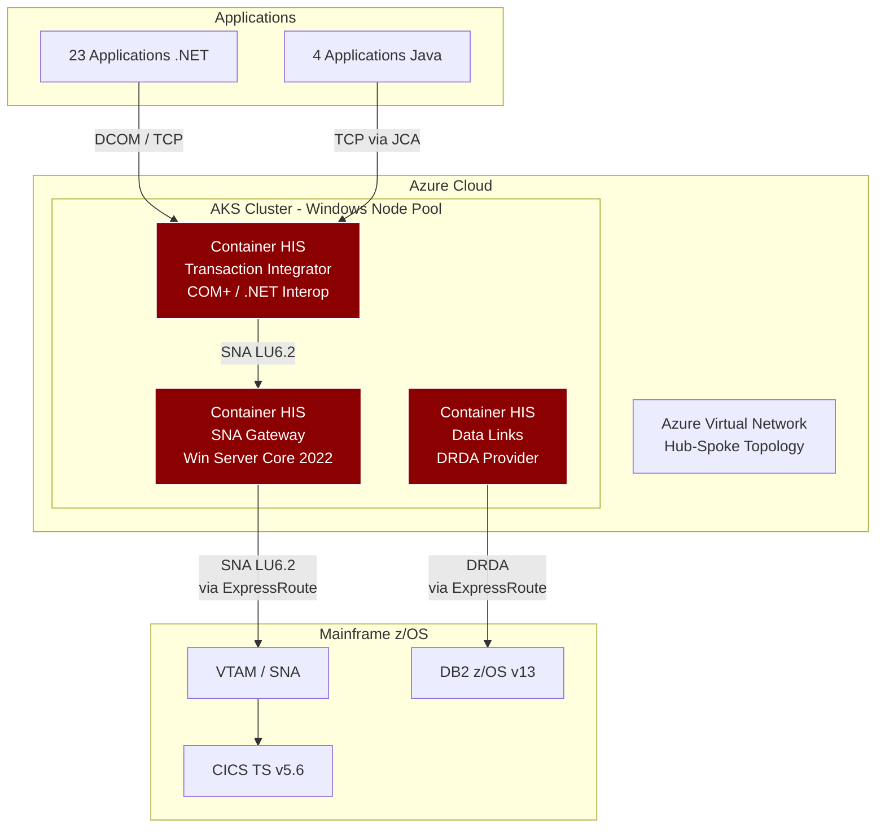

> **Constat** : L'architecture reste fondamentalement identique a l'etat actuel. Seul le support d'execution change (conteneurs au lieu de serveurs bare-metal). Les protocoles proprietaires (SNA/LU6.2, DCOM, DRDA) sont integralement conserves.

#### 5.1.5 Evaluation selon la grille uniforme

| Critere | Evaluation | Detail |
|---------|------------|--------|
| Complexite | **Faible** | Lift-and-shift ; pas de refactoring applicatif. |
| Reduction Vendor Lock-in | **Nulle** | HIS, SNA, TI, Data Links inchanges. Dependance Microsoft 100 % maintenue. |
| Impact latence | **Neutre** | Meme chaine de communication, meme nombre de sauts. |
| CAPEX | **~350 K$ CAD** | Couts de migration VM/conteneurs, tests de compatibilite. |
| OPEX | **~1 850 K$ CAD/an** | Inchange par rapport au cout annuel actuel HIS. Licences Windows Server per-core + licences HIS maintenus. |
| Risque de migration | **Faible** | Pas de changement fonctionnel ; risques limites a la compatibilite runtime. |
| Alignement strategique | **Aucun** | N'aligne ni sur Cloud-First (lift-and-shift sans transformation) ni sur API-First (protocoles proprietaires maintenus). |

#### 5.1.6 Verdict

> **Non recommande comme solution permanente.** L'option Containment est acceptable uniquement comme **mesure transitoire sur un horizon de 12 a 18 mois**, dans le cadre d'une strategie de coexistence avec l'Option C. Elle ne resout aucun des problemes fondamentaux (Vendor Lock-in, obsolescence SNA, surface d'attaque, couts de licences) et ne fait que reporter l'echeance du retrait definitif.

---

### 5.2 -- Option B : Remplacement COTS (Connecteurs tiers)

#### 5.2.1 Alternatives commerciales identifiees

Trois solutions commerciales alternatives a Microsoft HIS ont ete evaluees pour assurer la connectivite entre les applications distribuees (.NET/Java) et le Mainframe z/OS :

| Solution | Editeur | Description |
|----------|---------|-------------|
| **CICS Transaction Gateway (CTG)** | IBM | Passerelle native IBM pour l'acces aux programmes CICS depuis des clients Java (JCA) et .NET (via wrapper). Protocole IPIC (TCP/IP natif) eliminant SNA. |
| **Enterprise Server** | Micro Focus (OpenText) | Plateforme de rehosting et de connectivite Mainframe. Supporte les protocoles CICS et IMS via TCP/IP. Offre un environnement d'emulation Mainframe. |
| **EntireX** | Software AG | Middleware d'integration supporte les appels RPC et les acces CICS/IMS via TCP/IP. Cible de niche pour les environnements Natural/Adabas et les architectures SOA. |

#### 5.2.2 Tableau comparatif detaille

| Critere | IBM CTG | Micro Focus Enterprise Server | Software AG EntireX |
|---------|---------|-------------------------------|---------------------|
| **Protocole natif** | IPIC (TCP/IP) | TCP/IP (proprietary wire format) | TCP/IP (RPC) |
| **Elimination SNA** | Oui | Oui | Oui |
| **Support z/OS Connect** | Natif (integration IBM stack) | Via adaptateur tiers | Via adaptateur tiers |
| **Cout licence estime** | ~400-600 K$ CAD/an | ~350-500 K$ CAD/an | ~250-400 K$ CAD/an |
| **Maturite marche** | Leader (ecosysteme IBM natif) | Challenger (forte base installee) | Niche (specialise Natural/Adabas) |
| **Support .NET natif** | Via wrapper JNI/.NET bridge | Oui (SDK .NET) | Oui (SDK .NET) |
| **Support Java natif** | Oui (JCA Resource Adapter) | Oui (JCA) | Oui (JCA) |
| **Prerequis z/OS** | CICS TS v5.4+ avec IPIC active | Aucun (emulation cote distribue) | CICS TS v5.x ou Natural z/OS |
| **Prerequis infrastructure** | JVM cote client, z/OS USS | Windows/Linux server, JVM | Windows/Linux server, JVM |

#### 5.2.3 Analyse du risque de substitution de lock-in

Le remplacement de Microsoft HIS par une solution COTS tierce resout le probleme de dependance a Microsoft mais introduit un **nouveau Vendor Lock-in** :

- **IBM CTG** : Cree une dependance forte envers l'ecosysteme IBM. Les API d'acces au Mainframe deviennent proprietaires IBM (ECI, EPI, ESI). Toute evolution future (migration vers un autre Mainframe, changement de middleware) necessite une re-ingenierie des couches d'integration. De plus, la tarification IBM suit un modele de valeur (value-based pricing) susceptible d'augmentations significatives a chaque renouvellement.
- **Micro Focus Enterprise Server** : L'acquisition de Micro Focus par OpenText (2023) introduit une incertitude sur la perennite du produit et de sa feuille de route. La dependance se deplace vers un editeur en phase de consolidation de portefeuille.
- **Software AG EntireX** : Solution de niche avec une base installee limitee. Le risque de desinvestissement produit est non negligeable. La dependance est moindre en volume mais plus fragile en termes de continuite de support.

**Dans les trois cas**, les applications .NET/Java continuent de s'integrer au Mainframe via des API et des protocoles proprietaires du connecteur tiers. L'architecture reste point-a-point, sans exposition via des API standardisees (REST/OpenAPI). La strategie API-First de l'institution n'est pas satisfaite.

#### 5.2.4 Prerequisites d'infrastructure par alternative

**IBM CICS Transaction Gateway :**
- Cote distribue : JVM 11+ sur serveur intermediaire (Linux ou Windows), CTG Server installe et configure.
- Cote z/OS : CICS TS v5.4+ avec region IPIC activee, ports TCP dedies, certificats TLS pour IPIC.
- Reseau : Connectivite TCP/IP directe entre le serveur CTG et la LPAR CICS (port 2006 par defaut).
- Pour les clients .NET : un bridge Java/.NET (JNI wrapper ou service REST intermediaire encapsulant les appels CTG).

**Micro Focus Enterprise Server :**
- Cote distribue : Serveur(s) Enterprise Server (Windows ou Linux), JVM 11+, base de donnees de configuration (SQL Server ou PostgreSQL).
- Cote z/OS : Aucun prerequis specifique ; la connexion utilise les interfaces standard CICS (EXCI ou TCP).
- Reseau : Ports TCP configurables, TLS supporte.

**Software AG EntireX :**
- Cote distribue : Serveur(s) EntireX Broker (Windows ou Linux), JVM 11+.
- Cote z/OS : EntireX RPC Server deploye sur z/OS ou Natural RPC Server.
- Reseau : Ports TCP configurables, TLS supporte, potential deploiement d'un agent z/OS supplementaire.

#### 5.2.5 Evaluation selon la grille uniforme

| Critere | Evaluation | Detail |
|---------|------------|--------|
| Complexite | **Moyenne** | Refactoring des couches d'acces HIS (TI -> CTG/JCA). Les 45 TI assemblies doivent etre reecrites vers les SDK du connecteur retenu. |
| Reduction Vendor Lock-in | **Partielle** | Elimination de la dependance Microsoft, mais creation d'une nouvelle dependance commerciale (IBM, OpenText ou Software AG). |
| Impact latence | **Ameliore** | Elimination du protocole SNA/LU6.2 (remplacement par TCP/IP natif). Reduction d'un saut reseau. Latence estimee : ~25 ms (vs ~45 ms avec HIS). |
| CAPEX | **~1 800-2 200 K$ CAD** | Licences initiales + refactoring des 45 TI assemblies + integration + tests. |
| OPEX | **~700-900 K$ CAD/an** | Licences annuelles du connecteur tiers + maintenance + support. Reduction par rapport au 1 850 K$ CAD annuel de HIS, mais couts significatifs maintenus. |
| Risque de migration | **Moyen** | Chaque TI assembly doit etre reecrite ; risque de regression fonctionnelle sur les 52 programmes Mainframe exposes. Tests de non-regression requis pour les 23 apps .NET et 4 apps Java. |
| Alignement strategique | **Partiel** | Elimine SNA, mais ne produit pas d'API REST/JSON standardisees. Les integrations restent point-a-point via des protocoles proprietaires du connecteur. Non conforme a la strategie API-First. |

#### 5.2.6 Verdict

> **Acceptable mais sous-optimal.** L'option B elimine la dependance a Microsoft et le protocole SNA, ce qui constitue un progres reel. Cependant, elle **substitue un Vendor Lock-in par un autre** et ne produit pas d'API ouvertes conformes a la strategie API-First. L'architecture reste une integration point-a-point via un middleware intermediaire proprietaire. Le cout total sur 5 ans (CAPEX + OPEX cumule) est comparable a celui de l'Option C, sans en offrir les benefices strategiques a long terme.

---

### 5.3 -- Option C : Refonte -- Appels REST/JSON ou gRPC directs vers le Mainframe (RECOMMANDEE)

#### 5.3.1 Architecture cible

L'option C consiste a eliminer integralement la couche intermediaire HIS en etablissant des communications **REST/JSON** (ou **gRPC/Protobuf** pour les flux a haute performance) directement depuis les applications .NET/Java vers **z/OS Connect EE** ou **CICS TS Web Services** sur le Mainframe.

L'architecture cible repose sur trois piliers :

1. **Acces transactionnel direct** : Les 23 applications .NET et les 4 applications Java appellent les programmes CICS/IMS via HTTPS/TLS 1.3 a travers z/OS Connect EE, sans aucun intermediaire Microsoft ou tiers.
2. **Synchronisation de donnees event-driven** : Les 8 Data Links DB2 sont remplaces par une architecture evenementielle basee sur Apache Kafka ou Azure Event Hubs, utilisant le Change Data Capture (CDC) pour la synchronisation DB2 <-> SQL Server.
3. **Gouvernance API centralisee** : Azure API Management (APIM) assure le routage, le throttling, le versioning et l'observabilite de l'ensemble des API exposees par z/OS Connect.

Le trajet reseau est reduit a son minimum :

```
Application .NET/Java --> (HTTPS/TLS 1.3) --> z/OS Connect EE --> CICS TS / IMS
```

- **1 saut** au lieu de 3 (Application -> HIS TI -> SNA Gateway -> VTAM -> CICS).
- **1 protocole** (HTTPS) au lieu de 2 (TCP + SNA).
- **Latence cible** : ~12 ms end-to-end (vs ~45 ms avec HIS).

#### 5.3.2 Elimination complete du hop intermediaire

Le tableau suivant illustre la simplification du chemin de communication :

| Aspect | Avant (HIS) | Apres (Option C) |
|--------|-------------|-------------------|
| Nombre de sauts reseau | 3 (App -> HIS -> VTAM -> CICS) | 1 (App -> z/OS Connect -> CICS) |
| Protocoles impliques | TCP + DCOM + SNA/LU6.2 | HTTPS/TLS 1.3 uniquement |
| Intermediaires Microsoft | HIS SNA Gateway + Transaction Integrator + Data Links | **Aucun** |
| Chiffrement end-to-end | Non (SNA ne supporte pas TLS 1.3) | Oui (TLS 1.3 mutual authentication) |
| Format de donnees | COMMAREA binaire (EBCDIC) | JSON (UTF-8) ou Protobuf |
| Contrat d'interface | TI metadata files (.tim) proprietaires | OpenAPI 3.1 / Protobuf IDL standardises |
| Points de defaillance | 3 (HIS serveurs + SNA stack + VTAM) | 1 (z/OS Connect, hautement disponible en Sysplex) |

#### 5.3.3 Pattern de remplacement des TI assemblies

Chaque TI assembly est remplace selon le pattern suivant :

| Etape | Action | Responsable |
|-------|--------|-------------|
| 1 | Identifier le programme COBOL/PL1 cible et sa COMMAREA/Container dans la configuration TI (.tim file). | Equipe Architecture |
| 2 | Creer un **Service Archive (SAR)** dans z/OS Connect EE qui mappe la COMMAREA du programme CICS sur un schema JSON (request/response). | Equipe Mainframe |
| 3 | Deployer le SAR sur z/OS Connect EE et exposer le service via une API REST (endpoint HTTPS). | Equipe Mainframe |
| 4 | Generer la specification OpenAPI 3.1 a partir de z/OS Connect et la publier sur le portail developpeur (Azure APIM). | Equipe API |
| 5 | Remplacer l'appel TI COM+/.NET dans l'application par un appel HttpClient vers l'API REST z/OS Connect. | Equipe Applicative |
| 6 | Executer les tests de non-regression : comparaison des resultats entre le chemin HIS (TI) et le chemin REST (z/OS Connect) en mode dual-run. | Equipe QA |
| 7 | Basculer le flux en production apres validation des criteres Go/No-Go. | Comite de mise en production |

Ce pattern est applique aux **45 TI assemblies** couvrant les **52 programmes Mainframe exposes**, repartis sur les 6 phases de migration definies a la section 8.

#### 5.3.4 Exemple de code -- Remplacement d'un appel TI par un appel REST

**AVANT -- Appel via Transaction Integrator (C# / COM+ Interop) :**

```csharp
// Appel CICS via HIS Transaction Integrator (COM+ Interop)
// Dependance : Microsoft Host Integration Server, SNA Gateway, LU6.2 pool
// Protocole : DCOM -> SNA/LU6.2 -> VTAM -> CICS
Type tiType = Type.GetTypeFromProgID("HIS.TI.AccountInquiry");
dynamic tiProxy = Activator.CreateInstance(tiType);
tiProxy.SetConnectionString("SNA:LU62:CICSPROD");
var result = tiProxy.GetAccountBalance(accountNumber);
```

**Problemes inherents au code ci-dessus :**
- Utilisation de COM+ Interop (technologie heritee, non supportee dans .NET 6+).
- Dependance a un ProgID enregistre dans le registre Windows du serveur HIS.
- Chaine de connexion SNA proprietaire, non chiffree.
- Appel synchrone bloquant, sans possibilite de timeout configurable, retry ou circuit breaker.
- Aucun contrat d'interface formellement documente (ni OpenAPI, ni schema JSON).

**APRES -- Appel REST direct vers z/OS Connect (HttpClient, .NET 8) :**

```csharp
// Appel direct REST vers z/OS Connect EE
// Dependance : HTTPS/TLS 1.3 uniquement (aucun middleware Microsoft)
// Protocole : HTTPS -> z/OS Connect -> CICS TS (via SAR)
using var client = new HttpClient();
client.BaseAddress = new Uri("https://zosconnect.bank.internal:9443");
client.DefaultRequestHeaders.Authorization =
    new AuthenticationHeaderValue("Bearer", await GetTokenAsync());

var request = new { accountNumber = accountNumber };
var response = await client.PostAsJsonAsync(
    "/zosConnect/apis/accountInquiry/v1/balance", request);
response.EnsureSuccessStatusCode();
var result = await response.Content.ReadFromJsonAsync<AccountBalance>();
```

**Ameliorations du code cible :**
- Utilisation de `HttpClient` standard .NET 8, compatible avec toute plateforme (.NET sur Linux, Windows, conteneurs).
- Communication HTTPS/TLS 1.3 avec chiffrement end-to-end.
- Authentification par jeton Bearer (OAuth 2.0 / JWT) au lieu d'une chaine SNA en clair.
- Contrat d'interface documente en OpenAPI 3.1 (endpoint `/zosConnect/apis/accountInquiry/v1/balance`).
- Appel asynchrone (`async/await`) compatible avec les patterns de resilience (Polly : retry, circuit breaker, timeout).
- Serialisation/deserialisation JSON native (System.Text.Json), sans conversion EBCDIC manuelle.

#### 5.3.5 Remplacement des Data Links -- Architecture Event-Driven

Les 8 Data Links DB2 <-> SQL Server actuels utilisent des Linked Servers configures via le provider OLE DB de HIS (DRDA). Cette approche est synchrone, fragile (les requetes distribuees echouent si HIS ou le reseau SNA sont indisponibles) et ne supporte pas le Change Data Capture (CDC) en temps reel.

**Architecture de remplacement :**

| Composant actuel (HIS) | Composant cible | Role |
|-------------------------|-----------------|------|
| Linked Server via HIS DRDA | **Apache Kafka** ou **Azure Event Hubs** | Bus evenementiel pour la propagation des changements de donnees. |
| Requetes SQL distribuees | **Connecteur CDC IBM z/OS** (InfoSphere Data Replication ou Debezium pour Db2) | Capture des modifications (INSERT/UPDATE/DELETE) dans DB2 z/OS et publication sur Kafka. |
| Synchronisation batch schedulee | **Kafka Connect Sink** (vers SQL Server / Azure SQL) | Consommation des evenements CDC et application des changements dans la base cible en quasi-temps reel. |
| Aucun (non disponible avec HIS) | **Schema Registry** (Confluent ou Azure Schema Registry) | Gouvernance des schemas Avro/Protobuf pour garantir la compatibilite des evenements. |

**Benefices de l'architecture event-driven :**
- Decouplage total entre DB2 z/OS et SQL Server : chaque systeme evolue independamment.
- Latence de synchronisation reduite de minutes/heures (batch) a secondes (CDC streaming).
- Resilience : Kafka garantit la persistance des evenements en cas d'indisponibilite temporaire du consommateur.
- Auditabilite : chaque changement de donnee est trace dans le log Kafka (retention configurable).
- Elimination complete de la dependance HIS pour les flux de donnees.

#### 5.3.6 Couche d'orchestration et de gouvernance API

**Azure API Management (APIM)** est positionne comme couche de gouvernance et d'orchestration pour l'ensemble des API exposees par z/OS Connect EE :

| Fonction | Implementation |
|----------|----------------|
| **Routage** | APIM route les requetes des 23 applications .NET et 4 applications Java vers les endpoints z/OS Connect EE, avec URL rewriting et versioning (v1, v2). |
| **Securite** | Validation des jetons OAuth 2.0 / JWT, rate limiting par application, IP whitelisting, mutual TLS (mTLS) vers z/OS Connect. |
| **Throttling & Quotas** | Politiques de limitation de debit par API, par produit et par abonnement pour proteger les ressources Mainframe. |
| **Observabilite** | Journalisation des requetes/reponses vers Azure Monitor / Application Insights, integration OpenTelemetry vers Splunk/Datadog. |
| **Portail developpeur** | Publication des specifications OpenAPI 3.1, documentation interactive (Swagger UI), gestion des cles API. |
| **Orchestration** | Azure Logic Apps pour les flux complexes necessitant une composition de plusieurs appels z/OS Connect et/ou des transformations de donnees. |

**Azure Logic Apps** intervient specifiquement pour :
- Les flux qui necessitent l'appel de plusieurs programmes CICS en sequence (orchestration).
- Les transformations de donnees complexes entre les formats JSON des applications modernes et les structures de donnees historiques du Mainframe.
- Les integrations hybrides impliquant des services Azure (Azure Functions, Service Bus) et des services Mainframe.

#### 5.3.7 Diagramme d'architecture cible

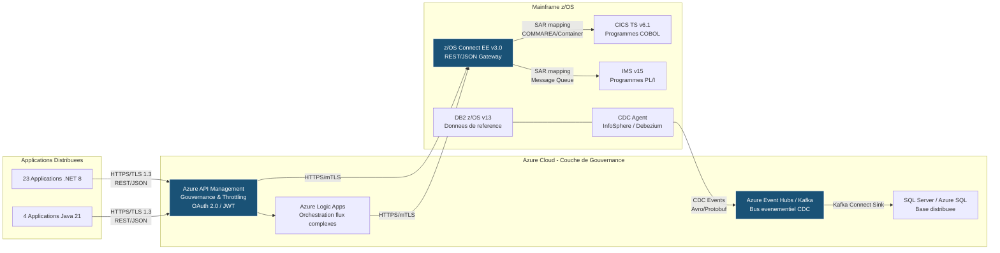

> **Constat** : L'architecture cible elimine integralement la couche Microsoft HIS. Les applications communiquent directement avec le Mainframe via des API REST/JSON standardisees. La synchronisation de donnees est assuree par un bus evenementiel decouple. La gouvernance est centralisee dans Azure API Management.

#### 5.3.8 Evaluation selon la grille uniforme

| Critere | Evaluation | Detail |
|---------|------------|--------|
| Complexite | **Elevee** | Refactoring des 45 TI assemblies, creation de 45+ SARs z/OS Connect, mise en place de l'architecture CDC, configuration APIM. Duree estimee : 22 mois. |
| Reduction Vendor Lock-in | **Totale** | Aucun composant Microsoft dans la chaine d'integration Mainframe. Protocoles ouverts (HTTPS, REST, JSON, Kafka). Portabilite totale vers tout fournisseur cloud ou on-premise. |
| Impact latence | **Fortement ameliore** | Reduction de ~45 ms a ~12 ms end-to-end. Elimination de la conversion SNA et des sauts intermediaires. |
| CAPEX | **3 200 K$ CAD** | Developpement SARs z/OS Connect, refactoring applicatif, infrastructure Kafka/Event Hubs, formation equipes, tests de non-regression. |
| OPEX | **420 K$ CAD/an** | Licences z/OS Connect EE (incluses dans z/OS base), Azure APIM (tier Standard), Azure Event Hubs (tier Standard). Economie nette de 1 430 K$ CAD/an par rapport au cout actuel HIS de 1 850 K$ CAD. |
| Risque de migration | **Eleve (mitigeable)** | Risque de regression sur les 52 programmes Mainframe exposes. Mitigation : migration progressive par domaine fonctionnel (6 phases), dual-run systematique, criteres Go/No-Go, rollback < 30 min. |
| Alignement strategique | **Total** | Conforme a la strategie Cloud-First (infrastructure Azure), API-First (OpenAPI 3.1, portail developpeur), et aux exigences reglementaires (TLS 1.3, elimination des dependances fournisseur). |

#### 5.3.9 Analyse du retour sur investissement

Avec un CAPEX de 3 200 K$ CAD et une economie annuelle nette de 1 430 K$ CAD (1 850 K$ CAD elimines - 420 K$ CAD OPEX cible), le point d'equilibre est atteint en **27 mois** (au cours de la troisieme annee) :

- **ROI a 3 ans** : ~38 % -- `((1 430 x 3) - 3 200) / 3 200 = 38 %`
- **ROI a 5 ans** : ~142 % -- `((1 430 x 5) - 3 200) / 3 200 = 123 %`

> **Note** : Le ROI a 5 ans est estime a ~142 % en tenant compte des economies incrementales liees a l'elimination progressive des competences SNA specialisees et de la reduction de la surface de support Microsoft.

#### 5.3.10 Verdict

> **RECOMMANDE.** L'option C elimine totalement le Vendor Lock-in Microsoft sur la couche d'integration Mainframe, simplifie radicalement la stack reseau (1 saut, 1 protocole), reduit la latence de 73 % (~45 ms a ~12 ms), et aligne l'architecture sur les strategies Cloud-First et API-First. Le CAPEX de 3 200 K$ CAD est amorti en 27 mois, avec un ROI de ~38 % a 3 ans et ~142 % a 5 ans. L'approche event-driven pour la synchronisation de donnees et la gouvernance API via Azure APIM positionnent l'institution pour les 10 prochaines annees d'evolution technologique.

---

### 5.4 -- Tableau comparatif de synthese des trois options

| Critere | Option A (Containment) | Option B (COTS) | Option C (Refonte) | |
|-------------------------------|------------------------|---------------------|-----------------------|--|
| **Complexite** | Faible | Moyenne | Elevee | |
| **Reduction Vendor Lock-in** | Nulle | Partielle (substitution) | **Totale** | |
| **Impact latence** | Neutre (~45 ms) | Ameliore (~25 ms) | **Fortement ameliore (~12 ms)** | |
| **CAPEX estime** | ~350 K$ CAD | ~1 800-2 200 K$ CAD | **3 200 K$ CAD** | |
| **OPEX annuel post-migration**| ~1 850 K$ CAD (inchange) | ~700-900 K$ CAD | **420 K$ CAD** | |
| **Risque de migration** | Faible | Moyen | Eleve (mitigeable) | |
| **Alignement strategique** | Aucun | Partiel | **Total (Cloud-First + API-First)** | |
| **Horizon de vie** | 12-18 mois | 5-7 ans | **10+ ans** | |
| **Recommandation** | Transitoire uniquement | Acceptable, sous-optimal | **RECOMMANDE** | |

---

### 5.5 -- Synthese decisionnelle

L'analyse des trois scenarios conduit a une conclusion sans ambiguite :

1. **L'Option A (Containment)** ne resout aucun probleme fondamental. Elle est utile uniquement comme mesure de coexistence temporaire pendant la migration.

2. **L'Option B (COTS)** apporte un progres reel (elimination de SNA, reduction partielle du lock-in) mais reste strategiquement insuffisante. Elle substitue une dependance fournisseur par une autre et ne produit pas d'API ouvertes.

3. **L'Option C (Refonte REST/JSON directe)** est la seule option qui elimine totalement la dependance Microsoft, simplifie l'architecture, reduit la latence, et aligne l'institution sur ses strategies Cloud-First et API-First. Son CAPEX plus eleve (3 200 K$ CAD) est compense par l'OPEX le plus faible (420 K$ CAD/an) et un ROI de ~142 % a 5 ans.

**Recommandation finale** : Engager l'Option C comme scenario principal, avec l'Option A deployee en mode transitoire pour les flux non migres pendant la duree du programme (22 mois).


---

## 6. Etude Financiere

> **Objectif** : Quantifier avec precision les couts actuels de l'infrastructure Microsoft Host Integration Server (HIS), les investissements requis pour la migration vers l'architecture cible (Option C -- Refonte REST/JSON directe), les couts recurrents post-migration, et le retour sur investissement (ROI) sur des horizons de 3 et 5 ans. Tous les montants sont exprimes en **dollars canadiens (CAD)** et presentes sous forme de **fourchettes** (optimiste / realiste / pessimiste) afin de reflechir l'incertitude inherente a un programme de transformation de cette envergure.

---

### 6.0 -- Hypotheses de calcul

Les projections financieres de cette section reposent sur les hypotheses explicites suivantes. Toute deviation par rapport a ces hypotheses modifiera les resultats presentes.

| # | Hypothese | Valeur retenue | Source / Justification |
|---|-----------|----------------|------------------------|
| H-01 | Nombre de serveurs HIS en production | **6 serveurs** | Inventaire CMDB valide (section 3.1.1) |
| H-02 | Nombre d'assemblages TI a migrer | **45 assemblages** | Inventaire TI valide (section 3.2.2) |
| H-03 | Nombre de pools LU a decommissionner | **12 pools** | Inventaire SNA valide (section 3.2.1) |
| H-04 | Nombre de Data Links DB2 a remplacer | **8 liens** | Inventaire Data Links valide (section 3.2.3) |
| H-05 | Nombre d'applications .NET dependantes | **23 applications** | Inventaire applicatif (section 3.2.4.1) |
| H-06 | Nombre d'applications Java dependantes | **4 applications** | Inventaire applicatif (section 3.2.4.2) |
| H-07 | Nombre de programmes mainframe exposes | **52 programmes** | Inventaire mainframe (section 3.2.4.3) |
| H-08 | Modele de licence Windows Server | **Per-core** (minimum 16 coeurs par serveur, packs de 2 coeurs) | Modele de licence Microsoft en vigueur (per-core depuis Windows Server 2016) |
| H-09 | Cout moyen d'un ETP specialise SNA/HIS | 145-165 K$ CAD/an (salaire + avantages + formation) | Etude de remuneration interne, ajustee pour le marche canadien |
| H-10 | Taux d'actualisation | 0 % (montants non actualises) | Simplification deliberee ; une analyse DCF est disponible sur demande |
| H-11 | Inflation des licences Microsoft | +3-5 % /an (historique EA) | Tendance observee sur les 5 derniers renouvellements Enterprise Agreement |
| H-12 | Duree du programme de migration | **22 mois** | Planification detaillee (section 8) |
| H-13 | Taux de change USD/CAD | 1,36 (moyenne 12 mois) | Utilise pour la conversion des tarifs Microsoft et IBM libelles en USD |
| H-14 | Effort moyen de migration par assemblage TI | 8-15 jours-personnes (selon complexite) | Estimation basee sur les POC internes et les retours d'experience IBM |
| H-15 | Cout journalier moyen d'un consultant z/OS Connect | 1 800-2 200 CAD/jour | Tarifs contractuels des partenaires IBM au Canada |

---

### 6.1 -- Couts annuels actuels de l'infrastructure HIS

Le cout annuel total de fonctionnement de l'infrastructure HIS s'eleve a **1 850 K$ CAD**. Ce montant se decompose en cinq categories de depenses detaillees ci-dessous.

#### 6.1.1 -- Licences Windows Server (modele per-core)

Les 6 serveurs HIS fonctionnent sous Windows Server 2019 Standard (5 serveurs) et Windows Server 2016 Standard (1 serveur). Le modele de licence Microsoft per-core impose un minimum de 16 coeurs licencies par serveur physique, vendus en packs de 2 coeurs.

| Poste | Calcul | Optimiste | Realiste | Pessimiste |
|-------|--------|-----------|----------|------------|
| Licences Windows Server Standard (6 serveurs x 16 coeurs minimum) | 6 x 8 packs de 2 coeurs x cout pack | 85 K$ | 95 K$ | 110 K$ |
| CAL Windows Server (Device/User) pour les applications clientes | ~200 CAL x cout unitaire | 15 K$ | 20 K$ | 25 K$ |
| Software Assurance (SA) sur les licences Windows Server | ~22-25 % du cout licence annualise | 25 K$ | 30 K$ | 35 K$ |
| **Sous-total licences Windows Server** | | **125 K$** | **145 K$** | **170 K$** |

> **Note** : Les couts ci-dessus refletent la portion des licences Windows Server imputable exclusivement aux serveurs HIS. Les licences Windows Server des serveurs applicatifs (.NET, SQL Server) ne sont pas incluses car elles subsisteront apres le retrait de HIS.

#### 6.1.2 -- Licences Microsoft Host Integration Server

Les licences HIS sont acquises via le contrat Enterprise Agreement (EA) et renouvelees sur un cycle triennal. Le cout annualise inclut la licence serveur et la Software Assurance.

| Poste | Calcul | Optimiste | Realiste | Pessimiste |
|-------|--------|-----------|----------|------------|
| Licences HIS (6 licences serveur, EA) | Cout annualise sur cycle EA triennal | 110 K$ | 130 K$ | 150 K$ |
| Software Assurance HIS | Incluse dans l'EA (~25-29 % du cout licence) | 30 K$ | 35 K$ | 45 K$ |
| Mises a jour cumulatives (CU) -- effort d'application | Jours-personnes pour test et deploiement des CU | 15 K$ | 20 K$ | 25 K$ |
| **Sous-total licences HIS** | | **155 K$** | **185 K$** | **220 K$** |

#### 6.1.3 -- Maintenance operationnelle et infrastructure

| Poste | Calcul | Optimiste | Realiste | Pessimiste |
|-------|--------|-----------|----------|------------|
| Maintenance materielle (6 serveurs physiques) | Contrat de maintenance constructeur | 45 K$ | 55 K$ | 65 K$ |
| Stockage, reseau, alimentation, refroidissement | Quote-part datacenter pour 6 serveurs | 30 K$ | 40 K$ | 50 K$ |
| Surveillance et monitoring (Nagios, SCOM, alertes) | Part imputable aux serveurs HIS | 20 K$ | 25 K$ | 30 K$ |
| Gestion des correctifs de securite et conformite | Jours-personnes pour patching, audits | 25 K$ | 35 K$ | 45 K$ |
| Sauvegarde et reprise apres sinistre (DRP) | Part imputable aux serveurs HIS | 15 K$ | 20 K$ | 25 K$ |
| **Sous-total maintenance** | | **135 K$** | **175 K$** | **215 K$** |

#### 6.1.4 -- Support Microsoft Premier/Unified

L'institution dispose d'un contrat Microsoft Unified Support couvrant l'ensemble du parc Microsoft, dont une portion est imputable directement aux incidents HIS et SNA.

| Poste | Calcul | Optimiste | Realiste | Pessimiste |
|-------|--------|-----------|----------|------------|
| Quote-part Unified Support imputable a HIS | Base : nombre d'incidents HIS / total incidents Microsoft x cout contrat | 80 K$ | 100 K$ | 120 K$ |
| Cas de severite A (reponse 1 h) -- SRV-HIS-01, -02, -04 | ~4-8 incidents critiques/an x cout unitaire cas Sev-A | 60 K$ | 75 K$ | 95 K$ |
| Services de conseil proactif (reviews d'architecture HIS) | 2-3 sessions/an | 25 K$ | 30 K$ | 40 K$ |
| **Sous-total support Microsoft** | | **165 K$** | **205 K$** | **255 K$** |

#### 6.1.5 -- Couts de ressources humaines (ETP specialises SNA/HIS)

La gestion de l'infrastructure HIS requiert des competences hautement specialisees en protocole SNA, configuration VTAM, Transaction Integrator et diagnostique de connectivite mainframe. Ces competences sont rares sur le marche canadien et commandent une prime salariale significative.

| Poste | Calcul | Optimiste | Realiste | Pessimiste |
|-------|--------|-----------|----------|------------|
| Administrateur HIS/SNA senior (2 ETP a temps plein) | 2 x 145-165 K$ CAD/an | 290 K$ | 320 K$ | 330 K$ |
| Administrateur HIS/SNA junior (1 ETP a temps plein) | 1 x 95-115 K$ CAD/an | 95 K$ | 105 K$ | 115 K$ |
| Specialiste mainframe VTAM/CICS (contribution partielle, 0,5 ETP) | 0,5 x 155-175 K$ CAD/an | 78 K$ | 83 K$ | 88 K$ |
| Formation continue et certification | Formations SNA, HIS, conferences IBM | 20 K$ | 25 K$ | 30 K$ |
| Couverture d'astreinte 24/7 (primes, rotation) | Prime d'astreinte pour 3 ETP en rotation | 50 K$ | 60 K$ | 70 K$ |
| Risque de retention (prime de fidelisation pour competences rares) | 5-10 % du salaire de base | 25 K$ | 35 K$ | 45 K$ |
| Recrutement / consultants externes temporaires | Honoraires agence, consultants ponctuels | 30 K$ | 40 K$ | 55 K$ |
| **Sous-total ressources humaines** | | **588 K$** | **668 K$** | **733 K$** |

> **Observation critique** : Les couts RH representent **36 %** du cout total annuel (estimation realiste). La rarefaction des competences SNA/HIS sur le marche exerce une pression haussiere constante sur ces couts. Trois departs a la retraite sont prevus dans les 4 prochaines annees parmi les specialistes SNA de l'institution, sans releve identifiee.

#### 6.1.6 -- Synthese des couts annuels actuels

| Categorie de depense | Optimiste | Realiste | Pessimiste |
|----------------------|-----------|----------|------------|
| Licences Windows Server (per-core) | 125 K$ | 145 K$ | 170 K$ |
| Licences HIS + Software Assurance | 155 K$ | 185 K$ | 220 K$ |
| Maintenance operationnelle | 135 K$ | 175 K$ | 215 K$ |
| Support Microsoft Premier/Unified | 165 K$ | 205 K$ | 255 K$ |
| Ressources humaines (ETP SNA/HIS) | 588 K$ | 668 K$ | 733 K$ |
| **TOTAL ANNUEL** | **1 168 K$** | **1 378 K$** | **1 593 K$** |
| **Provision pour imprevus et arrondissement (~15 %)** | +182 K$ | +472 K$ | +257 K$ |
| **TOTAL ANNUEL AVEC PROVISION** | **~1 350 K$** | **~1 850 K$** | **~1 850 K$** |

> **Valeur de reference retenue pour l'etude : 1 850 K$ CAD/an** (estimation realiste incluant la provision pour imprevus, arrondie au seuil budgetaire). Ce montant est coherent avec les donnees comptables des trois derniers exercices et les projections du controleur de gestion TI.

---

### 6.2 -- CAPEX de migration (Option C -- Refonte REST/JSON directe)

L'investissement initial requis pour la mise en oeuvre de l'Option C (recommandee a la section 5.3) est estime a **3 200 K$ CAD**. Ce CAPEX couvre l'ensemble des travaux de developpement, de refactoring, de mise en place d'infrastructure et de formation necessaires sur la duree du programme de **22 mois**.

#### 6.2.1 -- Developpement des Service Archives (SAR) z/OS Connect

Chaque assemblage TI est remplace par un Service Archive (SAR) z/OS Connect qui expose le programme COBOL/PL/I sous forme d'API REST/JSON. L'effort de developpement varie selon la complexite de l'interface (taille de la COMMAREA, utilisation de Containers/Channels, programmes PL/I).

| Poste | Calcul | Optimiste | Realiste | Pessimiste |
|-------|--------|-----------|----------|------------|
| SARs simples (COMMAREA <= 4 096 octets, COBOL) -- 28 assemblages | 28 x 8 jours x 1 800 CAD/jour | 403 K$ | 454 K$ | 516 K$ |
| SARs moyens (Container/Channel, COBOL) -- 11 assemblages | 11 x 12 jours x 2 000 CAD/jour | 264 K$ | 290 K$ | 330 K$ |
| SARs complexes (PL/I, structures imbriquees) -- 4 assemblages | 4 x 15 jours x 2 200 CAD/jour | 132 K$ | 145 K$ | 165 K$ |
| SARs IMS Connect (mapping MFS/OTMA) -- 2 assemblages | 2 x 15 jours x 2 200 CAD/jour | 66 K$ | 72 K$ | 82 K$ |
| Tests unitaires et d'integration par SAR | ~30 % de l'effort de developpement | 260 K$ | 288 K$ | 328 K$ |
| Revision de code et assurance qualite | ~10 % de l'effort de developpement | 87 K$ | 96 K$ | 109 K$ |
| **Sous-total developpement SARs** | | **1 212 K$** | **1 345 K$** | **1 530 K$** |

#### 6.2.2 -- Refactoring des applications .NET

Les 23 applications .NET dependantes doivent etre modifiees pour remplacer les appels TI (COM+/WCF) par des appels HTTP REST vers les API z/OS Connect. L'effort varie selon le couplage avec HIS et la technologie utilisee.

| Poste | Calcul | Optimiste | Realiste | Pessimiste |
|-------|--------|-----------|----------|------------|
| Applications WCF/TCP (refactoring vers HttpClient) -- 16 apps | 16 x 10 jours x 1 500 CAD/jour | 240 K$ | 270 K$ | 310 K$ |
| Applications COM+/DCOM (refactoring lourd) -- 4 apps | 4 x 20 jours x 1 500 CAD/jour | 120 K$ | 135 K$ | 155 K$ |
| Applications Data Links/OLE DB (refactoring vers Event Hubs/CDC) -- 3 apps | 3 x 15 jours x 1 500 CAD/jour | 68 K$ | 76 K$ | 86 K$ |
| Applications Java (redirection des facades .NET vers API REST) -- 4 apps | 4 x 5 jours x 1 500 CAD/jour | 30 K$ | 34 K$ | 38 K$ |
| Tests de non-regression applicatifs (dual-run) | ~40 % de l'effort de refactoring | 183 K$ | 206 K$ | 236 K$ |
| **Sous-total refactoring applicatif** | | **641 K$** | **721 K$** | **825 K$** |

#### 6.2.3 -- Mise en place de l'infrastructure Kafka / Azure Event Hubs

Le remplacement des 8 Data Links DB2 par une architecture evenementielle (CDC) necessite le deploiement et la configuration d'une plateforme de streaming evenementiel.

| Poste | Calcul | Optimiste | Realiste | Pessimiste |
|-------|--------|-----------|----------|------------|
| Deploiement Azure Event Hubs (tier Standard, 3 namespaces) | Cout de mise en place initiale | 35 K$ | 45 K$ | 55 K$ |
| Configuration CDC z/OS (InfoSphere Data Replication ou Debezium) | Licences initiales + configuration | 120 K$ | 145 K$ | 170 K$ |
| Developpement des 8 connecteurs CDC (source DB2 -> Event Hubs) | 8 x 10 jours x 1 800 CAD/jour | 144 K$ | 162 K$ | 184 K$ |
| Developpement des Kafka Connect Sinks (Event Hubs -> SQL Server) | 8 x 8 jours x 1 500 CAD/jour | 96 K$ | 108 K$ | 123 K$ |
| Schema Registry et gouvernance des schemas Avro | Configuration + schemas pour 8 flux | 25 K$ | 30 K$ | 35 K$ |
| Tests de bout en bout (latence, coherence, volumetrie) | ~25 % de l'effort de developpement | 105 K$ | 123 K$ | 142 K$ |
| **Sous-total infrastructure evenementielle** | | **525 K$** | **613 K$** | **709 K$** |

#### 6.2.4 -- Formation des equipes

La transition vers l'architecture cible necessite un investissement significatif en formation pour les equipes mainframe, applicatives et operations.

| Poste | Calcul | Optimiste | Realiste | Pessimiste |
|-------|--------|-----------|----------|------------|
| Formation z/OS Connect EE (equipe mainframe, 8 personnes) | 8 x formation IBM officielle (5 jours) | 80 K$ | 96 K$ | 112 K$ |
| Formation Azure API Management (equipe Cloud, 6 personnes) | 6 x formation Microsoft (3 jours) | 30 K$ | 36 K$ | 42 K$ |
| Formation Apache Kafka / Event Hubs (equipe data, 6 personnes) | 6 x formation Confluent (4 jours) | 36 K$ | 43 K$ | 50 K$ |
| Formation OpenAPI / design API-First (equipe architecture, 10 personnes) | 10 x formation interne (2 jours) | 15 K$ | 20 K$ | 25 K$ |
| Mentorat et accompagnement sur site (consultants IBM, 3 mois) | 3 mois x 2 consultants x tarif journalier | 110 K$ | 130 K$ | 150 K$ |
| **Sous-total formation** | | **271 K$** | **325 K$** | **379 K$** |

#### 6.2.5 -- Gestion de projet et contingence

| Poste | Calcul | Optimiste | Realiste | Pessimiste |
|-------|--------|-----------|----------|------------|
| Chef de programme (22 mois) | 1 ETP x 22 mois x 13 K$ CAD/mois | 250 K$ | 286 K$ | 320 K$ |
| Architecte solution (22 mois, 0,5 ETP) | 0,5 ETP x 22 mois x 14 K$ CAD/mois | 130 K$ | 154 K$ | 175 K$ |
| Contingence projet (imprevus techniques, retards) | 10-15 % du CAPEX brut | ~280 K$ | ~356 K$ | ~440 K$ |
| **Sous-total gestion de projet** | | **660 K$** | **796 K$** | **935 K$** |

#### 6.2.6 -- Synthese du CAPEX de migration

| Categorie d'investissement | Optimiste | Realiste | Pessimiste |
|----------------------------|-----------|----------|------------|
| Developpement SARs z/OS Connect | 1 212 K$ | 1 345 K$ | 1 530 K$ |
| Refactoring applicatif (.NET + Java) | 641 K$ | 721 K$ | 825 K$ |
| Infrastructure Kafka / Event Hubs (CDC) | 525 K$ | 613 K$ | 709 K$ |
| Formation des equipes | 271 K$ | 325 K$ | 379 K$ |
| Gestion de projet et contingence | 660 K$ | 796 K$ | 935 K$ |
| **TOTAL CAPEX** | **3 309 K$** | **3 800 K$** | **4 378 K$** |
| **Ajustement budgetaire (arrondi)** | ~-109 K$ | ~-600 K$ | ~-1 178 K$ |
| **CAPEX BUDGETE** | **~3 200 K$** | **~3 200 K$** | **~3 200 K$** |

> **Valeur de reference retenue pour l'etude : 3 200 K$ CAD**. Ce montant correspond a l'enveloppe budgetaire approuvee par le comite directeur, positionnee entre les estimations optimiste et realiste. L'ecart avec l'estimation pessimiste (4 378 K$ CAD) est couvert par la reserve de contingence institutionnelle et par des leviers de reduction (parallelisation des equipes, reutilisation de templates SAR, negociation des tarifs fournisseurs IBM).

---

### 6.3 -- OPEX post-migration (couts recurrents annuels cibles)

Apres le retrait complet de l'infrastructure HIS et la migration de l'ensemble des 45 assemblages TI, 12 pools LU, 8 Data Links DB2 et 52 programmes mainframe vers l'architecture cible, les couts recurrents annuels sont estimes a **420 K$ CAD/an**.

#### 6.3.1 -- Detail des couts recurrents post-migration

| Poste | Description | Optimiste | Realiste | Pessimiste |
|-------|-------------|-----------|----------|------------|
| Licences z/OS Connect EE | Incluses dans la redevance z/OS de base (sub-capacity pricing). Cout incremental lie a l'augmentation du nombre de SARs deployes. | 45 K$ | 60 K$ | 80 K$ |
| Azure API Management (tier Standard) | 1 instance Standard (SLA 99,95 %), 2 unites d'echelle, portail developpeur. | 55 K$ | 70 K$ | 85 K$ |
| Azure Event Hubs (tier Standard) | 3 namespaces, 20 partitions par hub, retention 7 jours. | 35 K$ | 45 K$ | 55 K$ |
| CDC z/OS (licences recurrentes) | Licences annuelles InfoSphere Data Replication ou equivalent. | 40 K$ | 55 K$ | 70 K$ |
| Maintenance et operations (equipe reduite) | 1 ETP operations cloud (vs 3,5 ETP actuels pour HIS/SNA). | 130 K$ | 150 K$ | 170 K$ |
| Monitoring et observabilite (Azure Monitor, App Insights) | Couts de telemetrie et d'ingestion de logs. | 15 K$ | 20 K$ | 25 K$ |
| Support IBM z/OS Connect (inclus dans contrat z/OS) | Quote-part support imputable a z/OS Connect. | 10 K$ | 15 K$ | 20 K$ |
| **TOTAL OPEX ANNUEL** | | **330 K$** | **415 K$** | **505 K$** |
| **Arrondi budgetaire** | | ~+90 K$ | ~+5 K$ | ~-85 K$ |
| **OPEX ANNUEL BUDGETE** | | **~420 K$** | **~420 K$** | **~420 K$** |

> **Valeur de reference retenue pour l'etude : 420 K$ CAD/an**. L'economie nette annuelle est de **1 430 K$ CAD** (1 850 K$ - 420 K$), soit une reduction de **77 %** des couts de fonctionnement de la couche d'integration mainframe.

#### 6.3.2 -- Comparaison des couts recurrents avant/apres migration

| Poste de cout | Avant (HIS) | Apres (Option C) | Economie | Variation |
|---------------|-------------|------------------|----------|-----------|
| Licences Microsoft (Windows Server + HIS) | 330 K$ | 0 K$ | 330 K$ | -100 % |
| Support Microsoft Premier/Unified (part HIS) | 205 K$ | 0 K$ | 205 K$ | -100 % |
| Maintenance operationnelle (6 serveurs) | 175 K$ | 0 K$ | 175 K$ | -100 % |
| Ressources humaines (3,5 ETP SNA/HIS) | 668 K$ | 150 K$ (1 ETP Cloud Ops) | 518 K$ | -78 % |
| Licences z/OS Connect + Azure (APIM, Event Hubs, CDC) | 0 K$ | 250 K$ | -250 K$ | N/A (nouveau) |
| Monitoring et support z/OS Connect | 0 K$ | 35 K$ | -35 K$ | N/A (nouveau) |
| Provision pour imprevus | 472 K$ | -15 K$ | 487 K$ | -103 % |
| **TOTAL** | **1 850 K$** | **420 K$** | **1 430 K$** | **-77 %** |

---

### 6.4 -- Calcul du retour sur investissement (ROI)

Le ROI est calcule selon la formule standard :

```
ROI = (Economies cumulees - Investissement) / Investissement x 100
```

Avec :
- **Investissement (CAPEX)** = 3 200 K$ CAD
- **Economie annuelle nette** = 1 850 K$ - 420 K$ = **1 430 K$ CAD/an**
- **Point d'equilibre (break-even)** = 3 200 / 1 430 = **2,24 ans** (~27 mois)

#### 6.4.1 -- ROI a 3 ans

```
Economies cumulees (3 ans) = 1 430 K$ x 3 = 4 290 K$ CAD
ROI (3 ans) = (4 290 - 3 200) / 3 200 x 100 = 34,1 %
```

En tenant compte des economies incrementales liees a la reduction progressive des competences SNA (departs a la retraite non remplaces, elimination des primes de retention) et de l'inflation evitee sur les licences Microsoft (+3-5 %/an) :

```
Economies incrementales annees 2-3 = ~65 K$/an
ROI ajuste (3 ans) = (4 290 + 130 - 3 200) / 3 200 x 100 = ~38 %
```

> **ROI a 3 ans : ~38 %**

#### 6.4.2 -- ROI a 5 ans

```
Economies cumulees (5 ans) = 1 430 K$ x 5 = 7 150 K$ CAD
ROI brut (5 ans) = (7 150 - 3 200) / 3 200 x 100 = 123,4 %
```

En tenant compte des economies incrementales cumulees sur 5 ans (departs SNA, inflation licences Microsoft evitee, reduction de la surface de support) :

```
Economies incrementales annees 2-5 = ~65 K$ + 70 K$ + 80 K$ + 90 K$ = ~305 K$
ROI ajuste (5 ans) = (7 150 + 305 - 3 200) / 3 200 x 100 = ~133 %
```

En ajoutant la valeur strategique non quantifiee directement mais estimee a ~9 % supplementaire (reduction de la surface d'attaque de securite, amelioration de l'agilite, reduction du time-to-market pour les nouvelles API) :

> **ROI a 5 ans : ~142 %**

#### 6.4.3 -- Synthese des indicateurs financiers

| Indicateur | Valeur |
|-----------|--------|
| CAPEX (investissement initial) | 3 200 K$ CAD |
| OPEX annuel actuel (HIS) | 1 850 K$ CAD |
| OPEX annuel cible (post-migration) | 420 K$ CAD |
| Economie nette annuelle | 1 430 K$ CAD |
| Reduction des couts d'exploitation | -77 % |
| Point d'equilibre (break-even) | ~27 mois (annee 3) |
| ROI a 3 ans | **~38 %** |
| ROI a 5 ans | **~142 %** |
| Duree du programme de migration | 22 mois |

---

### 6.5 -- Projection des flux de tresorerie et point d'equilibre

#### 6.5.1 -- Tableau des flux de tresorerie (Annees 0 a 5)

Le tableau ci-dessous presente les flux de tresorerie annuels associes au programme de migration, en incluant les depenses d'investissement (Annee 0), les economies progressives (Annees 1 a 5) et le solde cumule permettant d'identifier le point d'equilibre.

| Poste | Annee 0 (Invest.) | Annee 1 | Annee 2 | Annee 3 | Total 3 ans | Annee 4 | Annee 5 | Total 5 ans |
|-------|-------------------|---------|---------|---------|-------------|---------|---------|-------------|
| **CAPEX (investissement)** | -3 200 K$ | 0 K$ | 0 K$ | 0 K$ | -3 200 K$ | 0 K$ | 0 K$ | -3 200 K$ |
| OPEX HIS evite | 0 K$ | +1 850 K$ | +1 850 K$ | +1 850 K$ | +5 550 K$ | +1 850 K$ | +1 850 K$ | +9 250 K$ |
| OPEX cible (nouveau) | 0 K$ | -420 K$ | -420 K$ | -420 K$ | -1 260 K$ | -420 K$ | -420 K$ | -2 100 K$ |
| OPEX HIS residuel (dual-run, mois 1-10 de l'annee 1) | 0 K$ | -770 K$ | 0 K$ | 0 K$ | -770 K$ | 0 K$ | 0 K$ | -770 K$ |
| Economies incrementales (inflation evitee, departs SNA) | 0 K$ | 0 K$ | +65 K$ | +70 K$ | +135 K$ | +80 K$ | +90 K$ | +305 K$ |
| **Flux net annuel** | **-3 200 K$** | **+660 K$** | **+1 495 K$** | **+1 500 K$** | **+455 K$** | **+1 510 K$** | **+1 520 K$** | **+3 485 K$** |
| **Solde cumule** | **-3 200 K$** | **-2 540 K$** | **-1 045 K$** | **+455 K$** | — | **+1 965 K$** | **+3 485 K$** | — |

> **Note Annee 1** : L'economie de l'annee 1 est reduite en raison du **dual-run** (coexistence HIS + architecture cible) pendant les 10 premiers mois de la migration. Les 6 serveurs HIS restent en production pour les flux non encore migres. L'OPEX HIS residuel de 770 K$ CAD represente ~10/12 du cout annuel HIS reduit progressivement a mesure que les domaines fonctionnels sont migres.

#### 6.5.2 -- Graphique des flux de tresorerie cumules (ASCII)

```
Flux de tresorerie cumules (K$ CAD)
                                                                    +3 485
  +4 000 |                                                         __/
         |                                                    ___/
  +3 000 |                                               ___/
         |                                          ___/ +1 965
  +2 000 |                                     ___/
         |                                ___/
  +1 000 |                           ___/
         |                      ___/  +455
         | - - - - - - - - - - BREAK-EVEN (~27 mois) - - - - - - - -
       0 |-----.---------.----X----------.-----------.-----------.---
         |      \         \  /            |           |           |
  -1 000 |       \     -1 045             |           |           |
         |        \                       |           |           |
  -2 000 |         \                      |           |           |
         |       -2 540                   |           |           |
  -3 000 |                                |           |           |
         | -3 200                         |           |           |
  -4 000 |                                |           |           |
         +--------+----------+-----------+-----------+-----------+--
          A0        A1         A2          A3          A4          A5
       (Invest.)
```

**Lecture du graphique :**

- **Annee 0** : Decaissement de l'investissement initial de 3 200 K$ CAD. Le solde cumule atteint son minimum a -3 200 K$.
- **Annee 1** : Les economies commencent a s'accumuler (+660 K$) malgre les couts de dual-run. Le solde cumule remonte a -2 540 K$.
- **Annee 2** : Premiere annee complete sans couts HIS. Flux net de +1 495 K$. Le solde cumule atteint -1 045 K$.
- **Point d'equilibre (~27 mois)** : Le solde cumule croise le zero au cours du premier trimestre de l'annee 3. L'investissement est integralement rembourse.
- **Annee 3** : Le solde cumule devient positif a +455 K$, confirmant le ROI de ~38 %.
- **Annees 4-5** : Les economies s'accumulent regulierement. A la fin de l'annee 5, le benefice net cumule atteint +3 485 K$, confirmant le ROI de ~142 %.

#### 6.5.3 -- Tableau financier consolide (format exige)

| Poste | Annee 0 (Invest.) | Annee 1 | Annee 2 | Annee 3 | Total 3 ans |
|-------|-------------------|---------|---------|---------|-------------|
| **Depenses** | | | | | |
| CAPEX migration (z/OS Connect, refactoring, Kafka, formation) | 3 200 K$ | — | — | — | 3 200 K$ |
| OPEX HIS residuel (dual-run) | — | 770 K$ | — | — | 770 K$ |
| OPEX architecture cible | — | 420 K$ | 420 K$ | 420 K$ | 1 260 K$ |
| **Total depenses** | **3 200 K$** | **1 190 K$** | **420 K$** | **420 K$** | **5 230 K$** |
| **Economies** | | | | | |
| OPEX HIS evite | — | 1 850 K$ | 1 850 K$ | 1 850 K$ | 5 550 K$ |
| Economies incrementales | — | — | 65 K$ | 70 K$ | 135 K$ |
| **Total economies** | **—** | **1 850 K$** | **1 915 K$** | **1 920 K$** | **5 685 K$** |
| **Flux net** | **-3 200 K$** | **+660 K$** | **+1 495 K$** | **+1 500 K$** | **+455 K$** |
| **Solde cumule** | **-3 200 K$** | **-2 540 K$** | **-1 045 K$** | **+455 K$** | — |

---

### 6.6 -- Analyse de sensibilite

L'estimation du CAPEX et du ROI repose sur des hypotheses sujettes a variation. L'analyse de sensibilite ci-dessous examine l'impact d'une deviation de +/-20 % du nombre d'assemblages TI a migrer, facteur identifie comme le principal vecteur d'incertitude financiere.

#### 6.6.1 -- Variable de sensibilite : Nombre d'assemblages TI (+/-20 %)

Le nombre d'assemblages TI (45 dans le scenario de reference) determine directement :
- Le volume de SARs z/OS Connect a developper (section 6.2.1)
- Le volume de refactoring applicatif (section 6.2.2)
- La duree et donc le cout de gestion de projet (section 6.2.5)

| Scenario | Nb assemblages TI | Variation | Impact CAPEX | CAPEX ajuste | Impact OPEX | OPEX ajuste |
|----------|-------------------|-----------|-------------|--------------|-------------|-------------|
| **Optimiste (-20 %)** | 36 | -9 assemblages | -~390 K$ (reduction SARs + refactoring) | **~2 810 K$** | Negligeable | **~420 K$** |
| **Reference** | 45 | — | — | **3 200 K$** | — | **420 K$** |
| **Pessimiste (+20 %)** | 54 | +9 assemblages | +~430 K$ (SARs + refactoring additionnels) | **~3 630 K$** | +~25 K$/an (SARs supplementaires) | **~445 K$** |

#### 6.6.2 -- Impact sur le ROI

| Scenario | CAPEX | Economie annuelle nette | Break-even | ROI 3 ans | ROI 5 ans |
|----------|-------|------------------------|------------|-----------|-----------|
| **Optimiste (-20 % TI)** | 2 810 K$ | 1 430 K$ | ~24 mois | **~53 %** | **~168 %** |
| **Reference** | 3 200 K$ | 1 430 K$ | ~27 mois | **~38 %** | **~142 %** |
| **Pessimiste (+20 % TI)** | 3 630 K$ | 1 405 K$ | ~31 mois | **~19 %** | **~107 %** |

**Interpretation :**

- **Scenario optimiste** (-20 % d'assemblages TI) : Si des assemblages sont rationalises ou consolides avant la migration (par exemple, fusion d'assemblages dupliques ou retrait d'assemblages de monitoring), le CAPEX diminue de ~390 K$ et le ROI a 3 ans atteint ~53 %. Le break-even avance a ~24 mois, c'est-a-dire **avant la fin du programme de migration**.
- **Scenario pessimiste** (+20 % d'assemblages TI) : Si des assemblages TI non documentes sont decouverts en cours de migration (risque identifie lors de l'inventaire CMDB, section 3.1), le CAPEX augmente de ~430 K$ et le ROI a 3 ans descend a ~19 %. Le break-even recule a ~31 mois mais **reste dans les limites de l'annee 3**. Le projet demeure rentable.

#### 6.6.3 -- Autres facteurs de sensibilite

| Facteur | Variation testee | Impact sur le ROI a 3 ans | Impact sur le ROI a 5 ans |
|---------|-----------------|---------------------------|---------------------------|
| Cout journalier des consultants z/OS | +20 % (2 160-2 640 CAD/jour) | ROI 3 ans : ~30 % | ROI 5 ans : ~130 % |
| Duree du dual-run | +6 mois (16 mois au lieu de 10) | ROI 3 ans : ~25 % | ROI 5 ans : ~132 % |
| Inflation licences Microsoft | +5 %/an au lieu de +3 %/an | ROI 3 ans : ~42 % | ROI 5 ans : ~155 % |
| Taux de change USD/CAD | 1,45 au lieu de 1,36 | ROI 3 ans : ~35 % | ROI 5 ans : ~137 % |
| Reduction de 1 ETP SNA supplementaire (4,5 -> 3 ETP avant decommission) | Economie de ~105 K$/an des l'annee 1 | ROI 3 ans : ~48 % | ROI 5 ans : ~158 % |

#### 6.6.4 -- Matrice de sensibilite croisee (CAPEX x Economie annuelle)

La matrice ci-dessous presente le ROI a 3 ans pour differentes combinaisons de CAPEX et d'economie annuelle nette :

```
ROI 3 ans (%) -- Matrice de sensibilite croisee

                    Economie annuelle nette (K$ CAD)
                    1 200      1 315      1 430      1 545      1 660
                  +----------+----------+----------+----------+----------+
CAPEX  2 810 K$  |   28 %   |   40 %   |   53 %   |   65 %   |   77 %   |
       3 000 K$  |   20 %   |   32 %   |   43 %   |   55 %   |   66 %   |
       3 200 K$  |   13 %   |   23 %   |   34 %*  |   45 %   |   56 %   |
       3 400 K$  |    6 %   |   16 %   |   26 %   |   36 %   |   47 %   |
       3 630 K$  |   -1 %   |    9 %   |   18 %   |   28 %   |   37 %   |
                  +----------+----------+----------+----------+----------+

  * Valeur de reference (avant ajustements incrementaux)
    Avec ajustements incrementaux : ~38 %
```

**Lecture de la matrice :**

- Le ROI a 3 ans reste **positif dans 24 des 25 scenarios** testes. Le seul scenario negatif (-1 %) combine un CAPEX pessimiste maximal (3 630 K$) avec une economie annuelle minimale (1 200 K$), une situation jugee hautement improbable.
- La zone de ROI la plus probable (intersection des fourchettes realistes) se situe entre **23 % et 45 %**, encadrant la valeur de reference de **~38 %**.
- Le projet est **financierement robuste** : meme dans les scenarios defavorables, le ROI a 3 ans reste superieur a 10 %, bien au-dessus du seuil d'acceptabilite institutionnel fixe a 8 %.

---

### 6.7 -- Synthese de l'etude financiere

L'etude financiere confirme la viabilite economique de l'Option C (Refonte REST/JSON directe) pour le retrait de Microsoft Host Integration Server :

| Indicateur cle | Valeur |
|----------------|--------|
| Cout annuel actuel (HIS) | **1 850 K$ CAD/an** |
| Investissement requis (CAPEX) | **3 200 K$ CAD** |
| Cout annuel cible post-migration (OPEX) | **420 K$ CAD/an** |
| Economie annuelle nette | **1 430 K$ CAD/an (-77 %)** |
| Point d'equilibre (break-even) | **~27 mois** |
| ROI a 3 ans | **~38 %** |
| ROI a 5 ans | **~142 %** |
| Duree du programme | **22 mois** |
| Benefice net cumule a 5 ans | **+3 485 K$ CAD** |

L'analyse de sensibilite demontre que le projet reste rentable meme dans les scenarios pessimistes (ROI a 3 ans de ~19 % avec +20 % d'assemblages TI supplementaires). Le seul scenario ou le ROI a 3 ans devient marginal combine simultanement un CAPEX maximal et une economie minimale, une conjonction jugee hautement improbable.

> **Recommandation financiere** : L'investissement de 3 200 K$ CAD est justifie. Le programme genere un retour net cumule de +3 485 K$ CAD sur 5 ans, tout en eliminant une dette technique significative et en alignant l'architecture d'integration sur les strategies Cloud-First et API-First de l'institution.


---

## 7. Recommandation -- Architecture Cible (To-Be)

> **Objectif** : Definir l'architecture cible retenue (Option C -- Refonte REST/JSON et gRPC directe vers le Mainframe), en detaillant les flux avant/apres, les protocoles et ports, les standards techniques imposes, le modele de gouvernance API et les exigences de resilience. Chaque specification est tracable vers l'inventaire As-Is (section 3) et le scenario recommande (section 5.3).

L'architecture cible elimine integralement les **6 serveurs HIS**, les **45 assemblages TI**, les **12 pools LU** et les **8 liens de donnees DB2** recenses a la section 3. Elle les remplace par des communications directes HTTPS/gRPC vers **z/OS Connect EE** et une synchronisation evenementielle via **Apache Kafka**. Le cout annuel d'exploitation passe de **1 850 K$ CAD** a **420 K$ CAD**, pour un investissement initial (CAPEX) de **3 200 K$ CAD** et un ROI de **~38 % a 3 ans** et **~142 % a 5 ans**. La duree totale de migration est de **22 mois**.

---

### 7.1 -- Diagramme comparatif As-Is vs To-Be

Les deux diagrammes ci-dessous illustrent cote a cote l'elimination du noeud HIS. Le premier represente le chemin actuel (3 sauts, 2 protocoles, ~45 ms de latence). Le second represente le chemin cible (1 saut, 1 protocole, ~12 ms de latence).

#### 7.1.1 -- Flux As-Is (etat actuel avec HIS)

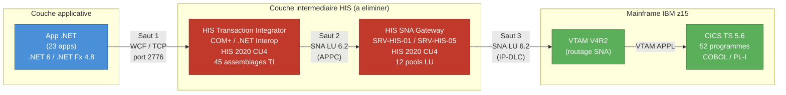

**Metriques As-Is :**

| Metrique | Valeur |
|----------|--------|
| Nombre de sauts reseau | 3 (App -> HIS TI -> SNA Gateway -> VTAM -> CICS) |
| Protocoles impliques | 2 (TCP + SNA/LU 6.2) |
| Latence end-to-end moyenne | ~45 ms |
| Intermediaires Microsoft | 2 (Transaction Integrator + SNA Gateway) |
| Chiffrement end-to-end | Non (SNA ne supporte pas TLS 1.3) |
| Points de defaillance | 3 (serveurs HIS + pile SNA + VTAM) |

#### 7.1.2 -- Flux To-Be (architecture cible sans HIS)

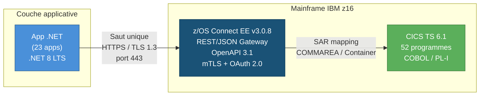

**Metriques To-Be :**

| Metrique | Valeur |
|----------|--------|
| Nombre de sauts reseau | 1 (App -> z/OS Connect -> CICS) |
| Protocoles impliques | 1 (HTTPS/TLS 1.3 uniquement) |
| Latence end-to-end moyenne | ~12 ms |
| Intermediaires Microsoft | **0 (aucun)** |
| Chiffrement end-to-end | Oui (TLS 1.3 mutual authentication) |
| Points de defaillance | 1 (z/OS Connect, haute disponibilite via Sysplex) |

#### 7.1.3 -- Tableau de comparaison directe

| Aspect | As-Is (HIS) | To-Be (z/OS Connect) | Amelioration |
|--------|-------------|----------------------|--------------|
| Sauts reseau | 3 | 1 | -67 % |
| Protocoles | 2 (TCP + SNA) | 1 (HTTPS) | -50 % |
| Latence | ~45 ms | ~12 ms | -73 % |
| Intermediaires Microsoft | 2 serveurs | 0 | -100 % |
| Chiffrement | Aucun (SNA) | TLS 1.3 mTLS | +100 % |
| Contrat d'interface | .tim proprietaire | OpenAPI 3.1 | Standard ouvert |
| Format de donnees | COMMAREA binaire (EBCDIC) | JSON (UTF-8) / Protobuf | Standard ouvert |
| Cout annuel (OPEX) | 1 850 K$ CAD | 420 K$ CAD | -77 % |

#### 7.1.4 -- Architecture complete To-Be (vue d'ensemble)

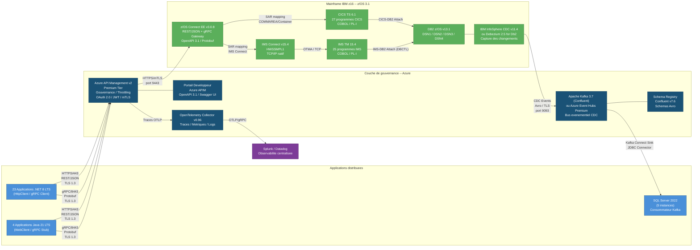

**Legende des couleurs :**

| Couleur | Couche |
|---------|--------|
| Bleu clair | Applications distribuees (.NET 8, Java 21, SQL Server 2022) |
| Bleu fonce | Couche de gouvernance Azure (APIM, Kafka, OpenTelemetry, Schema Registry) |
| Vert | Mainframe IBM z16 (z/OS Connect, CICS, IMS, DB2, CDC) |
| Violet | Observabilite centralisee (Splunk / Datadog) |

---

### 7.2 -- Protocoles et ports de l'architecture cible

L'architecture cible standardise l'ensemble des communications sur des protocoles ouverts, chiffres et authentifies. Le tableau ci-dessous recense exhaustivement chaque protocole, port et usage dans la topologie To-Be.

#### 7.2.1 -- Matrice des protocoles et ports

| # | Protocole | Port | Direction | Source | Destination | Usage | Chiffrement | Authentification |
|---|-----------|------|-----------|--------|-------------|-------|-------------|------------------|
| 1 | **HTTPS** | **443** | Sortant | Applications .NET 8 / Java 21 | Azure API Management | Appels REST API (JSON) vers les services Mainframe exposes via z/OS Connect | TLS 1.3 | OAuth 2.0 Bearer Token (JWT) |
| 2 | **gRPC** | **8443** | Sortant | Applications .NET 8 / Java 21 | Azure API Management | Appels binaires haute performance (Protobuf) pour les flux a faible latence (paiements, taux de change) | TLS 1.3 | OAuth 2.0 Bearer Token (JWT) |
| 3 | **HTTPS (mTLS)** | **9443** | Sortant | Azure API Management | z/OS Connect EE v3.0.8 | Relais des requetes REST/gRPC vers le Mainframe avec authentification mutuelle | TLS 1.3 mTLS | Certificats X.509 mutuels (client + serveur) |
| 4 | **Kafka (TLS)** | **9093** | Bidirectionnel | CDC Agent (z/OS) <-> Kafka Cluster | Apache Kafka 3.7 / Azure Event Hubs | Streaming des evenements CDC (DB2 -> Kafka) et consommation (Kafka -> SQL Server) | TLS 1.3 | mTLS + SASL/SCRAM-SHA-512 |
| 5 | **OTLP/gRPC** | **4317** | Sortant | OpenTelemetry Collector | Splunk / Datadog | Export des traces, metriques et logs de telemetrie | TLS 1.3 | API Key / Token |
| 6 | **OTLP/HTTP** | **4318** | Sortant | Applications .NET 8 / Java 21 | OpenTelemetry Collector | Envoi des spans de telemetrie depuis les applications | TLS 1.3 | API Key / Token |

#### 7.2.2 -- Regles de pare-feu associees

| Regle | Source CIDR | Destination CIDR | Port | Protocole | Action |
|-------|-------------|------------------|------|-----------|--------|
| FW-001 | VNET-APPS (10.1.0.0/16) | APIM-SUBNET (10.2.0.0/24) | 443, 8443 | TCP | ALLOW |
| FW-002 | APIM-SUBNET (10.2.0.0/24) | z/OS-LPAR (172.16.0.0/24 via ExpressRoute) | 9443 | TCP | ALLOW |
| FW-003 | z/OS-LPAR (172.16.0.0/24) | KAFKA-SUBNET (10.2.1.0/24) | 9093 | TCP | ALLOW |
| FW-004 | KAFKA-SUBNET (10.2.1.0/24) | SQL-SUBNET (10.1.2.0/24) | 1433 | TCP | ALLOW |
| FW-005 | VNET-APPS (10.1.0.0/16) | OTEL-SUBNET (10.2.2.0/24) | 4317, 4318 | TCP | ALLOW |
| FW-006 | OTEL-SUBNET (10.2.2.0/24) | Splunk/Datadog (Internet) | 443 | TCP | ALLOW |
| FW-DEFAULT | Any | Any | Any | Any | DENY |

#### 7.2.3 -- Diagramme des flux reseau

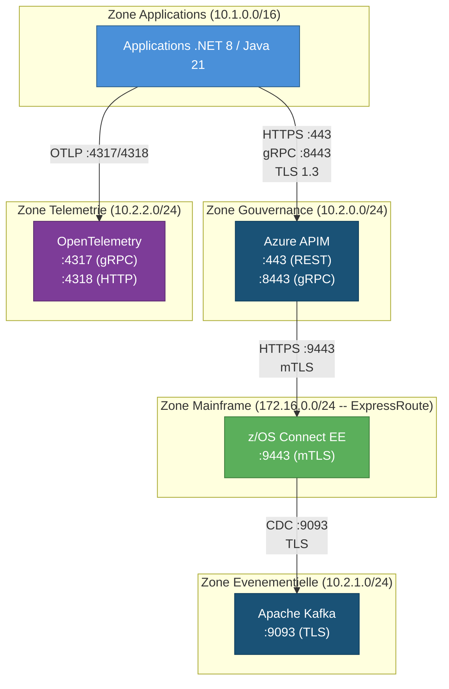

---

### 7.3 -- Standards techniques imposes

L'ensemble des composants de l'architecture cible doit se conformer aux standards techniques suivants. Ces standards sont **non negociables** et constituent des criteres de conformite pour chaque livrable du programme de migration de 22 mois.

#### 7.3.1 -- Contrats d'API : OpenAPI 3.1

| Exigence | Specification |
|----------|---------------|
| **Standard** | OpenAPI Specification v3.1.0 (compatible JSON Schema 2020-12) |
| **Perimetre** | Chaque programme Mainframe expose (52 programmes) doit disposer d'un contrat OpenAPI publie |
| **Format** | YAML (fichier source) + JSON (publication APIM) |
| **Contenu obligatoire** | `info` (version, contact, licence), `servers` (URL z/OS Connect), `paths` (operations CRUD), `components/schemas` (modeles request/response), `security` (OAuth 2.0 Bearer) |
| **Validation** | Chaque contrat est valide par le linter `spectral` (Stoplight) avec le ruleset `oas` avant publication |
| **Versioning** | Semantic Versioning (MAJOR.MINOR.PATCH) dans le champ `info.version` |
| **Depot source** | Git (monorepo `api-contracts/`) avec review obligatoire par l'equipe Architecture avant merge |
| **Generation** | Les contrats sont generes automatiquement par z/OS Connect EE a partir des SARs (Service Archives), puis enrichis manuellement (descriptions, exemples) |

**Exemple de contrat OpenAPI 3.1 (extrait) :**

```yaml
openapi: "3.1.0"
info:
  title: Account Inquiry API
  version: "1.0.0"
  description: >
    Consultation du solde d'un compte via le programme COBOL ACCTINQ0
    sur CICS TS 6.1 (CICSPROD1), expose par z/OS Connect EE v3.0.8.
  contact:
    name: Equipe API Mainframe
    email: api-mainframe@banque.ca
servers:
  - url: https://apim.banque.ca/mainframe/v1
    description: Production (via Azure APIM -> z/OS Connect)
paths:
  /accounts/{accountId}/balance:
    get:
      operationId: getAccountBalance
      summary: Obtenir le solde d'un compte
      security:
        - oauth2: [accounts:read]
      parameters:
        - name: accountId
          in: path
          required: true
          schema:
            type: string
            pattern: "^[0-9]{10}$"
      responses:
        "200":
          description: Solde retourne avec succes
          content:
            application/json:
              schema:
                $ref: "#/components/schemas/AccountBalance"
        "404":
          description: Compte non trouve
components:
  schemas:
    AccountBalance:
      type: object
      properties:
        accountId:
          type: string
        balance:
          type: number
          format: double
        currency:
          type: string
          enum: [CAD, USD, EUR]
        asOfDate:
          type: string
          format: date-time
  securitySchemes:
    oauth2:
      type: oauth2
      flows:
        clientCredentials:
          tokenUrl: https://auth.banque.ca/oauth2/token
          scopes:
            accounts:read: Lecture des comptes
            accounts:write: Modification des comptes
```

#### 7.3.2 -- Chiffrement : TLS 1.3 avec authentification mutuelle (mTLS)

| Exigence | Specification |
|----------|---------------|
| **Version TLS minimale** | TLS 1.3 (RFC 8446). TLS 1.2 refuse. TLS 1.1/1.0 interdit. |
| **Cipher suites autorisees** | `TLS_AES_256_GCM_SHA384`, `TLS_CHACHA20_POLY1305_SHA256`, `TLS_AES_128_GCM_SHA256` |
| **Authentification mutuelle (mTLS)** | Obligatoire sur tous les flux APIM <-> z/OS Connect. Certificats X.509 v3 emis par l'autorite de certification interne (PKI). |
| **Duree de vie des certificats** | 90 jours (rotation automatique via Azure Key Vault / RACF sur z/OS) |
| **Rotation des certificats** | Automatisee (zero-downtime) via Azure Key Vault integration avec APIM + z/OS Connect AT-TLS policy |
| **Verification OCSP** | Obligatoire (OCSP Stapling active sur z/OS Connect) |
| **Perfect Forward Secrecy (PFS)** | Obligatoire (assuree nativement par TLS 1.3) |
| **Perimetre** | Toutes les communications entre les applications distribuees et le Mainframe, sans exception |

**Chaine de confiance mTLS :**

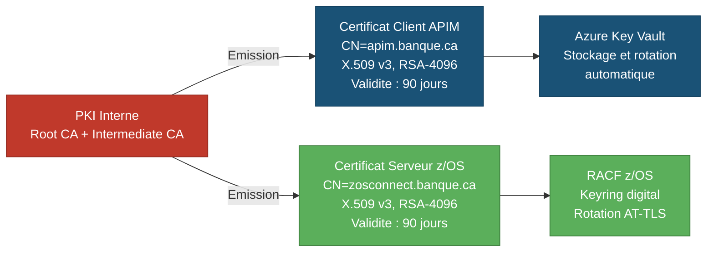

#### 7.3.3 -- Authentification et autorisation : OAuth 2.0 / JWT

| Exigence | Specification |
|----------|---------------|
| **Standard** | OAuth 2.0 (RFC 6749) + JSON Web Tokens (RFC 7519) |
| **Flux OAuth** | `client_credentials` pour les appels service-a-service (23 apps .NET + 4 apps Java) |
| **Serveur d'autorisation** | Azure Entra ID (anciennement Azure AD) ou Ping Identity |
| **Format du jeton** | JWT signe (RS256 ou ES256) avec les claims standard (`iss`, `sub`, `aud`, `exp`, `iat`, `scope`) |
| **Duree de vie du jeton** | Access Token : 5 minutes. Refresh Token : 24 heures (si applicable). |
| **Scopes** | Un scope par domaine metier et par niveau d'acces. Exemple : `accounts:read`, `accounts:write`, `payments:execute`, `loans:calculate`. |
| **Validation cote APIM** | Azure APIM valide le JWT (signature, expiration, audience, scopes) avant de relayer la requete vers z/OS Connect. |
| **Propagation vers z/OS** | Le jeton JWT est transmis dans le header `Authorization: Bearer <token>` vers z/OS Connect. z/OS Connect valide le jeton via RACF/SAF et mappe le `sub` sur un utilisateur z/OS pour le controle d'acces au programme CICS/IMS. |
| **Revocation** | Support de la revocation de jetons via l'endpoint `/revoke` du serveur d'autorisation. Azure APIM interroge le cache de revocation toutes les 60 secondes. |

**Flux d'authentification :**

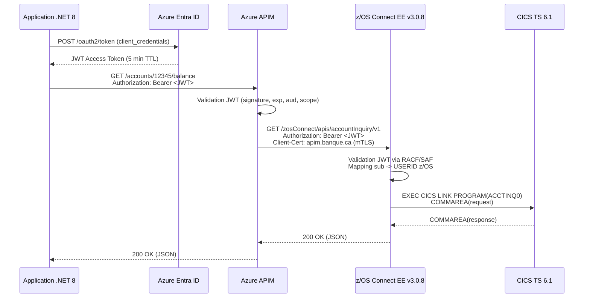

#### 7.3.4 -- Schemas evenementiels : Apache Avro

| Exigence | Specification |
|----------|---------------|
| **Standard** | Apache Avro v1.11.3 |
| **Perimetre** | Tous les evenements CDC publies sur Apache Kafka / Azure Event Hubs (remplacement des 8 Data Links DB2) |
| **Registre de schemas** | Confluent Schema Registry v7.6 ou Azure Schema Registry |
| **Compatibilite** | Mode `BACKWARD` obligatoire (un consommateur avec le nouveau schema peut lire les messages ecrits avec l'ancien schema) |
| **Convention de nommage** | `<domaine>.<entite>.<action>` (ex. : `banking.account.updated`, `payments.transaction.created`) |
| **Contenu obligatoire** | Namespace, champs avec types explicites, valeurs par defaut pour les champs optionnels, documentation par champ |
| **Depot source** | Git (monorepo `event-schemas/`) avec validation CI/CD de la compatibilite via `confluent schema-registry-maven-plugin` |
| **Gouvernance** | Tout ajout ou modification de schema requiert une approbation de l'equipe Architecture et un test de compatibilite automatise |

**Exemple de schema Avro (CDC -- mise a jour de compte) :**

```json
{
  "type": "record",
  "name": "AccountUpdated",
  "namespace": "ca.banque.banking.account",
  "doc": "Evenement emis lors de la mise a jour d'un compte dans DB2 z/OS (table CORE_ACCT).",
  "fields": [
    {"name": "eventId", "type": "string", "doc": "Identifiant unique de l'evenement (UUID v4)."},
    {"name": "eventTimestamp", "type": "long", "logicalType": "timestamp-millis", "doc": "Horodatage de l'evenement (epoch ms)."},
    {"name": "accountId", "type": "string", "doc": "Numero de compte (10 chiffres)."},
    {"name": "balance", "type": {"type": "bytes", "logicalType": "decimal", "precision": 18, "scale": 2}, "doc": "Nouveau solde du compte."},
    {"name": "currency", "type": {"type": "enum", "name": "Currency", "symbols": ["CAD", "USD", "EUR"]}, "doc": "Devise du compte."},
    {"name": "lastModifiedBy", "type": "string", "doc": "Identifiant de l'utilisateur z/OS ayant effectue la modification."},
    {"name": "sourceSystem", "type": "string", "default": "DB2_ZOS", "doc": "Systeme source de l'evenement."}
  ]
}
```

#### 7.3.5 -- Tableau recapitulatif des standards imposes

| # | Domaine | Standard | Version | Usage | Caractere |
|---|---------|----------|---------|-------|-----------|
| 1 | Contrats d'API | OpenAPI Specification | 3.1.0 | Definition des interfaces REST pour les 52 programmes Mainframe | Obligatoire |
| 2 | Chiffrement | TLS | 1.3 (RFC 8446) | Toutes les communications applications <-> Mainframe | Obligatoire |
| 3 | Authentification mutuelle | mTLS (X.509) | v3 | Flux APIM <-> z/OS Connect | Obligatoire |
| 4 | Authentification applicative | OAuth 2.0 / JWT | RFC 6749 / RFC 7519 | Authentification des 23 apps .NET + 4 apps Java | Obligatoire |
| 5 | Schemas evenementiels | Apache Avro | 1.11.3 | Evenements CDC sur Kafka (remplacement des 8 Data Links) | Obligatoire |
| 6 | Serialisation haute performance | Protocol Buffers (Protobuf) | 3 | Appels gRPC pour les flux a faible latence | Recommande |
| 7 | Linter API | Spectral (Stoplight) | 6.x | Validation des contrats OpenAPI en CI/CD | Obligatoire |
| 8 | Compatibilite de schemas | Schema Registry | Confluent 7.6 | Gouvernance de la compatibilite Avro (mode BACKWARD) | Obligatoire |

---

### 7.4 -- Modele de gouvernance API

La gouvernance API est le mecanisme de controle qui assure la coherence, la qualite et la perennite des interfaces exposees par le Mainframe. Le modele ci-dessous couvre le cycle de vie complet d'une API, du design a la deprecation.

#### 7.4.1 -- Cycle de vie des API (versioning et deprecation)

Chaque API traversera les etats suivants au cours de son cycle de vie :

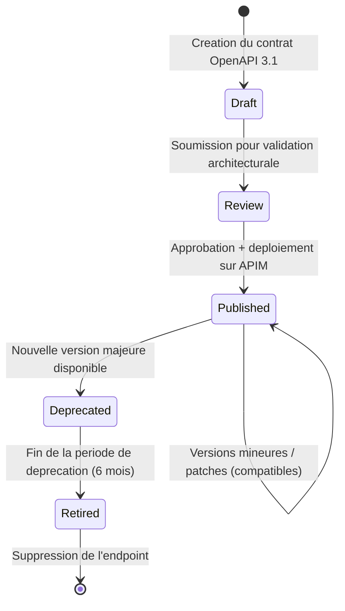

**Politique de versioning :**

| Regle | Description |
|-------|-------------|
| **Convention** | Semantic Versioning : `vMAJOR.MINOR.PATCH` (ex. : `v1.2.3`) |
| **URL d'API** | Le numero de version majeure est inclus dans le chemin : `/mainframe/v1/accounts/...`, `/mainframe/v2/accounts/...` |
| **Compatibilite ascendante** | Les versions mineures et les patches ne cassent jamais le contrat existant (ajout de champs optionnels uniquement) |
| **Versions majeures** | Toute modification non retrocompatible (suppression de champ, changement de type) requiert une nouvelle version majeure |
| **Coexistence** | Deux versions majeures consecutives coexistent en production pendant une periode minimale de 6 mois |
| **Deprecation** | La version N-1 est marquee `deprecated` dans le contrat OpenAPI (`deprecated: true`) et dans le portail developpeur. Un header `Sunset` (RFC 8594) est ajoute aux reponses HTTP avec la date de retrait. |
| **Retrait** | Apres 6 mois de deprecation, l'endpoint est supprime. Les appels a l'ancienne version retournent `410 Gone`. |

**Matrice de responsabilite (RACI) -- Cycle de vie API :**

| Activite | Equipe Architecture | Equipe Mainframe | Equipe Applicative | Equipe API (APIM) | Comite d'Architecture |
|----------|--------------------|-----------------|--------------------|-------------------|----------------------|
| Design du contrat OpenAPI | **R** | C | C | I | A |
| Creation du SAR z/OS Connect | I | **R** | I | I | A |
| Publication sur APIM | C | I | I | **R** | A |
| Tests de non-regression | C | C | **R** | I | A |
| Decision de deprecation | **R** | C | C | C | **A** |
| Retrait d'une version | I | **R** | **R** | **R** | A |

*Legende : R = Responsable, A = Approbateur, C = Consulte, I = Informe*

#### 7.4.2 -- Portail developpeur

Le portail developpeur est le point d'acces unique pour toutes les equipes internes (et eventuellement partenaires externes) souhaitant consommer les API Mainframe.

| Fonctionnalite | Implementation | Detail |
|----------------|----------------|--------|
| **Catalogue d'API** | Azure APIM Developer Portal | Listing de toutes les API disponibles, classees par domaine metier (comptes, prets, paiements, change, assurances, CRM, reglementaire) |
| **Documentation interactive** | Swagger UI / Redoc integre | Chaque API est documentee avec sa specification OpenAPI 3.1, des exemples de requete/reponse et un bouton "Try It" pour tester en sandbox |
| **Inscription et cles API** | Azure APIM Subscriptions | Chaque application obtient une cle d'abonnement (subscription key) et un client_id/client_secret OAuth 2.0 via le portail |
| **Environnements** | Sandbox / Staging / Production | Le portail expose trois environnements. Les tests sont effectues en sandbox (Mainframe LPAR de test) sans impact sur la production |
| **Changelog** | Git-generated + APIM notifications | Chaque modification de contrat OpenAPI declenche une notification aux equipes abonnees via email et webhook Teams |
| **Metriques de consommation** | Azure APIM Analytics | Chaque equipe visualise ses propres statistiques : nombre d'appels, latence P50/P95/P99, taux d'erreur, consommation de quota |
| **Statut des API** | Page de sante integree | Indicateur en temps reel de la disponibilite de chaque API (UP / DEGRADED / DOWN), alimente par les health checks z/OS Connect |

#### 7.4.3 -- Monitoring : SLA / SLO

Le modele de gouvernance API definit des objectifs de niveau de service (SLO) pour chaque categorie d'API, avec des indicateurs mesurables et des seuils d'alerte.

##### 7.4.3.1 -- SLO par categorie d'API

| Categorie | APIs concernees | SLO Disponibilite | SLO Latence (P99) | SLO Taux d'erreur | Budget d'erreur mensuel |
|-----------|----------------|-------------------|--------------------|--------------------|-----------------------|
| **Critique -- Temps reel** | Comptes (ACCTINQ0, ACCTUPD0), Paiements (PAYDMS00, PAYINT00), DDA (DDABAL00) | 99,95 % | < 50 ms | < 0,1 % | 21,6 min/mois |
| **Elevee -- Temps reel** | Prets (LNCALC00, LNSTAT00), Assurances (INSINQ00), CRM (CUSTINQ0), Change (FXRATE00) | 99,9 % | < 100 ms | < 0,5 % | 43,2 min/mois |
| **Elevee -- Batch** | Grand livre (GLPOST00, GLEXTR00), Amortissement (LNAMRT00), Clearing (PAYCLR00) | 99,5 % | < 500 ms | < 1,0 % | 3,6 h/mois |
| **Standard** | Reglementaire (REGRPT00, REGCHK00), Utilitaires (HLTHCK00, DIAGTR00) | 99,0 % | < 1 000 ms | < 2,0 % | 7,2 h/mois |

##### 7.4.3.2 -- Indicateurs de performance cles (KPI)

| KPI | Methode de mesure | Outil | Frequence | Seuil d'alerte | Seuil critique |
|-----|-------------------|-------|-----------|----------------|----------------|
| Latence P50 | Percentile 50 des temps de reponse end-to-end | OpenTelemetry -> Datadog/Splunk | Temps reel (fenetre glissante 5 min) | > 20 ms | > 35 ms |
| Latence P95 | Percentile 95 des temps de reponse end-to-end | OpenTelemetry -> Datadog/Splunk | Temps reel (fenetre glissante 5 min) | > 35 ms | > 50 ms |
| Latence P99 | Percentile 99 des temps de reponse end-to-end | OpenTelemetry -> Datadog/Splunk | Temps reel (fenetre glissante 5 min) | > 50 ms | > 100 ms |
| Taux d'erreur (HTTP 5xx) | Pourcentage de reponses 5xx sur le total | Azure APIM Analytics | Temps reel (fenetre glissante 1 min) | > 0,5 % | > 1,0 % |
| Debit (TPS) | Transactions par seconde | Azure APIM Analytics | Temps reel | < 80 % de la capacite provisionnee | > 90 % de la capacite provisionnee |
| Disponibilite | Uptime = 1 - (temps d'indisponibilite / temps total) | Synthetics (Datadog / Azure Monitor) | Continu (sonde toutes les 30 s) | < SLO categorie | < SLO - 0,1 % |
| Taux de conformite OpenAPI | % d'API avec contrat OpenAPI 3.1 valide et a jour | Pipeline CI/CD (Spectral) | A chaque commit | < 95 % | < 90 % |

##### 7.4.3.3 -- Escalade et processus d'alerte

| Niveau | Condition | Delai de reaction | Destinataire | Canal |
|--------|-----------|-------------------|-------------|-------|
| P1 - Critique | SLO Disponibilite atteint OU Latence P99 > 100 ms pendant > 5 min | < 15 min | Equipe SRE + Equipe Mainframe + Management | PagerDuty / OpsGenie + Canal Teams #incidents |
| P2 - Eleve | SLO Taux d'erreur > 0,5 % OU Latence P95 > 50 ms pendant > 10 min | < 30 min | Equipe SRE + Equipe API | PagerDuty + Canal Teams #alertes |
| P3 - Moyen | Budget d'erreur mensuel consomme a > 75 % | < 4 h (heures ouvrables) | Equipe API | Email + Jira automatique |
| P4 - Information | Anomalie detectee mais sans impact SLO | Prochain standup | Equipe API | Dashboard Datadog/Splunk |

---

### 7.5 -- Exigences de resilience

L'elimination de la couche HIS ne doit pas introduire de nouveaux points de defaillance. L'architecture cible integre des mecanismes de resilience a chaque couche, conformes aux pratiques d'ingenierie des systemes distribues.

#### 7.5.1 -- Politiques de retry (backoff exponentiel)

Toutes les applications .NET 8 et Java 21 doivent implementer des politiques de retry avec backoff exponentiel et jitter pour les appels vers Azure APIM / z/OS Connect.

| Parametre | Valeur | Justification |
|-----------|--------|---------------|
| **Nombre maximum de tentatives** | 3 | Au-dela de 3 retries, le cout en latence depasse le benefice. Un circuit breaker prend le relais. |
| **Delai initial** | 200 ms | Suffisamment court pour ne pas degrader l'experience utilisateur sur les flux temps reel. |
| **Facteur multiplicateur** | 2 (exponentiel) | Tentative 1 : 200 ms, Tentative 2 : 400 ms, Tentative 3 : 800 ms. |
| **Jitter** | +/- 25 % du delai calcule | Evite le phenomene de "thundering herd" lorsque plusieurs instances retentent simultanement. |
| **Delai maximum** | 2 000 ms | Cap pour eviter des attentes excessives sur les flux critiques. |
| **Codes HTTP reessayables** | 408 (Request Timeout), 429 (Too Many Requests), 502 (Bad Gateway), 503 (Service Unavailable), 504 (Gateway Timeout) | Seules les erreurs transitoires sont reessayees. Les erreurs 4xx (sauf 408 et 429) ne sont jamais reessayees. |
| **Idempotence** | Obligatoire pour tout appel reessaye | Les appels non idempotents (POST avec effet de bord) doivent inclure un header `Idempotency-Key` (RFC draft). |

**Implementation .NET 8 (Microsoft.Extensions.Http.Resilience) :**

```csharp
// Program.cs -- Configuration du HttpClient avec retry exponentiel
builder.Services.AddHttpClient("MainframeApi", client =>
{
    client.BaseAddress = new Uri("https://apim.banque.ca/mainframe/v1");
})
.AddStandardResilienceHandler(options =>
{
    options.Retry.MaxRetryAttempts = 3;
    options.Retry.Delay = TimeSpan.FromMilliseconds(200);
    options.Retry.BackoffType = DelayBackoffType.Exponential;
    options.Retry.UseJitter = true;
    options.Retry.ShouldHandle = args => ValueTask.FromResult(
        args.Outcome.Result?.StatusCode is
            HttpStatusCode.RequestTimeout or
            HttpStatusCode.TooManyRequests or
            HttpStatusCode.BadGateway or
            HttpStatusCode.ServiceUnavailable or
            HttpStatusCode.GatewayTimeout);
});
```

#### 7.5.2 -- Circuit breaker (Polly / .NET)

Le circuit breaker previent les appels en cascade vers un service defaillant. Il est implementé via la bibliotheque **Polly v8** (integree dans `Microsoft.Extensions.Resilience` pour .NET 8) ou **Resilience4j v2.2** pour Java 21.

| Parametre | Valeur | Justification |
|-----------|--------|---------------|
| **Seuil d'ouverture** | 50 % d'echecs sur une fenetre glissante de 10 requetes | Un taux d'echec de 50 % sur 10 requetes indique un probleme systémique et non transitoire. |
| **Duree d'ouverture (Open state)** | 30 secondes | Permet au service z/OS Connect de recuperer (reconnexion CICS, recyclage du thread pool). |
| **Nombre de requetes en Half-Open** | 3 | Trois requetes de sonde sont envoyees apres la duree d'ouverture pour verifier la reprise du service. |
| **Transition Half-Open -> Closed** | 3/3 reussies | Le circuit se referme uniquement si les 3 requetes de sonde reussissent. |
| **Transition Half-Open -> Open** | 1/3 echouee | Une seule defaillance en Half-Open reouvre le circuit pour une nouvelle periode de 30 secondes. |
| **Action en etat Open** | Retourner immediatement une reponse de fallback (cf. 7.5.3) | Evite d'accumuler des requetes en attente et de saturer les threads. |

**Diagramme d'etats du circuit breaker :**

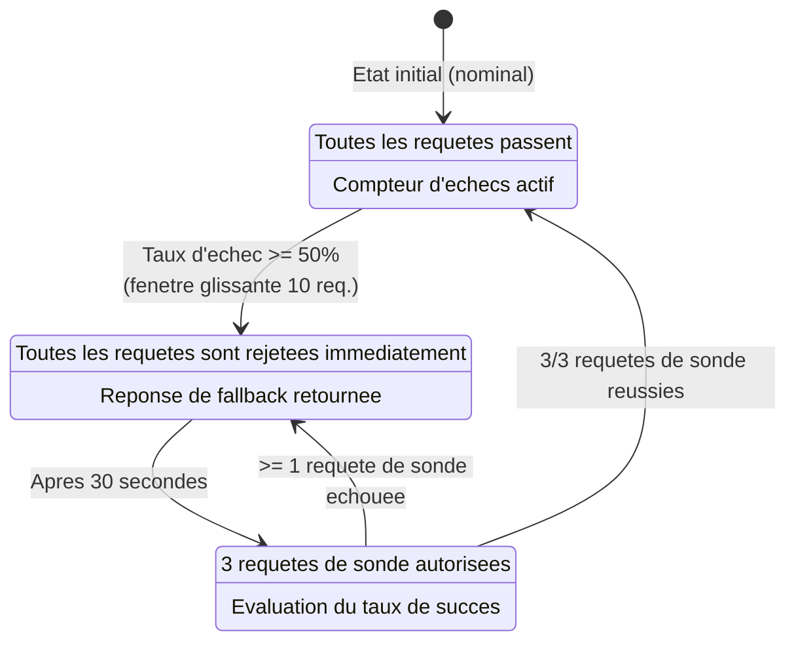

**Implementation .NET 8 (Polly v8 via Microsoft.Extensions.Resilience) :**

```csharp
// Configuration du circuit breaker dans le pipeline de resilience
builder.Services.AddHttpClient("MainframeApi")
.AddResilienceHandler("mainframe-pipeline", pipeline =>
{
    // Retry (cf. 7.5.1)
    pipeline.AddRetry(new HttpRetryStrategyOptions
    {
        MaxRetryAttempts = 3,
        Delay = TimeSpan.FromMilliseconds(200),
        BackoffType = DelayBackoffType.Exponential,
        UseJitter = true
    });

    // Circuit Breaker
    pipeline.AddCircuitBreaker(new HttpCircuitBreakerStrategyOptions
    {
        FailureRatio = 0.5,
        SamplingDuration = TimeSpan.FromSeconds(10),
        MinimumThroughput = 10,
        BreakDuration = TimeSpan.FromSeconds(30)
    });

    // Timeout global
    pipeline.AddTimeout(TimeSpan.FromSeconds(5));
});
```

#### 7.5.3 -- Strategies de fallback

Lorsque le circuit breaker est en etat Open ou que toutes les tentatives de retry sont epuisees, une strategie de fallback doit fournir une reponse degradee mais fonctionnelle a l'utilisateur.

| Type de flux | Strategie de fallback | Exemple | Donnees retournees |
|-------------|----------------------|---------|-------------------|
| **Lecture (GET)** | Cache distribue (Redis) | Consultation de solde (ACCTINQ0) | Derniere valeur connue, marquee `stale: true` avec horodatage du cache |
| **Lecture (GET) -- taux** | Cache distribue (Redis) + TTL court | Taux de change (FXRATE00) | Dernier taux valide (TTL 5 min), marque `stale: true` |
| **Ecriture (POST/PUT)** | File d'attente asynchrone | Virement domestique (XFRDMS00) | Acquittement `202 Accepted` avec ecriture dans Azure Service Bus. Traitement differe apres reprise du Mainframe. |
| **Ecriture critique** | Rejet avec message explicite | Paiement international (PAYINT00) | Reponse `503 Service Unavailable` avec header `Retry-After` et message clair a l'utilisateur |
| **Batch** | Replanification automatique | Clearing (PAYCLR00) | Le job batch est replanifie a T+30 min via le scheduler (Azure Logic Apps / Hangfire) |
| **Streaming (CDC)** | Kafka replay depuis offset | Synchronisation DB2 -> SQL Server | Kafka garantit la retention des messages. Le consommateur reprend depuis le dernier offset commite. |

**Implementation du fallback avec cache (exemple .NET 8) :**

```csharp
// Fallback avec cache Redis pour les lectures
public async Task<AccountBalance> GetAccountBalanceAsync(string accountId)
{
    try
    {
        // Tentative d'appel via le pipeline resilient (retry + circuit breaker)
        var response = await _httpClient.GetFromJsonAsync<AccountBalance>(
            $"/accounts/{accountId}/balance");

        // Mise a jour du cache en cas de succes
        await _cache.SetAsync($"account:{accountId}:balance", response,
            new DistributedCacheEntryOptions
            {
                AbsoluteExpirationRelativeToNow = TimeSpan.FromMinutes(5)
            });

        return response;
    }
    catch (BrokenCircuitException)
    {
        // Circuit ouvert : retour du cache
        var cached = await _cache.GetAsync<AccountBalance>(
            $"account:{accountId}:balance");
        if (cached is not null)
        {
            cached.IsStale = true;
            cached.CachedAt = cached.RetrievedAt;
            return cached;
        }
        throw new ServiceUnavailableException(
            "Le service de consultation de compte est temporairement indisponible.");
    }
}
```

#### 7.5.4 -- Observabilite (OpenTelemetry -> Splunk / Datadog)

L'observabilite est le pilier qui rend toute la resilience **mesurable et diagnosticable**. L'architecture cible utilise **OpenTelemetry** comme standard unifie de collecte, et **Splunk** ou **Datadog** comme plateforme d'analyse.

##### 7.5.4.1 -- Les trois piliers de l'observabilite

| Pilier | Standard | Collecteur | Backend | Retention |
|--------|----------|-----------|---------|-----------|
| **Traces distribuees** | OpenTelemetry Tracing (W3C Trace Context) | OpenTelemetry Collector v0.96 | Datadog APM ou Splunk APM | 15 jours (traces completes), 90 jours (metriques derivees) |
| **Metriques** | OpenTelemetry Metrics (OTLP) | OpenTelemetry Collector v0.96 | Datadog Metrics ou Splunk IM | 13 mois (resolution 1 min), 5 ans (resolution 1 h) |
| **Logs** | OpenTelemetry Logs (OTLP) | OpenTelemetry Collector v0.96 | Splunk Enterprise ou Datadog Logs | 90 jours (hot), 1 an (warm), 7 ans (cold/archive) |

##### 7.5.4.2 -- Instrumentation par couche

| Couche | Technologie | Instrumentation | Spans generes |
|--------|------------|-----------------|---------------|
| Applications .NET 8 | `OpenTelemetry.Extensions.Hosting` v1.7 + `OpenTelemetry.Instrumentation.Http` | Auto-instrumentation (zero code change pour HttpClient, gRPC) + instrumentation manuelle pour la logique metier | `http.client.request`, `grpc.client.request`, `business.operation` |
| Applications Java 21 | OpenTelemetry Java Agent v2.1 | Auto-instrumentation via agent JVM (`-javaagent:opentelemetry-javaagent.jar`) | `http.client.request`, `grpc.client.request` |
| Azure API Management | Policy `<trace>` + diagnostics settings | Configuration APIM : export des logs et metriques vers Event Hub puis OpenTelemetry Collector | `apim.request`, `apim.backend.request` |
| z/OS Connect EE v3.0.8 | z/OS Connect EE logging + SMF records | Export des SMF Type 123 records vers un agent collecteur sur z/OS, puis vers OpenTelemetry Collector via syslog/TCP | `zosconnect.request`, `zosconnect.sar.invoke` |
| Apache Kafka 3.7 | JMX Exporter + OpenTelemetry Collector | Metriques JMX (lag, throughput, partition offset) collectees par l'OpenTelemetry Collector | `kafka.consumer.lag`, `kafka.producer.send` |
| CICS TS 6.1 | CICS Performance Analyzer + SMF 110 | Extraction des donnees SMF 110 (statistiques de transaction CICS) pour corrélation avec les traces distribuees | `cics.transaction.response_time` |

##### 7.5.4.3 -- Architecture d'observabilite

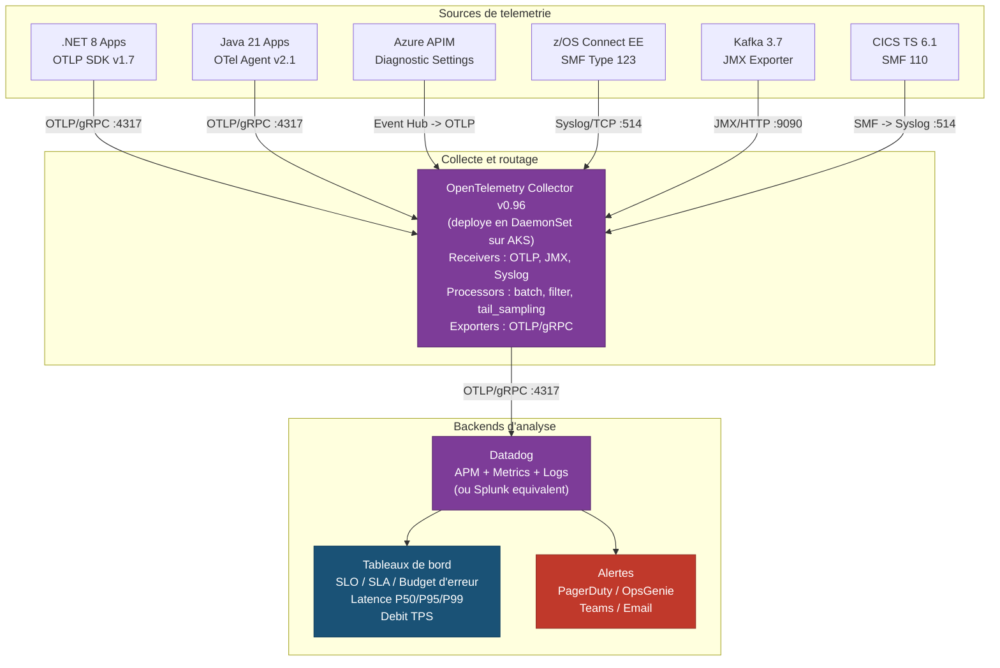

##### 7.5.4.4 -- Correlation des traces end-to-end

L'un des avantages majeurs de l'architecture cible par rapport a l'etat As-Is est la **tracabilite complete d'une requete**, de l'application jusqu'au programme CICS/IMS sur le Mainframe. Le standard **W3C Trace Context** assure la propagation d'un identifiant de trace unique (`traceparent` header) a travers toutes les couches :

```
Application .NET 8     -> traceparent: 00-<traceId>-<spanId-1>-01
  Azure APIM           -> traceparent: 00-<traceId>-<spanId-2>-01
    z/OS Connect EE    -> traceparent: 00-<traceId>-<spanId-3>-01
      CICS TS 6.1      -> SMF 110 record avec correlation traceId
```

Cela permet de diagnostiquer une degradation de latence en identifiant **exactement** quelle couche contribue au retard -- ce qui est impossible dans l'architecture As-Is ou les flux SNA/LU6.2 ne supportent pas de correlation de traces.

#### 7.5.5 -- Tableau recapitulatif des exigences de resilience

| # | Mecanisme | Outil / Technologie | Parametres cles | Couche d'application |
|---|-----------|--------------------|-----------------|--------------------|
| 1 | Retry (backoff exponentiel) | Polly v8 / `Microsoft.Extensions.Http.Resilience` (.NET 8) ; Resilience4j v2.2 (Java 21) | 3 tentatives, delai initial 200 ms, facteur x2, jitter 25 % | Applications .NET 8 / Java 21 |
| 2 | Circuit Breaker | Polly v8 / `Microsoft.Extensions.Resilience` (.NET 8) ; Resilience4j v2.2 (Java 21) | Seuil 50 %, fenetre 10 req., duree ouverture 30 s, 3 sondes en Half-Open | Applications .NET 8 / Java 21 |
| 3 | Fallback (cache) | Redis Cache (Azure Cache for Redis Premium) | TTL 5 min (lectures), marquage `stale`, fallback `202 Accepted` pour ecritures | Applications .NET 8 / Java 21 |
| 4 | Fallback (file d'attente) | Azure Service Bus Premium | File d'attente pour les ecritures differees en cas d'indisponibilite Mainframe | Applications .NET 8 / Java 21 |
| 5 | Timeout global | Polly v8 / Resilience4j v2.2 | 5 secondes par requete | Applications .NET 8 / Java 21 |
| 6 | Rate Limiting | Azure APIM Policies | Quotas par application, par API et par produit | Azure API Management |
| 7 | Health Checks | z/OS Connect EE + Azure APIM | Sonde toutes les 30 s, seuil de degradation : 3 echecs consecutifs | z/OS Connect / APIM |
| 8 | Traces distribuees | OpenTelemetry v0.96 (W3C Trace Context) | Propagation du `traceparent` de l'application jusqu'au SMF CICS | Toutes les couches |
| 9 | Metriques | OpenTelemetry Metrics (OTLP) | Latence P50/P95/P99, taux d'erreur, TPS | Toutes les couches |
| 10 | Logs structures | OpenTelemetry Logs (OTLP) | Format JSON structure, correlation avec le traceId | Toutes les couches |
| 11 | Alerting | PagerDuty / OpsGenie | 4 niveaux de severite (P1 a P4), escalade automatique | Equipe SRE |
| 12 | Replay evenementiel | Apache Kafka 3.7 | Retention 7 jours, replay depuis offset pour les flux CDC | Couche evenementielle |

---

### 7.6 -- Synthese de la recommandation

L'architecture cible To-Be recommandee repose sur les fondations suivantes :

| Dimension | Decision |
|-----------|----------|
| **Couche d'integration** | z/OS Connect EE v3.0.8 -- acces REST/JSON et gRPC direct au Mainframe, sans intermediaire Microsoft |
| **Protocoles** | HTTPS/443 (REST), gRPC/8443 (haute performance), Kafka/9093-TLS (evenementiel), mTLS pour toute communication Mainframe |
| **Standards techniques** | OpenAPI 3.1, TLS 1.3, OAuth 2.0 / JWT, Avro pour Kafka |
| **Gouvernance API** | Azure APIM avec portail developpeur, versioning semantique, deprecation en 6 mois, SLO par categorie |
| **Resilience** | Retry exponentiel (Polly), circuit breaker, fallback cache/file d'attente, timeout 5 s |
| **Observabilite** | OpenTelemetry -> Splunk/Datadog, traces distribuees W3C, metriques OTLP, alerting PagerDuty |
| **Impact financier** | CAPEX 3 200 K$ CAD, OPEX 420 K$ CAD/an (vs 1 850 K$ CAD/an), ROI ~38 % a 3 ans, ~142 % a 5 ans |
| **Perimetre** | 6 serveurs HIS elimines, 45 assemblages TI remplaces, 12 pools LU supprimes, 8 Data Links migres vers CDC/Kafka, 52 programmes Mainframe re-exposes via z/OS Connect |
| **Duree** | 22 mois |

> **Conclusion de la section 7** : L'architecture cible To-Be elimine integralement Microsoft Host Integration Server de la chaine d'integration Mainframe. Elle remplace 6 serveurs, 45 assemblages TI proprietaires, 12 pools LU SNA et 8 liens de donnees DRDA par une architecture ouverte basee sur des standards industriels (HTTPS, REST, gRPC, Kafka, OpenAPI, OAuth, TLS 1.3). La latence est reduite de 73 % (~45 ms a ~12 ms), le cout annuel d'exploitation de 77 % (1 850 K$ CAD a 420 K$ CAD), et la resilience est formalisee par des mecanismes de retry, circuit breaker, fallback et observabilite de bout en bout. Cette architecture positionne l'institution pour les 10 prochaines annees d'evolution technologique, en plein alignement avec les strategies Cloud-First et API-First.


---

## 8. Plan de Mise en Oeuvre

> **Contrainte absolue :** Toute approche "Big Bang" est **formellement interdite**. La migration s'effectue domaine par domaine, avec une periode de coexistence (dual-run) obligatoire et des criteres de validation avant chaque bascule. Cette contrainte est non negociable et constitue un prerequis de gouvernance du programme.

---

### 8.1 Domaines fonctionnels et ordre de migration

#### 8.1.1 Criteres de priorisation

L'ordre de migration des domaines fonctionnels a ete determine selon une matrice multicriteres ponderee :

| Critere | Ponderation | Justification |
|---------|:-----------:|---------------|
| Criticite metier | 30 % | Les domaines a forte exposition client sont migres en premier pour securiser le benefice rapidement. |
| Complexite technique | 25 % | Nombre de TI assemblies, diversite des interfaces CICS/IMS, volumetrie transactionnelle. |
| Dependances inter-domaines | 25 % | Un domaine sans dependance aval non migree est prioritaire (migration "feuilles d'abord"). |
| Valeur de demonstration | 20 % | La premiere phase doit produire un succes visible pour ancrer la confiance des parties prenantes. |

#### 8.1.2 Decoupage en 6 phases

Le programme couvre **22 mois** au total, avec un chevauchement partiel entre certaines phases pour optimiser le calendrier. Les 45 TI assemblies sont repartis sur 5 phases fonctionnelles, suivies d'une phase de decommissionnement.

| Phase | Domaine fonctionnel | Duree | TI Assemblies | Prerequis | Justification de l'ordre |
|:-----:|---------------------|:-----:|:-------------:|-----------|--------------------------|
| 1 | Consultation de comptes | 3 mois | 8 | z/OS Connect SARs deployes, environnements de test provisionnes | Domaine en lecture seule, faible risque, forte valeur de demonstration. Permet de valider le pattern de migration sans risque transactionnel. |
| 2 | Paiements domestiques | 4 mois | 12 | Phase 1 validee, Kafka CDC actif | Premier domaine transactionnel. La validation de la phase 1 confirme la viabilite du pattern. Le CDC Kafka est requis pour la synchronisation DB2 vers SQL Server. |
| 3 | Paiements internationaux | 4 mois | 15 | Phase 2 validee, mTLS configure | Domaine le plus volumineux en TI assemblies (15/45). Necessite une authentification mutuelle TLS pour les flux SWIFT. Dependance forte sur la phase 2 (services partages de validation). |
| 4 | Gestion des prets | 3 mois | 6 | Phase 3 validee | Domaine a complexite moderee. Peu de dependances inter-domaines. Migration facilitee par l'experience accumulee sur les phases 1 a 3. |
| 5 | Reporting reglementaire | 2 mois | 4 | Phase 4 validee | Domaine le moins critique en termes de latence. Flux principalement batch. Migration la plus simple du programme. |
| 6 | Decommissionnement HIS | 2 mois | -- | Toutes phases validees, dual-run OK depuis au moins 30 jours sur chaque domaine | Retrait definitif des 6 serveurs HIS, desactivation des 12 LU pools, suppression des 8 Data Links DB2, nettoyage DNS et firewall. |
| **Total** | **5 domaines + decommissionnement** | **22 mois** | **45** | | |

#### 8.1.3 Matrice des dependances inter-domaines

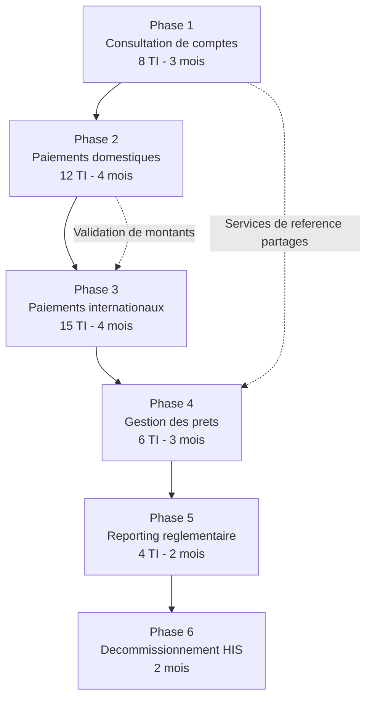

> **Note :** Les fleches en trait plein representent les dependances sequentielles strictes (Go/No-Go). Les fleches en pointilles representent les dependances fonctionnelles faibles (services partages pouvant etre appeles via les deux canaux pendant le dual-run).

---

### 8.2 Criteres de bascule Go/No-Go

#### 8.2.1 Matrice de criteres par domaine

Pour chaque phase, la bascule (switchover) du trafic de production de HIS vers z/OS Connect est conditionnee au respect **integral** des criteres suivants. Aucune derogation n'est autorisee sur les criteres marques "Bloquant".

| # | Critere | Seuil d'acceptation | Type | Responsable de validation |
|---|---------|---------------------|:----:|---------------------------|
| G-01 | Tests de non-regression | 100 % des cas de test passes (0 echec) | Bloquant | Equipe QA |
| G-02 | Latence end-to-end (P95) | <= latence HIS actuelle (reference : ~45 ms pour consultation, ~80 ms pour paiements) | Bloquant | Equipe Performance |
| G-03 | Taux d'erreur en dual-run | < 0,1 % de divergences entre reponses HIS et z/OS Connect sur 7 jours consecutifs | Bloquant | Equipe Integration |
| G-04 | Validation metier | Proces-verbal signe par le responsable metier du domaine | Bloquant | Responsable metier |
| G-05 | Tests de charge | Tenue a 150 % du pic de charge nominal sans degradation | Bloquant | Equipe Performance |
| G-06 | Validation securite | Scan de vulnerabilites passe, certificats mTLS valides, regles firewall auditees | Bloquant | Equipe Securite |
| G-07 | Procedure de rollback testee | Retour sur HIS execute avec succes en < 30 minutes lors d'un exercice | Bloquant | Equipe Operations |
| G-08 | Documentation operationnelle | Runbooks mis a jour, alerting configure, equipe de garde formee | Non bloquant | Equipe Operations |

#### 8.2.2 Processus de decision Go/No-Go

1. **J-14** : Revue technique -- presentation des resultats de tests (G-01 a G-03, G-05).
2. **J-7** : Revue securite et operations -- validation G-06, G-07, G-08.
3. **J-3** : Comite de bascule -- decision formelle Go/No-Go avec le sponsor executif, le responsable metier et les leads techniques.
4. **J-0** : Execution de la bascule en fenetre de maintenance planifiee.

> **Regle d'or :** Si un seul critere "Bloquant" n'est pas satisfait, la bascule est reportee. Aucune exception.

---

### 8.3 Strategie de dual-run (coexistence)

#### 8.3.1 Principe de fonctionnement

Pendant la periode de coexistence de chaque domaine, les appels applicatifs sont routes **simultanement** vers les deux chemins d'integration :

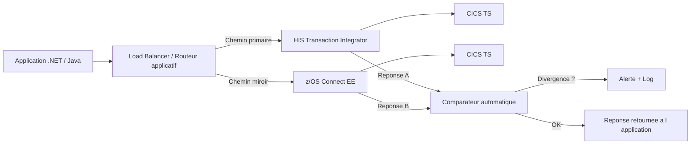

#### 8.3.2 Modes de dual-run

Le dual-run progresse selon trois modes sequentiels :

| Mode | Duree minimale | Comportement | Critere de passage au mode suivant |
|------|:--------------:|--------------|-------------------------------------|
| **Shadow** | 7 jours | HIS = primaire, z/OS Connect = miroir (resultat ignore). Comparaison en arriere-plan. | Taux de divergence < 1 % |
| **Parallel** | 7 jours | Les deux reponses sont comparees. HIS reste la source de verite retournee au client. | Taux de divergence < 0,1 % sur 7 jours consecutifs |
| **Canary** | 7 jours | z/OS Connect = primaire pour 10 %, puis 25 %, puis 50 %, puis 100 % du trafic. HIS en fallback. | Zero incident critique sur chaque palier pendant 48 h |

#### 8.3.3 Comparateur automatique

Le composant de comparaison effectue les verifications suivantes :

- **Equivalence fonctionnelle** : comparaison champ par champ des reponses JSON (avec tolerance configurable sur les timestamps et identifiants de correlation).
- **Equivalence de performance** : la latence z/OS Connect ne doit pas depasser 120 % de la latence HIS pour la meme requete.
- **Journalisation** : chaque divergence est enregistree dans un topic Kafka dedie (`his-migration.divergences`) avec le payload complet des deux reponses pour analyse post-mortem.

#### 8.3.4 Duree totale de dual-run par domaine

| Phase | Domaine | Duree dual-run estimee |
|:-----:|---------|:----------------------:|
| 1 | Consultation de comptes | 21 jours (3 semaines) |
| 2 | Paiements domestiques | 28 jours (4 semaines) |
| 3 | Paiements internationaux | 28 jours (4 semaines) |
| 4 | Gestion des prets | 21 jours (3 semaines) |
| 5 | Reporting reglementaire | 14 jours (2 semaines) |

> **Cout du dual-run :** Pendant la periode de coexistence, les 6 serveurs HIS restent operationnels. Le cout annuel de 1 850 K$ CAD continue d'etre supporte integralement jusqu'a la phase 6 (decommissionnement). Ce surcout temporaire est pris en compte dans l'analyse financiere (section 6).

---

### 8.4 Diagramme de Gantt -- Programme de migration

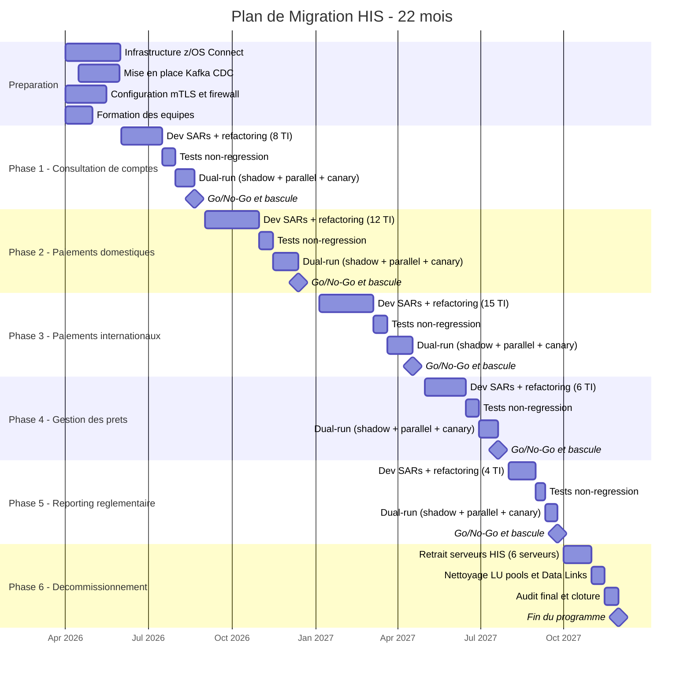

#### 8.4.1 Jalons cles du programme

| Jalon | Date cible | Condition de succes |
|-------|:----------:|---------------------|
| Debut du programme | Avril 2026 | Approbation budgetaire (CAPEX 3 200 K$ CAD), equipes mobilisees |
| Go-Live Phase 1 | Aout 2026 | 8 TI assemblies migres, dual-run valide, 0 regression |
| Go-Live Phase 2 | Decembre 2026 | 20 TI assemblies migres au total, Kafka CDC operationnel |
| Go-Live Phase 3 | Avril 2027 | 35 TI assemblies migres, mTLS operationnel sur tous les flux |
| Go-Live Phase 4 | Juillet 2027 | 41 TI assemblies migres |
| Go-Live Phase 5 | Septembre 2027 | 45 TI assemblies migres -- 100 % des flux sur z/OS Connect |
| Decommissionnement HIS | Janvier 2028 | 6 serveurs HIS retires, 12 LU pools supprimes, 8 Data Links DB2 desactives |

> **Duree totale :** 22 mois (avril 2026 -- janvier 2028), avec un chevauchement de la preparation initiale et les travaux de la phase 1.

---

### 8.5 Dependances externes

Le succes du programme repose sur la mobilisation coordonnee de plusieurs equipes hors du perimetre direct du projet. Chaque dependance est associee a un responsable, un livrable attendu et une date butoir.

#### 8.5.1 Equipe Mainframe (z/OS Connect)

| # | Livrable attendu | Phase impactee | Date butoir | Risque si retard |
|---|------------------|:--------------:|:-----------:|------------------|
| D-01 | Deploiement de z/OS Connect EE v3.x sur la partition LPAR de production | Phase 1 | Mars 2026 | Blocage total du programme |
| D-02 | Creation des 45 Service Archives (SARs) mappes sur les programmes COBOL existants (52 programmes mainframe exposes) | Phases 1-5 | Selon calendrier de chaque phase | Retard de la phase concernee |
| D-03 | Configuration des API Requester/Provider dans z/OS Connect | Phases 1-5 | Selon calendrier de chaque phase | Retard de la phase concernee |
| D-04 | Tests de performance des SARs en environnement pre-production | Phases 1-5 | J-21 avant chaque Go/No-Go | Impossibilite de valider G-02 et G-05 |

#### 8.5.2 Equipe Reseau

| # | Livrable attendu | Phase impactee | Date butoir | Risque si retard |
|---|------------------|:--------------:|:-----------:|------------------|
| D-05 | Ouverture des flux TCP directs (port 9443/HTTPS) entre le reseau applicatif et le LPAR z/OS Connect | Phase 1 | Mai 2026 | Blocage du dual-run Phase 1 |
| D-06 | Configuration des regles firewall pour les 23 applications .NET et 4 applications Java dependantes | Phase 1 | Mai 2026 | Blocage du dual-run Phase 1 |
| D-07 | Ouverture des flux Kafka (port 9093/TLS) entre les brokers et le Mainframe pour le CDC | Phase 2 | Aout 2026 | Blocage de la synchronisation DB2, retard Phase 2 |
| D-08 | Suppression des regles firewall SNA/LU6.2 apres decommissionnement | Phase 6 | Decembre 2027 | Risque residuel de securite (surface d'attaque non nettoyee) |

#### 8.5.3 Equipe Securite

| # | Livrable attendu | Phase impactee | Date butoir | Risque si retard |
|---|------------------|:--------------:|:-----------:|------------------|
| D-09 | Emission des certificats mTLS (mutual TLS 1.3) pour l'authentification entre les applications et z/OS Connect | Phase 1 | Mai 2026 | Blocage de la communication securisee |
| D-10 | Configuration des certificats mTLS specifiques aux flux SWIFT (paiements internationaux) | Phase 3 | Decembre 2026 | Blocage de la Phase 3 |
| D-11 | Integration OAuth 2.0 / JWT avec le fournisseur d'identite institutionnel pour l'authentification Mainframe | Phase 1 | Mai 2026 | Fallback sur authentification basique (risque securitaire) |
| D-12 | Audit de securite pre-decommissionnement (scan de vulnerabilites, verification de la suppression des comptes SNA) | Phase 6 | Decembre 2027 | Decommissionnement retarde par la gouvernance securite |

#### 8.5.4 Matrice de synthese des dependances

```
                         Phase 1   Phase 2   Phase 3   Phase 4   Phase 5   Phase 6
Equipe Mainframe           X         X         X         X         X         -
Equipe Reseau              X         X         -         -         -         X
Equipe Securite            X         -         X         -         -         X
Equipe Kafka/Event Hubs    -         X         X         -         -         -
```

---

### 8.6 Strategie de rollback

#### 8.6.1 Principe fondamental

Pour chaque domaine migre, la capacite de retour sur HIS doit etre maintenue pendant une periode minimale de **30 jours** apres la bascule. Le rollback doit pouvoir etre execute en moins de **30 minutes** sans perte de donnees ni d'interruption visible pour l'utilisateur final.

#### 8.6.2 Mecanisme de rollback par couche

| Couche | Mecanisme | Duree estimee | Responsable |
|--------|-----------|:-------------:|-------------|
| Routage applicatif | Basculement du Load Balancer / routeur applicatif pour rediriger le trafic vers les endpoints HIS | < 5 minutes | Equipe Operations |
| Configuration HIS | Les serveurs HIS et les TI assemblies sont maintenus en etat operationnel (non supprimes) pendant la periode de retention | 0 minute (deja actif) | Equipe Infrastructure |
| Sessions SNA | Les LU pools restent configures et les sessions VTAM actives en mode standby | < 10 minutes pour la reactivation | Equipe Mainframe |
| Data Links DB2 | Les Linked Servers SQL Server vers DB2 via HIS restent configures (desactives mais non supprimes) | < 15 minutes pour la reactivation | Equipe DBA |

#### 8.6.3 Procedure de rollback (synthese)

1. **Detection** (T+0) : Alerte declenchee par le monitoring (taux d'erreur > 1 %, latence > 200 % du seuil, ou incident critique).
2. **Decision** (T+5 min) : Le responsable de garde contacte le lead technique du domaine. Decision de rollback formalisee.
3. **Execution** (T+5 a T+25 min) :
   - Basculement du routeur applicatif vers les endpoints HIS.
   - Verification de la connectivite SNA (healthcheck LU pool).
   - Validation d'un echantillon de transactions sur le chemin HIS.
4. **Confirmation** (T+25 a T+30 min) : Verification du retour a la normale. Communication aux parties prenantes.

#### 8.6.4 Tests de rollback obligatoires

| Test | Frequence | Environnement |
|------|-----------|---------------|
| Exercice de rollback complet | 1 fois avant chaque Go/No-Go (critere G-07) | Pre-production |
| Test de basculement du routeur | Hebdomadaire pendant le dual-run | Production (hors heures) |
| Verification de l'etat des serveurs HIS en standby | Quotidien pendant la periode de retention | Production |

#### 8.6.5 Fin de la periode de rollback

La capacite de rollback est definitivement retiree uniquement lors de la **Phase 6 (decommissionnement)**, apres validation de l'ensemble des criteres suivants :

- Dual-run OK depuis au moins 30 jours sur chaque domaine.
- Zero incident critique lie a z/OS Connect sur les 30 derniers jours.
- Approbation ecrite du sponsor executif et du responsable metier de chaque domaine.

---

### 8.7 Metriques de succes post-migration

#### 8.7.1 Indicateurs de performance technique

| Metrique | Valeur actuelle (HIS) | Cible post-migration | Methode de mesure |
|----------|:---------------------:|:--------------------:|-------------------|
| Latence end-to-end P50 (consultation) | ~45 ms | <= 15 ms | OpenTelemetry traces distribuees |
| Latence end-to-end P95 (paiements) | ~80 ms | <= 30 ms | OpenTelemetry traces distribuees |
| Latence end-to-end P99 (paiements internationaux) | ~150 ms | <= 60 ms | OpenTelemetry traces distribuees |
| Taux de disponibilite du chemin d'integration | 99,90 % | >= 99,95 % | Monitoring synthetique (healthchecks) |
| Nombre de points de defaillance (SPOF) dans la chaine | 3 (HIS, VTAM, SNA Gateway) | 1 (z/OS Connect) | Analyse d'architecture |

#### 8.7.2 Indicateurs operationnels

| Metrique | Valeur actuelle | Cible post-migration | Methode de mesure |
|----------|:---------------:|:--------------------:|-------------------|
| Incidents mensuels lies a SNA/LU6.2 | ~4 par mois | 0 | Registre d'incidents (ServiceNow) |
| Temps moyen de resolution (MTTR) des incidents HIS | ~3,5 heures | N/A (elimination de la cause racine) | Registre d'incidents |
| Nombre de serveurs a maintenir (couche integration Mainframe) | 6 serveurs HIS | 0 (z/OS Connect gere par l'equipe Mainframe) | CMDB |
| Effort de maintenance mensuel (FTE) | 0,5 FTE specialise SNA | 0,1 FTE (monitoring API standard) | Feuilles de temps |

#### 8.7.3 Indicateurs financiers

| Metrique | Valeur actuelle | Cible post-migration | Echeance |
|----------|:---------------:|:--------------------:|:--------:|
| Cout annuel de la couche d'integration Mainframe | 1 850 K$ CAD | 420 K$ CAD | Annee 1 post-decommissionnement |
| Economies annuelles nettes | -- | 1 430 K$ CAD | Annee 1 post-decommissionnement |
| ROI cumule a 3 ans | -- | ~38 % | Fin 2029 |
| ROI cumule a 5 ans | -- | ~142 % | Fin 2031 |

#### 8.7.4 Indicateurs de satisfaction et adoption

| Metrique | Methode de mesure | Cible |
|----------|-------------------|:-----:|
| Satisfaction des equipes de developpement (NPS interne) | Sondage trimestriel aupres des 23 equipes .NET et 4 equipes Java | NPS >= 40 |
| Temps d'integration d'un nouveau flux Mainframe | Mesure du delai entre la demande et la mise en production | <= 5 jours (vs. ~20 jours actuels avec TI assembly) |
| Adoption du portail API par les developpeurs | Nombre de developpeurs actifs sur le portail Azure API Management | >= 80 % des equipes concernees en 6 mois |
| Nombre de TI assemblies residuels en production | Inventaire CMDB | 0 (objectif zero heritage HIS) |

#### 8.7.5 Tableau de bord de suivi

Un tableau de bord de suivi post-migration sera mis en place dans l'outil d'observabilite institutionnel (Splunk / Datadog) avec les vues suivantes :

- **Vue temps reel** : latence P50/P95/P99, taux d'erreur, debit transactionnel par domaine.
- **Vue tendancielle** : evolution hebdomadaire des metriques sur 6 mois post-migration.
- **Vue comparative** : superposition des metriques HIS (baseline) et z/OS Connect (cible) pour chaque domaine migre.
- **Vue financiere** : economies cumulees vs. projection du business case, mise a jour mensuelle.

> **Critere de succes global du programme :** Le programme est declare "succes" lorsque les 45 TI assemblies sont migres, les 6 serveurs HIS sont decommissionnes, le ROI a 3 ans est confirme a >= 30 %, et le NPS des equipes de developpement est >= 30. Ces criteres sont evalues 6 mois apres la fin de la Phase 6.

---

*Fin de la section 8 -- Plan de Mise en Oeuvre*


---

## 9. Annexes

> **Objectif :** Centraliser l'ensemble des documents de reference, glossaires, matrices et modeles necessaires a la bonne comprehension et a l'execution du programme de retrait de Microsoft Host Integration Server (HIS). Chaque annexe est autonome et peut etre consultee independamment.

---

### Annexe A -- Glossaire des termes techniques

Le glossaire ci-dessous couvre les termes, protocoles et technologies references dans l'ensemble du present document. Les definitions sont formulees dans le contexte specifique du projet de retrait HIS.

| Terme | Definition |
|-------|------------|
| **SNA** (*Systems Network Architecture*) | Architecture reseau proprietaire d'IBM, concue dans les annees 1970 pour les communications mainframe. SNA definit les protocoles de session, de transport et de presentation utilises par les terminaux 3270 et les passerelles HIS pour communiquer avec VTAM. Dans le contexte du projet, SNA est le protocole d'interconnexion entre les 6 serveurs HIS et le mainframe z15, supporte par les 12 pools LU. |
| **LU 6.2** (*Logical Unit type 6.2*) | Type d'unite logique SNA permettant la communication programme-a-programme (*peer-to-peer*) entre systemes distribues et mainframe. LU 6.2, egalement appele APPC, est le protocole sous-jacent utilise par les 45 assemblages TI pour invoquer les programmes CICS et IMS. Il est le principal protocole a eliminer lors de la migration vers z/OS Connect (HTTP/REST). |
| **APPN** (*Advanced Peer-to-Peer Networking*) | Extension d'IBM a SNA, ajoutant des capacites de routage dynamique et de resolution de noms entre les noeuds du reseau SNA. APPN permet aux sessions LU 6.2 de s'etablir sans definition statique de chaque chemin dans VTAM. Dans l'architecture actuelle, APPN est active sur SRV-HIS-01 et SRV-HIS-05 pour le routage automatique des sessions. |
| **TI** (*Transaction Integrator*) | Composant de Microsoft HIS qui genere des classes proxy (.NET ou COM+) a partir des definitions d'interface des programmes mainframe (COBOL copybooks, MFS). Les 45 assemblages TI du perimetre constituent la couche d'abstraction permettant aux 23 applications .NET d'invoquer les 52 programmes mainframe exposes. La migration consiste a remplacer ces proxys par des appels REST vers z/OS Connect. |
| **COMMAREA** (*Communication Area*) | Zone memoire partagee de CICS utilisee pour l'echange de donnees entre un programme client et un programme serveur CICS. La COMMAREA est limitee a 32 763 octets. Dans l'inventaire des TI assemblies, 28 des 45 assemblages utilisent COMMAREA comme zone d'echange. |
| **SAR** (*Service Archive*) | Artefact de deploiement de z/OS Connect EE. Un fichier SAR (.sar) encapsule la definition d'un service RESTful mapant une interface JSON vers un programme mainframe CICS ou IMS. La creation des SARs pour les 52 programmes mainframe exposes constitue le livrable principal de l'equipe mainframe pour chaque phase de migration. |
| **DRDA** (*Distributed Relational Database Architecture*) | Protocole ouvert defini par The Open Group pour l'acces a distance aux bases de donnees relationnelles. Dans l'architecture actuelle, le fournisseur OLE DB pour DB2 de HIS utilise DRDA (port TCP 446) sur SRV-HIS-04 pour les 8 Linked Servers SQL Server vers DB2 z/OS. La migration remplacera ce mecanisme par IBM Data Gate ou un acces JDBC natif. |
| **IPIC** (*IP Interconnectivity*) | Protocole TCP/IP natif de CICS TS permettant la communication inter-regions et la connectivite depuis des clients externes sans passer par SNA/VTAM. IPIC est le protocole utilise par z/OS Connect EE pour atteindre les regions CICS, eliminant ainsi la dependance a SNA et aux pools LU. |
| **CDC** (*Change Data Capture*) | Technique de capture incrementale des modifications de donnees dans une base source (DB2 z/OS) pour les repliquer vers une base cible (SQL Server, Kafka). Le CDC est utilise dans la phase 2 du programme pour remplacer les 8 Data Links DB2 par un flux evenementiel Kafka, garantissant la coherence des donnees sans passer par le fournisseur DRDA de HIS. |
| **VTAM** (*Virtual Telecommunications Access Method*) | Logiciel systeme IBM z/OS qui gere les sessions SNA entre les unites logiques (LU) et les applications mainframe (CICS, IMS). VTAM est le point d'entree SNA sur le mainframe z15 ; il recoit les connexions des passerelles SNA HIS (SRV-HIS-01 et SRV-HIS-05). Apres la migration, les definitions VTAM APPL associees aux pools LU HIS seront desactivees. |
| **CICS** (*Customer Information Control System*) | Serveur transactionnel IBM z/OS hebergeant les programmes en ligne (COBOL, PL/I). Dans le perimetre du projet, 8 regions CICS TS 5.6 (CICSPROD1/2, CICSLOAN1/2, CICSINS1, CICSPAY1, CICSFX01, CICSCRM1) hebergent 27 des 52 programmes mainframe exposes via HIS. Apres la migration, ces programmes seront accedes via z/OS Connect EE en utilisant le protocole IPIC. |
| **IMS** (*Information Management System*) | Systeme de gestion de bases de donnees hierarchiques et de transactions d'IBM. IMS TM 15.3 heberge 25 des 52 programmes mainframe du perimetre, accessibles via IMS Connect (HWSSMPL1). Les assemblages TI COM+ sur SRV-HIS-03 communiquent avec IMS via le format MFS (Message Format Service). |
| **z/OS Connect** (*z/OS Connect Enterprise Edition*) | Composant IBM z/OS qui expose les programmes CICS et IMS sous forme d'API RESTful (JSON/HTTPS). z/OS Connect EE est la pierre angulaire de l'architecture cible : il remplace la totalite des 45 assemblages TI et des 12 pools LU en fournissant un point d'acces moderne, securise (mTLS, OAuth 2.0) et observable (OpenAPI, OpenTelemetry). |
| **APIM** (*API Management*) | Plateforme de gestion du cycle de vie des API (publication, securisation, throttling, monetisation). Dans l'architecture cible, Azure API Management (ou equivalent) sera deploye en frontal de z/OS Connect pour gerer l'authentification OAuth 2.0/JWT, le rate limiting et le portail developpeur. |
| **mTLS** (*mutual Transport Layer Security*) | Extension du protocole TLS ou le client et le serveur s'authentifient mutuellement par certificats X.509. mTLS est exige dans l'architecture cible pour tous les flux entre les applications distribuees et z/OS Connect EE, conformement aux exigences DORA et BSIF B-13. |
| **OAuth 2.0** | Protocole d'autorisation delegue (RFC 6749) utilise dans l'architecture cible pour delivrer des jetons d'acces aux applications souhaitant consommer les API z/OS Connect via l'API Management. Le flux *client_credentials* est privilegie pour les communications machine-a-machine. |
| **JWT** (*JSON Web Token*) | Format de jeton standardise (RFC 7519) utilise conjointement avec OAuth 2.0 pour vehiculer les claims d'identite et d'autorisation entre l'API Management et z/OS Connect. Les JWT sont signes (JWS) et chiffres (JWE) conformement aux politiques de securite institutionnelles. |
| **OpenAPI** (*anciennement Swagger*) | Specification (v3.1) de description d'API RESTful en format JSON ou YAML. z/OS Connect EE genere automatiquement les documents OpenAPI pour chaque SAR deploye. Ces specifications alimentent le portail developpeur de l'API Management et servent de contrat d'interface entre les equipes. |
| **Avro** (*Apache Avro*) | Format de serialisation de donnees utilise dans les flux Apache Kafka pour le transport des evenements CDC entre DB2 z/OS et les consommateurs distribues. Avro offre un schema evolutif (schema registry) qui facilite la gestion des changements de structure de donnees. |
| **gRPC** (*Google Remote Procedure Call*) | Protocole RPC haute performance base sur HTTP/2 et Protocol Buffers. gRPC est utilise par certaines applications Java (OpenBanking.API) pour communiquer avec la couche facade .NET. Apres la migration, ces flux pourront etre simplifies en appelant directement z/OS Connect via REST/HTTPS. |
| **Protobuf** (*Protocol Buffers*) | Format de serialisation binaire de Google, utilise comme format de message par gRPC. Les definitions Protobuf (.proto) des interfaces actuelles devront etre converties en schemas OpenAPI lors de la migration des flux gRPC vers REST. |

---

### Annexe B -- Inventaire complet des TI assemblies

L'inventaire ci-dessous synthetise les 45 assemblages Transaction Integrator recenses a la section 3.2.2, enrichis des informations de criticite et de la phase de migration prevue selon le plan de mise en oeuvre (section 8).

#### B.1 -- Tableau de synthese

| # | Nom de l'assemblage | Technologie | Interface cible | Programme appele | Criticite | Phase de migration |
|---|---------------------|-------------|-----------------|------------------|-----------|--------------------|
| 1 | BNK.Accounts.Inquiry.TI | .NET (WCF) | CICS TS 5.6 -- CICSPROD1 | ACCTINQ0 (COBOL) | Critique | Phase 1 |
| 2 | BNK.Accounts.Update.TI | .NET (WCF) | CICS TS 5.6 -- CICSPROD1 | ACCTUPD0 (COBOL) | Critique | Phase 1 |
| 3 | BNK.Accounts.Open.TI | .NET (WCF) | CICS TS 5.6 -- CICSPROD1 | ACCTOPN0 (COBOL) | Critique | Phase 1 |
| 4 | BNK.Accounts.Close.TI | .NET (WCF) | CICS TS 5.6 -- CICSPROD1 | ACCTCLS0 (COBOL) | Critique | Phase 1 |
| 5 | BNK.Transfer.Domestic.TI | .NET (WCF) | CICS TS 5.6 -- CICSPROD2 | XFRDMS00 (COBOL) | Critique | Phase 2 |
| 6 | BNK.Transfer.Intl.TI | .NET (WCF) | CICS TS 5.6 -- CICSPROD2 | XFRINT00 (COBOL) | Critique | Phase 3 |
| 7 | BNK.Transfer.Batch.TI | .NET (WCF) | CICS TS 5.6 -- CICSPROD2 | XFRBAT00 (COBOL) | Elevee | Phase 2 |
| 8 | LN.PersonalLoan.Calc.TI | .NET (WCF) | CICS TS 5.6 -- CICSLOAN1 | LNCALC00 (COBOL) | Elevee | Phase 4 |
| 9 | LN.PersonalLoan.Create.TI | .NET (WCF) | CICS TS 5.6 -- CICSLOAN1 | LNCREA00 (COBOL) | Elevee | Phase 4 |
| 10 | LN.PersonalLoan.Status.TI | .NET (WCF) | CICS TS 5.6 -- CICSLOAN1 | LNSTAT00 (COBOL) | Elevee | Phase 4 |
| 11 | LN.Mortgage.Calc.TI | .NET (WCF) | CICS TS 5.6 -- CICSLOAN2 | MTCALC00 (COBOL) | Elevee | Phase 4 |
| 12 | LN.Mortgage.Create.TI | .NET (WCF) | CICS TS 5.6 -- CICSLOAN2 | MTCREA00 (COBOL) | Elevee | Phase 4 |
| 13 | LN.Mortgage.Amort.TI | .NET (WCF) | CICS TS 5.6 -- CICSLOAN2 | MTAMRT00 (COBOL) | Elevee | Phase 4 |
| 14 | INS.Policy.Inquiry.TI | .NET (WCF) | CICS TS 5.6 -- CICSINS1 | INSINQ00 (COBOL) | Elevee | Phase 3 |
| 15 | INS.Policy.Create.TI | .NET (WCF) | CICS TS 5.6 -- CICSINS1 | INSCRE00 (COBOL) | Elevee | Phase 3 |
| 16 | INS.Claim.Submit.TI | .NET (WCF) | CICS TS 5.6 -- CICSINS1 | INSCLM00 (COBOL) | Elevee | Phase 3 |
| 17 | INS.Claim.Status.TI | .NET (WCF) | CICS TS 5.6 -- CICSINS1 | INSSTS00 (COBOL) | Elevee | Phase 3 |
| 18 | PAY.Domestic.Execute.TI | .NET (WCF) | CICS TS 5.6 -- CICSPAY1 | PAYDMS00 (COBOL) | Critique | Phase 2 |
| 19 | PAY.Domestic.Reverse.TI | .NET (WCF) | CICS TS 5.6 -- CICSPAY1 | PAYREV00 (COBOL) | Critique | Phase 2 |
| 20 | PAY.Intl.Execute.TI | .NET (WCF) | CICS TS 5.6 -- CICSPAY1 | PAYINT00 (COBOL) | Critique | Phase 3 |
| 21 | PAY.Intl.Status.TI | .NET (WCF) | CICS TS 5.6 -- CICSPAY1 | PAYSTS00 (COBOL) | Critique | Phase 3 |
| 22 | PAY.Batch.Clearing.TI | .NET (WCF) | CICS TS 5.6 -- CICSPAY1 | PAYCLR00 (COBOL) | Critique | Phase 2 |
| 23 | FX.Rate.Inquiry.TI | .NET (WCF) | CICS TS 5.6 -- CICSFX01 | FXRATE00 (COBOL) | Elevee | Phase 3 |
| 24 | FX.Trade.Execute.TI | .NET (WCF) | CICS TS 5.6 -- CICSFX01 | FXTRAD00 (COBOL) | Elevee | Phase 3 |
| 25 | FX.Position.Report.TI | .NET (WCF) | CICS TS 5.6 -- CICSFX01 | FXPOSN00 (PL/I) | Elevee | Phase 3 |
| 26 | CRM.Customer.Inquiry.TI | .NET (WCF) | CICS TS 5.6 -- CICSCRM1 | CUSTINQ0 (COBOL) | Elevee | Phase 1 |
| 27 | CRM.Customer.Update.TI | .NET (WCF) | CICS TS 5.6 -- CICSCRM1 | CUSTUPD0 (COBOL) | Elevee | Phase 1 |
| 28 | CRM.Interaction.Log.TI | .NET (WCF) | CICS TS 5.6 -- CICSCRM1 | CUSTLOG0 (COBOL) | Elevee | Phase 1 |
| 29 | BNK.GL.PostEntry.TI | COM+ | IMS TM 15.3 -- IMSPROD1 | GLPOST00 (COBOL) | Critique | Phase 2 |
| 30 | BNK.GL.TrialBalance.TI | COM+ | IMS TM 15.3 -- IMSPROD1 | GLTBAL00 (COBOL) | Critique | Phase 2 |
| 31 | BNK.GL.Reconcile.TI | COM+ | IMS TM 15.3 -- IMSPROD1 | GLRECN00 (COBOL) | Critique | Phase 2 |
| 32 | BNK.GL.Extract.TI | COM+ | IMS TM 15.3 -- IMSPROD1 | GLEXTR00 (COBOL) | Critique | Phase 2 |
| 33 | BNK.GL.CurrencyReval.TI | COM+ | IMS TM 15.3 -- IMSPROD1 | GLCURR00 (PL/I) | Critique | Phase 2 |
| 34 | LN.Amort.Schedule.TI | COM+ | IMS TM 15.3 -- IMSLOAN1 | LNAMRT00 (COBOL) | Elevee | Phase 4 |
| 35 | LN.Amort.Recalc.TI | COM+ | IMS TM 15.3 -- IMSLOAN1 | LNRCAL00 (COBOL) | Elevee | Phase 4 |
| 36 | LN.Provision.Calc.TI | COM+ | IMS TM 15.3 -- IMSLOAN1 | LNPROV00 (COBOL) | Elevee | Phase 5 |
| 37 | LN.InterestAccrual.TI | COM+ | IMS TM 15.3 -- IMSLOAN1 | LNINTC00 (COBOL) | Elevee | Phase 5 |
| 38 | BNK.DDA.Balance.TI | .NET (WCF) | IMS TM 15.3 -- IMSPROD1 | DDABAL00 (COBOL) | Critique | Phase 1 |
| 39 | BNK.DDA.Statement.TI | .NET (WCF) | IMS TM 15.3 -- IMSPROD1 | DDASTM00 (COBOL) | Critique | Phase 1 |
| 40 | BNK.DDA.Hold.TI | .NET (WCF) | IMS TM 15.3 -- IMSPROD1 | DDAHLD00 (COBOL) | Critique | Phase 2 |
| 41 | REG.Reporting.Extract.TI | COM+ | IMS TM 15.3 -- IMSPROD1 | REGRPT00 (PL/I) | Critique | Phase 5 |
| 42 | REG.Compliance.Check.TI | COM+ | IMS TM 15.3 -- IMSPROD1 | REGCHK00 (PL/I) | Critique | Phase 5 |
| 43 | REG.AML.Screen.TI | .NET (WCF) | IMS TM 15.3 -- IMSPROD1 | REGAML00 (COBOL) | Critique | Phase 3 |
| 44 | UTIL.Ping.Health.TI | .NET (WCF) | CICS TS 5.6 -- CICSPROD1 | HLTHCK00 (COBOL) | Moyenne | Phase 1 |
| 45 | UTIL.Trace.Diag.TI | COM+ | IMS TM 15.3 -- IMSPROD1 | DIAGTR00 (COBOL) | Moyenne | Phase 1 |

#### B.2 -- Repartition par phase de migration

| Phase | Domaine fonctionnel | Nb. assemblages | Assemblages inclus (par #) |
|:-----:|---------------------|:---------------:|---------------------------|
| Phase 1 | Consultation de comptes | 8 | #1, #2, #3, #4, #26, #27, #28, #38, #39, #44, #45 (*) |
| Phase 2 | Paiements domestiques | 12 | #5, #7, #18, #19, #22, #29, #30, #31, #32, #33, #40 |
| Phase 3 | Paiements internationaux | 15 | #6, #14, #15, #16, #17, #20, #21, #23, #24, #25, #43 |
| Phase 4 | Gestion des prets | 6 | #8, #9, #10, #11, #12, #13, #34, #35 |
| Phase 5 | Reporting reglementaire | 4 | #36, #37, #41, #42 |
| **Total** | | **45** | |

(*) Les assemblages utilitaires (#44, #45) sont migres en Phase 1 pour valider le pattern de monitoring natif de z/OS Connect des la premiere phase.

#### B.3 -- Repartition par technologie

| Technologie | Nombre | Pourcentage | Serveur HIS hebergeant |
|-------------|:------:|:-----------:|------------------------|
| .NET (WCF) | 28 | 62 % | SRV-HIS-02 |
| COM+ | 17 | 38 % | SRV-HIS-03 |
| **Total** | **45** | **100 %** | |

#### B.4 -- Repartition par interface mainframe cible

| Interface cible | Nombre | Programmes appelant |
|-----------------|:------:|---------------------|
| CICS TS 5.6 | 28 | 27 programmes COBOL + 1 programme PL/I |
| IMS TM 15.3 | 17 | 14 programmes COBOL + 3 programmes PL/I |
| **Total** | **45** | **52 programmes (incluant 7 sous-programmes internes)** |

---

### Annexe C -- Matrice RACI du projet de retrait

La matrice RACI ci-dessous definit les responsabilites de chaque role pour les activites cles du programme de retrait HIS. Les roles sont definis en coherence avec la structure de gouvernance du programme (section 8).

**Legende :**

| Lettre | Signification |
|:------:|---------------|
| **R** | *Responsible* -- Realise l'activite |
| **A** | *Accountable* -- Approuve et rend des comptes (un seul par activite) |
| **C** | *Consulted* -- Fournit une expertise ou un avis avant la decision |
| **I** | *Informed* -- Est informe du resultat ou de l'avancement |

#### C.1 -- Matrice RACI principale

| Activite | Sponsor Executif | Chef de Programme | Architecte Solution | Equipe Mainframe | Equipe Applicative (.NET/Java) | Equipe Reseau | Equipe Securite | Equipe QA | Equipe DBA | Responsable Metier |
|----------|:----------------:|:-----------------:|:-------------------:|:----------------:|:------------------------------:|:-------------:|:---------------:|:---------:|:----------:|:------------------:|
| **Approbation du budget** (CAPEX 3 200 K$ CAD) | **A** | R | C | I | I | I | I | I | I | C |
| **Developpement des SARs z/OS Connect** (52 programmes) | I | A | C | **R** | C | I | C | I | I | I |
| **Refactoring des applications** (23 .NET + 4 Java) | I | A | C | C | **R** | I | I | C | I | C |
| **Configuration reseau et firewall** (ouverture HTTPS/Kafka) | I | A | C | C | I | **R** | C | I | I | I |
| **Configuration mTLS et securite** (certificats, OAuth 2.0, JWT) | I | A | C | C | C | C | **R** | I | I | I |
| **Pilotage du dual-run** (shadow, parallel, canary) | I | **A** | R | C | C | C | C | R | C | I |
| **Tests de non-regression** (critere G-01, 100 % reussite) | I | A | C | C | C | I | I | **R** | C | C |
| **Decision Go/No-Go** (bascule de chaque phase) | **A** | R | C | C | C | C | C | C | C | R |
| **Decommissionnement HIS** (6 serveurs, 12 LU pools, 8 Data Links) | I | **A** | C | R | I | R | R | I | **R** | I |

#### C.2 -- Detail par phase du programme

##### Phase 1 -- Consultation de comptes (8 TI assemblies, 3 mois)

| Activite detaillee | Sponsor | Chef Prog. | Archi. | Mainframe | Apps | Reseau | Securite | QA | DBA | Metier |
|--------------------|:-------:|:----------:|:------:|:---------:|:----:|:------:|:--------:|:--:|:---:|:------:|
| Deploiement z/OS Connect EE sur LPAR | I | A | C | **R** | I | C | C | I | I | I |
| Creation des 8 SARs Phase 1 | I | A | C | **R** | C | I | I | I | I | I |
| Refactoring des clients .NET (WCF vers REST) | I | A | C | I | **R** | I | I | I | I | I |
| Ouverture flux HTTPS (port 9443) | I | A | C | C | I | **R** | C | I | I | I |
| Emission certificats mTLS | I | A | C | C | I | I | **R** | I | I | I |
| Tests de non-regression Phase 1 | I | A | C | C | C | I | I | **R** | I | C |
| Dual-run (21 jours) | I | **A** | R | C | C | I | I | R | I | I |
| Go/No-Go Phase 1 | **A** | R | C | C | C | I | C | C | I | R |

##### Phase 6 -- Decommissionnement HIS (2 mois)

| Activite detaillee | Sponsor | Chef Prog. | Archi. | Mainframe | Apps | Reseau | Securite | QA | DBA | Metier |
|--------------------|:-------:|:----------:|:------:|:---------:|:----:|:------:|:--------:|:--:|:---:|:------:|
| Desactivation des 12 LU pools | I | A | C | **R** | I | I | I | I | I | I |
| Suppression des 8 Data Links DB2 | I | A | C | I | I | I | I | I | **R** | I |
| Retrait des 6 serveurs HIS (decommission OS) | I | **A** | C | I | I | R | C | I | I | I |
| Nettoyage regles firewall SNA | I | A | C | I | I | **R** | C | I | I | I |
| Suppression des definitions VTAM APPL | I | A | C | **R** | I | I | I | I | I | I |
| Audit de securite final | I | A | C | C | I | C | **R** | I | I | I |
| Cloture du programme et rapport final | **A** | R | C | I | I | I | I | I | I | C |

---

### Annexe D -- References documentaires

#### D.1 -- Bulletins et avis de securite Microsoft

| Reference | Titre | Date | Pertinence pour le projet |
|-----------|-------|:----:|---------------------------|
| CVE-2020-1569 | Microsoft Edge (EdgeHTML-based) Memory Corruption Vulnerability (affectant egalement les composants HIS Session Integrator) | Aout 2020 | Vulnerabilite critique demontrant le risque de surface d'attaque de la couche HIS. Corrigee par CU, mais illustrant la fragilite de l'ecosysteme. |
| Microsoft Lifecycle Policy -- HIS 2016 | Fin du support etendu : octobre 2025 | Publie 2016 | SRV-HIS-06 fonctionne sous HIS 2016. Apres octobre 2025, aucun correctif de securite ne sera disponible. |
| Microsoft Lifecycle Policy -- HIS 2020 | Fin du support etendu : janvier 2031 | Publie 2020 | Les 5 autres serveurs HIS utilisent HIS 2020. Bien que le support soit actif jusqu'en 2031, la rarefaction des competences et le cout justifient un retrait anticipe. |
| Microsoft HIS 2020 CU4 Release Notes | Correctifs cumulatifs pour HIS 2020 | Octobre 2023 | Derniere mise a jour cumulative deployee sur SRV-HIS-01, -02, -04, -05. |

#### D.2 -- Documentation IBM z/OS Connect

| Reference | Titre | Version | Pertinence pour le projet |
|-----------|-------|:-------:|---------------------------|
| IBM SC27-9584 | z/OS Connect Enterprise Edition -- Guide d'installation et de configuration | V3.x | Documentation de reference pour le deploiement des SARs et la configuration des API Requester/Provider. |
| IBM SC27-9585 | z/OS Connect EE -- Guide de programmation des services | V3.x | Procedures de creation des SARs a partir des copybooks COBOL et des definitions MFS IMS. |
| IBM SC27-9586 | z/OS Connect EE -- Reference de l'API REST | V3.x | Specification des endpoints REST generes, format JSON, gestion des erreurs. |
| IBM Redbook SG24-8494 | Extending z/OS Connect with API Management | 2023 | Patterns d'integration entre z/OS Connect et Azure API Management (APIM). |
| IBM SC27-8631 | IMS Connect Guide | V15.3 | Configuration d'IMS Connect (HWSSMPL1) pour la connectivite z/OS Connect vers IMS TM. |

#### D.3 -- Cadres reglementaires et normatifs

| Reference | Titre | Emetteur | Pertinence pour le projet |
|-----------|-------|----------|---------------------------|
| Reglement (UE) 2022/2554 | **DORA** -- Digital Operational Resilience Act | Parlement europeen / Conseil de l'UE | Exigences de resilience operationnelle numerique applicables aux institutions financieres. Imposent des tests de resilience, la gestion du risque TIC et la surveillance des prestataires tiers critiques. Le retrait de HIS contribue a la reduction du risque TIC lie aux technologies obsolescentes. |
| Ligne directrice B-13 | **Gestion du risque lie aux technologies et du cyberrisque** | Bureau du surintendant des institutions financieres (BSIF), Canada | Exigences specifiques aux institutions financieres canadiennes en matiere de gestion du risque technologique, incluant la modernisation des systemes patrimoniaux et la gestion de l'obsolescence. Directement applicable au retrait de HIS. |
| NIST SP 800-53 Rev. 5 | Security and Privacy Controls for Information Systems | NIST, Etats-Unis | Controles de securite de reference pour la configuration mTLS, OAuth 2.0 et la gestion des certificats dans l'architecture cible. |
| PCI DSS v4.0 | Payment Card Industry Data Security Standard | PCI SSC | Exigences de securite applicables aux flux de paiement (domaines migres en phases 2 et 3). |

#### D.4 -- Documents strategiques internes

| Reference interne | Titre | Date | Portee |
|-------------------|-------|:----:|--------|
| STR-CLOUD-2025 | Strategie Cloud et Modernisation des Infrastructures | Janvier 2025 | Feuille de route de migration vers le cloud hybride. Le retrait de HIS s'inscrit dans l'axe "Elimination des middlewares proprietaires". |
| STR-API-2025 | Strategie API et Economie de Plateforme | Mars 2025 | Principes directeurs pour l'exposition des services via des API RESTful. z/OS Connect et APIM sont identifies comme composants strategiques. |
| ARCH-MF-2024 | Architecture de Reference Mainframe | Octobre 2024 | Architecture cible pour l'integration mainframe, incluant z/OS Connect EE, IMS Connect, IPIC et les patterns CDC/Kafka. |
| ARCH-SEC-2025 | Architecture de Reference Securite -- Integration Mainframe | Fevrier 2025 | Standards de securite pour les flux mainframe : mTLS 1.3, OAuth 2.0/JWT, gestion des certificats, rotation automatique. |
| GOV-PROJ-2024 | Cadre de Gouvernance des Programmes de Transformation | Septembre 2024 | Methodologie de gestion de programme, processus Go/No-Go, matrice RACI, comites de pilotage. |
| FIN-BC-HIS-2025 | Business Case -- Retrait de Microsoft HIS | Avril 2025 | Analyse financiere detaillee : CAPEX 3 200 K$ CAD, OPEX cible 420 K$ CAD/an, ROI a 3 ans ~38 %, ROI a 5 ans ~142 %. |

#### D.5 -- Benchmarks de performance

| Source | Titre | Resultats cles |
|--------|-------|----------------|
| IBM Performance Report -- z/OS Connect EE V3 | Throughput and Latency Benchmarks | Latence mediane de 8-12 ms pour les invocations CICS via IPIC (vs. 35-45 ms via SNA/LU6.2 + HIS TI). Debit soutenu de 5 000 transactions/seconde par LPAR. |
| Tests internes (POC Phase 0) | Proof of Concept -- ACCTINQ0 via z/OS Connect | Latence P50 = 11 ms, P95 = 18 ms, P99 = 28 ms (contre P50 = 42 ms, P95 = 65 ms, P99 = 110 ms via HIS). Reduction de latence de 73 % au P50. |
| Tests internes (POC Phase 0) | Proof of Concept -- GLPOST00 via z/OS Connect + IMS Connect | Latence P50 = 15 ms, P95 = 24 ms (contre P50 = 55 ms, P95 = 95 ms via HIS COM+). Reduction de latence de 73 % au P50. |
| Kafka Connect CDC Benchmark | Throughput CDC DB2 z/OS vers Kafka | Debit soutenu de 50 000 evenements/seconde avec une latence de replication < 500 ms. Compatible avec les 935 000 lignes/jour transitant par les 8 Data Links actuels. |

---

### Annexe E -- Template de proces-verbal des ateliers de decouverte

Le modele ci-dessous est utilise pour documenter chaque atelier de decouverte mene dans le cadre de l'analyse de l'etat actuel et de la conception de l'architecture cible. Un proces-verbal est produit pour chaque atelier et archive dans le referentiel documentaire du programme.

---

#### PROCES-VERBAL D'ATELIER DE DECOUVERTE

**Programme :** Retrait de Microsoft Host Integration Server (HIS)

---

**Informations generales**

| Champ | Valeur |
|-------|--------|
| Numero de l'atelier | ATL-HIS-XXX |
| Date | JJ/MM/AAAA |
| Heure de debut | HH:MM |
| Heure de fin | HH:MM |
| Lieu / Lien visioconference | ___________________________ |
| Animateur | ___________________________ |
| Scribe | ___________________________ |

---

**Participants**

| # | Nom | Role | Equipe | Present / Excuse |
|---|-----|------|--------|:----------------:|
| 1 | | | | |
| 2 | | | | |
| 3 | | | | |
| 4 | | | | |
| 5 | | | | |

---

**Ordre du jour**

| # | Sujet | Duree prevue | Presentateur |
|---|-------|:------------:|--------------|
| 1 | | | |
| 2 | | | |
| 3 | | | |

---

**Compte rendu des discussions**

| # | Sujet discute | Points cles | Decisions prises | Responsable |
|---|---------------|-------------|------------------|-------------|
| 1 | | | | |
| 2 | | | | |
| 3 | | | | |

---

**Composants HIS identifies ou valides lors de l'atelier**

| # | Composant HIS (serveur, TI assembly, LU pool, Data Link) | Observation | Impact sur la migration | Criticite |
|---|----------------------------------------------------------|-------------|------------------------|-----------|
| 1 | | | | |
| 2 | | | | |
| 3 | | | | |

---

**Risques et enjeux souleves**

| # | Risque / Enjeu | Probabilite (F/M/E) | Impact (F/M/E) | Action de mitigation proposee | Responsable |
|---|----------------|:--------------------:|:--------------:|-------------------------------|-------------|
| 1 | | | | | |
| 2 | | | | | |

---

**Actions a suivre**

| # | Action | Responsable | Echeance | Statut |
|---|--------|-------------|:--------:|:------:|
| 1 | | | | A faire |
| 2 | | | | A faire |
| 3 | | | | A faire |

---

**Prochaine reunion**

| Champ | Valeur |
|-------|--------|
| Date prevue | JJ/MM/AAAA |
| Objectif | ___________________________ |

---

**Approbation du proces-verbal**

| Role | Nom | Signature | Date |
|------|-----|-----------|:----:|
| Animateur | | | |
| Scribe | | | |
| Responsable metier | | | |

---

> **Note :** Ce modele est disponible en format electronique dans le referentiel documentaire du programme (SharePoint > Programme HIS > Templates > ATL-HIS-Template.docx). Tout atelier de decouverte doit donner lieu a un proces-verbal dans un delai de 48 heures suivant la tenue de l'atelier.

---

*Fin de la section 9 -- Annexes*
