# Plan d'exécution — Amélioration du CorpusInformatique

> Généré le 2026-02-12 — Fondé sur l'Analyse du Corpus (Février 2026)

---

## Vue d'ensemble

Ce plan organise **18 tâches** en **4 phases** avec dépendances explicites, conçu pour exécution par une équipe d'agents Claude Code (Agent Teams). Chaque tâche spécifie son agent assigné, ses pré-requis, ses entrées/sorties et ses critères de complétion.

### Architecture de l'équipe d'agents

| Agent | Rôle | Type d'agent |
|-------|------|-------------|
| **lead** | Coordinateur, validation finale, gestion des dépendances | `general-purpose` |
| **auditor** | Diagnostic, vérification MD5, inventaire, validation post-tâche | `Explore` |
| **cleanup-1** | Nettoyage Section 2 (doublons, fichiers legacy) | `general-purpose` |
| **cleanup-2** | Nettoyage Section 1 (volumes monolithiques) | `general-purpose` |
| **writer-interop** | Rédaction/enrichissement Section 2 (Interopérabilité) | `general-purpose` |
| **writer-agentique** | Rédaction/enrichissement Section 3 (Entreprise Agentique) | `general-purpose` |
| **writer-cursus** | Rédaction/enrichissement Section 1 (Cursus) | `general-purpose` |
| **indexer** | Création INDEX.md, glossaire, références croisées | `general-purpose` |

---

## Phase 0 — Diagnostic et validation initiale

> **Objectif** : Établir l'état exact du corpus avant toute modification.
> **Durée estimée** : 1 session
> **Parallélisme** : Toutes les tâches de Phase 0 sont indépendantes et parallélisables.

### T0.1 — Vérification des doublons MD5

| Propriété | Valeur |
|-----------|--------|
| **Agent** | `auditor` |
| **Dépendances** | Aucune |
| **Entrées** | 5 fichiers `Volume_X_Consolide.md` dans Section 2 et Section 3 |
| **Action** | Calculer MD5 des 10 fichiers (5 paires) et confirmer qu'ils sont identiques |
| **Sortie** | Rapport de vérification MD5 (identique / divergent par fichier) |
| **Critère de complétion** | Rapport produit avec statut confirmé pour chaque paire |

### T0.2 — Audit de complétude du Chapitre V.10

| Propriété | Valeur |
|-----------|--------|
| **Agent** | `auditor` |
| **Dépendances** | Aucune |
| **Entrées** | `Chapitre_V.10_Spec_Driven_Development.md` (69 Ko) |
| **Action** | Analyser la table des matières interne, vérifier si les sections 6-10 (gestion d'erreur, critères d'acceptation, intégration Claude) sont présentes ou absentes |
| **Sortie** | Rapport de complétude avec sections manquantes identifiées |
| **Critère de complétion** | Liste explicite des sections présentes/absentes |

### T0.3 — Inventaire des fichiers legacy Section 2

| Propriété | Valeur |
|-----------|--------|
| **Agent** | `auditor` |
| **Dépendances** | Aucune |
| **Entrées** | Tous les fichiers de `2 - Interopérabilité/` |
| **Action** | Comparer les 12 fichiers `NN_Description.md` avec les 11 fichiers `Chapitre_2.N_*.md` — vérifier si le contenu est identique (doublons) ou différent (deux versions) |
| **Sortie** | Matrice de correspondance NN ↔ Chapitre_2.N avec statut (identique/divergent) |
| **Critère de complétion** | Chaque paire évaluée, recommandation sur lesquels supprimer |

### T0.4 — Inventaire Section 1 : volumes vs chapitres individuels

| Propriété | Valeur |
|-----------|--------|
| **Agent** | `auditor` |
| **Dépendances** | Aucune |
| **Entrées** | 7 fichiers `Cursus - Volume X - *.md` + 83 fichiers `Chapitre_1.*.md` |
| **Action** | Vérifier si les 83 chapitres individuels couvrent intégralement le contenu des 7 volumes monolithiques. Identifier les chapitres manquants ou les écarts de contenu. |
| **Sortie** | Rapport de couverture volumes ↔ chapitres avec écarts identifiés |
| **Critère de complétion** | Couverture complète confirmée ou écarts listés |

---

## Phase 1 — Nettoyage immédiat (Priorité 1)

> **Objectif** : Éliminer la redondance et normaliser les conventions.
> **Durée estimée** : 1-2 sessions
> **Pré-requis** : Phase 0 complétée.

### T1.1 — Supprimer les 5 fichiers Consolidés dupliqués de Section 2

| Propriété | Valeur |
|-----------|--------|
| **Agent** | `cleanup-1` |
| **Dépendances** | `T0.1` (confirmation MD5 identique) |
| **Entrées** | Rapport T0.1 |
| **Action** | Supprimer les fichiers suivants de `2 - Interopérabilité/` : `Volume_I_Consolide.md`, `Volume_II_Consolide.md`, `Volume_III_Consolide.md`, `Volume_IV_Consolide.md`, `Volume_V_Consolide.md` |
| **Sortie** | 5 fichiers supprimés, ~71 000 lignes éliminées |
| **Critère de complétion** | Fichiers absents du répertoire, `git status` confirme les suppressions |
| **Risque** | Faible — copies confirmées par MD5 ; originaux dans Section 3 intacts |

### T1.2 — Supprimer les fichiers legacy NN_ de Section 2

| Propriété | Valeur |
|-----------|--------|
| **Agent** | `cleanup-1` |
| **Dépendances** | `T0.3` (confirmation que Chapitre_2.N sont des remplacements valides) |
| **Entrées** | Rapport T0.3, matrice de correspondance |
| **Action** | Si les fichiers `Chapitre_2.N_*.md` couvrent intégralement les `NN_*.md` : supprimer les 12 fichiers legacy. Sinon, fusionner le contenu manquant avant suppression. |
| **Sortie** | Section 2 avec uniquement la convention `Chapitre_2.N_*.md` |
| **Critère de complétion** | Plus aucun fichier `NN_*.md`, contenu intégralement préservé dans `Chapitre_2.N_*.md` |

### T1.3 — Nettoyer les volumes monolithiques de Section 1

| Propriété | Valeur |
|-----------|--------|
| **Agent** | `cleanup-2` |
| **Dépendances** | `T0.4` (confirmation couverture chapitres individuels) |
| **Entrées** | Rapport T0.4 |
| **Action** | Si les 83 chapitres `Chapitre_1.*.md` couvrent intégralement les 7 volumes : (a) créer un fichier `Volume_1_Consolide.md` unique généré à partir des chapitres, ou (b) supprimer les 7 volumes monolithiques si les consolidés ne sont pas nécessaires. Décision à valider avec `lead`. |
| **Sortie** | Section 1 nettoyée avec uniquement des fichiers `Chapitre_1.*.md` |
| **Critère de complétion** | Aucune perte de contenu, convention de nommage uniforme |

### T1.4 — Compléter le Chapitre V.10 (si nécessaire)

| Propriété | Valeur |
|-----------|--------|
| **Agent** | `writer-agentique` |
| **Dépendances** | `T0.2` (identification des sections manquantes) |
| **Entrées** | Rapport T0.2, contenu actuel de `Chapitre_V.10_Spec_Driven_Development.md` |
| **Action** | Rédiger les sections manquantes identifiées (gestion d'erreur, critères d'acceptation, intégration Claude, etc.) en respectant le ton académique français et le style du Volume V |
| **Sortie** | Chapitre V.10 complet |
| **Critère de complétion** | Toutes les sections 1-10 présentes, cohérence stylistique avec le reste du volume |

### T1.5 — Mettre à jour CLAUDE.md

| Propriété | Valeur |
|-----------|--------|
| **Agent** | `lead` |
| **Dépendances** | `T1.1`, `T1.2`, `T1.3` (état final des conventions connu) |
| **Entrées** | État réel du dépôt après nettoyage |
| **Action** | Mettre à jour CLAUDE.md pour refléter : (a) la convention unifiée `Chapitre_X.Y_Topic.md` maintenant appliquée partout, (b) la suppression des doublons, (c) les statistiques de fichiers actualisées, (d) retirer les items « Known Improvement Areas » résolus |
| **Sortie** | CLAUDE.md mis à jour |
| **Critère de complétion** | CLAUDE.md reflète fidèlement l'état actuel du dépôt |

---

## Phase 2 — Améliorations structurelles (Priorité 2)

> **Objectif** : Rééquilibrer le contenu et créer la navigation inter-volumes.
> **Durée estimée** : 3-5 sessions
> **Pré-requis** : Phase 1 complétée (dépôt nettoyé).

### T2.1 — Rééquilibrer le Volume I (Fondations Agentique)

| Propriété | Valeur |
|-----------|--------|
| **Agent** | `writer-agentique` |
| **Dépendances** | `T1.1` (dépôt nettoyé) |
| **Entrées** | 28 chapitres de `Volume_I_Fondations_Entreprise_Agentique/` |
| **Action** | Analyser le déséquilibre structurel actuel (3-6-3-8-8 chapitres par partie). Proposer une redistribution vers un ratio plus équilibré (ex: 5-6-5-6-6). Réorganiser les fichiers dans les répertoires `Partie_*` appropriés. Mettre à jour les numéros de chapitre si nécessaire. |
| **Sortie** | Volume I restructuré avec parties rééquilibrées |
| **Critère de complétion** | Distribution plus uniforme, progression pédagogique améliorée, `Volume_I_Consolide.md` régénéré |
| **Risque** | Moyen — renumérotation peut casser des références internes |

### T2.2 — Créer les références croisées inter-sections

| Propriété | Valeur |
|-----------|--------|
| **Agent** | `indexer` |
| **Dépendances** | `T1.1`, `T1.2`, `T1.3` (structure finale connue) |
| **Entrées** | Tous les fichiers du corpus |
| **Action** | Identifier les concepts partagés entre sections (EDA, Kafka, Iceberg, Interopérabilité, Architecture Agentique). Insérer des liens relatifs entre chapitres apparentés. Exemples : EDA (Section 2) → Kafka (Vol. II-III), Sécurité (Section 1 Vol. IV) → Sécurité (Vol. II Partie 4). |
| **Sortie** | Liens relatifs insérés dans les chapitres concernés |
| **Critère de complétion** | Minimum 30 références croisées ajoutées, liens valides vérifiés |

### T2.3 — Créer/mettre à jour INDEX.md avec glossaire fédéré

| Propriété | Valeur |
|-----------|--------|
| **Agent** | `indexer` |
| **Dépendances** | `T2.2` (références croisées en place) |
| **Entrées** | INDEX.md existant, structure complète du dépôt |
| **Action** | Créer un INDEX.md complet contenant : (a) carte de navigation inter-volumes avec structure hiérarchique, (b) glossaire fédéré des termes récurrents (Intention, Contrats de Données, Constitution Agentique, EDA, CQRS, etc.), (c) matrice de correspondance thématique entre sections |
| **Sortie** | INDEX.md enrichi à la racine |
| **Critère de complétion** | Navigation complète, glossaire ≥ 50 termes, liens fonctionnels |

### T2.4 — Régénérer les fichiers Consolidés de Section 3

| Propriété | Valeur |
|-----------|--------|
| **Agent** | `writer-agentique` |
| **Dépendances** | `T2.1` (Volume I rééquilibré) |
| **Entrées** | Chapitres individuels de chaque volume de Section 3 |
| **Action** | Régénérer les 5 fichiers `Volume_X_Consolide.md` à partir des chapitres individuels mis à jour, en respectant l'ordre des parties et chapitres |
| **Sortie** | 5 fichiers consolidés à jour |
| **Critère de complétion** | Chaque consolidé reflète exactement la concaténation de ses chapitres |

---

## Phase 3 — Enrichissement du contenu (Priorité 3)

> **Objectif** : Ajouter diagrammes, code et contenu manquant.
> **Durée estimée** : 5-10 sessions
> **Pré-requis** : Phase 2 complétée (structure stabilisée).
> **Parallélisme** : T3.1-T3.3 sont indépendants et parallélisables. T3.4-T3.6 sont indépendants entre eux mais chacun dépend de sa section respective.

### T3.1 — Diagrammes Mermaid : Section 1 (Cursus)

| Propriété | Valeur |
|-----------|--------|
| **Agent** | `writer-cursus` |
| **Dépendances** | `T1.3` (Section 1 nettoyée) |
| **Entrées** | Chapitres de Section 1 |
| **Action** | Ajouter 5-7 diagrammes Mermaid : (a) architecture de noyau OS (Vol. III), (b) arbres de recherche IA (Vol. V), (c) sphère de Bloch (Vol. VII), (d) pipeline de compilation (Vol. III), (e) topologie réseau (Vol. IV), (f) architecture Von Neumann (Vol. II), (g) convergence AGI-quantique (Vol. VII) |
| **Sortie** | Diagrammes insérés dans les chapitres appropriés |
| **Critère de complétion** | 5-7 diagrammes Mermaid valides, rendus correctement sur GitHub |

### T3.2 — Diagrammes Mermaid : Section 2 (Interopérabilité)

| Propriété | Valeur |
|-----------|--------|
| **Agent** | `writer-interop` |
| **Dépendances** | `T1.2` (Section 2 nettoyée) |
| **Entrées** | Chapitres de Section 2 |
| **Action** | Ajouter 3-5 diagrammes Mermaid : (a) flux Order-to-Cash complet (Chap. 10), (b) architecture EDA (Chap. 5), (c) patrons d'intégration (Chap. 3-4), (d) architecture de référence (Chap. 9), (e) continuum d'interopérabilité (Chap. 2) |
| **Sortie** | Diagrammes insérés dans les chapitres appropriés |
| **Critère de complétion** | 3-5 diagrammes Mermaid valides |

### T3.3 — Diagrammes Mermaid : Section 3 (Entreprise Agentique)

| Propriété | Valeur |
|-----------|--------|
| **Agent** | `writer-agentique` |
| **Dépendances** | `T2.4` (consolidés régénérés) |
| **Entrées** | Chapitres de Section 3 |
| **Action** | Ajouter 7-10 diagrammes Mermaid : (a) Agentic Mesh topology (Vol. I), (b) architecture Kafka (Vol. II-III), (c) couches Iceberg (Vol. IV), (d) pipeline Saga chorégraphiée (Vol. II), (e) CQRS/Event Sourcing (Vol. II), (f) architecture Confluent (Vol. III), (g) Lakehouse layers (Vol. IV), (h) flux CI/CD agentique (Vol. II), (i) gouvernance agentique (Vol. I), (j) SDD workflow (Vol. V) |
| **Sortie** | Diagrammes insérés dans les chapitres appropriés |
| **Critère de complétion** | 7-10 diagrammes Mermaid valides |

### T3.4 — Enrichir le code pratique (Sections 2 et 3)

| Propriété | Valeur |
|-----------|--------|
| **Agent** | `writer-interop` + `writer-agentique` (parallèle) |
| **Dépendances** | `T3.2` (Section 2), `T3.3` (Section 3) |
| **Entrées** | Chapitres identifiés comme manquant de code |
| **Action** | *Section 2* : ajouter configurations API Gateway, schéma AsyncAPI, contrats de données YAML. *Section 3 (Vol. IV)* : ajouter exemples PySpark pour Iceberg, requêtes Spark SQL, configurations de table. *Section 3 (Vol. V)* : compléter templates SDD avec exemples concrets. |
| **Sortie** | Blocs de code insérés dans les chapitres |
| **Critère de complétion** | ≥ 10 nouveaux blocs de code, syntaxiquement valides |

### T3.5 — Combler les lacunes thématiques de l'Interopérabilité

| Propriété | Valeur |
|-----------|--------|
| **Agent** | `writer-interop` |
| **Dépendances** | `T3.2` (diagrammes en place) |
| **Entrées** | Chapitres de Section 2 |
| **Action** | Enrichir les chapitres existants ou créer de nouvelles sections pour couvrir : (a) TCO de l'intégration, (b) métriques de maturité d'intégration, (c) cas d'échec documentés (anonymisés), (d) Master Data Management, (e) cybersécurité spécifique aux flux d'intégration |
| **Sortie** | Contenu enrichi dans les chapitres concernés |
| **Critère de complétion** | 5 thèmes traités, cohérence stylistique maintenue |

### T3.6 — Approfondir le Streaming Lakehouse (Kafka → Iceberg)

| Propriété | Valeur |
|-----------|--------|
| **Agent** | `writer-agentique` |
| **Dépendances** | `T3.3` (diagrammes en place) |
| **Entrées** | Vol. III (Kafka) et Vol. IV (Iceberg) |
| **Action** | Créer ou enrichir un chapitre dédié au pipeline Kafka → Iceberg dans chaque volume : (a) architecture de référence du streaming lakehouse, (b) patrons de connecteurs Kafka-Iceberg, (c) gestion des schémas entre Kafka et Iceberg, (d) cas d'usage entreprise agentique |
| **Sortie** | Contenu enrichi ou nouveau chapitre dans Vol. III et Vol. IV |
| **Critère de complétion** | Pipeline Kafka→Iceberg documenté de bout en bout |

---

## Graphe de dépendances

```mermaid
graph TD
    subgraph "Phase 0 — Diagnostic"
        T0.1["T0.1 Vérif MD5<br/>👤 auditor"]
        T0.2["T0.2 Audit V.10<br/>👤 auditor"]
        T0.3["T0.3 Inventaire Sect.2<br/>👤 auditor"]
        T0.4["T0.4 Inventaire Sect.1<br/>👤 auditor"]
    end

    subgraph "Phase 1 — Nettoyage"
        T1.1["T1.1 Suppr. Consolidés Sect.2<br/>👤 cleanup-1"]
        T1.2["T1.2 Suppr. fichiers legacy NN_<br/>👤 cleanup-1"]
        T1.3["T1.3 Nettoyer monolithes Sect.1<br/>👤 cleanup-2"]
        T1.4["T1.4 Compléter V.10<br/>👤 writer-agentique"]
        T1.5["T1.5 MAJ CLAUDE.md<br/>👤 lead"]
    end

    subgraph "Phase 2 — Structure"
        T2.1["T2.1 Rééquilibrer Vol.I<br/>👤 writer-agentique"]
        T2.2["T2.2 Références croisées<br/>👤 indexer"]
        T2.3["T2.3 INDEX.md + Glossaire<br/>👤 indexer"]
        T2.4["T2.4 Régénérer Consolidés<br/>👤 writer-agentique"]
    end

    subgraph "Phase 3 — Enrichissement"
        T3.1["T3.1 Mermaid Sect.1<br/>👤 writer-cursus"]
        T3.2["T3.2 Mermaid Sect.2<br/>👤 writer-interop"]
        T3.3["T3.3 Mermaid Sect.3<br/>👤 writer-agentique"]
        T3.4["T3.4 Code pratique<br/>👤 writer-interop + writer-agentique"]
        T3.5["T3.5 Lacunes Interop<br/>👤 writer-interop"]
        T3.6["T3.6 Streaming Lakehouse<br/>👤 writer-agentique"]
    end

    %% Phase 0 → Phase 1
    T0.1 --> T1.1
    T0.3 --> T1.2
    T0.4 --> T1.3
    T0.2 --> T1.4

    %% Phase 1 interne
    T1.1 --> T1.5
    T1.2 --> T1.5
    T1.3 --> T1.5

    %% Phase 1 → Phase 2
    T1.1 --> T2.1
    T1.1 --> T2.2
    T1.2 --> T2.2
    T1.3 --> T2.2
    T2.2 --> T2.3
    T2.1 --> T2.4

    %% Phase 2 → Phase 3
    T1.3 --> T3.1
    T1.2 --> T3.2
    T2.4 --> T3.3
    T3.2 --> T3.4
    T3.3 --> T3.4
    T3.2 --> T3.5
    T3.3 --> T3.6

    %% Styles
    classDef phase0 fill:#E3F2FD,stroke:#1565C0
    classDef phase1 fill:#FFF3E0,stroke:#E65100
    classDef phase2 fill:#E8F5E9,stroke:#2E7D32
    classDef phase3 fill:#F3E5F5,stroke:#6A1B9A

    class T0.1,T0.2,T0.3,T0.4 phase0
    class T1.1,T1.2,T1.3,T1.4,T1.5 phase1
    class T2.1,T2.2,T2.3,T2.4 phase2
    class T3.1,T3.2,T3.3,T3.4,T3.5,T3.6 phase3
```



---

## Chemin critique

Le chemin critique (séquence la plus longue) est :

```
T0.1 → T1.1 → T2.1 → T2.4 → T3.3 → T3.6
```

**6 tâches séquentielles** sur le chemin critique. Les autres tâches s'exécutent en parallèle sur des branches indépendantes.

---

## Matrice de parallélisme par session

| Session | Tâches parallélisables | Agents actifs |
|---------|----------------------|---------------|
| **S1** | T0.1, T0.2, T0.3, T0.4 | auditor (4 tâches) |
| **S2** | T1.1, T1.2, T1.3, T1.4 | cleanup-1, cleanup-2, writer-agentique |
| **S3** | T1.5, T2.1, T2.2 | lead, writer-agentique, indexer |
| **S4** | T2.3, T2.4, T3.1, T3.2 | indexer, writer-agentique, writer-cursus, writer-interop |
| **S5** | T3.3, T3.4 (partiel), T3.5 | writer-agentique, writer-interop |
| **S6** | T3.4 (complétion), T3.6 | writer-agentique, writer-interop |

**Résultat** : 18 tâches exécutées en ~6 sessions grâce au parallélisme (vs 18 sessions séquentielles).

---

## Critères de validation finale

À la fin de Phase 3, le `lead` exécute une validation globale :

1. **Zéro fichier dupliqué** — aucun `Volume_X_Consolide.md` dans Section 2
2. **Convention unique** — tous les fichiers suivent `Chapitre_X.Y_Topic.md`
3. **Références croisées** — ≥ 30 liens inter-sections fonctionnels
4. **INDEX.md** — navigation complète, glossaire ≥ 50 termes
5. **Diagrammes Mermaid** — 15-20 diagrammes valides
6. **Code pratique** — ≥ 10 nouveaux blocs de code
7. **CLAUDE.md** — reflète l'état actuel
8. **Git propre** — tous les changements commités, historique lisible
9. **Score cible** — élévation du score structurel de 6.5/10 vers 8.5/10+

---

## Commande de lancement

Pour lancer l'exécution par Agent Teams :

```
Phase 0 : Lancer auditor sur T0.1, T0.2, T0.3, T0.4 en parallèle
Phase 1 : Dès résultats Phase 0, lancer cleanup-1 (T1.1, T1.2),
          cleanup-2 (T1.3), writer-agentique (T1.4) en parallèle
Phase 2 : Dès Phase 1 terminée, lancer writer-agentique (T2.1),
          indexer (T2.2), lead (T1.5) en parallèle
Phase 3 : Dès dépendances satisfaites, lancer writer-cursus (T3.1),
          writer-interop (T3.2, T3.5), writer-agentique (T3.3, T3.6)
```
