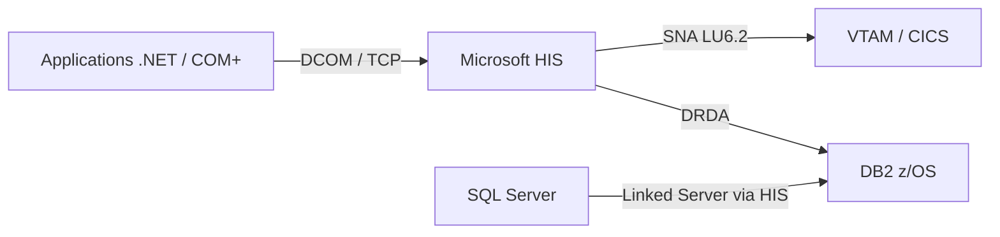
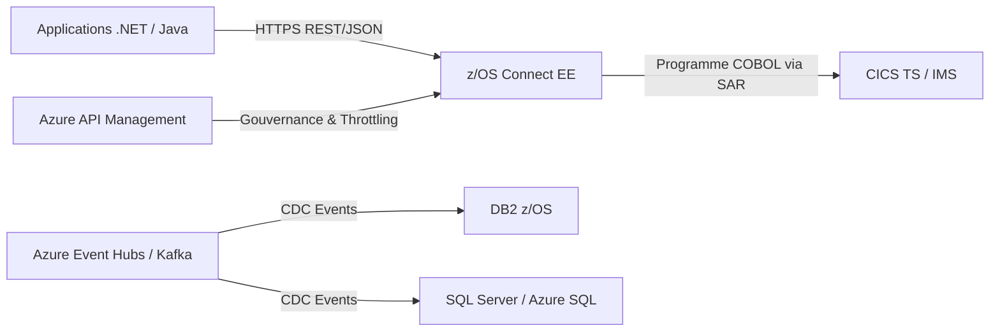

# PRD — Directive de rédaction : Étude d'opportunité de retrait de Microsoft Host Integration Server (HIS)

**Document cible :** `MS-HIS.md`
**Classification :** Confidentiel — Usage interne
**Version :** 1.0
**Date :** 2026-02-09
**Auteur :** Architecture de domaine — Interopérabilité & Modernisation

---

## Objet du présent document

Ce PRD (Product Requirements Document) constitue la **directive stricte** encadrant la rédaction de l'étude d'opportunité de retrait technologique `MS-HIS.md`. Chaque section ci-dessous définit les exigences de contenu, de profondeur d'analyse et de livrables attendus pour la section correspondante du document final. Aucune section du `MS-HIS.md` ne peut être rédigée sans respecter les contraintes énoncées ici.

---

## Table des matières

1. [Résumé Exécutif](#1-résumé-exécutif)
2. [Contexte et Alignement Stratégique](#2-contexte-et-alignement-stratégique)
3. [Analyse de l'État Actuel (As-Is)](#3-analyse-de-létat-actuel-as-is)
4. [Analyse des Risques du Statu Quo](#4-analyse-des-risques-du-statu-quo)
5. [Scénarios de Retrait](#5-scénarios-de-retrait)
6. [Étude Financière](#6-étude-financière)
7. [Recommandation — Architecture Cible (To-Be)](#7-recommandation--architecture-cible-to-be)
8. [Plan de Mise en Œuvre](#8-plan-de-mise-en-œuvre)
9. [Annexes](#9-annexes)

---

## 1. Résumé Exécutif

### Objectif de la section dans `MS-HIS.md`

Fournir aux décideurs (C-Level, VP Technologie, Directeurs d'architecture) une synthèse décisionnelle en **une page maximum**.

### Exigences de contenu

| # | Exigence | Obligatoire |
|---|----------|:-----------:|
| 1.1 | Énoncer la problématique en une phrase : HIS est une couche intermédiaire obsolète qui génère un couplage fort avec l'écosystème Microsoft pour l'accès au Mainframe. | Oui |
| 1.2 | Quantifier l'exposition au **Vendor Lock-in** : nombre de serveurs HIS, nombre de Transaction Integrator (TI) assemblies déployés, nombre de LU pools configurés. | Oui |
| 1.3 | Mettre en évidence la **simplification de la stack réseau** : élimination du protocole SNA/APPN, suppression du saut réseau intermédiaire (hop), réduction de la surface d'attaque. | Oui |
| 1.4 | Présenter la recommandation retenue (Option C — Refonte) et le ROI estimé sur 3 ans. | Oui |
| 1.5 | Inclure un tableau de synthèse « Avant / Après » en 5 lignes maximum. | Oui |

### Contraintes de rédaction

- Ton : **décisionnel**, pas technique.
- Aucun acronyme non défini.
- Inclure un indicateur visuel de risque (🔴 Critique / 🟡 Modéré / 🟢 Faible) pour le statu quo.

---

## 2. Contexte et Alignement Stratégique

### Objectif de la section dans `MS-HIS.md`

Démontrer que le retrait de HIS n'est pas un projet isolé mais un **accélérateur** des stratégies institutionnelles en cours.

### Exigences de contenu

| # | Exigence | Obligatoire |
|---|----------|:-----------:|
| 2.1 | Lier explicitement le retrait de HIS à la **stratégie Cloud-First** de l'institution : migration des workloads vers Azure/AWS, réduction de l'empreinte on-premise. | Oui |
| 2.2 | Lier le retrait à la **stratégie API-First** : exposition des services Mainframe via des API REST/JSON standardisées (OpenAPI 3.x), remplacement des intégrations point-à-point. | Oui |
| 2.3 | Référencer les cadres réglementaires pertinents (ex. : directive DORA, lignes directrices BSIF/OSFI sur la résilience opérationnelle) qui exigent la réduction de la dépendance envers les fournisseurs tiers. | Oui |
| 2.4 | Positionner le retrait dans la feuille de route de modernisation du Mainframe (z/OS Connect EE, CICS TS v6.x, zCX). | Oui |
| 2.5 | Inclure un diagramme de positionnement montrant HIS dans le paysage applicatif actuel et son élimination dans la cible. | Oui |

### Contraintes de rédaction

- Citer les documents stratégiques internes par référence (numéro de document ou titre exact).
- Inclure une matrice de traçabilité : Objectif stratégique ↔ Bénéfice du retrait de HIS.

---

## 3. Analyse de l'État Actuel (As-Is)

### Objectif de la section dans `MS-HIS.md`

Dresser un **inventaire exhaustif et vérifiable** de toutes les dépendances envers Microsoft HIS dans l'environnement de production.

### Exigences de contenu

#### 3.1 — Inventaire des composants HIS

Le document doit inclure un tableau détaillé avec les colonnes suivantes :

```
| Composant HIS        | Version | Serveur hôte    | OS / Patch Level | Rôle fonctionnel         | Domaine métier     | Criticité |
|-----------------------|---------|-----------------|-------------------|--------------------------|--------------------|-----------|
| SNA Gateway           | x.x     | SRV-HIS-01      | Win 2019 / CUxx   | Conversion TCP→SNA       | Paiements          | Critique  |
| Transaction Integrator| x.x     | SRV-HIS-02      | Win 2022 / CUxx   | Appel CICS via COM+/.NET | Gestion de comptes | Élevée    |
| ...                   | ...     | ...             | ...               | ...                      | ...                | ...       |
```

#### 3.2 — Cartographie des flux

| # | Exigence | Obligatoire |
|---|----------|:-----------:|
| 3.2.1 | Lister tous les **LU pools** (Local/Remote) configurés avec leur affectation aux régions CICS/IMS. | Oui |
| 3.2.2 | Inventorier les **TI assemblies** (.NET et COM+) : nom, version, interface CICS/IMS cible, programme COBOL/PL1 appelé, COMMAREA/Container utilisé. | Oui |
| 3.2.3 | Documenter les **Data Links** DB2 ↔ SQL Server : noms des Linked Servers, fréquence de synchronisation, volumétrie quotidienne. | Oui |
| 3.2.4 | Identifier les **dépendances amont/aval** : quelles applications .NET/Java appellent HIS, et quels programmes Mainframe sont exposés via HIS. | Oui |

#### 3.3 — Diagramme d'architecture As-Is

Le document `MS-HIS.md` **doit** inclure un diagramme d'architecture (format Mermaid ou draw.io) illustrant :



- Le diagramme doit montrer chaque protocole sur chaque lien.
- Chaque nœud doit être annoté avec la version logicielle.

---

## 4. Analyse des Risques du Statu Quo

### Objectif de la section dans `MS-HIS.md`

Démontrer que le **maintien de HIS en production constitue un risque croissant** et non une option stable.

### Exigences de contenu

Le document doit présenter les risques sous forme d'un registre structuré :

| ID | Catégorie | Risque | Impact | Probabilité | Niveau |
|----|-----------|--------|--------|-------------|--------|
| R-01 | Compétences | Pénurie critique de ressources maîtrisant SNA/APPN et le TI de HIS. Le bassin de talents se réduit chaque année. | Incapacité à maintenir ou dépanner l'infrastructure en cas d'incident majeur. | Élevée | 🔴 Critique |
| R-02 | Financier | Coûts de licence Windows Server + HIS (per-core licensing) en croissance continue. | Augmentation du TCO sans valeur ajoutée fonctionnelle. | Certaine | 🔴 Critique |
| R-03 | Sécurité | SNA/LU6.2 ne supporte pas nativement le chiffrement TLS 1.3. Surface d'attaque élargie par le hop intermédiaire. | Exposition à des vulnérabilités réseau non corrigeables. | Modérée | 🟡 Modéré |
| R-04 | Obsolescence | Microsoft a réduit l'investissement dans HIS. Cycle de support limité (fin de support étendu prévisible). | Risque de fonctionnement sur une plateforme non supportée. | Élevée | 🔴 Critique |
| R-05 | Opérationnel | Ajout d'un point de défaillance unique (SPOF) dans la chaîne d'intégration Mainframe. | Indisponibilité de services critiques en cas de panne HIS. | Modérée | 🟡 Modéré |

### Contraintes de rédaction

- Chaque risque doit être accompagné d'une **référence factuelle** (bulletin de sécurité Microsoft, annonce de fin de support, benchmark de marché RH).
- Inclure une section « Coût de l'inaction » chiffrée sur 5 ans.

---

## 5. Scénarios de Retrait

### Objectif de la section dans `MS-HIS.md`

Présenter **trois scénarios mutuellement exclusifs**, analysés selon des critères uniformes, pour permettre une décision éclairée.

### Critères d'évaluation uniformes

Chaque scénario **doit** être évalué selon la grille suivante :

| Critère | Description |
|---------|-------------|
| Complexité de mise en œuvre | Effort d'implémentation (Faible / Moyen / Élevé) |
| Réduction du Vendor Lock-in | Degré d'élimination de la dépendance Microsoft (Nulle / Partielle / Totale) |
| Impact sur la latence | Amélioration, dégradation ou neutralité sur les temps de réponse end-to-end |
| Coût d'investissement (CAPEX) | Estimation budgétaire initiale |
| Coût récurrent (OPEX) | Coûts annuels de fonctionnement post-migration |
| Risque de migration | Probabilité de régression fonctionnelle ou d'interruption de service |
| Alignement stratégique | Conformité avec les stratégies Cloud-First et API-First |

---

### 5.1 — Option A : Containment (Virtualisation / Conteneurisation de HIS)

#### Exigences de contenu

| # | Exigence | Obligatoire |
|---|----------|:-----------:|
| 5.1.1 | Décrire la stratégie : encapsuler les serveurs HIS existants dans des VMs ou conteneurs Windows (Azure VM, Windows Containers sur AKS). | Oui |
| 5.1.2 | Analyser les **limites** : cette approche ne supprime pas la dépendance SNA/LU6.2, ne réduit pas le lock-in, et ne simplifie pas l'architecture. | Oui |
| 5.1.3 | Identifier les cas d'usage valides : prolongation temporaire pour les flux à faible priorité pendant la migration des flux critiques. | Oui |
| 5.1.4 | Fournir un diagramme montrant l'architecture « conteneurisée ». | Oui |

#### Verdict attendu

> **Non recommandé comme solution permanente.** Acceptable uniquement comme mesure transitoire sur un horizon de 12 à 18 mois maximum.

---

### 5.2 — Option B : Remplacement COTS (Connecteurs tiers)

#### Exigences de contenu

| # | Exigence | Obligatoire |
|---|----------|:-----------:|
| 5.2.1 | Identifier les alternatives commerciales : **IBM CICS Transaction Gateway (CTG)**, Micro Focus Enterprise Server, Software AG EntireX. | Oui |
| 5.2.2 | Comparer chaque alternative selon les critères uniformes (§5 supra). | Oui |
| 5.2.3 | Analyser le risque de **substitution de lock-in** : remplacer une dépendance Microsoft par une dépendance IBM ou autre. | Oui |
| 5.2.4 | Documenter les prérequis d'infrastructure pour chaque alternative (JVM, z/OS USS, réseau TCP/IP direct). | Oui |

#### Tableau comparatif requis

```
| Critère                  | IBM CTG          | Micro Focus      | Software AG       |
|--------------------------|------------------|-------------------|-------------------|
| Protocole natif          | IPIC (TCP/IP)    | TCP/IP             | TCP/IP             |
| Élimination SNA          | Oui              | Oui                | Oui                |
| Support z/OS Connect     | Natif            | Via adaptateur     | Via adaptateur     |
| Coût licence estimé      | $xxx K/an        | $xxx K/an          | $xxx K/an          |
| Maturité marché          | Leader            | Challenger         | Niche              |
```

#### Verdict attendu

> **Acceptable mais sous-optimal.** Introduit une nouvelle dépendance commerciale sans aligner l'architecture sur la stratégie API-First.

---

### 5.3 — Option C : Refonte — Appels REST/JSON ou gRPC directs vers le Mainframe (Recommandée)

#### Exigences de contenu

| # | Exigence | Obligatoire |
|---|----------|:-----------:|
| 5.3.1 | Décrire l'architecture cible : appels **REST/JSON** (ou **gRPC/Protobuf**) directement depuis les applications .NET/Java vers **z/OS Connect EE** ou **CICS TS Web Services**. | Oui |
| 5.3.2 | Démontrer l'élimination complète du hop intermédiaire : Application → (HTTPS/TLS 1.3) → z/OS Connect → CICS/IMS. | Oui |
| 5.3.3 | Documenter le pattern de remplacement des TI assemblies : chaque TI assembly est remplacé par un appel HTTP vers un Service Archive (SAR) z/OS Connect mappé sur le même programme COBOL/COMMAREA. | Oui |
| 5.3.4 | Fournir un **exemple de code** illustrant le remplacement d'un appel TI par un appel REST. | Oui |
| 5.3.5 | Intégrer une architecture Event-Driven (Kafka / Azure Event Hubs) pour les flux de synchronisation de données DB2 ↔ SQL Server, en remplacement des Data Links HIS. | Oui |
| 5.3.6 | Proposer l'utilisation d'**Azure Logic Apps** ou **Azure API Management** comme couche d'orchestration et de gouvernance API pour les flux migrés. | Oui |

#### Exemple de code requis (§5.3.4)

Le document `MS-HIS.md` doit inclure un bloc comparatif avant/après :

**Avant — Appel via Transaction Integrator (C# / COM Interop) :**

```csharp
// Appel CICS via HIS Transaction Integrator (COM+ Interop)
Type tiType = Type.GetTypeFromProgID("HIS.TI.AccountInquiry");
dynamic tiProxy = Activator.CreateInstance(tiType);
tiProxy.SetConnectionString("SNA:LU62:CICSPROD");
var result = tiProxy.GetAccountBalance(accountNumber);
```

**Après — Appel REST direct vers z/OS Connect (HttpClient) :**

```csharp
// Appel direct REST vers z/OS Connect EE
using var client = new HttpClient();
client.BaseAddress = new Uri("https://zosconnect.bank.internal:9443");
client.DefaultRequestHeaders.Authorization =
    new AuthenticationHeaderValue("Bearer", await GetTokenAsync());

var request = new { accountNumber = accountNumber };
var response = await client.PostAsJsonAsync(
    "/zosConnect/apis/accountInquiry/v1/balance", request);
var result = await response.Content.ReadFromJsonAsync<AccountBalance>();
```

#### Diagramme d'architecture cible requis



#### Verdict attendu

> **Recommandé.** Élimine totalement le Vendor Lock-in Microsoft sur la couche d'intégration Mainframe, simplifie la stack réseau, réduit la latence, et aligne l'architecture sur les stratégies Cloud-First et API-First.

---

### Tableau comparatif de synthèse des trois options

Le document `MS-HIS.md` **doit** inclure le tableau suivant :

```
| Critère                       | Option A (Containment) | Option B (COTS)     | Option C (Refonte) ✅ |
|-------------------------------|------------------------|---------------------|-----------------------|
| Complexité                    | Faible                 | Moyenne             | Élevée                |
| Réduction Vendor Lock-in      | Nulle                  | Partielle (nouveau) | Totale                |
| Impact latence                | Neutre                 | Amélioré            | Fortement amélioré    |
| CAPEX estimé                  | $ Faible               | $$ Moyen            | $$$ Élevé             |
| OPEX annuel post-migration    | $$$ (inchangé)         | $$ Moyen            | $ Faible              |
| Risque de migration           | Faible                 | Moyen               | Élevé (mitigeable)    |
| Alignement stratégique        | ❌ Non                 | ⚠️ Partiel          | ✅ Total              |
| Horizon de vie                | 12-18 mois             | 5-7 ans             | 10+ ans               |
```

---

## 6. Étude Financière

### Objectif de la section dans `MS-HIS.md`

Fournir une **analyse financière rigoureuse** justifiant l'investissement dans le scénario recommandé (Option C).

### Exigences de contenu

| # | Exigence | Obligatoire |
|---|----------|:-----------:|
| 6.1 | Chiffrer le **coût annuel actuel** de HIS : licences Windows Server (per-core), licences HIS, maintenance, support Microsoft Premier/Unified, coûts RH (FTE spécialisés SNA). | Oui |
| 6.2 | Chiffrer le **CAPEX de migration** pour l'Option C : développement z/OS Connect SARs, refactoring des applications .NET, mise en place Kafka/Event Hubs, formation des équipes. | Oui |
| 6.3 | Chiffrer l'**OPEX post-migration** : coûts récurrents de la cible (licences z/OS Connect, Azure API Management, Kafka/Event Hubs). | Oui |
| 6.4 | Calculer le **ROI sur 3 ans et 5 ans** avec la formule : `ROI = (Économies cumulées - Investissement) / Investissement × 100`. | Oui |
| 6.5 | Présenter un **graphique de flux de trésorerie** (cash flow) annualisé montrant le point d'équilibre (break-even). | Oui |
| 6.6 | Inclure une **analyse de sensibilité** : variation du ROI si le nombre de TI assemblies à migrer est ±20% par rapport à l'estimation. | Oui |

### Tableau financier requis

```
| Poste                                | Année 0 (Invest.) | Année 1    | Année 2    | Année 3    | Total 3 ans |
|--------------------------------------|--------------------|------------|------------|------------|-------------|
| CAPEX — Développement & Migration    | -$X XXX K          | —          | —          | —          | -$X XXX K   |
| CAPEX — Infrastructure cible         | -$XXX K            | —          | —          | —          | -$XXX K     |
| OPEX — Coût actuel HIS (éliminé)     | —                  | +$XXX K    | +$XXX K    | +$XXX K    | +$X XXX K   |
| OPEX — Coût cible (nouveau)          | —                  | -$XXX K    | -$XXX K    | -$XXX K    | -$XXX K     |
| **Flux net**                         | **-$X XXX K**      | **+$XXX K**| **+$XXX K**| **+$XXX K**| **+$X XXX K**|
```

### Contraintes de rédaction

- Tous les montants doivent être présentés en **fourchettes** (optimiste / réaliste / pessimiste) pour refléter l'incertitude.
- Les hypothèses de calcul doivent être explicitement listées.
- Le coût des licences per-core doit être basé sur le modèle de tarification Microsoft en vigueur.

---

## 7. Recommandation — Architecture Cible (To-Be)

### Objectif de la section dans `MS-HIS.md`

Présenter l'architecture cible de manière **visuelle et sans ambiguïté**, en mettant en évidence l'élimination du hop intermédiaire.

### Exigences de contenu

| # | Exigence | Obligatoire |
|---|----------|:-----------:|
| 7.1 | Inclure un **diagramme de flux comparatif As-Is vs To-Be** côte à côte, montrant explicitement la suppression du nœud HIS. | Oui |
| 7.2 | Documenter les **protocoles et ports** utilisés dans l'architecture cible (HTTPS/443, gRPC/8443, Kafka/9093-TLS). | Oui |
| 7.3 | Définir les **standards techniques** imposés : OpenAPI 3.1, TLS 1.3 mutual auth, OAuth 2.0 / JWT pour l'authentification Mainframe, schémas Avro pour les événements Kafka. | Oui |
| 7.4 | Décrire le modèle de **gouvernance API** : cycle de vie des API (versioning, deprecation), portail développeur, monitoring (SLA/SLO). | Oui |
| 7.5 | Spécifier les exigences de **résilience** : retry policies, circuit breaker, fallback, observabilité (OpenTelemetry → Splunk/Datadog). | Oui |

### Diagramme comparatif requis (§7.1)

```
┌─────────────────────────────────────────────────────────────────────────────┐
│                          AVANT (As-Is)                                      │
│                                                                             │
│  App .NET ──► [HIS TI - COM+] ──► [SNA Gateway] ──► [VTAM] ──► CICS       │
│       3 sauts          2 protocoles (TCP + SNA)         Latence: ~45ms      │
│                                                                             │
├─────────────────────────────────────────────────────────────────────────────┤
│                          APRÈS (To-Be)                                      │
│                                                                             │
│  App .NET ──► [z/OS Connect EE] ──► CICS                                   │
│       1 saut           1 protocole (HTTPS)              Latence: ~12ms      │
│                                                                             │
└─────────────────────────────────────────────────────────────────────────────┘
```

### Contraintes de rédaction

- Les diagrammes doivent être reproductibles (Mermaid, PlantUML, ou ASCII art dans le Markdown).
- Chaque composant du diagramme doit être accompagné de sa version logicielle cible.

---

## 8. Plan de Mise en Œuvre

### Objectif de la section dans `MS-HIS.md`

Définir une stratégie de migration **progressive, par domaine fonctionnel**, avec des critères de bascule clairs.

### Contrainte absolue

> ⛔ **Toute approche « Big Bang » est interdite.** La migration doit se faire domaine par domaine, avec une période de coexistence (dual-run) et des critères de validation avant chaque bascule.

### Exigences de contenu

| # | Exigence | Obligatoire |
|---|----------|:-----------:|
| 8.1 | Définir les **domaines fonctionnels** et leur ordre de migration basé sur : criticité, complexité, nombre de TI assemblies, dépendances inter-domaines. | Oui |
| 8.2 | Pour chaque domaine, spécifier les **critères de bascule (Go/No-Go)** : tests de non-régression passés, latence ≤ seuil, taux d'erreur < 0.1%, validation métier signée. | Oui |
| 8.3 | Définir la stratégie de **dual-run** : pendant la période de coexistence, les appels sont routés en parallèle vers HIS et z/OS Connect, avec comparaison automatique des résultats. | Oui |
| 8.4 | Inclure un **diagramme de Gantt** (ou chronogramme) couvrant 18 à 24 mois. | Oui |
| 8.5 | Identifier les **dépendances externes** : équipe Mainframe (z/OS Connect), équipe réseau (ouverture de flux TCP directs), équipe sécurité (certificats mTLS, règles firewall). | Oui |
| 8.6 | Définir la stratégie de **rollback** : pour chaque domaine migré, capacité de retour sur HIS en moins de 30 minutes. | Oui |
| 8.7 | Spécifier les **métriques de succès** post-migration : réduction de latence, élimination des incidents liés à SNA, satisfaction des équipes de développement. | Oui |

### Plan de migration type (à adapter)

```
| Phase | Domaine fonctionnel     | Durée   | TI Assemblies | Prérequis                          |
|-------|-------------------------|---------|---------------|------------------------------------|
| 1     | Consultation de comptes | 3 mois  | 8             | z/OS Connect SARs déployés         |
| 2     | Paiements domestiques   | 4 mois  | 12            | Phase 1 validée, Kafka CDC actif   |
| 3     | Paiements internationaux| 4 mois  | 15            | Phase 2 validée, mTLS configuré    |
| 4     | Gestion des prêts       | 3 mois  | 6             | Phase 3 validée                    |
| 5     | Reporting réglementaire | 2 mois  | 4             | Phase 4 validée                    |
| 6     | Décommissionnement HIS  | 2 mois  | —             | Toutes phases validées, dual-run OK|
```

---

## 9. Annexes

### Exigences de contenu

Le document `MS-HIS.md` doit inclure les annexes suivantes :

| Annexe | Contenu | Obligatoire |
|--------|---------|:-----------:|
| A | Glossaire des termes techniques (SNA, LU6.2, APPN, TI, COMMAREA, SAR, DRDA, IPIC, CDC). | Oui |
| B | Inventaire complet des TI assemblies (extrait de la CMDB ou du registre de configuration). | Oui |
| C | Matrice RACI du projet de retrait. | Oui |
| D | Références documentaires : bulletins Microsoft, documentation z/OS Connect, benchmarks de performance. | Oui |
| E | Procès-verbaux des ateliers de découverte (discovery workshops) avec les équipes applicatives. | Recommandé |

---

## Directives transversales de rédaction du `MS-HIS.md`

### Ton et style

| Directive | Description |
|-----------|-------------|
| Professionnel et incisif | Style direct, orienté prise de décision. Pas de verbiage. Chaque phrase doit apporter de la valeur. |
| Factuel | Chaque affirmation doit être soutenue par une donnée, une référence ou une estimation chiffrée. |
| Orienté risques | Les risques opérationnels et de sécurité doivent être mis en avant, pas les considérations purement techniques. |

### Format et mise en page

| Élément | Règle |
|---------|-------|
| Listes à puces | Utiliser pour toute énumération de 3 éléments ou plus. |
| Tableaux | Obligatoires pour toute comparaison ou tout inventaire. |
| Blocs de code | Obligatoires pour tout exemple technique (C#, JSON, YAML, config). |
| Diagrammes | Format Mermaid privilégié (rendu natif dans GitHub/Azure DevOps). ASCII art acceptable. |
| Longueur cible | 20-30 pages (hors annexes). |
| En-têtes | Numérotation hiérarchique (1, 1.1, 1.1.1). |

### Critères d'acceptation du `MS-HIS.md`

Le document sera considéré comme **complet et recevable** lorsque :

- [ ] Toutes les sections marquées « Obligatoire » dans ce PRD sont présentes et conformes.
- [ ] Tous les diagrammes requis sont inclus et lisibles.
- [ ] Tous les tableaux comparatifs sont remplis avec des données réelles ou des estimations documentées.
- [ ] L'analyse financière inclut un ROI chiffré sur 3 ans minimum.
- [ ] Le plan de mise en œuvre respecte la contrainte anti-Big Bang.
- [ ] Le document a été révisé par : Architecture, Sécurité, Finance, et les équipes Mainframe.
- [ ] Un exemple de code avant/après est fourni pour au moins un flux migré.

---

*Fin du PRD — Ce document constitue la référence unique pour la rédaction de `MS-HIS.md`.*
