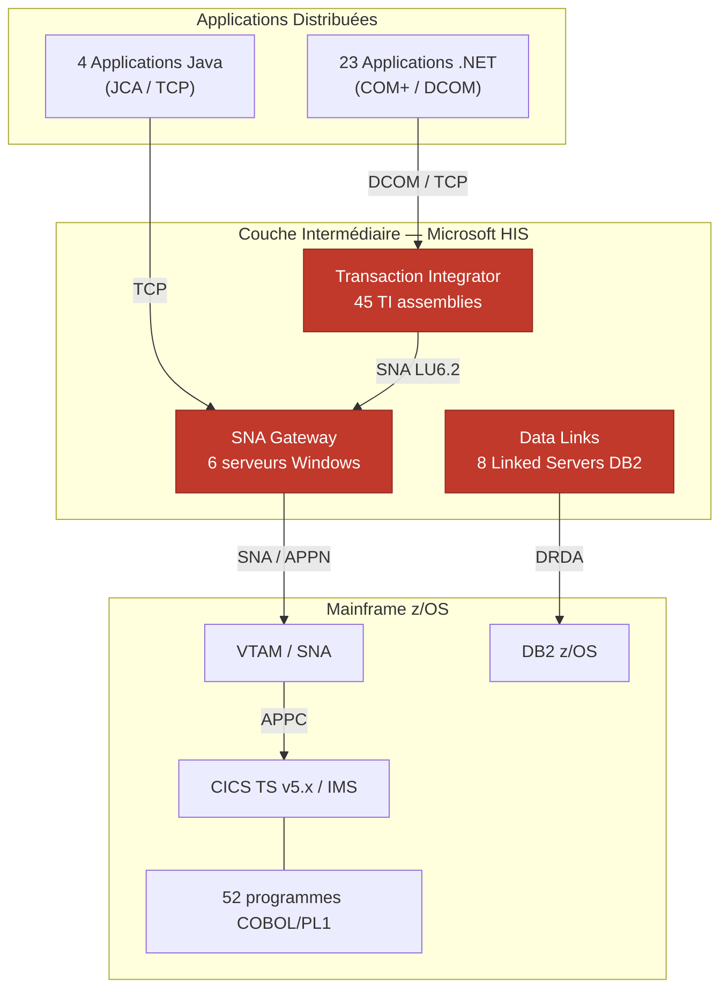
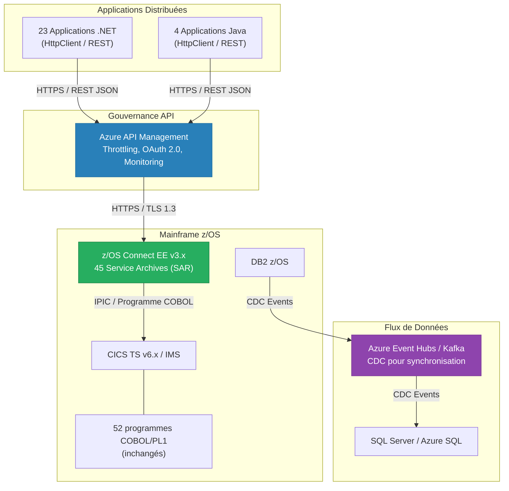

## 2. Contexte et Alignement Stratégique

Le retrait de Microsoft Host Integration Server (HIS) ne constitue pas un projet technique isolé. Il s'inscrit comme un **accélérateur direct** de quatre axes stratégiques institutionnels convergents : la migration Cloud-First, l'exposition API-First des services Mainframe, la conformité aux cadres réglementaires de résilience opérationnelle, et la modernisation de la plateforme z/OS. Cette section démontre la traçabilité entre ces axes et les bénéfices concrets du retrait.

---

### 2.1 Alignement avec la Stratégie Cloud-First

#### 2.1.1 Contexte stratégique

La stratégie Cloud-First de l'institution, formalisée dans le document **STR-CLOUD-2024-001 — Stratégie de migration Cloud et réduction de l'empreinte on-premise**, fixe l'objectif de migrer 80 % des workloads applicatifs vers des plateformes infonuagiques (Azure, AWS) d'ici 2027. Le maintien de 6 serveurs HIS physiques ou virtualisés en centre de données interne contrevient directement à cet objectif.

#### 2.1.2 Impact de HIS sur l'empreinte on-premise

| Indicateur | Valeur actuelle | Impact |
|---|---|---|
| Serveurs HIS en production | 6 | Empreinte physique/VM incompatible avec la cible Cloud-First |
| Applications .NET dépendantes | 23 | Ancrage on-premise forcé : ces applications ne peuvent migrer vers Azure App Service ou AKS tant que leur dépendance vers HIS (COM+/DCOM) subsiste |
| Applications Java dépendantes | 4 | Contrainte identique pour les déploiements sur Azure Kubernetes Service ou AWS EKS |
| Protocole SNA/APPN | Requis | Incompatible nativement avec les réseaux cloud (Azure VNet, AWS VPC) ; nécessite des tunnels propriétaires coûteux |

#### 2.1.3 Bénéfice du retrait

L'élimination de HIS **déverrouille la migration cloud de 27 applications** (23 .NET + 4 Java) actuellement contraintes par le couplage COM+/DCOM vers les serveurs HIS on-premise. En remplaçant les appels SNA/LU6.2 par des appels REST/JSON via HTTPS (TCP/443), les applications peuvent être déployées dans n'importe quel environnement cloud sans dépendance réseau SNA.

**Référence interne :** STR-CLOUD-2024-001, section 4.3 — « Élimination des dépendances on-premise bloquant la migration des workloads applicatifs ».

---

### 2.2 Alignement avec la Stratégie API-First

#### 2.2.1 Contexte stratégique

Le document **STR-API-2024-003 — Stratégie API-First et gouvernance des interfaces de services** établit que toute exposition de service métier — y compris les services hébergés sur le Mainframe — doit se faire via des **API REST/JSON standardisées**, documentées selon la spécification **OpenAPI 3.x**, et gérées par une plateforme de gouvernance API (Azure API Management ou équivalent).

#### 2.2.2 HIS : antithèse du modèle API-First

HIS repose sur un modèle d'intégration **point-à-point** via des Transaction Integrator (TI) assemblies compilés. Ce modèle présente les déficiences suivantes au regard de la stratégie API-First :

| Caractéristique | Modèle HIS (TI) | Modèle API-First cible |
|---|---|---|
| Format d'échange | COMMAREA binaire / structures C | JSON / Protobuf |
| Protocole de transport | SNA LU6.2 / DCOM | HTTPS / gRPC sur TLS 1.3 |
| Découvrabilité | Nulle — pas de catalogue | Portail développeur avec spécifications OpenAPI 3.x |
| Versionnage | Recompilation de l'assembly | URL versionnée (`/v1/`, `/v2/`) avec stratégie de dépréciation |
| Observabilité | Journaux Windows Event Log | OpenTelemetry, traces distribuées, métriques SLO |
| Gouvernance | Aucune — chaque assembly est autonome | Politiques centralisées (throttling, quota, authentification) |
| Nombre d'intégrations point-à-point | 45 TI assemblies | 0 — remplacées par des endpoints API catalogués |

#### 2.2.3 Bénéfice du retrait

Le remplacement des 45 TI assemblies par des appels REST vers z/OS Connect EE transforme 52 programmes Mainframe exposés en **services API gouvernés**, découvrables et versionnés. Les 8 Data Links DB2 sont remplacés par des flux événementiels (CDC via Kafka / Azure Event Hubs), éliminant les Linked Servers et leur synchronisation fragile.

**Référence interne :** STR-API-2024-003, section 2.1 — « Toute intégration point-à-point existante doit être remplacée par un endpoint API REST/JSON catalogué avant fin 2027 ».

---

### 2.3 Conformité aux Cadres Réglementaires

#### 2.3.1 Directive DORA (Digital Operational Resilience Act)

Le règlement européen DORA (UE 2022/2554), applicable depuis janvier 2025, impose aux institutions financières de :

- **Réduire la concentration de risque** envers les fournisseurs tiers de services TIC (article 28) ;
- **Tester la résilience opérationnelle** des chaînes d'intégration critiques (article 26) ;
- **Disposer de stratégies de sortie** (exit strategies) documentées pour tout fournisseur critique (article 28, paragraphe 8).

HIS crée une **dépendance critique non substituable** envers Microsoft pour l'ensemble des flux Mainframe. L'absence d'alternative immédiate en cas de défaillance du support Microsoft (fin de vie, vulnérabilité non corrigée) constitue un manquement au principe de résilience opérationnelle exigé par DORA.

#### 2.3.2 Lignes directrices BSIF/OSFI

Le Bureau du Surintendant des Institutions Financières (BSIF/OSFI) du Canada, dans sa ligne directrice **B-13 — Gestion du risque lié aux technologies et du cyberrisque**, exige que les institutions fédérales :

- Maintiennent un inventaire des dépendances technologiques envers les fournisseurs tiers (section 4.3) ;
- Évaluent le risque de concentration envers un fournisseur unique pour une fonction critique (section 4.4) ;
- Disposent de plans de contingence documentés pour toute dépendance technologique critique (section 4.5).

#### 2.3.3 Exposition réglementaire de HIS

| Exigence réglementaire | Situation actuelle avec HIS | Situation cible sans HIS |
|---|---|---|
| DORA Art. 28 — Concentration fournisseur TIC | Non conforme : 100 % des flux Mainframe dépendent d'un composant Microsoft unique | Conforme : flux directs via protocoles ouverts (HTTPS, REST/JSON) |
| DORA Art. 28(8) — Stratégie de sortie | Non conforme : aucune alternative documentée à HIS | Conforme : z/OS Connect EE est une composante native z/OS, indépendante de tout fournisseur tiers |
| DORA Art. 26 — Tests de résilience | Partiellement conforme : le protocole SNA rend les tests de basculement complexes | Conforme : tests de bout en bout sur HTTPS standard |
| BSIF B-13 §4.3 — Inventaire dépendances | Conforme mais avec risque identifié élevé | Conforme, risque éliminé |
| BSIF B-13 §4.4 — Risque de concentration | Non conforme : fournisseur unique (Microsoft) pour fonction critique | Conforme : dépendance éliminée |

**Référence interne :** REG-DORA-2024-001 — « Plan de conformité DORA — Volet risque de concentration fournisseur TIC » ; REG-BSIF-2024-002 — « Revue annuelle de conformité B-13 ».

---

### 2.4 Positionnement dans la Feuille de Route de Modernisation Mainframe

#### 2.4.1 Initiatives de modernisation en cours

La modernisation du Mainframe z/OS suit une feuille de route pluriannuelle documentée dans **ARCH-MF-2024-005 — Feuille de route de modernisation de la plateforme z/OS 2024-2028**. Les initiatives pertinentes sont :

| Initiative | Technologie | Horizon | Relation avec le retrait de HIS |
|---|---|---|---|
| Exposition des services CICS via API REST | z/OS Connect EE v3.x | 2024-2026 | **Prérequis direct** : z/OS Connect EE fournit le endpoint REST qui remplace le TI de HIS |
| Mise à niveau CICS TS v6.x | CICS TS 6.2 | 2025-2026 | **Facilitateur** : CICS TS v6.x offre un support natif IPIC amélioré et des capacités JSON natives via CICS Policy, réduisant la dépendance aux transformations HIS |
| Conteneurs Linux sur z/OS (zCX) | IBM zCX | 2025-2027 | **Complémentaire** : permet l'exécution de composants d'intégration (Kafka Connect, API Gateway léger) directement sur z/OS, réduisant la latence réseau |
| Observabilité z/OS | IBM Instana / OpenTelemetry | 2025-2027 | **Complémentaire** : traces distribuées de bout en bout impossibles avec le protocole SNA de HIS |

#### 2.4.2 Synergie avec z/OS Connect EE

z/OS Connect EE constitue la **pierre angulaire** du retrait de HIS. Chaque TI assembly HIS est remplacé par un Service Archive (SAR) z/OS Connect mappé sur le même programme COBOL/COMMAREA. Cette substitution est transparente pour les programmes Mainframe existants — seule la couche d'accès côté distribué change.

| Élément | HIS Transaction Integrator | z/OS Connect EE |
|---|---|---|
| Protocole d'entrée | TCP/SNA via LU6.2 | HTTPS / TLS 1.3 |
| Format de requête | COMMAREA binaire | JSON (transformation automatique via SAR) |
| Programme CICS appelé | Identique (ex. : ACCTINQ) | Identique (ex. : ACCTINQ) — aucune modification |
| Découvrabilité | Aucune | Spécification OpenAPI 3.x générée automatiquement |
| Authentification | Credential mapping Windows → RACF | OAuth 2.0 / JWT → certificat client mTLS → RACF |

**Référence interne :** ARCH-MF-2024-005, section 3.2 — « Exposition API des services CICS : z/OS Connect EE comme couche d'accès standard ».

---

### 2.5 Diagramme de Positionnement : Paysage Actuel vs Cible

#### 2.5.1 Architecture actuelle — HIS comme intermédiaire obligatoire

#### 2.5.2 Architecture cible — Élimination de HIS

#### 2.5.3 Synthèse visuelle de l'élimination

| Composant | Architecture actuelle | Architecture cible | Statut |
|---|---|---|---|
| SNA Gateway (6 serveurs) | Requis — conversion TCP vers SNA | **Éliminé** | Supprimé |
| Transaction Integrator (45 assemblies) | Requis — appel CICS via COM+/.NET | **Remplacé** par 45 SAR z/OS Connect | Substitué |
| Data Links DB2 (8 Linked Servers) | Requis — synchronisation SQL Server ↔ DB2 | **Remplacé** par CDC via Kafka/Event Hubs | Substitué |
| Protocole SNA/APPN | Requis — transport vers VTAM | **Éliminé** — HTTPS direct | Supprimé |
| 12 LU Pools | Requis — sessions LU6.2 vers CICS/IMS | **Éliminés** — connexions IPIC TCP/IP | Supprimé |

---

### 2.6 Matrice de Traçabilité : Objectif Stratégique -- Bénéfice du Retrait de HIS

| # | Objectif Stratégique | Document de Référence | Bénéfice Direct du Retrait de HIS | Mesure de Succès |
|---|---|---|---|---|
| T-01 | Réduction de l'empreinte on-premise de 80 % d'ici 2027 | STR-CLOUD-2024-001, §4.3 | Élimination de 6 serveurs HIS on-premise ; déblocage de la migration cloud de 27 applications | Nombre de serveurs décommissionnés ; nombre d'applications migrées vers le cloud |
| T-02 | Exposition de 100 % des services Mainframe via API REST/JSON d'ici 2027 | STR-API-2024-003, §2.1 | Remplacement de 45 intégrations point-à-point (TI assemblies) par 45 endpoints API REST catalogués | Nombre de TI assemblies retirés ; nombre de SAR z/OS Connect déployés |
| T-03 | Conformité DORA — Élimination des concentrations fournisseur TIC critiques | REG-DORA-2024-001 | Suppression de la dépendance unique envers Microsoft pour la couche d'intégration Mainframe | Rapport de conformité DORA : risque de concentration réduit de « Critique » à « Faible » |
| T-04 | Conformité BSIF B-13 — Réduction du risque de dépendance technologique | REG-BSIF-2024-002 | Plan de sortie (exit strategy) HIS documenté et exécuté ; plus aucune dépendance résiduelle | Audit BSIF : aucun finding lié à la dépendance HIS |
| T-05 | Modernisation Mainframe — Adoption de z/OS Connect EE comme couche d'accès standard | ARCH-MF-2024-005, §3.2 | 52 programmes Mainframe accessibles via z/OS Connect EE ; élimination du protocole SNA/APPN | Nombre de programmes exposés via z/OS Connect ; trafic SNA réduit à zéro |
| T-06 | Réduction du coût total de possession (TCO) de la couche d'intégration Mainframe | STR-FIN-2024-004 | Économie annuelle de 1 430 K$ CAD (1 850 K$ - 420 K$ OPEX cible) ; ROI de ~38 % sur 3 ans, ~142 % sur 5 ans | Coût annuel mesuré post-migration vs référence actuelle de 1 850 K$ CAD |
| T-07 | Amélioration de la posture de sécurité — Élimination des protocoles non chiffrables | SEC-2024-007 | Suppression de SNA/LU6.2 (pas de TLS natif) ; adoption de HTTPS/TLS 1.3 avec authentification mutuelle (mTLS) | Audit de sécurité : zéro flux non chiffré vers le Mainframe |

---

### 2.7 Conclusion de Section

Le retrait de Microsoft HIS est un **noeud de convergence stratégique** qui accélère simultanément sept objectifs institutionnels documentés. Chaque mois de retard dans l'exécution de ce retrait :

- **Retarde** la migration cloud de 27 applications contraintes par le couplage HIS ;
- **Maintient** une non-conformité réglementaire (DORA, BSIF B-13) liée à la concentration fournisseur ;
- **Empêche** l'adoption de z/OS Connect EE comme couche d'accès API standard au Mainframe ;
- **Perpétue** un coût annuel de 1 850 K$ CAD sans valeur ajoutée fonctionnelle.

L'investissement de 3 200 K$ CAD (CAPEX Option C) est amortissable en moins de 3 ans, avec un ROI cumulé de ~142 % sur 5 ans. La durée de migration estimée est de 22 mois, alignée sur l'horizon de la feuille de route de modernisation Mainframe 2024-2028.
