## 3. Analyse de l'État Actuel (As-Is)

> **Objectif** : Fournir un inventaire exhaustif et vérifiable de l'ensemble des dépendances Microsoft Host Integration Server (HIS) dans l'environnement de production, afin d'établir la ligne de base (*baseline*) sur laquelle s'appuiera la stratégie de retrait.

L'environnement HIS actuel comprend **6 serveurs**, **45 assemblages TI**, **12 pools LU**, **8 liens de données DB2**, **23 applications .NET dépendantes**, **4 applications Java dépendantes** et **52 programmes mainframe exposés**. Le coût annuel de fonctionnement s'élève à **1 850 K$ CAD**. Les sous-sections suivantes détaillent chaque couche de cette infrastructure.

---

### 3.1 — Inventaire des composants HIS

L'inventaire ci-dessous a été constitué à partir des données CMDB, des audits de configuration Active Directory et des relevés manuels effectués sur chaque serveur. Chaque entrée a été validée par l'équipe d'exploitation mainframe et l'équipe infrastructure Windows.

#### 3.1.1 — Serveurs HIS en production

| # | Composant HIS | Version | Serveur hôte | OS / Patch Level | Rôle fonctionnel | Domaine métier | Criticité |
|---|---------------|---------|--------------|------------------|------------------|----------------|-----------|
| 1 | HIS Runtime + SNA Gateway | HIS 2020 CU4 | SRV-HIS-01 | Windows Server 2019 Std (KB5034127) | Passerelle SNA principale — gère 8 des 12 pools LU vers VTAM/CICS. Point d'entrée SNA LU6.2 pour l'ensemble des transactions en ligne. | Opérations bancaires (Core Banking) | **Critique** |
| 2 | HIS Runtime + Transaction Integrator (TI) | HIS 2020 CU4 | SRV-HIS-02 | Windows Server 2019 Std (KB5034127) | Héberge 28 assemblages TI (.NET) pour les transactions CICS en temps réel. Expose les programmes COBOL via des interfaces WCF/TCP. | Opérations bancaires (Core Banking) | **Critique** |
| 3 | HIS Runtime + Transaction Integrator (TI) | HIS 2020 CU3 | SRV-HIS-03 | Windows Server 2019 Std (KB5033914) | Héberge 17 assemblages TI (COM+ et .NET) pour les transactions IMS et traitements par lots déclenchés. | Prêts et financements | **Élevée** |
| 4 | HIS Runtime + Data Links (DRDA) | HIS 2020 CU4 | SRV-HIS-04 | Windows Server 2022 Std (KB5034129) | Fournisseur OLE DB/DRDA pour les 8 Linked Servers SQL Server ↔ DB2 z/OS. Synchronisation bidirectionnelle des données référentielles. | Données de référence (MDM) | **Critique** |
| 5 | HIS Runtime + SNA Gateway (secours) | HIS 2020 CU4 | SRV-HIS-05 | Windows Server 2019 Std (KB5034127) | Passerelle SNA secondaire — bascule automatique (*failover*) pour SRV-HIS-01. Gère les 4 pools LU restants et le trafic IMS. | Opérations bancaires / Assurances | **Élevée** |
| 6 | HIS Runtime + Session Integrator + Print Service | HIS 2016 CU10 | SRV-HIS-06 | Windows Server 2016 Std (KB5034119) | Émulation 3270/5250 pour les agents du centre d'appels. Service d'impression mainframe (LU1/LU3) pour la production de relevés. | Service à la clientèle | **Moyenne** |

**Observations clés :**

- SRV-HIS-06 fonctionne encore sous HIS 2016, une version dont le support étendu prend fin en 2025. Une mise à niveau serait nécessaire si le retrait n'est pas complété à temps.
- SRV-HIS-01 et SRV-HIS-05 forment une paire active/passive pour la haute disponibilité SNA. Le mécanisme de bascule repose sur le service HIS Hot Backup et non sur le clustering Windows.
- SRV-HIS-02 et SRV-HIS-03 concentrent la totalité des 45 assemblages TI, répartis entre les interfaces CICS (28) et IMS (17).
- SRV-HIS-04 est le point unique de passage (*single point of failure*) pour l'intégration de données DB2. Aucune redondance n'est en place pour le rôle Data Links.

#### 3.1.2 — Licences et contrats de support

| Élément | Détail |
|---------|--------|
| Licences HIS | 6 licences serveur Microsoft HIS (incluses dans le contrat EA) |
| Support Microsoft Premier | Couverture A (réponse 1 h) pour SRV-HIS-01, -02, -04 ; Couverture C pour les autres |
| Coût annuel total | **1 850 K$ CAD** (licences, support, exploitation, maintenance corrective) |
| Fin de support HIS 2016 | Octobre 2025 (support étendu) |
| Fin de support HIS 2020 | Janvier 2031 (support étendu) |

---

### 3.2 — Cartographie des flux

#### 3.2.1 — Pools LU (Local/Remote) et affectation aux régions CICS/IMS

Les 12 pools LU configurés assurent la connectivité SNA entre les serveurs HIS et les sous-systèmes mainframe. Chaque pool est dimensionné selon le volume transactionnel du domaine métier qu'il dessert.

| # | Nom du pool LU | Type | Mode LU | Serveur HIS | Région CICS/IMS cible | VTAM APPL | Sessions max | Utilisation moyenne | Domaine métier |
|---|----------------|------|---------|-------------|----------------------|-----------|-------------|---------------------|----------------|
| 1 | POOL-CICS-CORE-01 | Remote APPC | LU 6.2 | SRV-HIS-01 | CICSPROD1 | APROD1 | 120 | 78 % | Core Banking — comptes |
| 2 | POOL-CICS-CORE-02 | Remote APPC | LU 6.2 | SRV-HIS-01 | CICSPROD2 | APROD2 | 120 | 65 % | Core Banking — virements |
| 3 | POOL-CICS-LOAN-01 | Remote APPC | LU 6.2 | SRV-HIS-01 | CICSLOAN1 | ALOAN1 | 60 | 52 % | Prêts personnels |
| 4 | POOL-CICS-LOAN-02 | Remote APPC | LU 6.2 | SRV-HIS-01 | CICSLOAN2 | ALOAN2 | 60 | 41 % | Prêts hypothécaires |
| 5 | POOL-CICS-INS-01 | Remote APPC | LU 6.2 | SRV-HIS-01 | CICSINS1 | AINS01 | 40 | 35 % | Assurances |
| 6 | POOL-CICS-PAY-01 | Remote APPC | LU 6.2 | SRV-HIS-01 | CICSPAY1 | APAY01 | 80 | 71 % | Paiements |
| 7 | POOL-CICS-FX-01 | Remote APPC | LU 6.2 | SRV-HIS-01 | CICSFX01 | AFX001 | 40 | 28 % | Change et trésorerie |
| 8 | POOL-CICS-CRM-01 | Remote APPC | LU 6.2 | SRV-HIS-01 | CICSCRM1 | ACRM01 | 30 | 45 % | Service à la clientèle |
| 9 | POOL-IMS-CORE-01 | Remote APPC | LU 6.2 | SRV-HIS-05 | IMSPROD1 | IAPRD1 | 80 | 60 % | Core Banking — grand livre |
| 10 | POOL-IMS-LOAN-01 | Remote APPC | LU 6.2 | SRV-HIS-05 | IMSLOAN1 | IALN01 | 40 | 38 % | Prêts — calcul d'amortissement |
| 11 | POOL-3270-AGENT-01 | Local LUA | LU 2 | SRV-HIS-06 | CICSPROD1 | SCRN01 | 200 | 55 % | Émulation écran — agents |
| 12 | POOL-PRINT-01 | Local LUA | LU 1/LU 3 | SRV-HIS-06 | CICSPROD1 | PRNT01 | 20 | 30 % | Impression mainframe |

**Observations clés :**

- Les pools 1 à 8 transitent par SRV-HIS-01 (passerelle SNA principale). En cas de défaillance, SRV-HIS-05 prend le relais pour les pools 1 à 8 via le mécanisme Hot Backup.
- Les pools 9 et 10 (IMS) sont gérés exclusivement par SRV-HIS-05 ; il n'existe pas de redondance dédiée pour ces flux IMS.
- Les pools 11 et 12 (émulation 3270 et impression) sont hébergés sur SRV-HIS-06 et ne disposent d'aucun mécanisme de bascule.
- Le pool POOL-CICS-CORE-01 présente un taux d'utilisation de 78 %, proche du seuil d'alerte fixé à 80 %. Un dimensionnement à la hausse devra être pris en compte dans l'architecture cible.

#### 3.2.2 — Inventaire des assemblages Transaction Integrator (TI)

Les 45 assemblages TI constituent la couche d'intégration programmatique entre les applications distribuées et les programmes mainframe. Ils sont répartis entre SRV-HIS-02 (28 assemblages CICS) et SRV-HIS-03 (17 assemblages IMS/COM+).

##### 3.2.2.1 — Assemblages TI hébergés sur SRV-HIS-02 (CICS — .NET / WCF)

| # | Nom de l'assemblage | Version | Technologie | Interface CICS cible | Programme COBOL/PL1 appelé | Zone d'échange | Taille (octets) | Appels/jour |
|---|---------------------|---------|-------------|---------------------|---------------------------|----------------|-----------------|-------------|
| 1 | BNK.Accounts.Inquiry.TI | 4.2.1 | .NET (WCF) | CICS TS 5.6 — CICSPROD1 | ACCTINQ0 (COBOL) | COMMAREA | 2 048 | 45 000 |
| 2 | BNK.Accounts.Update.TI | 4.2.1 | .NET (WCF) | CICS TS 5.6 — CICSPROD1 | ACCTUPD0 (COBOL) | COMMAREA | 4 096 | 18 000 |
| 3 | BNK.Accounts.Open.TI | 3.8.0 | .NET (WCF) | CICS TS 5.6 — CICSPROD1 | ACCTOPN0 (COBOL) | COMMAREA | 3 072 | 2 200 |
| 4 | BNK.Accounts.Close.TI | 3.8.0 | .NET (WCF) | CICS TS 5.6 — CICSPROD1 | ACCTCLS0 (COBOL) | COMMAREA | 2 048 | 450 |
| 5 | BNK.Transfer.Domestic.TI | 5.0.3 | .NET (WCF) | CICS TS 5.6 — CICSPROD2 | XFRDMS00 (COBOL) | Container (Channel) | 8 192 | 32 000 |
| 6 | BNK.Transfer.Intl.TI | 5.0.3 | .NET (WCF) | CICS TS 5.6 — CICSPROD2 | XFRINT00 (COBOL) | Container (Channel) | 12 288 | 5 600 |
| 7 | BNK.Transfer.Batch.TI | 4.1.0 | .NET (WCF) | CICS TS 5.6 — CICSPROD2 | XFRBAT00 (COBOL) | COMMAREA | 6 144 | 800 |
| 8 | LN.PersonalLoan.Calc.TI | 3.5.2 | .NET (WCF) | CICS TS 5.6 — CICSLOAN1 | LNCALC00 (COBOL) | COMMAREA | 2 048 | 8 500 |
| 9 | LN.PersonalLoan.Create.TI | 3.5.2 | .NET (WCF) | CICS TS 5.6 — CICSLOAN1 | LNCREA00 (COBOL) | COMMAREA | 4 096 | 1 200 |
| 10 | LN.PersonalLoan.Status.TI | 3.5.0 | .NET (WCF) | CICS TS 5.6 — CICSLOAN1 | LNSTAT00 (COBOL) | COMMAREA | 1 024 | 12 000 |
| 11 | LN.Mortgage.Calc.TI | 3.6.1 | .NET (WCF) | CICS TS 5.6 — CICSLOAN2 | MTCALC00 (COBOL) | COMMAREA | 2 048 | 6 400 |
| 12 | LN.Mortgage.Create.TI | 3.6.1 | .NET (WCF) | CICS TS 5.6 — CICSLOAN2 | MTCREA00 (COBOL) | COMMAREA | 4 096 | 400 |
| 13 | LN.Mortgage.Amort.TI | 3.6.0 | .NET (WCF) | CICS TS 5.6 — CICSLOAN2 | MTAMRT00 (COBOL) | Container (Channel) | 16 384 | 3 200 |
| 14 | INS.Policy.Inquiry.TI | 2.9.4 | .NET (WCF) | CICS TS 5.6 — CICSINS1 | INSINQ00 (COBOL) | COMMAREA | 2 048 | 7 800 |
| 15 | INS.Policy.Create.TI | 2.9.4 | .NET (WCF) | CICS TS 5.6 — CICSINS1 | INSCRE00 (COBOL) | COMMAREA | 3 072 | 900 |
| 16 | INS.Claim.Submit.TI | 2.8.1 | .NET (WCF) | CICS TS 5.6 — CICSINS1 | INSCLM00 (COBOL) | Container (Channel) | 10 240 | 2 100 |
| 17 | INS.Claim.Status.TI | 2.8.1 | .NET (WCF) | CICS TS 5.6 — CICSINS1 | INSSTS00 (COBOL) | COMMAREA | 1 024 | 5 400 |
| 18 | PAY.Domestic.Execute.TI | 6.1.0 | .NET (WCF) | CICS TS 5.6 — CICSPAY1 | PAYDMS00 (COBOL) | Container (Channel) | 8 192 | 28 000 |
| 19 | PAY.Domestic.Reverse.TI | 6.1.0 | .NET (WCF) | CICS TS 5.6 — CICSPAY1 | PAYREV00 (COBOL) | COMMAREA | 4 096 | 1 500 |
| 20 | PAY.Intl.Execute.TI | 6.0.2 | .NET (WCF) | CICS TS 5.6 — CICSPAY1 | PAYINT00 (COBOL) | Container (Channel) | 12 288 | 4 200 |
| 21 | PAY.Intl.Status.TI | 6.0.2 | .NET (WCF) | CICS TS 5.6 — CICSPAY1 | PAYSTS00 (COBOL) | COMMAREA | 1 024 | 9 000 |
| 22 | PAY.Batch.Clearing.TI | 5.2.0 | .NET (WCF) | CICS TS 5.6 — CICSPAY1 | PAYCLR00 (COBOL) | Container (Channel) | 32 768 | 200 |
| 23 | FX.Rate.Inquiry.TI | 1.4.0 | .NET (WCF) | CICS TS 5.6 — CICSFX01 | FXRATE00 (COBOL) | COMMAREA | 1 024 | 15 000 |
| 24 | FX.Trade.Execute.TI | 1.4.0 | .NET (WCF) | CICS TS 5.6 — CICSFX01 | FXTRAD00 (COBOL) | Container (Channel) | 8 192 | 3 800 |
| 25 | FX.Position.Report.TI | 1.3.2 | .NET (WCF) | CICS TS 5.6 — CICSFX01 | FXPOSN00 (PL/I) | Container (Channel) | 16 384 | 600 |
| 26 | CRM.Customer.Inquiry.TI | 2.1.0 | .NET (WCF) | CICS TS 5.6 — CICSCRM1 | CUSTINQ0 (COBOL) | COMMAREA | 2 048 | 22 000 |
| 27 | CRM.Customer.Update.TI | 2.1.0 | .NET (WCF) | CICS TS 5.6 — CICSCRM1 | CUSTUPD0 (COBOL) | COMMAREA | 3 072 | 8 000 |
| 28 | CRM.Interaction.Log.TI | 2.0.1 | .NET (WCF) | CICS TS 5.6 — CICSCRM1 | CUSTLOG0 (COBOL) | Container (Channel) | 6 144 | 14 000 |

##### 3.2.2.2 — Assemblages TI hébergés sur SRV-HIS-03 (IMS et COM+)

| # | Nom de l'assemblage | Version | Technologie | Interface IMS/CICS cible | Programme COBOL/PL1 appelé | Zone d'échange | Taille (octets) | Appels/jour |
|---|---------------------|---------|-------------|-------------------------|---------------------------|----------------|-----------------|-------------|
| 29 | BNK.GL.PostEntry.TI | 3.0.4 | COM+ | IMS TM 15.3 — IMSPROD1 | GLPOST00 (COBOL) | IMS Message (MFS) | 4 096 | 52 000 |
| 30 | BNK.GL.TrialBalance.TI | 3.0.4 | COM+ | IMS TM 15.3 — IMSPROD1 | GLTBAL00 (COBOL) | IMS Message (MFS) | 8 192 | 2 400 |
| 31 | BNK.GL.Reconcile.TI | 3.0.2 | COM+ | IMS TM 15.3 — IMSPROD1 | GLRECN00 (COBOL) | IMS Message (MFS) | 16 384 | 800 |
| 32 | BNK.GL.Extract.TI | 3.0.0 | COM+ | IMS TM 15.3 — IMSPROD1 | GLEXTR00 (COBOL) | IMS Message (MFS) | 32 768 | 150 |
| 33 | BNK.GL.CurrencyReval.TI | 2.8.1 | COM+ | IMS TM 15.3 — IMSPROD1 | GLCURR00 (PL/I) | IMS Message (MFS) | 4 096 | 1 200 |
| 34 | LN.Amort.Schedule.TI | 2.5.0 | COM+ | IMS TM 15.3 — IMSLOAN1 | LNAMRT00 (COBOL) | IMS Message (MFS) | 8 192 | 3 600 |
| 35 | LN.Amort.Recalc.TI | 2.5.0 | COM+ | IMS TM 15.3 — IMSLOAN1 | LNRCAL00 (COBOL) | IMS Message (MFS) | 4 096 | 1 800 |
| 36 | LN.Provision.Calc.TI | 2.4.3 | COM+ | IMS TM 15.3 — IMSLOAN1 | LNPROV00 (COBOL) | IMS Message (MFS) | 4 096 | 900 |
| 37 | LN.InterestAccrual.TI | 2.4.3 | COM+ | IMS TM 15.3 — IMSLOAN1 | LNINTC00 (COBOL) | IMS Message (MFS) | 2 048 | 6 000 |
| 38 | BNK.DDA.Balance.TI | 4.0.1 | .NET (WCF) | IMS TM 15.3 — IMSPROD1 | DDABAL00 (COBOL) | IMS Connect (HWSSMPL1) | 2 048 | 35 000 |
| 39 | BNK.DDA.Statement.TI | 4.0.1 | .NET (WCF) | IMS TM 15.3 — IMSPROD1 | DDASTM00 (COBOL) | IMS Connect (HWSSMPL1) | 16 384 | 8 000 |
| 40 | BNK.DDA.Hold.TI | 4.0.0 | .NET (WCF) | IMS TM 15.3 — IMSPROD1 | DDAHLD00 (COBOL) | IMS Connect (HWSSMPL1) | 1 024 | 4 500 |
| 41 | REG.Reporting.Extract.TI | 1.2.0 | COM+ | IMS TM 15.3 — IMSPROD1 | REGRPT00 (PL/I) | IMS Message (MFS) | 65 536 | 50 |
| 42 | REG.Compliance.Check.TI | 1.2.0 | COM+ | IMS TM 15.3 — IMSPROD1 | REGCHK00 (PL/I) | IMS Message (MFS) | 4 096 | 2 000 |
| 43 | REG.AML.Screen.TI | 1.1.5 | .NET (WCF) | IMS TM 15.3 — IMSPROD1 | REGAML00 (COBOL) | IMS Connect (HWSSMPL1) | 2 048 | 18 000 |
| 44 | UTIL.Ping.Health.TI | 1.0.0 | .NET (WCF) | CICS TS 5.6 — CICSPROD1 | HLTHCK00 (COBOL) | COMMAREA | 128 | 86 400 |
| 45 | UTIL.Trace.Diag.TI | 1.0.0 | COM+ | IMS TM 15.3 — IMSPROD1 | DIAGTR00 (COBOL) | IMS Message (MFS) | 512 | 1 440 |

**Observations clés :**

- 28 assemblages utilisent la technologie .NET/WCF (62 %), tandis que 17 reposent sur COM+ (38 %). Les assemblages COM+ représentent un risque accru de dette technique, car ils dépendent de l'infrastructure DCOM de Windows et sont plus difficiles à migrer.
- Les assemblages à plus fort volume transactionnel sont BNK.GL.PostEntry.TI (52 000 appels/jour, COM+) et BNK.Accounts.Inquiry.TI (45 000 appels/jour, .NET). Ces deux composants devront faire l'objet d'une attention particulière lors des tests de performance de la solution cible.
- 4 assemblages appellent des programmes PL/I (GLCURR00, FXPOSN00, REGRPT00, REGCHK00). Les interfaces PL/I utilisent des structures de données distinctes qui devront être cartographiées avec précision lors de la migration.
- Les assemblages UTIL.Ping.Health.TI et UTIL.Trace.Diag.TI sont des utilitaires de surveillance ; ils seront remplacés par les mécanismes de *health check* natifs de la solution cible.

#### 3.2.3 — Liens de données DB2 ↔ SQL Server (Data Links)

Les 8 liens de données transitent exclusivement par SRV-HIS-04, qui héberge le fournisseur OLE DB pour DB2 (DRDA). Ces liens alimentent les bases SQL Server en données référentielles et transactionnelles issues de DB2 z/OS.

| # | Nom du Linked Server (SQL) | SQL Server source | Base DB2 z/OS cible | Sous-système DB2 | Fréquence de sync. | Volume quotidien | Direction | Objet principal |
|---|---------------------------|-------------------|---------------------|-------------------|---------------------|------------------|-----------|-----------------|
| 1 | LS_DB2_CORE_ACCT | SQL-CORE-01 | DSNPROD1.CORE_ACCT | DSN1 | Temps réel (requête à la demande) | 120 000 lignes | Lecture seule (SQL → DB2) | Consultation des soldes de comptes |
| 2 | LS_DB2_CORE_CUST | SQL-CORE-01 | DSNPROD1.CORE_CUST | DSN1 | Toutes les 15 min | 85 000 lignes | Bidirectionnel | Synchronisation des données clients |
| 3 | LS_DB2_LOAN_PORT | SQL-LOAN-01 | DSNPROD2.LOAN_PORT | DSN2 | Toutes les heures | 42 000 lignes | Lecture seule (SQL → DB2) | Portefeuille de prêts |
| 4 | LS_DB2_LOAN_AMORT | SQL-LOAN-01 | DSNPROD2.LOAN_AMORT | DSN2 | Quotidien (02h00) | 18 000 lignes | Lecture seule (SQL → DB2) | Tables d'amortissement |
| 5 | LS_DB2_PAY_TXN | SQL-PAY-01 | DSNPROD3.PAY_TXN | DSN3 | Temps réel (requête à la demande) | 95 000 lignes | Lecture seule (SQL → DB2) | Transactions de paiement |
| 6 | LS_DB2_PAY_REF | SQL-PAY-01 | DSNPROD3.PAY_REF | DSN3 | Quotidien (03h00) | 5 000 lignes | Bidirectionnel | Données référentielles paiements |
| 7 | LS_DB2_FX_RATES | SQL-MKT-01 | DSNPROD4.FX_RATES | DSN4 | Toutes les 5 min | 220 000 lignes | Lecture seule (SQL → DB2) | Taux de change en quasi temps réel |
| 8 | LS_DB2_REG_RPT | SQL-REG-01 | DSNPROD1.REG_RPT | DSN1 | Quotidien (04h00) | 350 000 lignes | Lecture seule (SQL → DB2) | Extractions réglementaires |

**Observations clés :**

- Les liens LS_DB2_CORE_ACCT, LS_DB2_PAY_TXN et LS_DB2_FX_RATES fonctionnent en mode temps réel ou quasi temps réel. Toute interruption de SRV-HIS-04 entraîne une perte immédiate d'accès aux données DB2 pour les applications distribuées.
- Seuls 2 liens sur 8 (LS_DB2_CORE_CUST et LS_DB2_PAY_REF) sont bidirectionnels. Ces flux d'écriture vers DB2 via DRDA nécessiteront une attention particulière pour garantir l'intégrité transactionnelle dans l'architecture cible.
- Le volume total quotidien s'élève à environ **935 000 lignes**, ce qui représente une charge significative sur le fournisseur DRDA.
- SRV-HIS-04 constitue un point unique de défaillance (*SPOF*) pour l'ensemble de ces flux. L'architecture cible devra impérativement prévoir une redondance.

#### 3.2.4 — Dépendances amont et aval

##### 3.2.4.1 — Applications .NET dépendantes de HIS (23 applications)

| # | Application | Version | Technologie | Serveurs TI utilisés | Assemblages TI consommés | Type d'intégration | Criticité |
|---|-------------|---------|-------------|----------------------|--------------------------|-------------------|-----------|
| 1 | CoreBanking.Web | 8.2.1 | ASP.NET Core 6 | SRV-HIS-02 | BNK.Accounts.* (4) | WCF/TCP | Critique |
| 2 | CoreBanking.API | 8.2.1 | ASP.NET Core 6 | SRV-HIS-02 | BNK.Accounts.*, BNK.Transfer.* (7) | WCF/TCP | Critique |
| 3 | CoreBanking.Batch | 7.5.0 | .NET 6 Console | SRV-HIS-02, SRV-HIS-03 | BNK.GL.* (5) | COM+/DCOM | Critique |
| 4 | LoanOrigination.Web | 5.1.0 | ASP.NET MVC 5 | SRV-HIS-02 | LN.PersonalLoan.* (3) | WCF/TCP | Élevée |
| 5 | LoanOrigination.API | 5.1.0 | ASP.NET Web API 2 | SRV-HIS-02, SRV-HIS-03 | LN.PersonalLoan.*, LN.Amort.* (5) | WCF/TCP + COM+ | Élevée |
| 6 | MortgagePortal.Web | 3.4.2 | ASP.NET Core 6 | SRV-HIS-02 | LN.Mortgage.* (3) | WCF/TCP | Élevée |
| 7 | MortgagePortal.Batch | 3.4.0 | .NET 6 Console | SRV-HIS-03 | LN.Amort.*, LN.Provision.*, LN.InterestAccrual.* (4) | COM+/DCOM | Élevée |
| 8 | InsurancePortal.Web | 4.0.3 | ASP.NET Core 6 | SRV-HIS-02 | INS.Policy.*, INS.Claim.* (4) | WCF/TCP | Élevée |
| 9 | InsurancePortal.API | 4.0.3 | ASP.NET Core 6 | SRV-HIS-02 | INS.Policy.*, INS.Claim.* (4) | WCF/TCP | Élevée |
| 10 | PaymentGateway.Core | 9.0.1 | .NET 6 | SRV-HIS-02 | PAY.Domestic.*, PAY.Intl.* (4) | WCF/TCP | Critique |
| 11 | PaymentGateway.Batch | 9.0.0 | .NET 6 Console | SRV-HIS-02 | PAY.Batch.Clearing.TI (1) | WCF/TCP | Critique |
| 12 | PaymentGateway.Reconciliation | 8.8.2 | .NET Framework 4.8 | SRV-HIS-04 | — (Data Links) | OLE DB / Linked Server | Critique |
| 13 | FXTrading.Web | 2.3.0 | ASP.NET Core 6 | SRV-HIS-02 | FX.Rate.*, FX.Trade.* (2) | WCF/TCP | Élevée |
| 14 | FXTrading.API | 2.3.0 | ASP.NET Core 6 | SRV-HIS-02 | FX.* (3) | WCF/TCP | Élevée |
| 15 | CRM.AgentDesktop | 6.5.1 | WPF / .NET Framework 4.8 | SRV-HIS-02, SRV-HIS-06 | CRM.Customer.*, CRM.Interaction.* (3) | WCF/TCP + Session Integrator | Élevée |
| 16 | CRM.API | 6.5.1 | ASP.NET Core 6 | SRV-HIS-02 | CRM.Customer.* (2) | WCF/TCP | Élevée |
| 17 | RegulatoryReporting.ETL | 1.8.0 | .NET 6 Console | SRV-HIS-03, SRV-HIS-04 | REG.Reporting.*, REG.Compliance.* (2) + Data Links | COM+ + OLE DB | Critique |
| 18 | AML.Screening.Service | 2.0.4 | .NET 6 Worker Service | SRV-HIS-03 | REG.AML.Screen.TI (1) | WCF/TCP | Critique |
| 19 | DataWarehouse.Loader | 7.1.0 | SSIS / .NET Framework 4.8 | SRV-HIS-04 | — (Data Links) | OLE DB / Linked Server | Élevée |
| 20 | MDM.SyncService | 3.2.1 | .NET 6 Worker Service | SRV-HIS-04 | — (Data Links) | OLE DB / Linked Server | Élevée |
| 21 | DDA.BalanceService | 4.0.0 | .NET 6 | SRV-HIS-03 | BNK.DDA.* (3) | WCF/TCP | Critique |
| 22 | MonitoringDashboard | 1.5.0 | Blazor / .NET 6 | SRV-HIS-02, SRV-HIS-03 | UTIL.Ping.Health.TI, UTIL.Trace.Diag.TI (2) | WCF/TCP + COM+ | Moyenne |
| 23 | PrintService.Manager | 2.0.0 | .NET Framework 4.8 / WinForms | SRV-HIS-06 | — (Print Service) | HIS Print API | Basse |

##### 3.2.4.2 — Applications Java dépendantes de HIS (4 applications)

| # | Application | Version | Technologie | Mode d'intégration avec HIS | Assemblages / Services consommés | Criticité |
|---|-------------|---------|-------------|----------------------------|----------------------------------|-----------|
| 1 | MobileBanking.Backend | 3.6.0 | Spring Boot 3.1 / Java 17 | Appel REST vers une couche façade .NET qui invoque les TI | BNK.Accounts.Inquiry.TI, BNK.Transfer.Domestic.TI (via CoreBanking.API) | Critique |
| 2 | PartnerGateway.Service | 2.1.0 | Jakarta EE 10 / Java 17 | JDBC via pilote DRDA tiers (pas HIS direct) + Linked Server en secours | LS_DB2_PAY_TXN (via SQL Server Linked Server en *fallback*) | Élevée |
| 3 | Analytics.Pipeline | 4.0.2 | Apache Spark 3.4 / Scala 2.13 | JDBC vers SQL Server, qui utilise les Linked Servers HIS pour accéder à DB2 | LS_DB2_REG_RPT, LS_DB2_CORE_ACCT (indirect via SQL) | Élevée |
| 4 | OpenBanking.API | 1.2.0 | Spring Boot 3.1 / Java 17 | Appel gRPC vers une couche façade .NET qui invoque les TI | BNK.Accounts.Inquiry.TI, PAY.Domestic.Execute.TI (via CoreBanking.API et PaymentGateway.Core) | Critique |

**Observations clés :**

- Sur les 23 applications .NET, **8 sont classées critiques**, ce qui signifie qu'une interruption de HIS entraînerait un impact direct sur les opérations bancaires de première ligne.
- Les 4 applications Java n'utilisent pas HIS directement. Elles passent soit par une couche façade .NET (MobileBanking, OpenBanking), soit par les Linked Servers SQL Server (PartnerGateway, Analytics). Cette indirection simplifie la migration pour le volet Java : il suffira de rediriger les appels vers les nouvelles interfaces cibles.
- L'application CRM.AgentDesktop (WPF / .NET Framework 4.8) utilise à la fois les assemblages TI et le Session Integrator de SRV-HIS-06 pour l'émulation 3270. Elle cumule donc deux types de dépendances HIS.
- Les applications DataWarehouse.Loader, MDM.SyncService et PaymentGateway.Reconciliation dépendent exclusivement des Data Links (SRV-HIS-04). Elles ne consomment aucun assemblage TI.

##### 3.2.4.3 — Programmes mainframe exposés via HIS (52 programmes)

Les 52 programmes mainframe exposés via HIS se répartissent comme suit :

| Sous-système | Langage | Nombre de programmes | Programmes |
|-------------|---------|---------------------|------------|
| CICS TS 5.6 | COBOL | 26 | ACCTINQ0, ACCTUPD0, ACCTOPN0, ACCTCLS0, XFRDMS00, XFRINT00, XFRBAT00, LNCALC00, LNCREA00, LNSTAT00, MTCALC00, MTCREA00, MTAMRT00, INSINQ00, INSCRE00, INSCLM00, INSSTS00, PAYDMS00, PAYREV00, PAYINT00, PAYSTS00, PAYCLR00, CUSTINQ0, CUSTUPD0, CUSTLOG0, HLTHCK00 |
| CICS TS 5.6 | PL/I | 1 | FXPOSN00 |
| CICS TS 5.6 — Total CICS | — | **27** | — |
| IMS TM 15.3 | COBOL | 20 | GLPOST00, GLTBAL00, GLRECN00, GLEXTR00, LNAMRT00, LNRCAL00, LNPROV00, LNINTC00, DDABAL00, DDASTM00, DDAHLD00, REGAML00, DIAGTR00, FXRATE00, FXTRAD00 + 5 sous-programmes appelés en interne |
| IMS TM 15.3 | PL/I | 5 | GLCURR00, REGRPT00, REGCHK00 + 2 sous-programmes appelés en interne |
| IMS TM 15.3 — Total IMS | — | **25** | — |
| **Total général** | — | **52** | — |

**Observations clés :**

- La répartition CICS/IMS est quasi équilibrée (27/25). Cependant, les programmes IMS présentent une complexité d'intégration supérieure en raison de l'utilisation du format MFS (*Message Format Service*) et d'IMS Connect.
- Les 6 programmes PL/I (1 CICS + 5 IMS) représentent 12 % du total. Leur migration nécessitera une expertise PL/I spécifique pour valider les structures de données.
- 7 sous-programmes (5 COBOL + 2 PL/I) ne sont pas directement exposés via les assemblages TI mais sont appelés en interne par les programmes principaux. Ils devront néanmoins être inclus dans le périmètre de test.

---

### 3.3 — Diagramme d'architecture As-Is

Le diagramme ci-dessous illustre l'architecture complète de la couche HIS, incluant chaque protocole de communication et les versions logicielles en production.

```mermaid
graph LR
    subgraph "Applications distribuées"
        A1["Applications .NET<br/>(23 apps)<br/>.NET 6 / .NET Fx 4.8"]
        A2["Applications Java<br/>(4 apps)<br/>Java 17 / Spring Boot 3.1"]
        A3["SQL Server<br/>(5 instances)<br/>SQL Server 2019 CU22"]
    end

    subgraph "Couche HIS — 6 serveurs"
        H1["SRV-HIS-01<br/>SNA Gateway (principal)<br/>HIS 2020 CU4<br/>Win Server 2019"]
        H2["SRV-HIS-02<br/>Transaction Integrator<br/>(28 assemblages CICS .NET)<br/>HIS 2020 CU4<br/>Win Server 2019"]
        H3["SRV-HIS-03<br/>Transaction Integrator<br/>(17 assemblages IMS COM+/.NET)<br/>HIS 2020 CU3<br/>Win Server 2019"]
        H4["SRV-HIS-04<br/>Data Links (DRDA)<br/>(8 Linked Servers)<br/>HIS 2020 CU4<br/>Win Server 2022"]
        H5["SRV-HIS-05<br/>SNA Gateway (secours)<br/>HIS 2020 CU4<br/>Win Server 2019"]
        H6["SRV-HIS-06<br/>Session Integrator + Print<br/>HIS 2016 CU10<br/>Win Server 2016"]
    end

    subgraph "Mainframe IBM z15"
        M1["VTAM<br/>V4R2"]
        M2["CICS TS 5.6<br/>CICSPROD1 / CICSPROD2<br/>CICSLOAN1 / CICSLOAN2<br/>CICSINS1 / CICSPAY1<br/>CICSFX01 / CICSCRM1<br/>(27 programmes)"]
        M3["IMS TM 15.3<br/>IMSPROD1 / IMSLOAN1<br/>(25 programmes)"]
        M4["DB2 z/OS V13<br/>DSN1 / DSN2 / DSN3 / DSN4"]
        M5["IMS Connect<br/>HWSSMPL1"]
    end

    %% Flux Applications .NET → HIS
    A1 -->|"WCF / TCP<br/>port 2776"| H2
    A1 -->|"DCOM / TCP<br/>port 135 + dynamique"| H3
    A1 -->|"Session Integrator API<br/>TCP port 1477"| H6

    %% Flux Applications Java → .NET (indirection)
    A2 -->|"REST / gRPC<br/>HTTPS port 443"| A1

    %% Flux SQL Server → HIS Data Links
    A3 -->|"OLE DB pour DB2<br/>(DRDA via HIS)<br/>TCP port 446"| H4

    %% Flux HIS TI → SNA Gateway
    H2 -->|"SNA LU 6.2<br/>(APPC)"| H1
    H3 -->|"SNA LU 6.2<br/>(APPC)"| H1
    H3 -->|"IMS Connect<br/>TCP port 9999"| M5

    %% Flux SNA Gateway → Mainframe
    H1 -->|"SNA LU 6.2<br/>(DLC 802.2 / IP-DLC)"| M1
    H5 -->|"SNA LU 6.2<br/>(IP-DLC — Hot Backup)"| M1

    %% Flux VTAM → CICS / IMS
    M1 -->|"VTAM APPL"| M2
    M1 -->|"VTAM APPL"| M3

    %% Flux IMS Connect → IMS
    M5 -->|"OTMA / TCP"| M3

    %% Flux Data Links → DB2
    H4 -->|"DRDA<br/>TCP port 446"| M4

    %% Flux Session Integrator → SNA
    H6 -->|"SNA LU 2 / LU 1 / LU 3<br/>(3270 / Print)"| M1

    %% Haute disponibilité
    H1 -.-|"HIS Hot Backup<br/>(bascule auto)"| H5

    %% CICS / IMS → DB2
    M2 -->|"CICS-DB2 Attach"| M4
    M3 -->|"IMS-DB2 Attach (DBCTL)"| M4

    style A1 fill:#4A90D9,stroke:#2C5F8A,color:#FFFFFF
    style A2 fill:#4A90D9,stroke:#2C5F8A,color:#FFFFFF
    style A3 fill:#4A90D9,stroke:#2C5F8A,color:#FFFFFF
    style H1 fill:#D4A843,stroke:#8B7023,color:#000000
    style H2 fill:#D4A843,stroke:#8B7023,color:#000000
    style H3 fill:#D4A843,stroke:#8B7023,color:#000000
    style H4 fill:#D4A843,stroke:#8B7023,color:#000000
    style H5 fill:#D4A843,stroke:#8B7023,color:#000000
    style H6 fill:#D4A843,stroke:#8B7023,color:#000000
    style M1 fill:#5BAF5B,stroke:#3A7A3A,color:#FFFFFF
    style M2 fill:#5BAF5B,stroke:#3A7A3A,color:#FFFFFF
    style M3 fill:#5BAF5B,stroke:#3A7A3A,color:#FFFFFF
    style M4 fill:#5BAF5B,stroke:#3A7A3A,color:#FFFFFF
    style M5 fill:#5BAF5B,stroke:#3A7A3A,color:#FFFFFF
```

**Légende des couleurs :**

| Couleur | Couche |
|---------|--------|
| Bleu | Applications distribuées (.NET, Java, SQL Server) |
| Jaune/Or | Couche Microsoft HIS (6 serveurs) |
| Vert | Mainframe IBM z15 (VTAM, CICS, IMS, DB2, IMS Connect) |

---

### 3.4 — Synthèse des risques identifiés dans l'état actuel

L'analyse de l'état actuel révèle les risques structurels suivants, qui justifient pleinement le projet de retrait de HIS dans un horizon de **22 mois** pour atteindre un coût d'exploitation annuel cible de **420 K$ CAD** (contre **1 850 K$ CAD** actuellement) :

| # | Risque | Sévérité | Composants concernés | Impact potentiel |
|---|--------|----------|---------------------|------------------|
| R-01 | Point unique de défaillance (SPOF) pour les Data Links | Critique | SRV-HIS-04 | Perte d'accès aux 8 Linked Servers DB2, affectant 5 applications dont 3 critiques |
| R-02 | Version HIS 2016 en fin de support | Élevée | SRV-HIS-06 | Plus de correctifs de sécurité après octobre 2025; vulnérabilités non corrigées |
| R-03 | Dépendance COM+/DCOM pour 17 assemblages TI | Élevée | SRV-HIS-03 | Infrastructure DCOM fragile, difficile à sécuriser et à migrer vers des environnements conteneurisés |
| R-04 | Saturation imminente du pool LU POOL-CICS-CORE-01 | Moyenne | SRV-HIS-01 | Rejet de transactions bancaires en période de pointe (utilisation à 78 %, seuil à 80 %) |
| R-05 | Absence de redondance pour les flux IMS | Moyenne | SRV-HIS-05 (pools 9 et 10) | Indisponibilité du grand livre et des calculs d'amortissement en cas de panne |
| R-06 | Compétences HIS/SNA en déclin | Élevée | Ensemble de l'infrastructure HIS | Difficulté croissante à recruter et retenir des spécialistes SNA/HIS |
| R-07 | Coût d'exploitation disproportionné | Élevée | Ensemble de l'infrastructure HIS | 1 850 K$ CAD/an pour une couche d'intégration intermédiaire, soit un ROI potentiel de ~38 % sur 3 ans et ~142 % sur 5 ans après migration (CAPEX estimé à 3 200 K$ CAD) |

---

> **Conclusion de la section 3** : L'inventaire exhaustif présenté dans cette section confirme que l'infrastructure HIS, bien que fonctionnelle, constitue une couche d'intégration coûteuse (1 850 K$ CAD/an), fragile (multiples SPOF) et de plus en plus difficile à maintenir (compétences en déclin, version en fin de support). La migration de l'ensemble des 45 assemblages TI, 12 pools LU, 8 liens de données DB2 et des 52 programmes mainframe associés représente un périmètre maîtrisable sur une durée de 22 mois, avec un objectif de réduction des coûts d'exploitation à 420 K$ CAD/an. Les sections suivantes détailleront les options d'architecture cible et la feuille de route de migration.
