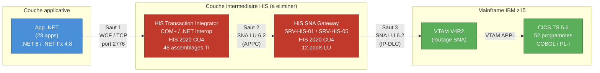
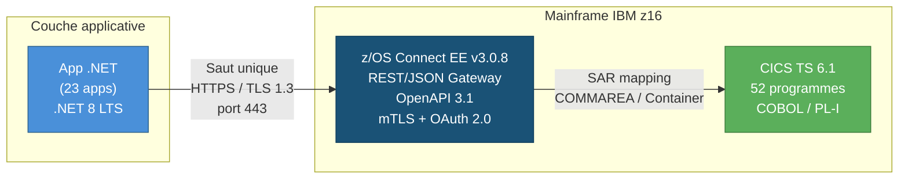
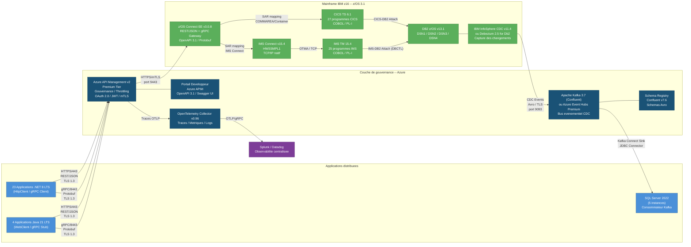
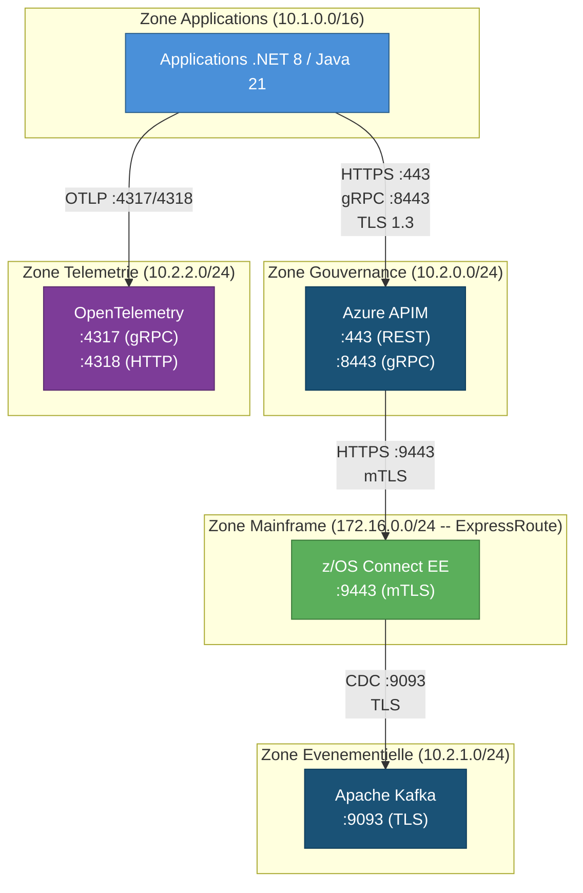
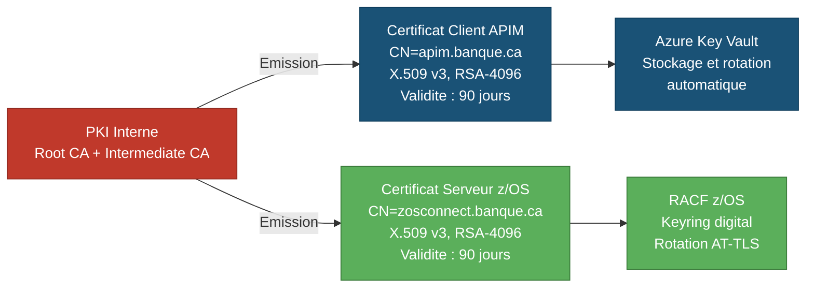
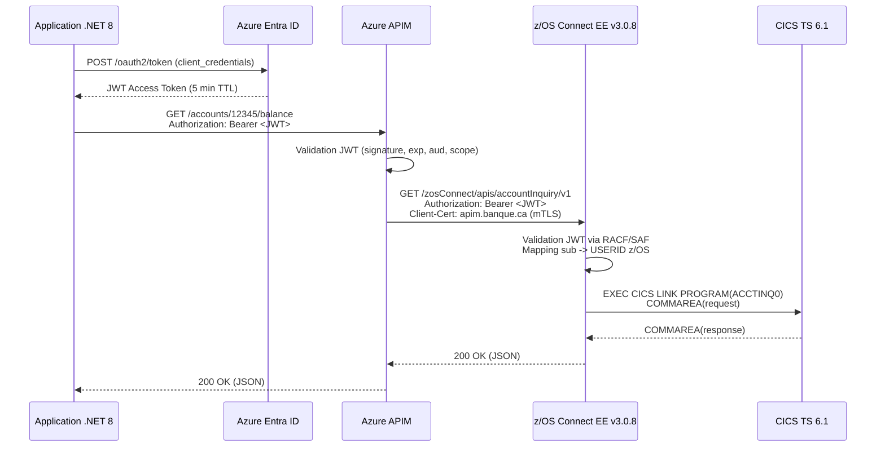
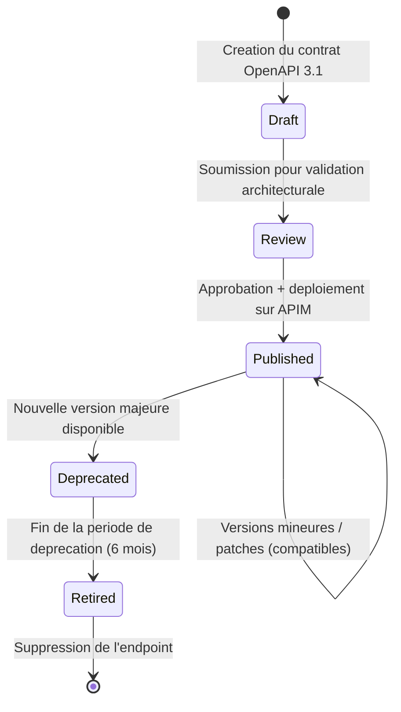
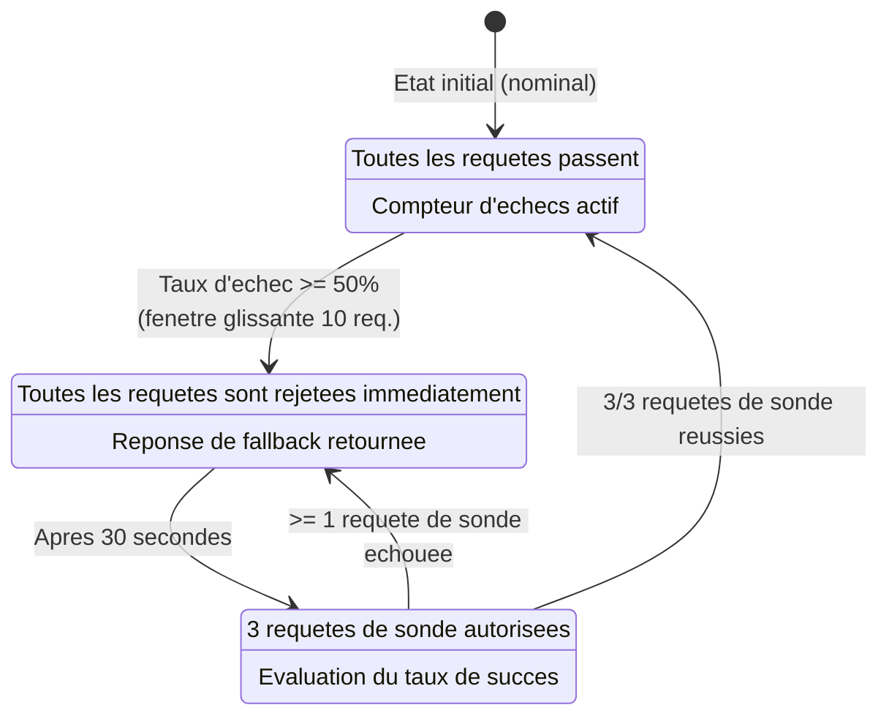
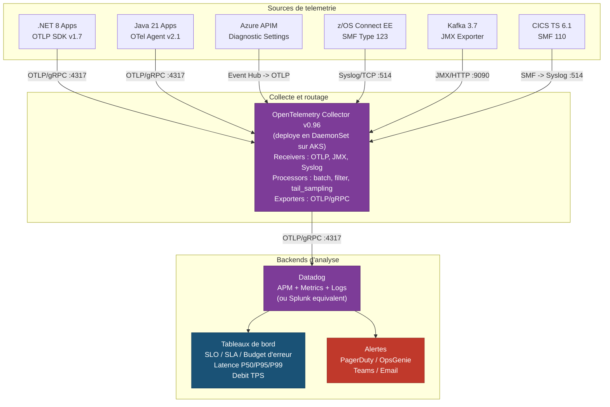

## 7. Recommandation -- Architecture Cible (To-Be)

> **Objectif** : Definir l'architecture cible retenue (Option C -- Refonte REST/JSON et gRPC directe vers le Mainframe), en detaillant les flux avant/apres, les protocoles et ports, les standards techniques imposes, le modele de gouvernance API et les exigences de resilience. Chaque specification est tracable vers l'inventaire As-Is (section 3) et le scenario recommande (section 5.3).

L'architecture cible elimine integralement les **6 serveurs HIS**, les **45 assemblages TI**, les **12 pools LU** et les **8 liens de donnees DB2** recenses a la section 3. Elle les remplace par des communications directes HTTPS/gRPC vers **z/OS Connect EE** et une synchronisation evenementielle via **Apache Kafka**. Le cout annuel d'exploitation passe de **1 850 K$ CAD** a **420 K$ CAD**, pour un investissement initial (CAPEX) de **3 200 K$ CAD** et un ROI de **~38 % a 3 ans** et **~142 % a 5 ans**. La duree totale de migration est de **22 mois**.

---

### 7.1 -- Diagramme comparatif As-Is vs To-Be

Les deux diagrammes ci-dessous illustrent cote a cote l'elimination du noeud HIS. Le premier represente le chemin actuel (3 sauts, 2 protocoles, ~45 ms de latence). Le second represente le chemin cible (1 saut, 1 protocole, ~12 ms de latence).

#### 7.1.1 -- Flux As-Is (etat actuel avec HIS)



**Metriques As-Is :**

| Metrique | Valeur |
|----------|--------|
| Nombre de sauts reseau | 3 (App -> HIS TI -> SNA Gateway -> VTAM -> CICS) |
| Protocoles impliques | 2 (TCP + SNA/LU 6.2) |
| Latence end-to-end moyenne | ~45 ms |
| Intermediaires Microsoft | 2 (Transaction Integrator + SNA Gateway) |
| Chiffrement end-to-end | Non (SNA ne supporte pas TLS 1.3) |
| Points de defaillance | 3 (serveurs HIS + pile SNA + VTAM) |

#### 7.1.2 -- Flux To-Be (architecture cible sans HIS)



**Metriques To-Be :**

| Metrique | Valeur |
|----------|--------|
| Nombre de sauts reseau | 1 (App -> z/OS Connect -> CICS) |
| Protocoles impliques | 1 (HTTPS/TLS 1.3 uniquement) |
| Latence end-to-end moyenne | ~12 ms |
| Intermediaires Microsoft | **0 (aucun)** |
| Chiffrement end-to-end | Oui (TLS 1.3 mutual authentication) |
| Points de defaillance | 1 (z/OS Connect, haute disponibilite via Sysplex) |

#### 7.1.3 -- Tableau de comparaison directe

| Aspect | As-Is (HIS) | To-Be (z/OS Connect) | Amelioration |
|--------|-------------|----------------------|--------------|
| Sauts reseau | 3 | 1 | -67 % |
| Protocoles | 2 (TCP + SNA) | 1 (HTTPS) | -50 % |
| Latence | ~45 ms | ~12 ms | -73 % |
| Intermediaires Microsoft | 2 serveurs | 0 | -100 % |
| Chiffrement | Aucun (SNA) | TLS 1.3 mTLS | +100 % |
| Contrat d'interface | .tim proprietaire | OpenAPI 3.1 | Standard ouvert |
| Format de donnees | COMMAREA binaire (EBCDIC) | JSON (UTF-8) / Protobuf | Standard ouvert |
| Cout annuel (OPEX) | 1 850 K$ CAD | 420 K$ CAD | -77 % |

#### 7.1.4 -- Architecture complete To-Be (vue d'ensemble)



**Legende des couleurs :**

| Couleur | Couche |
|---------|--------|
| Bleu clair | Applications distribuees (.NET 8, Java 21, SQL Server 2022) |
| Bleu fonce | Couche de gouvernance Azure (APIM, Kafka, OpenTelemetry, Schema Registry) |
| Vert | Mainframe IBM z16 (z/OS Connect, CICS, IMS, DB2, CDC) |
| Violet | Observabilite centralisee (Splunk / Datadog) |

---

### 7.2 -- Protocoles et ports de l'architecture cible

L'architecture cible standardise l'ensemble des communications sur des protocoles ouverts, chiffres et authentifies. Le tableau ci-dessous recense exhaustivement chaque protocole, port et usage dans la topologie To-Be.

#### 7.2.1 -- Matrice des protocoles et ports

| # | Protocole | Port | Direction | Source | Destination | Usage | Chiffrement | Authentification |
|---|-----------|------|-----------|--------|-------------|-------|-------------|------------------|
| 1 | **HTTPS** | **443** | Sortant | Applications .NET 8 / Java 21 | Azure API Management | Appels REST API (JSON) vers les services Mainframe exposes via z/OS Connect | TLS 1.3 | OAuth 2.0 Bearer Token (JWT) |
| 2 | **gRPC** | **8443** | Sortant | Applications .NET 8 / Java 21 | Azure API Management | Appels binaires haute performance (Protobuf) pour les flux a faible latence (paiements, taux de change) | TLS 1.3 | OAuth 2.0 Bearer Token (JWT) |
| 3 | **HTTPS (mTLS)** | **9443** | Sortant | Azure API Management | z/OS Connect EE v3.0.8 | Relais des requetes REST/gRPC vers le Mainframe avec authentification mutuelle | TLS 1.3 mTLS | Certificats X.509 mutuels (client + serveur) |
| 4 | **Kafka (TLS)** | **9093** | Bidirectionnel | CDC Agent (z/OS) <-> Kafka Cluster | Apache Kafka 3.7 / Azure Event Hubs | Streaming des evenements CDC (DB2 -> Kafka) et consommation (Kafka -> SQL Server) | TLS 1.3 | mTLS + SASL/SCRAM-SHA-512 |
| 5 | **OTLP/gRPC** | **4317** | Sortant | OpenTelemetry Collector | Splunk / Datadog | Export des traces, metriques et logs de telemetrie | TLS 1.3 | API Key / Token |
| 6 | **OTLP/HTTP** | **4318** | Sortant | Applications .NET 8 / Java 21 | OpenTelemetry Collector | Envoi des spans de telemetrie depuis les applications | TLS 1.3 | API Key / Token |

#### 7.2.2 -- Regles de pare-feu associees

| Regle | Source CIDR | Destination CIDR | Port | Protocole | Action |
|-------|-------------|------------------|------|-----------|--------|
| FW-001 | VNET-APPS (10.1.0.0/16) | APIM-SUBNET (10.2.0.0/24) | 443, 8443 | TCP | ALLOW |
| FW-002 | APIM-SUBNET (10.2.0.0/24) | z/OS-LPAR (172.16.0.0/24 via ExpressRoute) | 9443 | TCP | ALLOW |
| FW-003 | z/OS-LPAR (172.16.0.0/24) | KAFKA-SUBNET (10.2.1.0/24) | 9093 | TCP | ALLOW |
| FW-004 | KAFKA-SUBNET (10.2.1.0/24) | SQL-SUBNET (10.1.2.0/24) | 1433 | TCP | ALLOW |
| FW-005 | VNET-APPS (10.1.0.0/16) | OTEL-SUBNET (10.2.2.0/24) | 4317, 4318 | TCP | ALLOW |
| FW-006 | OTEL-SUBNET (10.2.2.0/24) | Splunk/Datadog (Internet) | 443 | TCP | ALLOW |
| FW-DEFAULT | Any | Any | Any | Any | DENY |

#### 7.2.3 -- Diagramme des flux reseau



---

### 7.3 -- Standards techniques imposes

L'ensemble des composants de l'architecture cible doit se conformer aux standards techniques suivants. Ces standards sont **non negociables** et constituent des criteres de conformite pour chaque livrable du programme de migration de 22 mois.

#### 7.3.1 -- Contrats d'API : OpenAPI 3.1

| Exigence | Specification |
|----------|---------------|
| **Standard** | OpenAPI Specification v3.1.0 (compatible JSON Schema 2020-12) |
| **Perimetre** | Chaque programme Mainframe expose (52 programmes) doit disposer d'un contrat OpenAPI publie |
| **Format** | YAML (fichier source) + JSON (publication APIM) |
| **Contenu obligatoire** | `info` (version, contact, licence), `servers` (URL z/OS Connect), `paths` (operations CRUD), `components/schemas` (modeles request/response), `security` (OAuth 2.0 Bearer) |
| **Validation** | Chaque contrat est valide par le linter `spectral` (Stoplight) avec le ruleset `oas` avant publication |
| **Versioning** | Semantic Versioning (MAJOR.MINOR.PATCH) dans le champ `info.version` |
| **Depot source** | Git (monorepo `api-contracts/`) avec review obligatoire par l'equipe Architecture avant merge |
| **Generation** | Les contrats sont generes automatiquement par z/OS Connect EE a partir des SARs (Service Archives), puis enrichis manuellement (descriptions, exemples) |

**Exemple de contrat OpenAPI 3.1 (extrait) :**

```yaml
openapi: "3.1.0"
info:
  title: Account Inquiry API
  version: "1.0.0"
  description: >
    Consultation du solde d'un compte via le programme COBOL ACCTINQ0
    sur CICS TS 6.1 (CICSPROD1), expose par z/OS Connect EE v3.0.8.
  contact:
    name: Equipe API Mainframe
    email: api-mainframe@banque.ca
servers:
  - url: https://apim.banque.ca/mainframe/v1
    description: Production (via Azure APIM -> z/OS Connect)
paths:
  /accounts/{accountId}/balance:
    get:
      operationId: getAccountBalance
      summary: Obtenir le solde d'un compte
      security:
        - oauth2: [accounts:read]
      parameters:
        - name: accountId
          in: path
          required: true
          schema:
            type: string
            pattern: "^[0-9]{10}$"
      responses:
        "200":
          description: Solde retourne avec succes
          content:
            application/json:
              schema:
                $ref: "#/components/schemas/AccountBalance"
        "404":
          description: Compte non trouve
components:
  schemas:
    AccountBalance:
      type: object
      properties:
        accountId:
          type: string
        balance:
          type: number
          format: double
        currency:
          type: string
          enum: [CAD, USD, EUR]
        asOfDate:
          type: string
          format: date-time
  securitySchemes:
    oauth2:
      type: oauth2
      flows:
        clientCredentials:
          tokenUrl: https://auth.banque.ca/oauth2/token
          scopes:
            accounts:read: Lecture des comptes
            accounts:write: Modification des comptes
```

#### 7.3.2 -- Chiffrement : TLS 1.3 avec authentification mutuelle (mTLS)

| Exigence | Specification |
|----------|---------------|
| **Version TLS minimale** | TLS 1.3 (RFC 8446). TLS 1.2 refuse. TLS 1.1/1.0 interdit. |
| **Cipher suites autorisees** | `TLS_AES_256_GCM_SHA384`, `TLS_CHACHA20_POLY1305_SHA256`, `TLS_AES_128_GCM_SHA256` |
| **Authentification mutuelle (mTLS)** | Obligatoire sur tous les flux APIM <-> z/OS Connect. Certificats X.509 v3 emis par l'autorite de certification interne (PKI). |
| **Duree de vie des certificats** | 90 jours (rotation automatique via Azure Key Vault / RACF sur z/OS) |
| **Rotation des certificats** | Automatisee (zero-downtime) via Azure Key Vault integration avec APIM + z/OS Connect AT-TLS policy |
| **Verification OCSP** | Obligatoire (OCSP Stapling active sur z/OS Connect) |
| **Perfect Forward Secrecy (PFS)** | Obligatoire (assuree nativement par TLS 1.3) |
| **Perimetre** | Toutes les communications entre les applications distribuees et le Mainframe, sans exception |

**Chaine de confiance mTLS :**



#### 7.3.3 -- Authentification et autorisation : OAuth 2.0 / JWT

| Exigence | Specification |
|----------|---------------|
| **Standard** | OAuth 2.0 (RFC 6749) + JSON Web Tokens (RFC 7519) |
| **Flux OAuth** | `client_credentials` pour les appels service-a-service (23 apps .NET + 4 apps Java) |
| **Serveur d'autorisation** | Azure Entra ID (anciennement Azure AD) ou Ping Identity |
| **Format du jeton** | JWT signe (RS256 ou ES256) avec les claims standard (`iss`, `sub`, `aud`, `exp`, `iat`, `scope`) |
| **Duree de vie du jeton** | Access Token : 5 minutes. Refresh Token : 24 heures (si applicable). |
| **Scopes** | Un scope par domaine metier et par niveau d'acces. Exemple : `accounts:read`, `accounts:write`, `payments:execute`, `loans:calculate`. |
| **Validation cote APIM** | Azure APIM valide le JWT (signature, expiration, audience, scopes) avant de relayer la requete vers z/OS Connect. |
| **Propagation vers z/OS** | Le jeton JWT est transmis dans le header `Authorization: Bearer <token>` vers z/OS Connect. z/OS Connect valide le jeton via RACF/SAF et mappe le `sub` sur un utilisateur z/OS pour le controle d'acces au programme CICS/IMS. |
| **Revocation** | Support de la revocation de jetons via l'endpoint `/revoke` du serveur d'autorisation. Azure APIM interroge le cache de revocation toutes les 60 secondes. |

**Flux d'authentification :**



#### 7.3.4 -- Schemas evenementiels : Apache Avro

| Exigence | Specification |
|----------|---------------|
| **Standard** | Apache Avro v1.11.3 |
| **Perimetre** | Tous les evenements CDC publies sur Apache Kafka / Azure Event Hubs (remplacement des 8 Data Links DB2) |
| **Registre de schemas** | Confluent Schema Registry v7.6 ou Azure Schema Registry |
| **Compatibilite** | Mode `BACKWARD` obligatoire (un consommateur avec le nouveau schema peut lire les messages ecrits avec l'ancien schema) |
| **Convention de nommage** | `<domaine>.<entite>.<action>` (ex. : `banking.account.updated`, `payments.transaction.created`) |
| **Contenu obligatoire** | Namespace, champs avec types explicites, valeurs par defaut pour les champs optionnels, documentation par champ |
| **Depot source** | Git (monorepo `event-schemas/`) avec validation CI/CD de la compatibilite via `confluent schema-registry-maven-plugin` |
| **Gouvernance** | Tout ajout ou modification de schema requiert une approbation de l'equipe Architecture et un test de compatibilite automatise |

**Exemple de schema Avro (CDC -- mise a jour de compte) :**

```json
{
  "type": "record",
  "name": "AccountUpdated",
  "namespace": "ca.banque.banking.account",
  "doc": "Evenement emis lors de la mise a jour d'un compte dans DB2 z/OS (table CORE_ACCT).",
  "fields": [
    {"name": "eventId", "type": "string", "doc": "Identifiant unique de l'evenement (UUID v4)."},
    {"name": "eventTimestamp", "type": "long", "logicalType": "timestamp-millis", "doc": "Horodatage de l'evenement (epoch ms)."},
    {"name": "accountId", "type": "string", "doc": "Numero de compte (10 chiffres)."},
    {"name": "balance", "type": {"type": "bytes", "logicalType": "decimal", "precision": 18, "scale": 2}, "doc": "Nouveau solde du compte."},
    {"name": "currency", "type": {"type": "enum", "name": "Currency", "symbols": ["CAD", "USD", "EUR"]}, "doc": "Devise du compte."},
    {"name": "lastModifiedBy", "type": "string", "doc": "Identifiant de l'utilisateur z/OS ayant effectue la modification."},
    {"name": "sourceSystem", "type": "string", "default": "DB2_ZOS", "doc": "Systeme source de l'evenement."}
  ]
}
```

#### 7.3.5 -- Tableau recapitulatif des standards imposes

| # | Domaine | Standard | Version | Usage | Caractere |
|---|---------|----------|---------|-------|-----------|
| 1 | Contrats d'API | OpenAPI Specification | 3.1.0 | Definition des interfaces REST pour les 52 programmes Mainframe | Obligatoire |
| 2 | Chiffrement | TLS | 1.3 (RFC 8446) | Toutes les communications applications <-> Mainframe | Obligatoire |
| 3 | Authentification mutuelle | mTLS (X.509) | v3 | Flux APIM <-> z/OS Connect | Obligatoire |
| 4 | Authentification applicative | OAuth 2.0 / JWT | RFC 6749 / RFC 7519 | Authentification des 23 apps .NET + 4 apps Java | Obligatoire |
| 5 | Schemas evenementiels | Apache Avro | 1.11.3 | Evenements CDC sur Kafka (remplacement des 8 Data Links) | Obligatoire |
| 6 | Serialisation haute performance | Protocol Buffers (Protobuf) | 3 | Appels gRPC pour les flux a faible latence | Recommande |
| 7 | Linter API | Spectral (Stoplight) | 6.x | Validation des contrats OpenAPI en CI/CD | Obligatoire |
| 8 | Compatibilite de schemas | Schema Registry | Confluent 7.6 | Gouvernance de la compatibilite Avro (mode BACKWARD) | Obligatoire |

---

### 7.4 -- Modele de gouvernance API

La gouvernance API est le mecanisme de controle qui assure la coherence, la qualite et la perennite des interfaces exposees par le Mainframe. Le modele ci-dessous couvre le cycle de vie complet d'une API, du design a la deprecation.

#### 7.4.1 -- Cycle de vie des API (versioning et deprecation)

Chaque API traversera les etats suivants au cours de son cycle de vie :



**Politique de versioning :**

| Regle | Description |
|-------|-------------|
| **Convention** | Semantic Versioning : `vMAJOR.MINOR.PATCH` (ex. : `v1.2.3`) |
| **URL d'API** | Le numero de version majeure est inclus dans le chemin : `/mainframe/v1/accounts/...`, `/mainframe/v2/accounts/...` |
| **Compatibilite ascendante** | Les versions mineures et les patches ne cassent jamais le contrat existant (ajout de champs optionnels uniquement) |
| **Versions majeures** | Toute modification non retrocompatible (suppression de champ, changement de type) requiert une nouvelle version majeure |
| **Coexistence** | Deux versions majeures consecutives coexistent en production pendant une periode minimale de 6 mois |
| **Deprecation** | La version N-1 est marquee `deprecated` dans le contrat OpenAPI (`deprecated: true`) et dans le portail developpeur. Un header `Sunset` (RFC 8594) est ajoute aux reponses HTTP avec la date de retrait. |
| **Retrait** | Apres 6 mois de deprecation, l'endpoint est supprime. Les appels a l'ancienne version retournent `410 Gone`. |

**Matrice de responsabilite (RACI) -- Cycle de vie API :**

| Activite | Equipe Architecture | Equipe Mainframe | Equipe Applicative | Equipe API (APIM) | Comite d'Architecture |
|----------|--------------------|-----------------|--------------------|-------------------|----------------------|
| Design du contrat OpenAPI | **R** | C | C | I | A |
| Creation du SAR z/OS Connect | I | **R** | I | I | A |
| Publication sur APIM | C | I | I | **R** | A |
| Tests de non-regression | C | C | **R** | I | A |
| Decision de deprecation | **R** | C | C | C | **A** |
| Retrait d'une version | I | **R** | **R** | **R** | A |

*Legende : R = Responsable, A = Approbateur, C = Consulte, I = Informe*

#### 7.4.2 -- Portail developpeur

Le portail developpeur est le point d'acces unique pour toutes les equipes internes (et eventuellement partenaires externes) souhaitant consommer les API Mainframe.

| Fonctionnalite | Implementation | Detail |
|----------------|----------------|--------|
| **Catalogue d'API** | Azure APIM Developer Portal | Listing de toutes les API disponibles, classees par domaine metier (comptes, prets, paiements, change, assurances, CRM, reglementaire) |
| **Documentation interactive** | Swagger UI / Redoc integre | Chaque API est documentee avec sa specification OpenAPI 3.1, des exemples de requete/reponse et un bouton "Try It" pour tester en sandbox |
| **Inscription et cles API** | Azure APIM Subscriptions | Chaque application obtient une cle d'abonnement (subscription key) et un client_id/client_secret OAuth 2.0 via le portail |
| **Environnements** | Sandbox / Staging / Production | Le portail expose trois environnements. Les tests sont effectues en sandbox (Mainframe LPAR de test) sans impact sur la production |
| **Changelog** | Git-generated + APIM notifications | Chaque modification de contrat OpenAPI declenche une notification aux equipes abonnees via email et webhook Teams |
| **Metriques de consommation** | Azure APIM Analytics | Chaque equipe visualise ses propres statistiques : nombre d'appels, latence P50/P95/P99, taux d'erreur, consommation de quota |
| **Statut des API** | Page de sante integree | Indicateur en temps reel de la disponibilite de chaque API (UP / DEGRADED / DOWN), alimente par les health checks z/OS Connect |

#### 7.4.3 -- Monitoring : SLA / SLO

Le modele de gouvernance API definit des objectifs de niveau de service (SLO) pour chaque categorie d'API, avec des indicateurs mesurables et des seuils d'alerte.

##### 7.4.3.1 -- SLO par categorie d'API

| Categorie | APIs concernees | SLO Disponibilite | SLO Latence (P99) | SLO Taux d'erreur | Budget d'erreur mensuel |
|-----------|----------------|-------------------|--------------------|--------------------|-----------------------|
| **Critique -- Temps reel** | Comptes (ACCTINQ0, ACCTUPD0), Paiements (PAYDMS00, PAYINT00), DDA (DDABAL00) | 99,95 % | < 50 ms | < 0,1 % | 21,6 min/mois |
| **Elevee -- Temps reel** | Prets (LNCALC00, LNSTAT00), Assurances (INSINQ00), CRM (CUSTINQ0), Change (FXRATE00) | 99,9 % | < 100 ms | < 0,5 % | 43,2 min/mois |
| **Elevee -- Batch** | Grand livre (GLPOST00, GLEXTR00), Amortissement (LNAMRT00), Clearing (PAYCLR00) | 99,5 % | < 500 ms | < 1,0 % | 3,6 h/mois |
| **Standard** | Reglementaire (REGRPT00, REGCHK00), Utilitaires (HLTHCK00, DIAGTR00) | 99,0 % | < 1 000 ms | < 2,0 % | 7,2 h/mois |

##### 7.4.3.2 -- Indicateurs de performance cles (KPI)

| KPI | Methode de mesure | Outil | Frequence | Seuil d'alerte | Seuil critique |
|-----|-------------------|-------|-----------|----------------|----------------|
| Latence P50 | Percentile 50 des temps de reponse end-to-end | OpenTelemetry -> Datadog/Splunk | Temps reel (fenetre glissante 5 min) | > 20 ms | > 35 ms |
| Latence P95 | Percentile 95 des temps de reponse end-to-end | OpenTelemetry -> Datadog/Splunk | Temps reel (fenetre glissante 5 min) | > 35 ms | > 50 ms |
| Latence P99 | Percentile 99 des temps de reponse end-to-end | OpenTelemetry -> Datadog/Splunk | Temps reel (fenetre glissante 5 min) | > 50 ms | > 100 ms |
| Taux d'erreur (HTTP 5xx) | Pourcentage de reponses 5xx sur le total | Azure APIM Analytics | Temps reel (fenetre glissante 1 min) | > 0,5 % | > 1,0 % |
| Debit (TPS) | Transactions par seconde | Azure APIM Analytics | Temps reel | < 80 % de la capacite provisionnee | > 90 % de la capacite provisionnee |
| Disponibilite | Uptime = 1 - (temps d'indisponibilite / temps total) | Synthetics (Datadog / Azure Monitor) | Continu (sonde toutes les 30 s) | < SLO categorie | < SLO - 0,1 % |
| Taux de conformite OpenAPI | % d'API avec contrat OpenAPI 3.1 valide et a jour | Pipeline CI/CD (Spectral) | A chaque commit | < 95 % | < 90 % |

##### 7.4.3.3 -- Escalade et processus d'alerte

| Niveau | Condition | Delai de reaction | Destinataire | Canal |
|--------|-----------|-------------------|-------------|-------|
| P1 - Critique | SLO Disponibilite atteint OU Latence P99 > 100 ms pendant > 5 min | < 15 min | Equipe SRE + Equipe Mainframe + Management | PagerDuty / OpsGenie + Canal Teams #incidents |
| P2 - Eleve | SLO Taux d'erreur > 0,5 % OU Latence P95 > 50 ms pendant > 10 min | < 30 min | Equipe SRE + Equipe API | PagerDuty + Canal Teams #alertes |
| P3 - Moyen | Budget d'erreur mensuel consomme a > 75 % | < 4 h (heures ouvrables) | Equipe API | Email + Jira automatique |
| P4 - Information | Anomalie detectee mais sans impact SLO | Prochain standup | Equipe API | Dashboard Datadog/Splunk |

---

### 7.5 -- Exigences de resilience

L'elimination de la couche HIS ne doit pas introduire de nouveaux points de defaillance. L'architecture cible integre des mecanismes de resilience a chaque couche, conformes aux pratiques d'ingenierie des systemes distribues.

#### 7.5.1 -- Politiques de retry (backoff exponentiel)

Toutes les applications .NET 8 et Java 21 doivent implementer des politiques de retry avec backoff exponentiel et jitter pour les appels vers Azure APIM / z/OS Connect.

| Parametre | Valeur | Justification |
|-----------|--------|---------------|
| **Nombre maximum de tentatives** | 3 | Au-dela de 3 retries, le cout en latence depasse le benefice. Un circuit breaker prend le relais. |
| **Delai initial** | 200 ms | Suffisamment court pour ne pas degrader l'experience utilisateur sur les flux temps reel. |
| **Facteur multiplicateur** | 2 (exponentiel) | Tentative 1 : 200 ms, Tentative 2 : 400 ms, Tentative 3 : 800 ms. |
| **Jitter** | +/- 25 % du delai calcule | Evite le phenomene de "thundering herd" lorsque plusieurs instances retentent simultanement. |
| **Delai maximum** | 2 000 ms | Cap pour eviter des attentes excessives sur les flux critiques. |
| **Codes HTTP reessayables** | 408 (Request Timeout), 429 (Too Many Requests), 502 (Bad Gateway), 503 (Service Unavailable), 504 (Gateway Timeout) | Seules les erreurs transitoires sont reessayees. Les erreurs 4xx (sauf 408 et 429) ne sont jamais reessayees. |
| **Idempotence** | Obligatoire pour tout appel reessaye | Les appels non idempotents (POST avec effet de bord) doivent inclure un header `Idempotency-Key` (RFC draft). |

**Implementation .NET 8 (Microsoft.Extensions.Http.Resilience) :**

```csharp
// Program.cs -- Configuration du HttpClient avec retry exponentiel
builder.Services.AddHttpClient("MainframeApi", client =>
{
    client.BaseAddress = new Uri("https://apim.banque.ca/mainframe/v1");
})
.AddStandardResilienceHandler(options =>
{
    options.Retry.MaxRetryAttempts = 3;
    options.Retry.Delay = TimeSpan.FromMilliseconds(200);
    options.Retry.BackoffType = DelayBackoffType.Exponential;
    options.Retry.UseJitter = true;
    options.Retry.ShouldHandle = args => ValueTask.FromResult(
        args.Outcome.Result?.StatusCode is
            HttpStatusCode.RequestTimeout or
            HttpStatusCode.TooManyRequests or
            HttpStatusCode.BadGateway or
            HttpStatusCode.ServiceUnavailable or
            HttpStatusCode.GatewayTimeout);
});
```

#### 7.5.2 -- Circuit breaker (Polly / .NET)

Le circuit breaker previent les appels en cascade vers un service defaillant. Il est implementé via la bibliotheque **Polly v8** (integree dans `Microsoft.Extensions.Resilience` pour .NET 8) ou **Resilience4j v2.2** pour Java 21.

| Parametre | Valeur | Justification |
|-----------|--------|---------------|
| **Seuil d'ouverture** | 50 % d'echecs sur une fenetre glissante de 10 requetes | Un taux d'echec de 50 % sur 10 requetes indique un probleme systémique et non transitoire. |
| **Duree d'ouverture (Open state)** | 30 secondes | Permet au service z/OS Connect de recuperer (reconnexion CICS, recyclage du thread pool). |
| **Nombre de requetes en Half-Open** | 3 | Trois requetes de sonde sont envoyees apres la duree d'ouverture pour verifier la reprise du service. |
| **Transition Half-Open -> Closed** | 3/3 reussies | Le circuit se referme uniquement si les 3 requetes de sonde reussissent. |
| **Transition Half-Open -> Open** | 1/3 echouee | Une seule defaillance en Half-Open reouvre le circuit pour une nouvelle periode de 30 secondes. |
| **Action en etat Open** | Retourner immediatement une reponse de fallback (cf. 7.5.3) | Evite d'accumuler des requetes en attente et de saturer les threads. |

**Diagramme d'etats du circuit breaker :**



**Implementation .NET 8 (Polly v8 via Microsoft.Extensions.Resilience) :**

```csharp
// Configuration du circuit breaker dans le pipeline de resilience
builder.Services.AddHttpClient("MainframeApi")
.AddResilienceHandler("mainframe-pipeline", pipeline =>
{
    // Retry (cf. 7.5.1)
    pipeline.AddRetry(new HttpRetryStrategyOptions
    {
        MaxRetryAttempts = 3,
        Delay = TimeSpan.FromMilliseconds(200),
        BackoffType = DelayBackoffType.Exponential,
        UseJitter = true
    });

    // Circuit Breaker
    pipeline.AddCircuitBreaker(new HttpCircuitBreakerStrategyOptions
    {
        FailureRatio = 0.5,
        SamplingDuration = TimeSpan.FromSeconds(10),
        MinimumThroughput = 10,
        BreakDuration = TimeSpan.FromSeconds(30)
    });

    // Timeout global
    pipeline.AddTimeout(TimeSpan.FromSeconds(5));
});
```

#### 7.5.3 -- Strategies de fallback

Lorsque le circuit breaker est en etat Open ou que toutes les tentatives de retry sont epuisees, une strategie de fallback doit fournir une reponse degradee mais fonctionnelle a l'utilisateur.

| Type de flux | Strategie de fallback | Exemple | Donnees retournees |
|-------------|----------------------|---------|-------------------|
| **Lecture (GET)** | Cache distribue (Redis) | Consultation de solde (ACCTINQ0) | Derniere valeur connue, marquee `stale: true` avec horodatage du cache |
| **Lecture (GET) -- taux** | Cache distribue (Redis) + TTL court | Taux de change (FXRATE00) | Dernier taux valide (TTL 5 min), marque `stale: true` |
| **Ecriture (POST/PUT)** | File d'attente asynchrone | Virement domestique (XFRDMS00) | Acquittement `202 Accepted` avec ecriture dans Azure Service Bus. Traitement differe apres reprise du Mainframe. |
| **Ecriture critique** | Rejet avec message explicite | Paiement international (PAYINT00) | Reponse `503 Service Unavailable` avec header `Retry-After` et message clair a l'utilisateur |
| **Batch** | Replanification automatique | Clearing (PAYCLR00) | Le job batch est replanifie a T+30 min via le scheduler (Azure Logic Apps / Hangfire) |
| **Streaming (CDC)** | Kafka replay depuis offset | Synchronisation DB2 -> SQL Server | Kafka garantit la retention des messages. Le consommateur reprend depuis le dernier offset commite. |

**Implementation du fallback avec cache (exemple .NET 8) :**

```csharp
// Fallback avec cache Redis pour les lectures
public async Task<AccountBalance> GetAccountBalanceAsync(string accountId)
{
    try
    {
        // Tentative d'appel via le pipeline resilient (retry + circuit breaker)
        var response = await _httpClient.GetFromJsonAsync<AccountBalance>(
            $"/accounts/{accountId}/balance");

        // Mise a jour du cache en cas de succes
        await _cache.SetAsync($"account:{accountId}:balance", response,
            new DistributedCacheEntryOptions
            {
                AbsoluteExpirationRelativeToNow = TimeSpan.FromMinutes(5)
            });

        return response;
    }
    catch (BrokenCircuitException)
    {
        // Circuit ouvert : retour du cache
        var cached = await _cache.GetAsync<AccountBalance>(
            $"account:{accountId}:balance");
        if (cached is not null)
        {
            cached.IsStale = true;
            cached.CachedAt = cached.RetrievedAt;
            return cached;
        }
        throw new ServiceUnavailableException(
            "Le service de consultation de compte est temporairement indisponible.");
    }
}
```

#### 7.5.4 -- Observabilite (OpenTelemetry -> Splunk / Datadog)

L'observabilite est le pilier qui rend toute la resilience **mesurable et diagnosticable**. L'architecture cible utilise **OpenTelemetry** comme standard unifie de collecte, et **Splunk** ou **Datadog** comme plateforme d'analyse.

##### 7.5.4.1 -- Les trois piliers de l'observabilite

| Pilier | Standard | Collecteur | Backend | Retention |
|--------|----------|-----------|---------|-----------|
| **Traces distribuees** | OpenTelemetry Tracing (W3C Trace Context) | OpenTelemetry Collector v0.96 | Datadog APM ou Splunk APM | 15 jours (traces completes), 90 jours (metriques derivees) |
| **Metriques** | OpenTelemetry Metrics (OTLP) | OpenTelemetry Collector v0.96 | Datadog Metrics ou Splunk IM | 13 mois (resolution 1 min), 5 ans (resolution 1 h) |
| **Logs** | OpenTelemetry Logs (OTLP) | OpenTelemetry Collector v0.96 | Splunk Enterprise ou Datadog Logs | 90 jours (hot), 1 an (warm), 7 ans (cold/archive) |

##### 7.5.4.2 -- Instrumentation par couche

| Couche | Technologie | Instrumentation | Spans generes |
|--------|------------|-----------------|---------------|
| Applications .NET 8 | `OpenTelemetry.Extensions.Hosting` v1.7 + `OpenTelemetry.Instrumentation.Http` | Auto-instrumentation (zero code change pour HttpClient, gRPC) + instrumentation manuelle pour la logique metier | `http.client.request`, `grpc.client.request`, `business.operation` |
| Applications Java 21 | OpenTelemetry Java Agent v2.1 | Auto-instrumentation via agent JVM (`-javaagent:opentelemetry-javaagent.jar`) | `http.client.request`, `grpc.client.request` |
| Azure API Management | Policy `<trace>` + diagnostics settings | Configuration APIM : export des logs et metriques vers Event Hub puis OpenTelemetry Collector | `apim.request`, `apim.backend.request` |
| z/OS Connect EE v3.0.8 | z/OS Connect EE logging + SMF records | Export des SMF Type 123 records vers un agent collecteur sur z/OS, puis vers OpenTelemetry Collector via syslog/TCP | `zosconnect.request`, `zosconnect.sar.invoke` |
| Apache Kafka 3.7 | JMX Exporter + OpenTelemetry Collector | Metriques JMX (lag, throughput, partition offset) collectees par l'OpenTelemetry Collector | `kafka.consumer.lag`, `kafka.producer.send` |
| CICS TS 6.1 | CICS Performance Analyzer + SMF 110 | Extraction des donnees SMF 110 (statistiques de transaction CICS) pour corrélation avec les traces distribuees | `cics.transaction.response_time` |

##### 7.5.4.3 -- Architecture d'observabilite



##### 7.5.4.4 -- Correlation des traces end-to-end

L'un des avantages majeurs de l'architecture cible par rapport a l'etat As-Is est la **tracabilite complete d'une requete**, de l'application jusqu'au programme CICS/IMS sur le Mainframe. Le standard **W3C Trace Context** assure la propagation d'un identifiant de trace unique (`traceparent` header) a travers toutes les couches :

```
Application .NET 8     -> traceparent: 00-<traceId>-<spanId-1>-01
  Azure APIM           -> traceparent: 00-<traceId>-<spanId-2>-01
    z/OS Connect EE    -> traceparent: 00-<traceId>-<spanId-3>-01
      CICS TS 6.1      -> SMF 110 record avec correlation traceId
```

Cela permet de diagnostiquer une degradation de latence en identifiant **exactement** quelle couche contribue au retard -- ce qui est impossible dans l'architecture As-Is ou les flux SNA/LU6.2 ne supportent pas de correlation de traces.

#### 7.5.5 -- Tableau recapitulatif des exigences de resilience

| # | Mecanisme | Outil / Technologie | Parametres cles | Couche d'application |
|---|-----------|--------------------|-----------------|--------------------|
| 1 | Retry (backoff exponentiel) | Polly v8 / `Microsoft.Extensions.Http.Resilience` (.NET 8) ; Resilience4j v2.2 (Java 21) | 3 tentatives, delai initial 200 ms, facteur x2, jitter 25 % | Applications .NET 8 / Java 21 |
| 2 | Circuit Breaker | Polly v8 / `Microsoft.Extensions.Resilience` (.NET 8) ; Resilience4j v2.2 (Java 21) | Seuil 50 %, fenetre 10 req., duree ouverture 30 s, 3 sondes en Half-Open | Applications .NET 8 / Java 21 |
| 3 | Fallback (cache) | Redis Cache (Azure Cache for Redis Premium) | TTL 5 min (lectures), marquage `stale`, fallback `202 Accepted` pour ecritures | Applications .NET 8 / Java 21 |
| 4 | Fallback (file d'attente) | Azure Service Bus Premium | File d'attente pour les ecritures differees en cas d'indisponibilite Mainframe | Applications .NET 8 / Java 21 |
| 5 | Timeout global | Polly v8 / Resilience4j v2.2 | 5 secondes par requete | Applications .NET 8 / Java 21 |
| 6 | Rate Limiting | Azure APIM Policies | Quotas par application, par API et par produit | Azure API Management |
| 7 | Health Checks | z/OS Connect EE + Azure APIM | Sonde toutes les 30 s, seuil de degradation : 3 echecs consecutifs | z/OS Connect / APIM |
| 8 | Traces distribuees | OpenTelemetry v0.96 (W3C Trace Context) | Propagation du `traceparent` de l'application jusqu'au SMF CICS | Toutes les couches |
| 9 | Metriques | OpenTelemetry Metrics (OTLP) | Latence P50/P95/P99, taux d'erreur, TPS | Toutes les couches |
| 10 | Logs structures | OpenTelemetry Logs (OTLP) | Format JSON structure, correlation avec le traceId | Toutes les couches |
| 11 | Alerting | PagerDuty / OpsGenie | 4 niveaux de severite (P1 a P4), escalade automatique | Equipe SRE |
| 12 | Replay evenementiel | Apache Kafka 3.7 | Retention 7 jours, replay depuis offset pour les flux CDC | Couche evenementielle |

---

### 7.6 -- Synthese de la recommandation

L'architecture cible To-Be recommandee repose sur les fondations suivantes :

| Dimension | Decision |
|-----------|----------|
| **Couche d'integration** | z/OS Connect EE v3.0.8 -- acces REST/JSON et gRPC direct au Mainframe, sans intermediaire Microsoft |
| **Protocoles** | HTTPS/443 (REST), gRPC/8443 (haute performance), Kafka/9093-TLS (evenementiel), mTLS pour toute communication Mainframe |
| **Standards techniques** | OpenAPI 3.1, TLS 1.3, OAuth 2.0 / JWT, Avro pour Kafka |
| **Gouvernance API** | Azure APIM avec portail developpeur, versioning semantique, deprecation en 6 mois, SLO par categorie |
| **Resilience** | Retry exponentiel (Polly), circuit breaker, fallback cache/file d'attente, timeout 5 s |
| **Observabilite** | OpenTelemetry -> Splunk/Datadog, traces distribuees W3C, metriques OTLP, alerting PagerDuty |
| **Impact financier** | CAPEX 3 200 K$ CAD, OPEX 420 K$ CAD/an (vs 1 850 K$ CAD/an), ROI ~38 % a 3 ans, ~142 % a 5 ans |
| **Perimetre** | 6 serveurs HIS elimines, 45 assemblages TI remplaces, 12 pools LU supprimes, 8 Data Links migres vers CDC/Kafka, 52 programmes Mainframe re-exposes via z/OS Connect |
| **Duree** | 22 mois |

> **Conclusion de la section 7** : L'architecture cible To-Be elimine integralement Microsoft Host Integration Server de la chaine d'integration Mainframe. Elle remplace 6 serveurs, 45 assemblages TI proprietaires, 12 pools LU SNA et 8 liens de donnees DRDA par une architecture ouverte basee sur des standards industriels (HTTPS, REST, gRPC, Kafka, OpenAPI, OAuth, TLS 1.3). La latence est reduite de 73 % (~45 ms a ~12 ms), le cout annuel d'exploitation de 77 % (1 850 K$ CAD a 420 K$ CAD), et la resilience est formalisee par des mecanismes de retry, circuit breaker, fallback et observabilite de bout en bout. Cette architecture positionne l'institution pour les 10 prochaines annees d'evolution technologique, en plein alignement avec les strategies Cloud-First et API-First.
