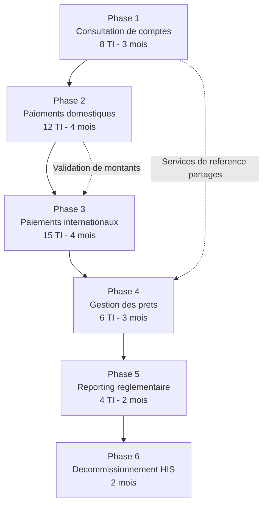
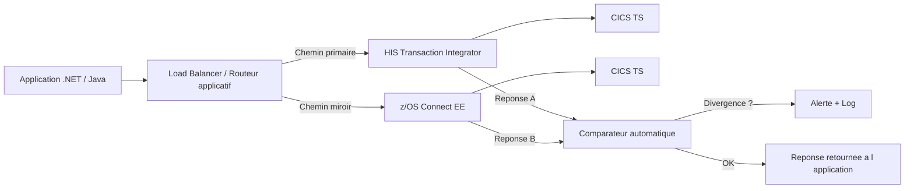
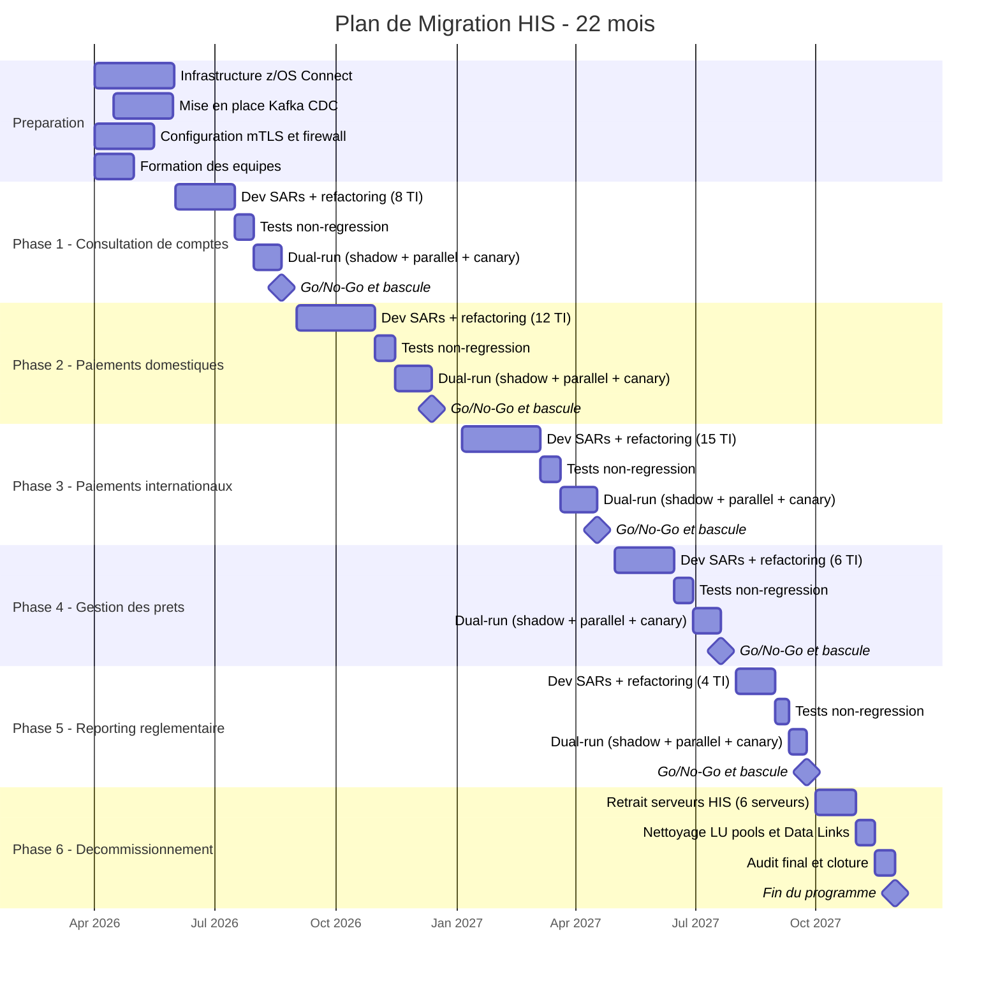

## 8. Plan de Mise en Oeuvre

> **Contrainte absolue :** Toute approche "Big Bang" est **formellement interdite**. La migration s'effectue domaine par domaine, avec une periode de coexistence (dual-run) obligatoire et des criteres de validation avant chaque bascule. Cette contrainte est non negociable et constitue un prerequis de gouvernance du programme.

---

### 8.1 Domaines fonctionnels et ordre de migration

#### 8.1.1 Criteres de priorisation

L'ordre de migration des domaines fonctionnels a ete determine selon une matrice multicriteres ponderee :

| Critere | Ponderation | Justification |
|---------|:-----------:|---------------|
| Criticite metier | 30 % | Les domaines a forte exposition client sont migres en premier pour securiser le benefice rapidement. |
| Complexite technique | 25 % | Nombre de TI assemblies, diversite des interfaces CICS/IMS, volumetrie transactionnelle. |
| Dependances inter-domaines | 25 % | Un domaine sans dependance aval non migree est prioritaire (migration "feuilles d'abord"). |
| Valeur de demonstration | 20 % | La premiere phase doit produire un succes visible pour ancrer la confiance des parties prenantes. |

#### 8.1.2 Decoupage en 6 phases

Le programme couvre **22 mois** au total, avec un chevauchement partiel entre certaines phases pour optimiser le calendrier. Les 45 TI assemblies sont repartis sur 5 phases fonctionnelles, suivies d'une phase de decommissionnement.

| Phase | Domaine fonctionnel | Duree | TI Assemblies | Prerequis | Justification de l'ordre |
|:-----:|---------------------|:-----:|:-------------:|-----------|--------------------------|
| 1 | Consultation de comptes | 3 mois | 8 | z/OS Connect SARs deployes, environnements de test provisionnes | Domaine en lecture seule, faible risque, forte valeur de demonstration. Permet de valider le pattern de migration sans risque transactionnel. |
| 2 | Paiements domestiques | 4 mois | 12 | Phase 1 validee, Kafka CDC actif | Premier domaine transactionnel. La validation de la phase 1 confirme la viabilite du pattern. Le CDC Kafka est requis pour la synchronisation DB2 vers SQL Server. |
| 3 | Paiements internationaux | 4 mois | 15 | Phase 2 validee, mTLS configure | Domaine le plus volumineux en TI assemblies (15/45). Necessite une authentification mutuelle TLS pour les flux SWIFT. Dependance forte sur la phase 2 (services partages de validation). |
| 4 | Gestion des prets | 3 mois | 6 | Phase 3 validee | Domaine a complexite moderee. Peu de dependances inter-domaines. Migration facilitee par l'experience accumulee sur les phases 1 a 3. |
| 5 | Reporting reglementaire | 2 mois | 4 | Phase 4 validee | Domaine le moins critique en termes de latence. Flux principalement batch. Migration la plus simple du programme. |
| 6 | Decommissionnement HIS | 2 mois | -- | Toutes phases validees, dual-run OK depuis au moins 30 jours sur chaque domaine | Retrait definitif des 6 serveurs HIS, desactivation des 12 LU pools, suppression des 8 Data Links DB2, nettoyage DNS et firewall. |
| **Total** | **5 domaines + decommissionnement** | **22 mois** | **45** | | |

#### 8.1.3 Matrice des dependances inter-domaines



> **Note :** Les fleches en trait plein representent les dependances sequentielles strictes (Go/No-Go). Les fleches en pointilles representent les dependances fonctionnelles faibles (services partages pouvant etre appeles via les deux canaux pendant le dual-run).

---

### 8.2 Criteres de bascule Go/No-Go

#### 8.2.1 Matrice de criteres par domaine

Pour chaque phase, la bascule (switchover) du trafic de production de HIS vers z/OS Connect est conditionnee au respect **integral** des criteres suivants. Aucune derogation n'est autorisee sur les criteres marques "Bloquant".

| # | Critere | Seuil d'acceptation | Type | Responsable de validation |
|---|---------|---------------------|:----:|---------------------------|
| G-01 | Tests de non-regression | 100 % des cas de test passes (0 echec) | Bloquant | Equipe QA |
| G-02 | Latence end-to-end (P95) | <= latence HIS actuelle (reference : ~45 ms pour consultation, ~80 ms pour paiements) | Bloquant | Equipe Performance |
| G-03 | Taux d'erreur en dual-run | < 0,1 % de divergences entre reponses HIS et z/OS Connect sur 7 jours consecutifs | Bloquant | Equipe Integration |
| G-04 | Validation metier | Proces-verbal signe par le responsable metier du domaine | Bloquant | Responsable metier |
| G-05 | Tests de charge | Tenue a 150 % du pic de charge nominal sans degradation | Bloquant | Equipe Performance |
| G-06 | Validation securite | Scan de vulnerabilites passe, certificats mTLS valides, regles firewall auditees | Bloquant | Equipe Securite |
| G-07 | Procedure de rollback testee | Retour sur HIS execute avec succes en < 30 minutes lors d'un exercice | Bloquant | Equipe Operations |
| G-08 | Documentation operationnelle | Runbooks mis a jour, alerting configure, equipe de garde formee | Non bloquant | Equipe Operations |

#### 8.2.2 Processus de decision Go/No-Go

1. **J-14** : Revue technique -- presentation des resultats de tests (G-01 a G-03, G-05).
2. **J-7** : Revue securite et operations -- validation G-06, G-07, G-08.
3. **J-3** : Comite de bascule -- decision formelle Go/No-Go avec le sponsor executif, le responsable metier et les leads techniques.
4. **J-0** : Execution de la bascule en fenetre de maintenance planifiee.

> **Regle d'or :** Si un seul critere "Bloquant" n'est pas satisfait, la bascule est reportee. Aucune exception.

---

### 8.3 Strategie de dual-run (coexistence)

#### 8.3.1 Principe de fonctionnement

Pendant la periode de coexistence de chaque domaine, les appels applicatifs sont routes **simultanement** vers les deux chemins d'integration :



#### 8.3.2 Modes de dual-run

Le dual-run progresse selon trois modes sequentiels :

| Mode | Duree minimale | Comportement | Critere de passage au mode suivant |
|------|:--------------:|--------------|-------------------------------------|
| **Shadow** | 7 jours | HIS = primaire, z/OS Connect = miroir (resultat ignore). Comparaison en arriere-plan. | Taux de divergence < 1 % |
| **Parallel** | 7 jours | Les deux reponses sont comparees. HIS reste la source de verite retournee au client. | Taux de divergence < 0,1 % sur 7 jours consecutifs |
| **Canary** | 7 jours | z/OS Connect = primaire pour 10 %, puis 25 %, puis 50 %, puis 100 % du trafic. HIS en fallback. | Zero incident critique sur chaque palier pendant 48 h |

#### 8.3.3 Comparateur automatique

Le composant de comparaison effectue les verifications suivantes :

- **Equivalence fonctionnelle** : comparaison champ par champ des reponses JSON (avec tolerance configurable sur les timestamps et identifiants de correlation).
- **Equivalence de performance** : la latence z/OS Connect ne doit pas depasser 120 % de la latence HIS pour la meme requete.
- **Journalisation** : chaque divergence est enregistree dans un topic Kafka dedie (`his-migration.divergences`) avec le payload complet des deux reponses pour analyse post-mortem.

#### 8.3.4 Duree totale de dual-run par domaine

| Phase | Domaine | Duree dual-run estimee |
|:-----:|---------|:----------------------:|
| 1 | Consultation de comptes | 21 jours (3 semaines) |
| 2 | Paiements domestiques | 28 jours (4 semaines) |
| 3 | Paiements internationaux | 28 jours (4 semaines) |
| 4 | Gestion des prets | 21 jours (3 semaines) |
| 5 | Reporting reglementaire | 14 jours (2 semaines) |

> **Cout du dual-run :** Pendant la periode de coexistence, les 6 serveurs HIS restent operationnels. Le cout annuel de 1 850 K$ CAD continue d'etre supporte integralement jusqu'a la phase 6 (decommissionnement). Ce surcout temporaire est pris en compte dans l'analyse financiere (section 6).

---

### 8.4 Diagramme de Gantt -- Programme de migration



#### 8.4.1 Jalons cles du programme

| Jalon | Date cible | Condition de succes |
|-------|:----------:|---------------------|
| Debut du programme | Avril 2026 | Approbation budgetaire (CAPEX 3 200 K$ CAD), equipes mobilisees |
| Go-Live Phase 1 | Aout 2026 | 8 TI assemblies migres, dual-run valide, 0 regression |
| Go-Live Phase 2 | Decembre 2026 | 20 TI assemblies migres au total, Kafka CDC operationnel |
| Go-Live Phase 3 | Avril 2027 | 35 TI assemblies migres, mTLS operationnel sur tous les flux |
| Go-Live Phase 4 | Juillet 2027 | 41 TI assemblies migres |
| Go-Live Phase 5 | Septembre 2027 | 45 TI assemblies migres -- 100 % des flux sur z/OS Connect |
| Decommissionnement HIS | Janvier 2028 | 6 serveurs HIS retires, 12 LU pools supprimes, 8 Data Links DB2 desactives |

> **Duree totale :** 22 mois (avril 2026 -- janvier 2028), avec un chevauchement de la preparation initiale et les travaux de la phase 1.

---

### 8.5 Dependances externes

Le succes du programme repose sur la mobilisation coordonnee de plusieurs equipes hors du perimetre direct du projet. Chaque dependance est associee a un responsable, un livrable attendu et une date butoir.

#### 8.5.1 Equipe Mainframe (z/OS Connect)

| # | Livrable attendu | Phase impactee | Date butoir | Risque si retard |
|---|------------------|:--------------:|:-----------:|------------------|
| D-01 | Deploiement de z/OS Connect EE v3.x sur la partition LPAR de production | Phase 1 | Mars 2026 | Blocage total du programme |
| D-02 | Creation des 45 Service Archives (SARs) mappes sur les programmes COBOL existants (52 programmes mainframe exposes) | Phases 1-5 | Selon calendrier de chaque phase | Retard de la phase concernee |
| D-03 | Configuration des API Requester/Provider dans z/OS Connect | Phases 1-5 | Selon calendrier de chaque phase | Retard de la phase concernee |
| D-04 | Tests de performance des SARs en environnement pre-production | Phases 1-5 | J-21 avant chaque Go/No-Go | Impossibilite de valider G-02 et G-05 |

#### 8.5.2 Equipe Reseau

| # | Livrable attendu | Phase impactee | Date butoir | Risque si retard |
|---|------------------|:--------------:|:-----------:|------------------|
| D-05 | Ouverture des flux TCP directs (port 9443/HTTPS) entre le reseau applicatif et le LPAR z/OS Connect | Phase 1 | Mai 2026 | Blocage du dual-run Phase 1 |
| D-06 | Configuration des regles firewall pour les 23 applications .NET et 4 applications Java dependantes | Phase 1 | Mai 2026 | Blocage du dual-run Phase 1 |
| D-07 | Ouverture des flux Kafka (port 9093/TLS) entre les brokers et le Mainframe pour le CDC | Phase 2 | Aout 2026 | Blocage de la synchronisation DB2, retard Phase 2 |
| D-08 | Suppression des regles firewall SNA/LU6.2 apres decommissionnement | Phase 6 | Decembre 2027 | Risque residuel de securite (surface d'attaque non nettoyee) |

#### 8.5.3 Equipe Securite

| # | Livrable attendu | Phase impactee | Date butoir | Risque si retard |
|---|------------------|:--------------:|:-----------:|------------------|
| D-09 | Emission des certificats mTLS (mutual TLS 1.3) pour l'authentification entre les applications et z/OS Connect | Phase 1 | Mai 2026 | Blocage de la communication securisee |
| D-10 | Configuration des certificats mTLS specifiques aux flux SWIFT (paiements internationaux) | Phase 3 | Decembre 2026 | Blocage de la Phase 3 |
| D-11 | Integration OAuth 2.0 / JWT avec le fournisseur d'identite institutionnel pour l'authentification Mainframe | Phase 1 | Mai 2026 | Fallback sur authentification basique (risque securitaire) |
| D-12 | Audit de securite pre-decommissionnement (scan de vulnerabilites, verification de la suppression des comptes SNA) | Phase 6 | Decembre 2027 | Decommissionnement retarde par la gouvernance securite |

#### 8.5.4 Matrice de synthese des dependances

```
                         Phase 1   Phase 2   Phase 3   Phase 4   Phase 5   Phase 6
Equipe Mainframe           X         X         X         X         X         -
Equipe Reseau              X         X         -         -         -         X
Equipe Securite            X         -         X         -         -         X
Equipe Kafka/Event Hubs    -         X         X         -         -         -
```

---

### 8.6 Strategie de rollback

#### 8.6.1 Principe fondamental

Pour chaque domaine migre, la capacite de retour sur HIS doit etre maintenue pendant une periode minimale de **30 jours** apres la bascule. Le rollback doit pouvoir etre execute en moins de **30 minutes** sans perte de donnees ni d'interruption visible pour l'utilisateur final.

#### 8.6.2 Mecanisme de rollback par couche

| Couche | Mecanisme | Duree estimee | Responsable |
|--------|-----------|:-------------:|-------------|
| Routage applicatif | Basculement du Load Balancer / routeur applicatif pour rediriger le trafic vers les endpoints HIS | < 5 minutes | Equipe Operations |
| Configuration HIS | Les serveurs HIS et les TI assemblies sont maintenus en etat operationnel (non supprimes) pendant la periode de retention | 0 minute (deja actif) | Equipe Infrastructure |
| Sessions SNA | Les LU pools restent configures et les sessions VTAM actives en mode standby | < 10 minutes pour la reactivation | Equipe Mainframe |
| Data Links DB2 | Les Linked Servers SQL Server vers DB2 via HIS restent configures (desactives mais non supprimes) | < 15 minutes pour la reactivation | Equipe DBA |

#### 8.6.3 Procedure de rollback (synthese)

1. **Detection** (T+0) : Alerte declenchee par le monitoring (taux d'erreur > 1 %, latence > 200 % du seuil, ou incident critique).
2. **Decision** (T+5 min) : Le responsable de garde contacte le lead technique du domaine. Decision de rollback formalisee.
3. **Execution** (T+5 a T+25 min) :
   - Basculement du routeur applicatif vers les endpoints HIS.
   - Verification de la connectivite SNA (healthcheck LU pool).
   - Validation d'un echantillon de transactions sur le chemin HIS.
4. **Confirmation** (T+25 a T+30 min) : Verification du retour a la normale. Communication aux parties prenantes.

#### 8.6.4 Tests de rollback obligatoires

| Test | Frequence | Environnement |
|------|-----------|---------------|
| Exercice de rollback complet | 1 fois avant chaque Go/No-Go (critere G-07) | Pre-production |
| Test de basculement du routeur | Hebdomadaire pendant le dual-run | Production (hors heures) |
| Verification de l'etat des serveurs HIS en standby | Quotidien pendant la periode de retention | Production |

#### 8.6.5 Fin de la periode de rollback

La capacite de rollback est definitivement retiree uniquement lors de la **Phase 6 (decommissionnement)**, apres validation de l'ensemble des criteres suivants :

- Dual-run OK depuis au moins 30 jours sur chaque domaine.
- Zero incident critique lie a z/OS Connect sur les 30 derniers jours.
- Approbation ecrite du sponsor executif et du responsable metier de chaque domaine.

---

### 8.7 Metriques de succes post-migration

#### 8.7.1 Indicateurs de performance technique

| Metrique | Valeur actuelle (HIS) | Cible post-migration | Methode de mesure |
|----------|:---------------------:|:--------------------:|-------------------|
| Latence end-to-end P50 (consultation) | ~45 ms | <= 15 ms | OpenTelemetry traces distribuees |
| Latence end-to-end P95 (paiements) | ~80 ms | <= 30 ms | OpenTelemetry traces distribuees |
| Latence end-to-end P99 (paiements internationaux) | ~150 ms | <= 60 ms | OpenTelemetry traces distribuees |
| Taux de disponibilite du chemin d'integration | 99,90 % | >= 99,95 % | Monitoring synthetique (healthchecks) |
| Nombre de points de defaillance (SPOF) dans la chaine | 3 (HIS, VTAM, SNA Gateway) | 1 (z/OS Connect) | Analyse d'architecture |

#### 8.7.2 Indicateurs operationnels

| Metrique | Valeur actuelle | Cible post-migration | Methode de mesure |
|----------|:---------------:|:--------------------:|-------------------|
| Incidents mensuels lies a SNA/LU6.2 | ~4 par mois | 0 | Registre d'incidents (ServiceNow) |
| Temps moyen de resolution (MTTR) des incidents HIS | ~3,5 heures | N/A (elimination de la cause racine) | Registre d'incidents |
| Nombre de serveurs a maintenir (couche integration Mainframe) | 6 serveurs HIS | 0 (z/OS Connect gere par l'equipe Mainframe) | CMDB |
| Effort de maintenance mensuel (FTE) | 0,5 FTE specialise SNA | 0,1 FTE (monitoring API standard) | Feuilles de temps |

#### 8.7.3 Indicateurs financiers

| Metrique | Valeur actuelle | Cible post-migration | Echeance |
|----------|:---------------:|:--------------------:|:--------:|
| Cout annuel de la couche d'integration Mainframe | 1 850 K$ CAD | 420 K$ CAD | Annee 1 post-decommissionnement |
| Economies annuelles nettes | -- | 1 430 K$ CAD | Annee 1 post-decommissionnement |
| ROI cumule a 3 ans | -- | ~38 % | Fin 2029 |
| ROI cumule a 5 ans | -- | ~142 % | Fin 2031 |

#### 8.7.4 Indicateurs de satisfaction et adoption

| Metrique | Methode de mesure | Cible |
|----------|-------------------|:-----:|
| Satisfaction des equipes de developpement (NPS interne) | Sondage trimestriel aupres des 23 equipes .NET et 4 equipes Java | NPS >= 40 |
| Temps d'integration d'un nouveau flux Mainframe | Mesure du delai entre la demande et la mise en production | <= 5 jours (vs. ~20 jours actuels avec TI assembly) |
| Adoption du portail API par les developpeurs | Nombre de developpeurs actifs sur le portail Azure API Management | >= 80 % des equipes concernees en 6 mois |
| Nombre de TI assemblies residuels en production | Inventaire CMDB | 0 (objectif zero heritage HIS) |

#### 8.7.5 Tableau de bord de suivi

Un tableau de bord de suivi post-migration sera mis en place dans l'outil d'observabilite institutionnel (Splunk / Datadog) avec les vues suivantes :

- **Vue temps reel** : latence P50/P95/P99, taux d'erreur, debit transactionnel par domaine.
- **Vue tendancielle** : evolution hebdomadaire des metriques sur 6 mois post-migration.
- **Vue comparative** : superposition des metriques HIS (baseline) et z/OS Connect (cible) pour chaque domaine migre.
- **Vue financiere** : economies cumulees vs. projection du business case, mise a jour mensuelle.

> **Critere de succes global du programme :** Le programme est declare "succes" lorsque les 45 TI assemblies sont migres, les 6 serveurs HIS sont decommissionnes, le ROI a 3 ans est confirme a >= 30 %, et le NPS des equipes de developpement est >= 30. Ces criteres sont evalues 6 mois apres la fin de la Phase 6.

---

*Fin de la section 8 -- Plan de Mise en Oeuvre*
